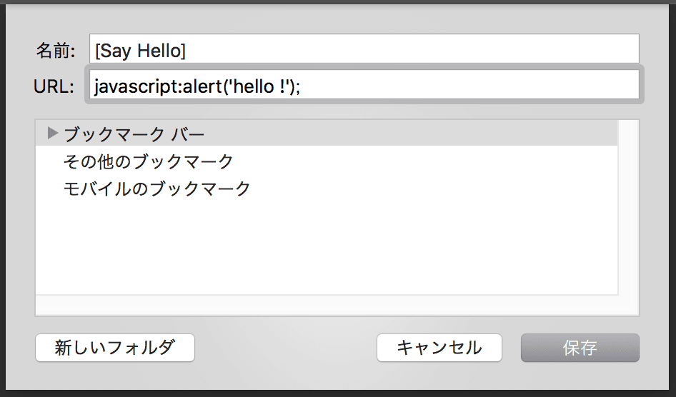

import EmbedCard from '@/components/Blog/EmbedCard.astro';

## What is a bookmarklet?
I'm Hirata. This is my very first blog post. To start with, I'd like to summarize **bookmarklets**, a topic I've been into recently. (If you already know what a bookmarklet is and just want to learn how to make one, please jump to [How to make a bookmarklet](#how-to-make-a-bookmarklet).) A bookmarklet is a technology where you register a short snippet of JS code as a browser bookmark and execute it by clicking it. It's a technology that has barely evolved since the early days of the internet, but it's handy because you can casually create one and use it for various purposes.

By prefixing the URL of a bookmark with `javascript:` and writing JS code, you can run that code on the web page you have open. You can create one through your browser's "Add new bookmark" menu, or you can register one published as an a tag.

## Examples of bookmarklets
Since you can run any JS code you like on any page, all sorts of things are possible. There are already plenty of useful ones made by enthusiasts. For example,

- [Copy the title and URL of the open page.](https://psephopaiktes.github.io/pages/bookmarklets/#bookmarklet-0)
- [Tweak the CSS layout of the open page](https://biz.moneyforward.com/blog/business-hack/iphone-chrome-bookmarklet/#26Web)
- [Translate the open page](https://psephopaiktes.github.io/pages/bookmarklets/#bookmarklet-4)
- [Quickly compose Gmail from a template](https://bookmarklet.web.fc2.com/bookmarklet_070.html)

There are tons more if you search around. As for SNS, Twitter and Facebook officially provide bookmarklets that let you quickly share the page you have open. I've compiled my recommended bookmarklets [on this page](https://psephopaiktes.github.io/pages/bookmarklets/), so please take a look.


## How to make a bookmarklet
A search will turn up a huge variety of bookmarklets, but if you use them heavily, you'll occasionally want a custom one made just for you. Especially when you want to format page information into a specific format and copy it, once you've made one, the rest is easy and very convenient.
### STEP1. Write the JS code
First, write the logic. To prevent affecting global variables (so it doesn't interfere with the JavaScript already running on the page), you need to write it in what's called an anonymous function form.
```js
javascript:!function(undefined){
    // Write your logic here
}();
```
Write it in the form above. To use it as a bookmarklet, prepend the string `javascript:` at the beginning.

### STEP2. Format special characters and compress to one line.
To register it as a bookmarklet, it needs to be compressed (with no line breaks). Use a tool like [/packer/](https://dean.edwards.name/packer/) to put it on one line. Also, characters like `(` or `&`, and Japanese characters basically can't be used as-is. So, after putting it on one line, use a tool like [URL Encode/Decode Form](https://www.tagindex.com/tool/url.html) to URL-escape (convert special characters). That said, in many recent environments it seems to work even if you register it with line breaks &amp;&amp; Japanese characters as-is.
### STEP3. Register it in your browser


Register the string compressed and escaped in STEP2 as a new bookmark in your browser. The procedure differs slightly per browser, but most are roughly the same. Taking Chrome as an example, right-click the bookmarks bar, choose "Add page", and run it. Enter any bookmark name in the "Name:" field, paste the code you created into the "URL:" field, hit "Save", and you're done.

### Supplement: When you want to use jQuery
You can also use jQuery by loading the library in advance within the URL you register. It makes grabbing the page's DOM easier, so you can extract elements from a specific page more readily. The page below explains it well.

<EmbedCard
    url="https://blog.mudatobunka.org/entry/2016/02/29/030633"
    title="A late summary of how to make bookmarklets"
    site="blog.mudatobunka.org" />


### Supplement: Copying a specific string to the clipboard
This is a very common operation in bookmarklets. To copy text to the clipboard with JS, use the **document.execCommand** method.

<EmbedCard
    url="https://developer.mozilla.org/ja/docs/Web/API/Document/execCommand"
    title="document.execCommand - Web API Interfaces | MDN"
    site="developer.mozilla.org" />

By writing it as below, you can copy the obtained string to the clipboard.
```js
javascript:!function(undefined){
    // Write your logic here
    !function(a){
        var b = document.createElement('textarea'),
        c = document.getSelection();
        b.textContent = a, document.body.appendChild(b), c.removeAllRanges(), b.select(), document.execCommand('copy'), c.removeAllRanges(), document.body.removeChild(b);
    }(/* Write the string you want to copy */);
}();
```


## Conclusion
For anyone who can write a fair bit of JS or jQuery, bookmarklets are very convenient and easy to create. I know many people will say "browser extensions or plugins are fine too," but unlike extensions, the advantages are that they don't tax the browser or memory when not in use, and you can freely organize them by folder and name. The things JavaScript can do these days have increased considerably—you can use the FileAPI to generate CSVs that summarize page info, or create images with CANVAS. Once you master them, they'll surely become powerful helpers for your work going forward.
