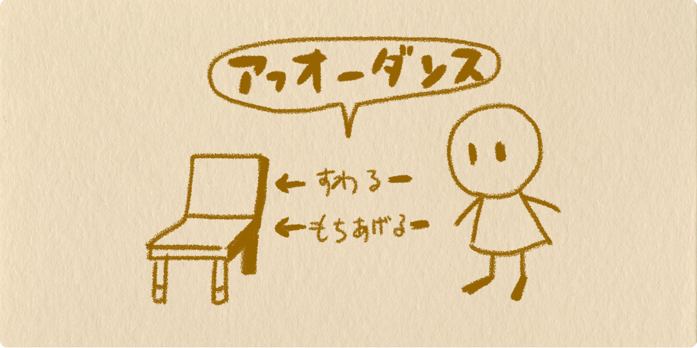

import EmbedCard from '@/components/Blog/EmbedCard.astro';

## Foreword
Have you ever heard the words **affordance** and **signifier**? If you've only ever heard of <b>affordance</b>, you should be careful. The affordance you know might actually be a <b>signifier</b>. They are important concepts in UX design, but they're easily misunderstood and hard to grasp. Since there aren't many easy-to-understand articles online, I'll try to explain them simply. If you don't know either of them, please take this opportunity to learn about them.

## Background of the misunderstanding
In general society, there are many people who mistakenly remember signifiers as affordances. There's a background to this.
<b>Affordance</b> is a word that became famous all at once when D.A. Norman introduced it in his 1990 book [The Design of Everyday Things](https://www.amazon.co.jp/dp/478850362X/ref=cm_sw_r_tw_dp_x_.Vl5zbYK2K00R). The book became a bestseller, was translated worldwide, and read by many people. However, in his 2015 book [The Design of Everyday Things: Revised and Expanded Edition](https://amzn.to/2yAmeln), he wrote that he had <b>introduced the word affordance incorrectly</b>. In the older edition, Norman had **mistakenly introduced what was actually a signifier as an affordance**. That's why the wrong meaning of affordance has become widely accepted in the public.

## Glossary
Now, let's explain what these terms mean. Both are concepts that are emphasized in <b>interaction</b> within UX design. They are concepts that arise between any object in the world (products, services, natural objects, artificial objects) and the entity using it (humans). I'll use diagrams to explain them as simply as possible, so please bear with me.

### What is affordance?
It's the **relationship** between an object and its user (a human). Between every physical object in the world (from things found in nature to artificial things) and humans, there is a relationship of "what can be done."

For example, a "human" has a relationship in which they can "sit on" a "chair." Also, many "humans" can "lift" a "chair." **The relationship of "what can be done" is called affordance.** In this case, with a slightly odd phrasing, we say "a chair <b>affords</b> a human to sit on it" or "a chair <b>affords</b> a human to lift it."

Even with the same object and the same subject, affordance changes when the targets change. In the previous example, if the "human" were a "baby," the affordance for "lifting" the "chair" would not exist. Other examples include:

- "Glass" affords "air" to "pass through"
- "Glass" does <b>not</b> afford "water" to "pass through"
- "Air" affords "water" to "pass through"

And so on. Many real examples already exist in the natural world.

### What is a signifier?
It's a **sign that conveys the relationship** between an object and its user (a human). In other words, it's a hint that tells you <b>what the affordance is</b>. This is what's especially important in design.

For example, suppose there is a "pigeon," a "wooden frame with nothing in it," and a "wooden frame with glass in it." In this case, the "wooden frame with nothing in it" affords the "pigeon" to "pass through" (= the "pigeon" has a relationship in which it can "pass through" the "wooden frame with nothing in it"). The "wooden frame with glass in it" does not afford the "pigeon" to "pass through" (= the "pigeon" has a relationship in which it cannot "pass through" the "wooden frame with glass in it"). However, if the glass is sufficiently transparent, both will look passable to the pigeon when it sees them. But if you paint the glass with paint, the pigeon can recognize the affordance of "cannot pass through." In this case, the paint is the signifier. **A sign that conveys "what can be done" is a signifier.** A signifier only works as a signifier when it is perceived.

I limited the explanation to vision for clarity, but more accurately it concerns "how it is perceived," so it could also be hearing or smell. For example, a "sweet smell" works as a signifier conveying that something is "edible" to a "living creature." Signifiers can exist naturally, and they can also be added intentionally.

## Examples of signifiers
Have you been able to understand affordance and signifier? So how do these concepts relate to design? As the sharp-eyed will have noticed, signifiers act as a powerful tool for conveying messages to users. By intentionally placing signifiers on a product or service, you can help users understand operations, encourage actions, or conversely restrict actions.

### Signifiers that convey how to operate something
- Doors
    - Many doors are used as real-world examples in Norman's book.
    - For example, between doors and humans, there are various affordances, such as "can be pushed," "can be pulled," and "can be slid." It's ideal to have a sign that lets users appropriately perceive what kind of operation is possible on a given door.
    - If a round doorknob is attached, you can twist and "pull"; if a flat plate is attached, you can "push"; if there's a recessed groove, you can hook your hand and "slide"—these are signifiers you can use.
- Web and apps
    - When "color and an underline" are applied to text, it lets people perceive that it's a link with the affordance of "being able to navigate to another page." → [This is Link Text !!](https://twitter.com/psephopaiktes)
    - A UI shaped like a "button" is a signifier showing that it "can be pressed."
    - When thumbnails are lined up, a signifier of "the next thumbnail being slightly cut off" lets you notice the affordance that you "can scroll."
    

### Signifiers that warn of danger
- The smell of city gas is intentionally added so that it works as a signifier conveying "gas is leaking and it's dangerous"
- Trucks are required by law to sound a "warning beep" when reversing

Examples of signifiers are hidden in every product and service in the world. What's important about them is that the target users can perceive them naturally and understand them easily. For example, the "floppy disk" icon is used as a signifier for the "save" button in various applications. However, for younger generations who have never used a floppy disk, they have no idea what the icon represents. A designer's job is to deeply understand the target user, prepare appropriate signifiers, and effectively convey the message the product carries. Don't decide design with a rigid mind; let's become designers who can help users with flexible ideas.

## Closing
[The Design of Everyday Things: Revised and Expanded Edition](https://amzn.to/2yAmeln), introduced at the beginning, is loved as a must-read not only for designers but for everyone involved with products. Of course it covers the details of affordance and signifier introduced in this article, but it also presents many important ideas and techniques about products and services. The page count is large and tough, but I highly recommend reading it at least once. It's written in a style that's easy to understand even for non-designers, so I don't think you'll have trouble reading it. Please be careful not to mistakenly buy the older edition.
