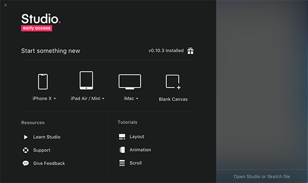
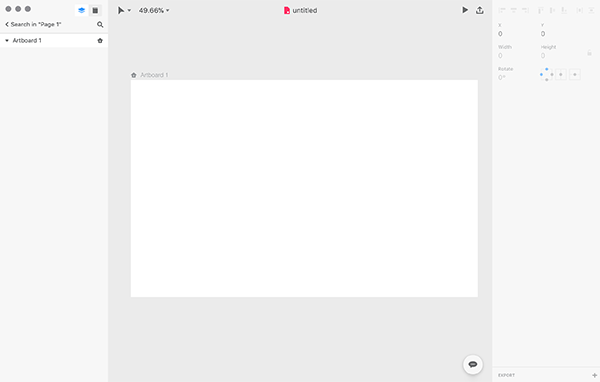
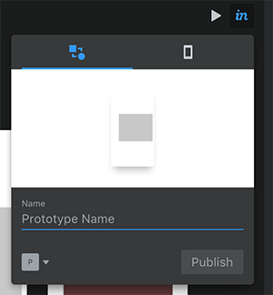
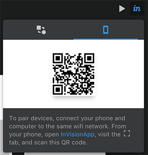
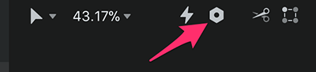
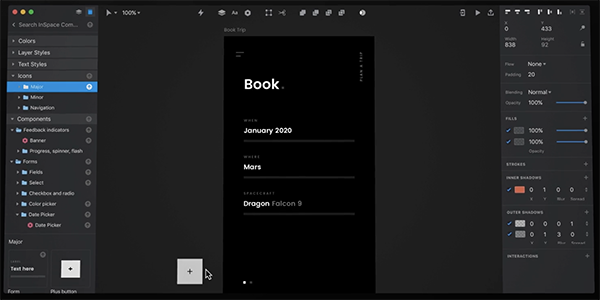

import EmbedCard from '@/components/Blog/EmbedCard.astro';

[Studio.](https://www.invisionapp.com/studio) is a piece of software whose promo video was released last year by [inVision](https://www.invisionapp.com/), a major prototyping web service company. Because of its rich feature set, it had everyone thinking, "<b>If it has all these features, is easy to use, and lightweight, won't it kill off both Sketch and XD...?</b>"

<EmbedCard
    url="https://www.invisionapp.com/studio"
    img="https://s3.amazonaws.com/www.invisionapp.com-studio/static/img/social/facebook.png"
    title="InVision Studio | Screen Design. Redesigned. "
    site="www.invisionapp.com" />

The features are now revealed on the [official site](https://www.invisionapp.com/studio), but in a nutshell:

- Cross-platform support for MacOS and Windows
- Design comp creation features like Sketch and XD
- Symbol management and library features like Sketch
- Design-level version control, review, and communication features like Abstract
- Animation settings using keyframes
- Of course, screen-transition prototyping like InVision

It's clearly piling on the features, but the "strongest app" vibe is intense. On top of that, they're also working on a [design system tool](https://www.invisionapp.com/blog/announcing-invision-design-system-manager/) — they're aiming to dominate the entire space.

It was supposed to be available for download back in January this year, but the release was delayed, so I'm sure many of you were getting impatient. The invitation mail finally arrived, so I'm going to try out what features are actually usable. The comparison is mainly with Sketch.

## Installation and launch
From the "GET STUDIO NOW" link in the invitation email, go to the download page and install on Mac from the .dmg file as usual. I'll skip the details. The icon looks like this. Simple, and stands out for that very reason.

It launched. This screen seems to be called the Launcher. The text "Open Studio or Sketch File"... apparently it supports the Sketch format. I tried opening a Sketch file I had on hand, but the appearance was pretty broken so let's pretend that never happened. Clicking "Learn Studio" at the bottom left just opens a [YouTube video](https://www.youtube.com/watch?v=LkEOaR4Bl5M&amp=&feature=youtu.be).

Quietly, there are lots of templates, which is nice.

As expected, the basic UI panel layout is close to Sketch.

By the way, there's also a Light theme.

## Features introduced in the tutorials
Let's start by going through the three Tutorials on the Launcher screen. Clicking these opens a practice file with explanations. XD has similar tutorials too, and this kind of thing is really easy to follow and great.

### Layout
- I was instantly impressed. In short, this is the feature where **you can set the size of layer objects as a percentage of the artboard**. Honestly, why doesn't Sketch have this?
- On top of that, you can also specify how child elements are positioned relative to the parent when resizing. This is the same as Sketch symbol's Resizing feature.

<video src="./capture-layout.mp4" width="1247" height="830" controls autoplay></video>

### Animation
- A feature for creating screen-transition prototypes, which is InVision's original service.
- It's super similar to the [Sketch prototyping feature]( controls) released just the other day... You can upload directly to the original InVision service from the top right of the screen, so Sketch may not stand a chance in this area.

<video src="./capture-animation.mp4" width="1280" height="800" controls autoplay></video>

### Scroll
- Another screen prototyping feature. You can create screens with partially fixed and scrollable areas.

## Other features

### Upload to InVision
Of course you can. Well, you can already do this in Sketch with Craft, so I'll skip it. 

### Mobile preview
There's also a feature like SketchMirror. Once you create a prototype, display the QR code from the upper right of the screen, 

 
and read it with the camera in the [InVision app](https://itunes.apple.com/app/invision-design-collaboration/id990700027) for a mobile preview.

### Components ( Symbols )
Now, about the important symbol feature. In studio., they call them **components**, not symbols. With the module concept becoming mainstream in web development these days, I think this is a more appropriate name than "symbol." The name is different, but the flow of componentization (I'll call it "symbolization" since it's a hassle to write) is mostly the same. Select the layer you want to symbolize and either use the `⌘K` shortcut or click the nut icon in the upper toolbar.

 
The place where symbols are managed is the Symbols layer (more precisely, an arbitrary layer) in Sketch, but in studio. there's a dedicated area called "Library" in the layer panel. Here's a screenshot from the official video↓

 
I would have thought Symbol Override would also be possible, but I can't seem to find it... Furthermore, in the video it looks like you can share this library with multiple people and manage text styles here, but those features don't seem to be implemented yet.

## Other evaluations

### Document structure
- The structure of pages, layers, and symbols is slightly different from Sketch, but you'll get used to it instantly once you start using it.

### Shortcuts
- Most of Sketch's shortcuts work, so you won't get lost. `⌘.` and `⌘⇧↓` and so on work normally, GOOD.
- The shortcuts for changing font size and repeating may be a bit different.

### Japanese text support
- You can imagine.

### Performance
The operations are quite <b>snappy</b>. The smoothed zoom-in/zoom-out animation feels a bit weird and uncomfortable. Opening files is much slower than Sketch.

### File format
As expected, it's JSON like Sketch. If you change the extension of the generated `.studio` file to `.zip` and unzip it, you get exactly what you'd expect.

## Overall impression
- **It's basically Sketch...!!** If you're used to Sketch, you can use this without any confusion at all...
- It still feels like only some features have been revealed, and it really is <b>just an early access version after all</b>. The following features are not yet visible:
    - Version control / review
    - Symbol library sharing
- Also, the symbol feature is still pretty basic, so it's not yet up to serious use.
- **Usability is quite good — there's promise here**. Of course I've only touched it lightly, so I haven't been able to check stability or fine details. If features continue to roll out as planned, a future where we're fully immersed in the InVision ecosystem might just arrive...
- I also hope they support plugins soon. Runner is a must.

That's all. I'll add more if I find anything else.
