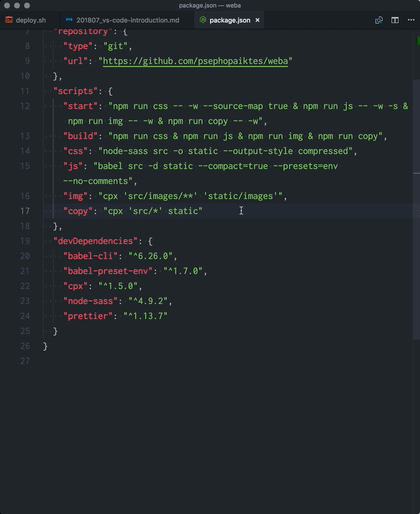
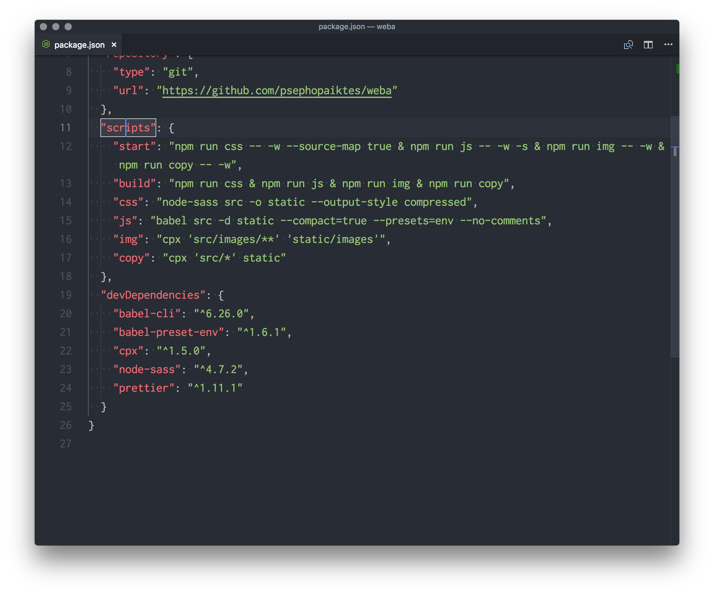
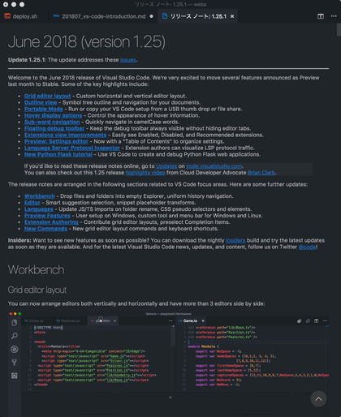
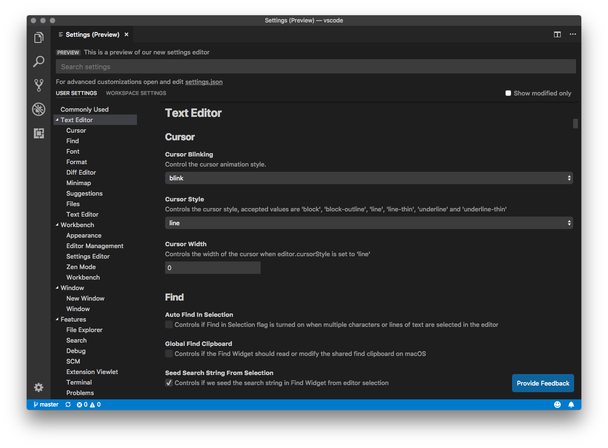

import EmbedCard from '@/components/Blog/EmbedCard.astro';

## Overview
This article evangelizes VS Code to users of Atom, Sublime, and (while we're at it) Brackets and friends. It's not really aimed at people using Vim, Dreamweaver, or JetBrains-style editors.

### What is VS Code?
VS Code (formally Visual Studio Code) is a text editor developed by Microsoft. It runs on Windows, Mac, and Linux. Lineage-wise, it's in the same rich-text-editor family as Sublime Text, Atom, Brackets, and Coda. It leans a bit more toward being an IDE (integrated development environment) than those, with plenty of built-in developer features. It's built on Electron, [open source](https://github.com/Microsoft/vscode), and completely <b>free</b>. In that respect, it's a lot like Atom.

You can download it from the page below.

<EmbedCard
    url="https://code.visualstudio.com/"
    img="https://code.visualstudio.com/opengraphimg/opengraph-home.png"
    title="Visual Studio Code - Code Editing. Redefined"
    site="code.visualstudio.com" />

With that out of the way, let me walk through what's great about VS Code.
The keyboard shortcuts mentioned below depend on your environment, so treat them as references.

## Stable performance
From startup to opening heavy files, the speed and performance are very stable and pleasant to use. Compared to Atom — also built on Electron — it's noticeably snappier. I haven't had it freeze on me yet.

That said, if all you care about is raw speed and performance, Sublime still wins by a landslide. But VS Code has zero practical issues and runs reliably.

Reference: [Atom vs Visual Studio Code: a speed comparison! Battle of the two big Electron-based text editors!](https://ryuta46.com/379)

## Rich default features
Even without piling on extensions, you get a serious amount of functionality out of the box. Plenty of things that required extensions in Atom or Sublime work natively in VS Code. Having so much officially supported functionality gives you a different sense of confidence. Of course, VS Code can be extended further with plugins. But, at the very least, I've barely ever found a feature I needed in Sublime or Atom that wasn't already in VS Code. A few examples:

- Terminal
- Git client
- Debugger

are all built in from the start.

## Built-in terminal
This one is just incredibly comfortable. Even as a designer or coder, you end up using the terminal a lot, and being able to do that inside the editor is amazing. Hitting `Ctrl + ` ` opens a terminal <b>in the folder of the file you're editing</b>, so you can take action right away. You can jump between the editor pane and the terminal pane with shortcuts, so your hands stay on the home row. You can also open multiple terminals at once.

Atom and Sublime have extensions for in-editor terminals too, but they tend to look ugly, run unreliably, only allow one instance, and generally feel half-baked.

## Strong design customization
Like Atom and Sublime, plenty of color themes and syntax themes are available. The UI itself is also highly customizable, so you can tune the look exactly to your taste. And of course, dark mode follows your system settings.

What I love is that the app's menu bar isn't the default macOS look — it has a clean, on-brand appearance. By the way, Atom can be configured the same way, but Sublime apparently can't.

## Use the keyboard shortcuts you're already used to
This is one of the reasons I'd recommend switching from another editor. VS Code supports Atom, Sublime, and Vim keybindings, so you don't have to relearn shortcuts.

<EmbedCard
    url="https://code.visualstudio.com/docs/getstarted/keybindings"
    img="https://code.visualstudio.com/assets/docs/getstarted/keybinding/customization_keybindings.png"
    title="Visual Studio Code Key Bindings"
    site="code.visualstudio.com" />

## Excellent as a Markdown editor
VS Code is great as a Markdown editor too. Out of the box it supports preview and syntax highlighting, but with two extensions —
[Markdown All in One](https://marketplace.visualstudio.com/items?itemName=yzhang.markdown-all-in-one) and [Paste Image](https://marketplace.visualstudio.com/items?itemName=mushan.vscode-paste-image) — it becomes the best Markdown editor I've used.

Markdown All in One is a do-it-all utility plugin.
You can toggle bold ( `** **` ) with a shortcut, auto-generate a table of contents from headings in the file, and so on — it's a must-have if you're writing Markdown. The comfort difference between having it and not is huge.

Paste Image lets you paste copied images straight into a Markdown (.md) file. You can configure which folder pasted images get saved to.

Being able to right-click an image on the web to copy it, or use macOS's screenshot copy feature ( `Command + Shift + 4` → drag while holding `Ctrl` ) and paste it instantly is unbelievably handy.

You just can't get this level of comfort in Atom or Sublime.

## Cloud-managed and synced settings
This is also possible in Atom and Sublime, but you can manage settings and extensions in the cloud. Sign in with a GitHub or Microsoft account and your configuration syncs and saves automatically.

<EmbedCard
    url="https://code.visualstudio.com/docs/editor/settings-sync"
    img="https://code.visualstudio.com/opengraphimg/opengraph-docs.png"
    title="Settings Sync in Visual Studio Code"
    site="code.visualstudio.com" />

Also, since version 1.25 there's apparently something called [Portable Mode](https://code.visualstudio.com/docs/editor/portable), which lets you keep the entire app in a single folder on a USB drive or cloud storage.

## It even runs in the browser
Strictly speaking, these are different products, but there are versions of VS Code that run in the browser — two of them, in fact. With either, you can sign in with the account mentioned above and use the same settings as the local version.

<EmbedCard
    url="https://github.co.jp/features/codespaces"
    img="https://github.githubassets.com/images/modules/site/social-cards/codespaces.png"
    title="Codespaces | GitHub"
    site="github.co.jp" />

This one runs on a virtual machine with VS Code Server, giving you nearly the full experience.

<EmbedCard
    url="https://github.com/github/dev"
    img="https://opengraph.githubassets.com/bae4cad5d745ae9e84b7aa281283ad831b14dfd907075b9b87d3d624220f9699/github/dev"
    title="github/dev: Press the . key on any repo"
    site="github.com" />

This is an editor-only (no terminal) lightweight version. Press `.` on any GitHub repository to launch it instantly.

You can technically **even use it on iPad**. Many shortcuts don't really work, so it's still painful in practice…

## Switching between projects (folders) is super easy
When you build a website or app in Atom or Sublime, instead of opening `index.html` and `style.css` one by one, you usually register the folder containing them and work from there.

When you do that, do you drag and drop the folder onto the editor every time? Or open it from the editor's menu? And what do you do when you want to switch to a different project?

In VS Code, once you've registered a project, you can switch between them quickly with `Ctrl + R`.

Hold `Ctrl` and press `R` to make a selection — when you release the keys, the current window switches to that project. Press `Esc` to cancel.

To open it in a new window, hold `Ctrl` and press `Enter`.

Also, set up the two things below and you'll be able to open folders in VS Code easily from both the GUI and the CLI.

[ASCII.jp: Boost productivity by adding apps to the Finder toolbar on macOS]
(https://ascii.jp/elem/000/001/025/1025457/)

[How to launch Visual Studio Code from the terminal (the official way) - Qiita]
(https://qiita.com/naru0504/items/c2ed8869ffbf7682cf5c)

## Per-project extensions and settings — and you can share them with your team
When working in a team, formatting rules like indentation can vary by project.
In VS Code, drop a `.vscode` settings folder at your project root and the editor automatically picks up the per-project settings. To create one, just open VS Code's preferences and configure "Workspace Settings" — the `.vscode` folder is created automatically. Share that folder via GitHub or similar and you're done.

Example of sharing:
[Microsoft/TypeScript: TypeScript is a superset of JavaScript that compiles to clean JavaScript output.](https://github.com/Microsoft/TypeScript)

## Multiple people can edit the same file at the same time
By installing the official LIVE Share extension, you can edit the same file collaboratively over the network. Great for pair programming.

<EmbedCard
    url="https://visualstudio.microsoft.com/ja/services/live-share/"
    img="https://visualstudio.microsoft.com/wp-content/uploads/2018/05/indroducing-visual-studio-live-share.jpg"
    title="Visual Studio Live Share: real-time code collaboration tool"
    site="visualstudio.microsoft.com" />

## The official documentation is incredibly thorough
This is true of the entire Visual Studio family — the documentation is detailed, abundant, and very easy to follow.

<EmbedCard
    url="https://code.visualstudio.com/docs"
    img="https://code.visualstudio.com/opengraphimg/opengraph-gettingstarted.png"
    title="Documentation for Visual Studio Code"
    site="code.visualstudio.com" />

The docs are managed on GitHub, and anyone can edit them right in the browser and submit a pull request to suggest a change. The article below covers this nicely — it really is a well-run setup.

[The way you can send pull requests to product documentation is amazing - Qiita](https://qiita.com/amay077/items/8823376f307235a7f651)

The release notes shown in the editor when it updates are also very readable, with operations explained via animated GIFs so you can understand new features at a glance.

## What I see as VS Code's weak points
That's the end of my evangelism for VS Code. Honestly, I have no real complaints. If I had to nitpick, here's what I'd say:

### It's slower than Sublime
Still, it's plenty snappy, so I wouldn't really call this a weakness.

### The icon is ugly
The color has changed a few times, but it's still ugly.

### ~~Settings are CLI only~~
Editor settings are basically written as JSON, which can be a little unfriendly for newcomers. There's now a GUI settings page available.

## Closing thoughts
I started writing this article hoping that, if more people used VS Code, sharing `.vscode` folders would make collaboration easier. How was it?

VS Code has become well known as the editor for "TypeScript," Microsoft's alternative language, but it has plenty of charms beyond that, ones other editors just don't have. For the record, my editor history goes Sublime 2 (1 year) → Brackets (6 months) → Sublime 3 beta (1 year) → Atom + Sublime 3 (3 years) → VS Code (6 months). I also briefly used Dreamweaver and WebStorm. The conclusion of all that is this article.

Of course, editors are practically a religion — preferences are intense and people want different things. In the end, what you're used to is what works best, but I'd be glad if this gets you even a little curious about Code.

Some other day, I'd like to write about extensions, themes, and recommended ways to use it.

<EmbedCard
    url="https://code.visualstudio.com/"
    img="https://code.visualstudio.com/opengraphimg/opengraph-home.png"
    title="Visual Studio Code - Code Editing. Redefined"
    site="code.visualstudio.com" />

By the way, GitHub — the company behind Atom — was acquired by Microsoft, but [development of Atom isn't planned to stop](https://www.itmedia.co.jp/enterprise/articles/1806/13/news052_2.html), apparently.

## Bonus
A pointless brag: I (Hirata) won an honorable mention in the old VS Code official mascot contest.

<blockquote class="twitter-tweet" data-lang="ja">
【優秀賞】平田章サマ。オメデトウ～♪ 作品はAzure Webサイトで公開されてるのヨ！ <a href="https://t.co/xPB6X9kF0q">https://t.co/xPB6X9kF0q</a><a href="https://twitter.com/hashtag/vsjp2525?src=hash&amp;ref_src=twsrc%5Etfw">#vsjp2525</a> <a href="https://t.co/NUuk79NZQR">pic.twitter.com/NUuk79NZQR</a>
&mdash; クラウディア窓辺（終了） (@Claudia_Azure) <a href="https://twitter.com/Claudia_Azure/status/667022885781794816?ref_src=twsrc%5Etfw">2015年11月18日</a></blockquote>

