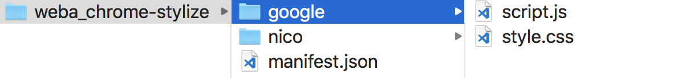
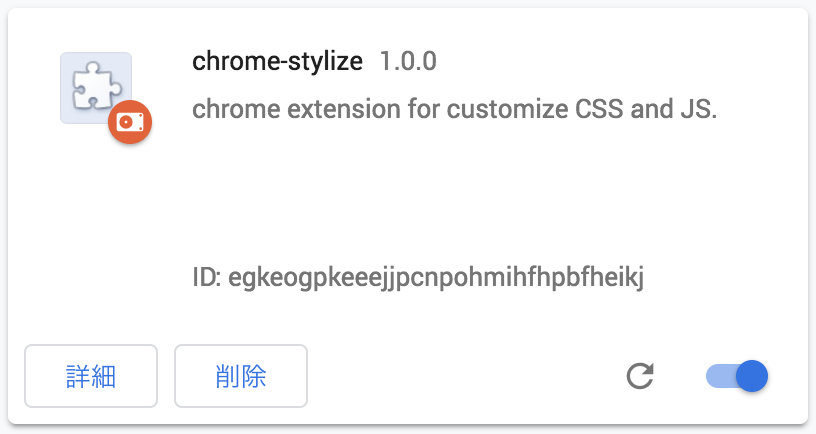

import EmbedCard from '@/components/Blog/EmbedCard.astro';

## Overview
When viewing various web pages on a PC, have you ever wished you could darken the background like the dark modes on YouTube or Twitter? Have you ever wanted to apply your own custom CSS — hiding particular elements, enlarging others, changing fonts, and so on? You can do this with a Chrome extension, and for a long time, the de facto choice was an extension called Stylish, used by tons of people. Recently, however, Stylish was [removed from the Chrome Web Store](https://forest.watch.impress.co.jp/docs/news/1131353.html) because it was secretly collecting users' browsing history.

So in this article I'll show you how to apply your own CSS and JS to any web page, replacing the now-unlisted Stylish. The approach is to make a local extension yourself, with the following pros and cons.

### 🙆 GOOD
- Load your own CSS and **JavaScript** into any page
- Since the CSS and JS files are managed locally, you can use SASS, TypeScript, or any environment you're comfortable with
- Since the files are managed locally, you can keep them in Git, Dropbox, etc.
- Doesn't depend on a third-party extension, so you don't have to worry about it being removed or about privacy

### 🙅 BAD
- Setup is a bit annoying
- Doesn't sync between Chrome accounts
- Unlike Stylish, you can't one-click install CSS that other users have created and published

As you can see, there are downsides, but generally you get more freedom and can do more. Let's walk through the steps. If you just want the easy way, jump to [Steps for the lazy](#steps-for-the-lazy). (I don't really recommend it, though.)


## Basic steps
Building a Chrome extension is surprisingly simple — drop your HTML, CSS, and JS files plus a `manifest.json` config file into a single folder, and you're done. Zip that folder up and you can publish it to the store; for personal local use, just load the folder from `chrome://extensions/`. For people who want to skip the setup, [I've prepared a template](#template), so I recommend downloading that and modifying it.

Chrome extensions can do many things, including <b>Browser Actions</b> that run when you click a button and <b>Override Pages</b> that replace things like the new tab page or history page. This time we'll use **Content Script**, which loads CSS and JS into pages matching a URL pattern.

### 1. Create manifest.json
First, make a folder anywhere with any name, and create `manifest.json` inside it. Its contents look like the following.

#### manifest.json
```json
{
  "name": "chrome-stylize",
  "author": "Akira HIRATA",
  "description": "chrome extension for customize CSS and JS.",
  "version": "1.0.0",
  "manifest_version": 2,
  "web_accessible_resources": ["*"],
  "permissions": ["storage"],
  "content_scripts": [
    {
      "matches": ["https://www.google.co.jp/*"],
      "css": ["google/style.css"],"js": ["google/script.js"]
    },
    {
      "matches": ["https://www.nicovideo.jp/watch/*"],
      "css": ["nico/style.css"],"js": ["nico/script.js"]
    }
  ]
}
```

The only setting you need to worry about above is `content_scripts`. The rest is essentially fine as is. Feel free to change `name` or `author` to whatever you like. If you're curious about what each setting does, [this page](https://qiita.com/mdstoy/items/9866544e37987337dc79) is a good reference.

### 2. Configure target pages and files
Specify the pages you want to apply CSS and JS to. Set URL patterns under `content_scripts` in `manifest.json`. In this example we'll customize Google Search and Nico Nico Douga's video pages.

#### manifest.json
```json
  "content_scripts": [
    {
      "matches": ["https://www.google.co.jp/*"],
      "css": ["google/style.css"],"js": ["google/script.js"]
    },
    {
      "matches": ["https://www.nicovideo.jp/watch/*"],
      "css": ["nico/style.css"],"js": ["nico/script.js"]
    }
  ]
```
`matches` is the URL pattern of the target web pages, and `css` / `js` specify the CSS and JS files to load on them. `*` is a wildcard. With the example above, every URL beginning with `https://www.google.co.jp/` matches. You can find other URL specification methods [here](https://developer.chrome.com/extensions/match_patterns).

Create the CSS and JS files, organizing them by target page. The contents can be empty for now.



You can specify multiple `css` and `js` files. If you want to use jQuery, drop the downloaded jQuery file in and write something like
`"js": ["jquery.min.js","google/script.js"]`.

### 3. Write your CSS and JS
Let's fill in the CSS and JS files we just created. Identifying which elements use which class names on a page involves slogging through DevTools. I'll cover the details below, but for now, try writing `/google/style.css` and `/google/script.js` like this.

#### /google/style.css
```css
body{
  background: #ccc !important;
}
```

#### /google/script.js
```js
console.log('Hello World');
```


### 4. Load it into Chrome
1. Open Chrome's extensions page. Type `chrome://extensions/` into Chrome's URL bar.
2. There's a "Developer mode" switch in the top right — turn it ON.
3. Drag and drop the folder you just made onto this page. That's it.
4. Open a Google search page and check it. The background should be gray and you should see the message in the DevTools console.


After this, when you change CSS or JS files further, **the changes don't take effect immediately — you need to reload the extension on the extensions page**. Click the reload icon on that screen to reload it.


## Writing CSS efficiently
The above are the basic steps, but as you'll find when you try it, writing CSS while watching the result in real time is pretty painful. Here are two approaches I'd recommend for actually writing the CSS and JS.

### Build it while watching the result in Chrome DevTools
This is the slow-and-steady method of investigating which classes the page uses and writing CSS. It's fairly tedious and may be tough for beginners.

1. Open Chrome DevTools. Right-click anywhere on the page and choose "Inspect," or use the shortcut `⌘⌥I` (Mac) or `F12` (Win).
2. Click the cursor icon at the top left of DevTools to enter element-pick mode. The shortcut `⌘⇧C` (Mac) or `Ctrl+Shift+C` (Win) also works.
3. Click an element to inspect with the cursor and DevTools highlights it. From there you can check the class name.

Also, customized CSS often gets overridden because of [specificity](https://developer.mozilla.org/ja/docs/Web/CSS/Specificity). If your changes aren't applying, the easiest fix is to slap on `!important` to force priority.

### Copy/paste from publicly shared styles
This is by far the easier path. Tons of user stylesheets created by enthusiasts are floating around online. Just copy and paste those. Of course, when using them, check the license and respect copyrights. (For local personal use, it's usually fine.)

If you used Stylish before, finding CSS on the official site might be the easiest route.

[Website Themes & Skins by Stylish | Userstyles.org](https://userstyles.org/)


## Steps for the lazy

1. Download and unzip the template below.
2. Edit manifest.json with your target pages and the CSS files you want to load. [[Details]](#2-configure-target-pages-and-files)
3. Either copy/paste a cool CSS from somewhere online, or write your own with DevTools. [[Details]](#writing-css-efficiently)
4. Turn on developer mode on Chrome's extensions page and drag-and-drop the folder. [[Details]](#4-load-it-into-chrome)


### Template
<a href="/download/weba_chrome-stylize.zip" download>Template — minimal version</a>
A minimal-file example. Download, unzip, and modify it however you like.

<a href="/download/weba_chrome-stylize_npm.zip" download>Template — with SCSS and BABEL</a>
If you're comfortable with NPM, I recommend this one. To use it, just `npm i` and then `npm start`. SCSS and JS files in the src folder are watched and built into the docs folder.

## Wrap-up and notes
If you've followed along, you'll know Chrome extensions can be built easily as long as you know HTML, CSS, and JS. Beyond what's shown here, building extensions that show a custom page in new tabs is also fun.

If you got interested in extension development, the entries below might help. If you make something good, by all means publish it to the [Chrome Web Store](https://chrome.google.com/webstore/category/extensions).

- ["Google Chrome extension development" you can understand even on your first try | OXY NOTES](https://oxynotes.com/?p=8836)
  - It's a slightly old page, but it's a well-organized overview of Chrome Extension topics.
- [The 2016 edition of my Chrome extension design patterns - Qiita](https://qiita.com/yoichiro6642/items/d446256e0bd709e2d76b)
  - Once you're a bit comfortable with extensions and want to publish to the store.
- [Browser extensions - Mozilla | MDN](https://developer.mozilla.org/ja/docs/Mozilla/Add-ons/WebExtensions)
  - I'm not super familiar with this myself, but using a set of APIs called WebExtension API, you can apparently write extensions that work in Firefox, Edge, and Chrome with mostly the same code. (When Firefox added support, lots of older Firefox plugins stopped working — that was a whole thing.)
