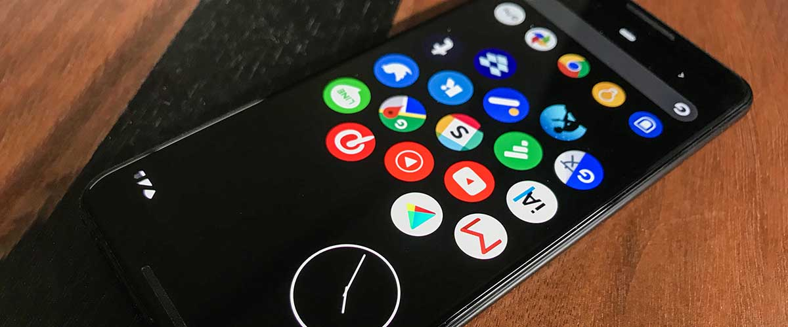
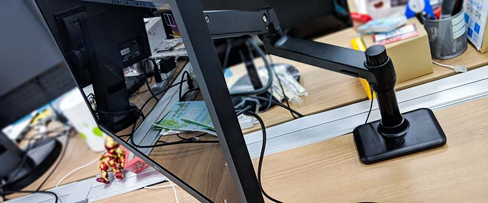
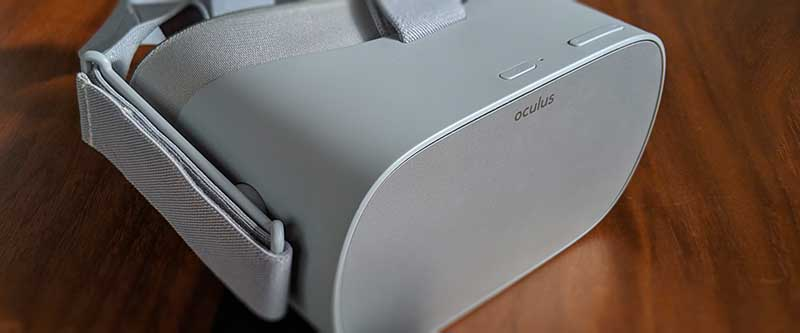
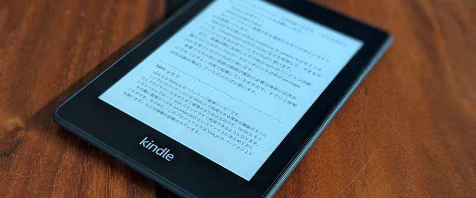
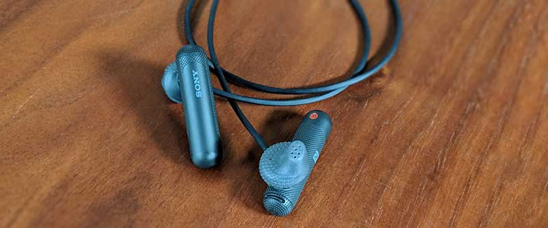
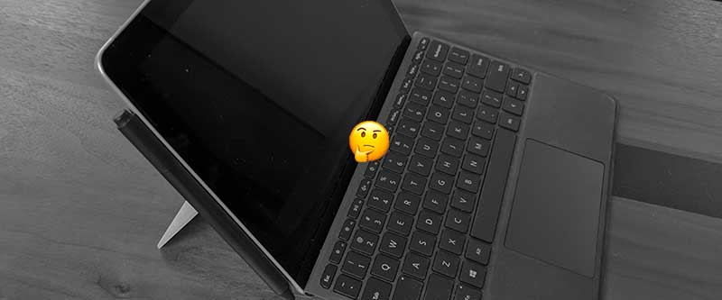
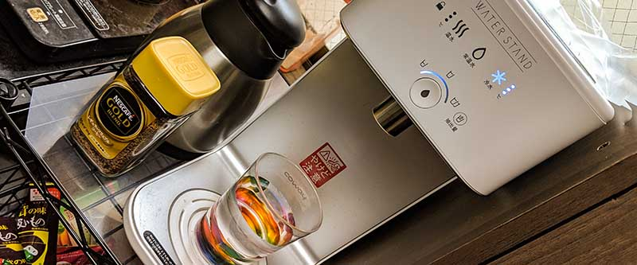
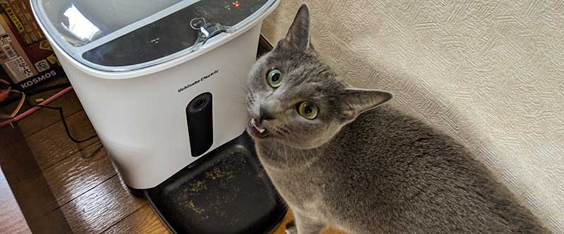
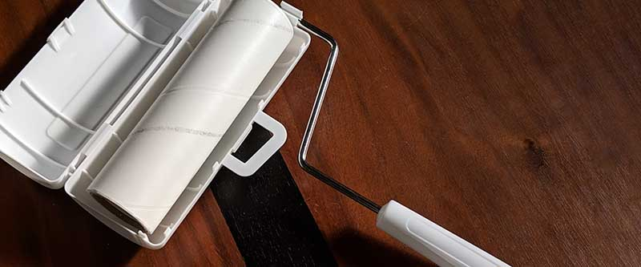
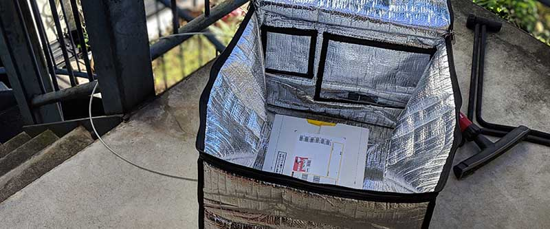

import EmbedCard from '@/components/Blog/EmbedCard.astro';

A roundup of things I bought or signed up for in 2018 that turned out great. My goal this year was cranking up my QOL, so I've been buying a lot. I've grouped them into gadgets, subscription services, things for my cat, and miscellaneous. Within each category they're roughly in order of how much I liked them.

## Things I'm glad I bought — Gadgets
PC, smartphone, and other digital gadget stuff.

### [Pixel 3](https://store.google.com/jp/product/pixel_3)

For me, this was the buy of the year. Until I bought the Pixel 3, I was using a Nexus 6P and an iPhone 7, but this phone is on a completely different level. Android Pie 9.0 is incredibly well done, and personally I find it more usable and lovable than iOS (this might be controversial, but I think people who disagree are just not used to Android).

The camera experience is also overwhelmingly good.

- The front camera has an ultra-wide lens, so no selfie stick required
- Portrait mode produces really nice bokeh — and you can change the focus position after the fact
- Night mode can capture solid photos even in near-total darkness
- You can save photos to Google Photos with unlimited original-quality storage
  - Cloud sync is super smooth, making editing and managing tons of photos easy
- AR features let you take pictures with Avengers and Star Wars characters
- Google Lens uses machine learning to identify subjects and search the web for them
- "Double-click the power button to launch the camera, then press volume to shoot" — so whether holding it portrait or landscape, you can shoot the moment you want

Rather than adding more lenses or boosting hardware specs like the iPhone, it builds great photos via post-shot machine-learning processing. [@goando](https://twitter.com/i/moments/1057656588255674369)'s Twitter Moments has more detailed info if you're curious.

### [LG UltraFine 4K Display](https://www.apple.com/jp/shop/product/HKMY2J/A/lg-ultrafine-4k-display) + [HP single monitor arm BT861AA](https://amzn.to/2GbHJhM)

LG's monitor sold as the official Mac display, paired with HP's monitor arm. I set this up at my work desk (on the company's dime).

The arm carries the HP (Hewlett-Packard) name, but it's actually an Ergotron OEM product — basically the same as the Ergotron LX. The Ergotron LX is a classic, popular monitor arm thanks to its smooth position adjustment. The BT861AA is essentially an Ergotron LX with different paint, and the matte black finish goes amazingly well with the LG UltraFine 4K Display. The LG UltraFine 4K Display can't normally pivot (rotate vertically), but with an arm it can.

The LG UltraFine 4K Display is designed exclusively for Macs and has zero unnecessary buttons on the display itself. Plug it in and it powers on; unplug and it powers off; you adjust brightness from your Mac's TouchBar. What's especially great about this display is that **power, storage, LAN, video, and audio are all managed through a single USB Type-C cable**. Plug your AC adapter, LAN cable, and HDD into the monitor side, and a single cable from monitor to Mac connects everything to the Mac. So all you see on the desk is one cable.

I went through quite a search to find this combination — together they're perfectly clean and beautiful, and I'm extremely happy with them.

### [MacBook Pro 2018 (later model)](https://www.apple.com/jp/macbook-pro/)

The TouchBar Mac model released in late 2018.

The early-model issues — "the keyboard is hard to press," "the display output is unstable," etc. — have largely been resolved, and it's working very well for me. I have no real complaints about Mac OS 12 either, and the screen capture feature you can now access with `⌘⇧5` is super handy.

### [Oculus GO](https://www.oculus.com/go/)

Facebook's affordable VR HMD (head-mounted display) released this year. It runs a customized Android OS and works standalone — no PC or smartphone required. It's very pleasant to use; you can leave it in sleep mode and pick it up whenever you want.
It does a great job of overcoming the previous downsides of being <b>expensive, heavy, and a hassle to launch</b>, and is a true milestone for HMD adoption. Battery life is short, though.

I really love an app called [Wander](https://www.oculus.com/experiences/go/1887977017892765/), which lets you "go" to places via Google Earth. You can revisit old places where you used to live and feel like dying from nostalgia. The default pre-installed apps are also fun.

That said, if I get the [Oculus Quest](https://www.oculus.com/quest/) coming next year, I might end up selling this one.

### [Kindle Paperwhite 2018 later model](https://amzn.to/2QqfZur)

I bought this in December 2018, but I added it to this article. It's the new Kindle model released last month. From this generation it's **waterproof**. I'd been reading on my iPhone 7 in the bath, but I'd been wanting to use the Kindle for that, so I grabbed it right away.

I bought it for 4,000 yen off during Amazon's Cyber Monday sale, but at full price it might feel a bit pricey. The look has changed slightly, but other than being waterproof, I haven't noticed any major changes so far.

### [SONY Bluetooth earphones WI-SP500](https://amzn.to/2L0yoIb)

SONY's Bluetooth earphones released this year. Models with totally separate left/right buds and noise cancelling came out simultaneously, but this shape is the simplest and most usable. There seem to be people in the world who are happy [dangling udon noodles from their ears](https://www.google.co.jp/search?q=耳からうどん&tbm=isch), but in my opinion this style is the perfected form of Bluetooth earphones (just throw in wireless charging and it's perfect).

By the way, the sound quality isn't great (the [JBL ones](https://amzn.to/2G3M3iL) I had before were better).

### [Bonus: the so-so Surface Go I bought](https://www.microsoft.com/ja-jp/p/surface-go/)

I'd been hoping for "a 10-inch device I could actually develop on" — and especially for "a 10-inch Surface" — for about five years, so the moment it was announced I pre-ordered and bought it. Maybe my expectations were too high, but I was more disappointed than I'd imagined.

First, the keyboard that arrived was a JIS layout instead of what I expected, so I called immediately for a return and exchange. All the photos in the store show US-layout keyboards and the spec sheet only says "Qwerty layout," but in Japan they actually sell the JIS layout. [Even as of December 2018 this hasn't been corrected](https://www.microsoft.com/ja-jp/p/surface-go-signature-type-cover/90KBCCPW6FSV) — extremely misleading… To top it off, in Japan you can only buy a bundle that includes MS Office, so it's needlessly expensive too.

Then there's the actual product: it's clunky in operation, often has rendering bugs and freezes, and just makes me irritated. I knew the specs were modest, but Windows as an OS has such a low UI/UX bar that it's barely usable on a slow machine. (For the record, I was a long-time Windows user, so it's not a familiarity issue.) I wanted to use it for drawing too and bought the pen, but the latency is so bad that fast strokes can't keep up.

That said, the hardware itself looks great. The size feels just right and the build quality is lovely. If only it actually ran well, it would have been my daily companion… It might be a fine device for a kid's toy or a casual hobby use.

---

## Things I'm glad I bought — Subscriptions
Services and equipment with monthly fees. "Things I'm glad I signed up for," really.

### [Prime Wardrobe](https://www.amazon.co.jp/b/?node=5425661051)

A service Amazon launched this year for Prime members. They send up to 8 items of clothing, shoes, bags, etc. to your home and you **only buy the ones you like and return the rest**. Returns are easy: put unwanted items back in the box, attach the prepaid label that came with it, and request a Yamato pickup. Buying clothes deserves time and thought, and **being able to try them on alongside the clothes you already own** is great. I've only used it three times so far, but I plan to keep using it. The selection isn't great yet.

### [YouTube Premium](https://www.youtube.com/premium)

YouTube's paid plan that finally rolled out in Japan. No ads in the app or on the web, plus background playback — it's super comfortable.

Subscribing to Premium also gives you YouTube Music, which I like in particular. (There's also a [standalone YouTube Music plan](https://www.youtube.com/musicpremium).) I won't compare it to Spotify or Apple Music since I don't use those much, but I was already listening to music on YouTube, so it just got way more pleasant. The features are well-built — let it recommend songs and you'll be happy.

The first three months are free, so if you already use YouTube for music, definitely give it a try.

### [Water Stand](https://waterstand.jp)

A water stand that dispenses both hot and cold filtered water. It's not the tank-swap kind of water server — <b>it's plumbed directly into your tap, so there's zero hassle of swapping anything</b>. Having instant hot water and cold water available all the time is super convenient for cooking and for drinks. I used to brew barley tea in the fridge but that's no longer needed. I bought two [thermal/insulated pots](https://amzn.to/2KZCG2l) so I can keep cold water and coffee right next to me.

It's about 4,000 yen a month, which is a bit pricey, but I'm pretty satisfied.

### [ANYTIME FITNESS](https://www.anytimefitness.co.jp/)

A training gym. Once you sign up, you can use any of their branches around the world, 24/7.

Since I really wanted to keep things effortless, I focused on minimizing what I bring and turning it into a habit. My gear is just [pouch-style protein](https://amzn.to/2KWsiII), [tabi-style training shoes](https://amzn.to/2KWI5HJ), and some shorts — fits easily into my regular bag. Changing twice at the gym is annoying, so I picked a gym near home, then go straight back home to shower. I run with hype playlists on YouTube Music, listening through the Bluetooth earphones I mentioned, on my Pixel 3.

Each session is under an hour, but thanks to this I'm managing 3–4 visits a week.

---

## Things I'm glad I bought — Cat
Stuff dedicated to my cat.

### [Paper yo-yo](https://amzn.to/2KXR9fj)

**That paper stick that stretches when you swing it, the kind sold at festival night stalls.** Apparently this is what they're called. They wear out fast, but they're cheap and fun.

### [Karikari Machine SP](https://amzn.to/2G0JNcb)

An automatic feeder. Beyond dispensing a set amount at set times, you can also dispense food remotely, watch through its camera, and talk to your cat. I've used it several times with no problems, and it can handle up to a 2-night, 3-day trip. Highly capable for the price — I'm satisfied.

### [Iris Ohyama carpet cleaner](https://amzn.to/2KYU5bA)

A goodie I learned about from [@onthehead](https://twitter.com/onthehead), who also owns a cat. Cats shed huge amounts at seasonal turnovers, and I use this roller to deal with it. Black clothes get covered in fur instantly, so this is essential for any cat owner. It also rolls fine on regular carpets. Unlike a typical lint roller, the sticky paper is cut diagonally, making it easy to discard the dirty section. 

### [Jare-neko LED Nyandaro Beam](https://amzn.to/2L5aRpL)

A laser pointer. The cat goes wild for it, and unlike a cat teaser stick, the human doesn't get tired. So easy.

---

## Things I'm glad I bought — Miscellaneous

### [Delivery box](https://amzn.to/2KXVLC7)

I shop on Amazon constantly, and I introduced this because it became annoying to receive things. You just put it in front of your door with a chain attached. Cost was low, but the QOL boost was huge.
* Note: depending on your residence, you might not be able to put one out front, so check first.

### Furusato nozei (hometown tax donation)

Maybe "bought" isn't quite the right word, but I started doing furusato nozei this year. I just picked some popular options as my return gifts and got **1 kg of frozen salmon roe, an assortment of frozen pork, and 15 kg of rice**. The frozen salmon roe was both delicious and lasts nearly a year, which was the best.

I applied through [Rakuten Furusato Nozei](https://event.rakuten.co.jp/furusato/) and the process was easy.

---

## Wrap-up

That's all. I'd been wanting to write this kind of post and had a lot of fun. Next year I'm planning to buy a washing machine and vacuum cleaner. If you're into gadgets, I'd love your recommendations. Things I want next are listed in my [Amazon wishlist](https://amzn.asia/eoKfIyd) — donations welcome anytime 🤗

Thanks for sticking with me.
