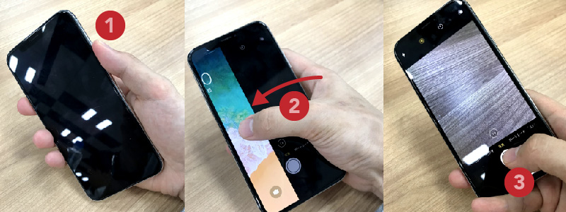
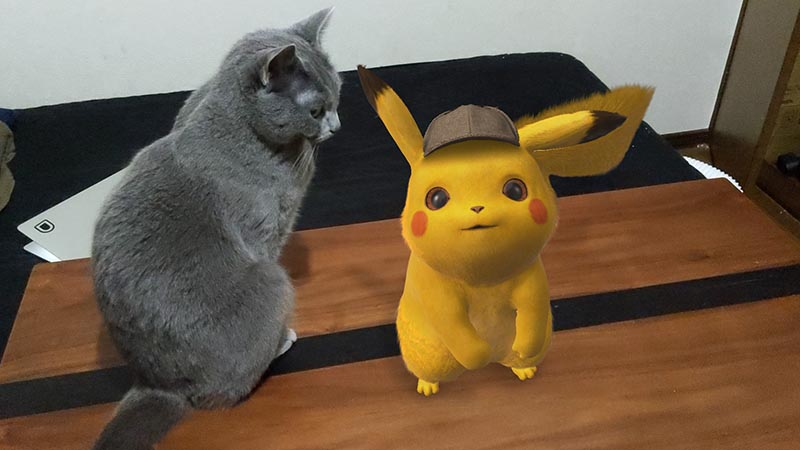

import EmbedCard from '@/components/Blog/EmbedCard.astro';

At the recent Google I/O 2019 event, the [Pixel 3a](https://store.google.com/jp/product/pixel_3a), a budget version of the [Pixel 3](https://store.google.com/jp/product/pixel_3), was announced.

<EmbedCard
    url="https://store.google.com/jp/product/pixel_3a"
    img="https://lh3.googleusercontent.com/-Ez9MiTstK6r-Rm8r9VNQmlYCw1qgo5ZgdLlJ5ol1wJqqytdUXd2fW8JoNl8fNSbo6M"
    title="Pixel 3a & Pixel 3a XL - The phone that delivers - Google Store"
    site="store.google.com" />

The Pixel 3 is a smartphone made by Google. From the start, its camera quality has been a huge talking point and has been featured all over the place.

The camera performance is great, of course, but **what really makes the Pixel 3 outstanding is the quality of its "shooting experience"**. This is a good opportunity, so let me share what I've always loved about the Pixel.

## 1. Speed of shooting

On the Pixel 3, you can **double-press the power button to launch the camera, then press the volume button to take a shot**. Not just on the Pixel 3 — many Android phones can launch the camera instantly via a physical button. You might think "so what?", but this is reaaaally great.

The iPhone also lets you launch the camera by swiping left on the lock screen, but it doesn't come close in terms of simplicity or speed.

The placement of the physical buttons is also great — **you can take a shot from the natural way you hold your phone, with almost no change to your hand position**.

To shoot with the iPhone, you have to change your grip and move your fingers quite a lot.

With the Pixel 3, **whether you're using your right or left hand, holding it portrait or landscape, wearing gloves or not even looking at the screen,** you can launch the camera quickly and reliably take a shot. Whether you're skiing, walking, or carrying a lot of luggage, you can shoot the moment you want to. The difference really shows when you take lots of photos, like during travel.

## 2. Easy photo management

Pixel 3 photos are managed inside the Google Photos app. Google Photos automatically saves to the cloud, so:

- No need for backups
- If you occasionally clear photos from your device, they don't eat up your phone's storage
- Sharing albums with others is easy
- You can browse and manage photos from your PC or other devices

…and more. Plus, <b>storage is unlimited</b>.

As mentioned, the Pixel 3 lets you shoot endlessly, so the volume of photos becomes huge. But even when there are tons of photos, Google Photos has you covered. With the power of machine learning, Google Photos is an app that **organizes huge amounts of photos automatically**.

<b>It automatically recognizes what's in your photos, so you can search with natural language like "dog" or "curry"</b>

<b>It uses face recognition to group people and pets together quite accurately</b>

<b>When you travel, it suggests albums based on location and date range</b>

<b>The editing features are simple to use, yet powerful</b>

…and so on — it's incredibly convenient. There are similar services like iCloud Photo Library and Adobe Lightroom, but if you have a Pixel 3, Google Photos is the only choice.

## 3. Camera performance
As mentioned, the Pixel 3 also excels in pure camera performance. In particular, **its low-light shooting** and **wide-angle selfie lens** are unmatched by other smartphones.

What follows has been said many times before, so I'll just go over it briefly. If you want technical details, [@goando's Twitter](https://twitter.com/i/moments/1057656588255674369) is a great reference.

### Portrait mode

This shooting mode heavily blurs everything except the subject. You can easily take stylish photos that look like they were shot with a DSLR.

The iPhone X also has this mode, and both produce high-quality results. You can also edit the blur after shooting on both.

That said, the iPhone X uses a dual-lens setup to capture depth information, while the Pixel uses machine-learning-based image processing to render the blur. The approaches differ, but in practice the performance gap between them is small.

### Front wide-angle lens

The Pixel 3 has two lenses on the front, one of which is an ultra-wide-angle. Thanks to this, **you can take group selfies without a selfie stick**. Super convenient. Note, however, <b>this wide-angle lens is not included on the Pixel 3a</b>.

### Night Mode

For night scenes and other **low-light situations, the Pixel 3 is among the very best smartphones currently available**. This too is thanks to the power of AI-based image processing. Compared to the iPhone X, the difference is brutal.

### PlayGround

A bonus. The AR features are fun. With the default camera app, you can take photos with characters from The Avengers, Star Wars, and Pokémon.

## Wrap-up

That's it. It really comes in handy in situations where you take lots of photos, like traveling. Compared to when I used an iPhone, **both the number of photos I take and their quality have clearly improved**. Whether you're a JK taking selfies or an uncle who loves to travel, get yourself a Pixel 3.

The end.
