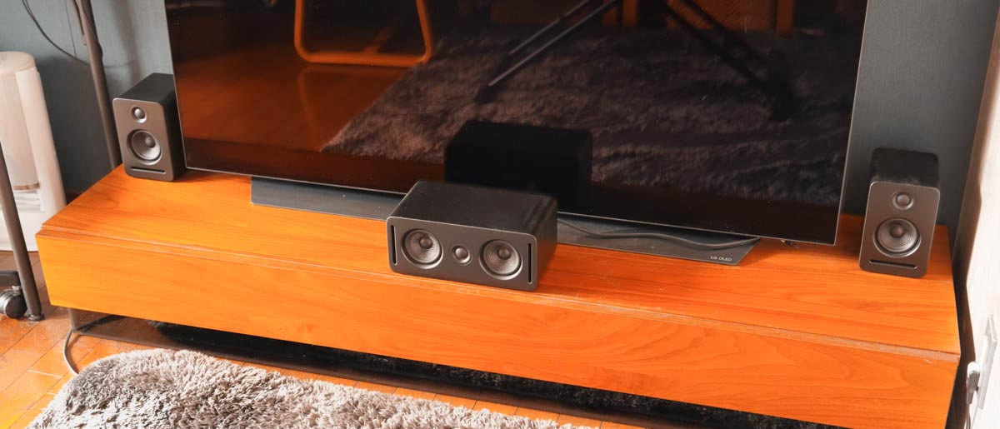
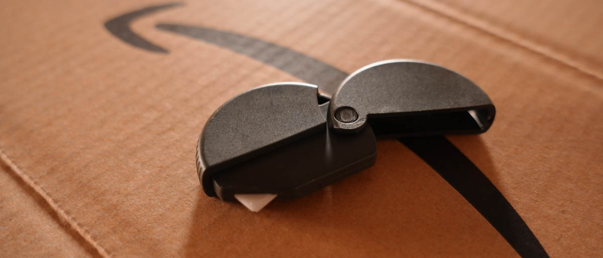
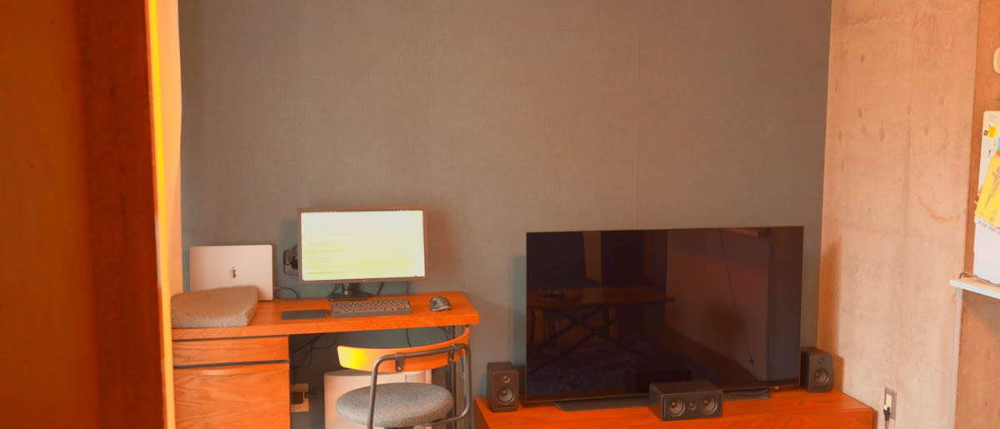
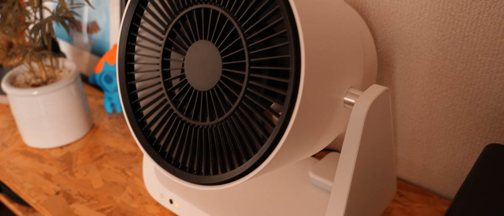
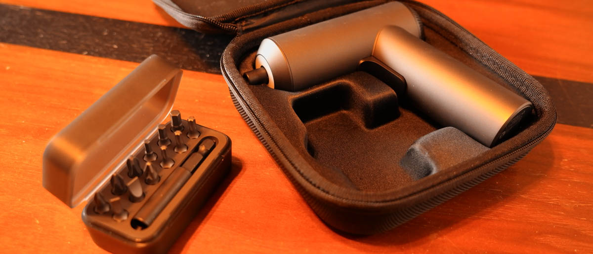
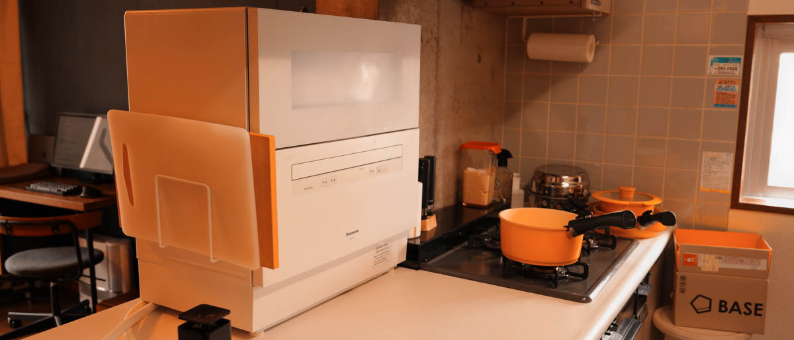

import EmbedCard from '@/components/Blog/EmbedCard.astro';

## Gadgets

### Ambie AM-TW01

<small class="reference">[Source: ambie](https://ambie.co.jp/soundearcuffs/tws/)</small>

A pair of true wireless Bluetooth earphones. Their biggest feature is that they have an <b>open-ear</b> design, so you can still hear what's around you. That makes them perfect for sports or commuting. They look absolutely cool, like earrings, and I use them all the time. They also seem to fit my ear shape well — even after wearing them for hours, nothing hurts, which I really like. Of course, you can't use them when you want to block out ambient noise.

* [Amazon](https://amzn.to/33tMRtU)
* [Official site](https://ambie.co.jp/soundearcuffs/tws/)

### iPad mini

The iPad mini hadn't been refreshed for a long time, so I'm sure many people were eagerly waiting for the new model. It's expensive, but it came out with everything I'd been hoping for, like USB-C and Apple Pencil 2 support. I use it for vector illustration in [Illustrator](#illustrator-ipad) (mentioned below), and for tethering with my DSLR for RAW development. The [Sidecar feature](https://support.apple.com/ja-jp/HT210380), which lets you use it as an external display for your Mac, is super handy too.

* [Amazon](https://amzn.to/3Icl8wq)
* [Official site](https://www.apple.com/jp/ipad-mini/)

### Desk Hack
A charger you mount under your desk that wirelessly charges through the desktop. Charging speed is pretty slow, but since I always keep my phone next to my PC anyway, it feels like my phone is just charging on its own.

<blockquote class="twitter-tweet">
<a href="https://twitter.com/hashtag/deskHack?src=hash&amp;ref_src=twsrc%5Etfw">#deskHack</a> 導入した  こんなん...こんなん最高やん  ⚡️アイコンはキズ補修マニュキュアで描いた<a href="https://t.co/YUyH1bN84f">https://t.co/YUyH1bN84f</a> <a href="https://t.co/TNRACIBT9S">pic.twitter.com/TNRACIBT9S</a>
&mdash; 平田 / U-NEXT (@psephopaiktes) <a href="https://twitter.com/psephopaiktes/status/1429345207145754624?ref_src=twsrc%5Etfw">August 22, 2021</a></blockquote> 

* [Amazon](https://amzn.to/3y6Xxbg)

### SOUND SPHERE

This is the one ONKYO crowdfunded last year. It's a speaker system that lets you build a 5.1ch surround setup **almost completely wirelessly**. I'm very happy with the clean movie-watching environment it creates. My complaints are:

* There's a slight delay, so <b>it's tough for FPS games</b>
* Even in stereo, sound comes from the rear, which makes it hard to tell whether Dolby Atmos surround is actually being output correctly (general products from other companies seem to indicate this on a display…)

…that kind of thing.

* [Crowdfunding (ended)](https://greenfunding.jp/lab/projects/4622)
* [Official site](https://onkyo.com/audiovisual/hometheater/soundsphere/sksss51x/)

## Moving / Furniture
Last summer I moved from Nakano to Yokohama. I work fully remote, so I spent a lot of time choosing furniture and setting up my home environment.

### Midori Cardboard Cutter

Super handy for quickly slicing through cardboard packaging and packing tape and folding it down. It's magnetic, so I stick it on the door — when a package arrives, I can immediately open it and break it down. Highly recommended if you use Amazon and online delivery a lot.

* [Amazon](https://amzn.to/3qz2oBj)

### Removable Wallpaper RILM

Half of the walls in my new place are concrete and half are gypsum board, which looked a bit awkward, so I put up a blue denim-style remake sheet on the gypsum board parts. Putting it up was a bit of work, but the texture and look turned out fantastic and I love it. Apparently it comes off cleanly when you use a removal solution at move-out time.

* [Rakuten](https://a.r10.to/hMCQAE)

### MUJI Sofa Chair for Living and Dining
<blockquote class="twitter-tweet">
昇降机と無印ソファの組み合わせ、我ながら天才  リビング配置にもダイニング配置にもすぐ変えられる <a href="https://t.co/88jDYWypI2">pic.twitter.com/88jDYWypI2</a>
&mdash; 平田 / U-NEXT (@psephopaiktes) <a href="https://twitter.com/psephopaiktes/status/1432976688070094850?ref_src=twsrc%5Etfw">September 1, 2021</a></blockquote> 

I bought one secondhand and just replaced the cover. It's solidly built, so it can serve as a work chair or dining chair too. I usually keep it in an L-shape layout and quickly rearrange it when guests come over. It pairs incredibly well with my [height-adjustable desk](https://a.r10.to/hkVJVO).

* [Official site](https://www.muji.com/jp/ja/store/cmdty/section/S2000607)
* [Amazon](https://amzn.to/3FIXTZo)

### BALMUDA GreenFan C2

A circulator with a charging dock — you can pick it up and easily move it around. (* The [charging dock is sold separately](https://store.balmuda.com/disp/CBlSfSelectGoodsPage.jsp?DISP_TP=1&PRODUCT_SERIES=EGF-P100).) It's pricey so I hesitated, but I'm thrilled with it. I have it linked to Nature Remo so it automatically turns on when I switch on the AC from my phone.

* [Amazon](https://amzn.to/3rznAGu)
* [Official site](https://www.balmuda.com/jp/greenfan-c2/)

### ELECOM Training Mat (Point Training Mat)

I used to have a yoga mat, but it took up space and was a hassle to take out and put away, so I ended up tossing it. With this size, it slips into a small gap and is ready to use in an instant. I just do planks, ab roller, and Ring Fit, so this size is plenty.

* [Amazon](https://amzn.to/3rxYbwV)
* [Official site](https://www.elecom.co.jp/products/HCF-YMCLBK.html)

### Amazon Basics Trash Can

A trash can from Amazon's own brand. It looks good, and being made of steel, the surface stays easy to clean. The lid closes quietly. What I like most is that the corners are rounded, so changing the trash bag is easy.

* [Amazon](https://amzn.to/3tL915L)

### Snow Peak Burner GS-600KH

A gas burner that packs down into a compact cylinder. It uses standard household gas canisters. Great for the outdoors, but it's also perfectly usable for hot pot in your room. Looks cool too.

* [Amazon](https://amzn.to/3tGqBYC)
* [Official site](https://ec.snowpeak.co.jp/snowpeak/ja/%E3%82%AD%E3%83%A3%E3%83%B3%E3%83%97/%E3%83%92%E3%83%BC%E3%83%86%E3%82%A3%E3%83%B3%E3%82%B0/HOME%EF%BC%86CAMP-%E3%83%90%E3%83%BC%E3%83%8A%E3%83%BC-%E3%82%AB%E3%83%BC%E3%82%AD/p/129399)

### WHATNOT Step Stool

I bought it casually for the move, and I use it constantly. It's super light and folds down thin, so I can stash it in a gap by the fridge or furniture and pull it out instantly when needed. Also works as an extra stool when I have lots of guests.

* [Amazon](https://amzn.to/3fF2ykk)

### MIJIA Portable 2000mAh Rechargeable Cordless Electric Screwdriver

A stylish electric screwdriver from Xiaomi that charges via USB-C. I'd been told that an electric screwdriver and a digital tape measure are essentials for moving — and they really were. The general go-to seems to be the [Bosch](https://www.bosch.co.jp/pt/products/?id=IXO6_2021).

* [Amazon](https://amzn.to/3IjHmN0)

### Wood Deck
<blockquote class="twitter-tweet">
ウッドデッキ敷いた <a href="https://t.co/WR5AT69M5y">pic.twitter.com/WR5AT69M5y</a>
&mdash; 平田 / U-NEXT (@psephopaiktes) <a href="https://twitter.com/psephopaiktes/status/1431469401862070276?ref_src=twsrc%5Etfw">August 28, 2021</a></blockquote> 

The balcony of my new place was unnecessarily large, and I wanted to step out barefoot, so I installed wood deck tiles. [IKEA](https://www.ikea.com/jp/ja/cat/outdoor-flooring-21957/) is the standard choice, but I bought the Kohnan ones, which got a high rating in [Kaden Hihyo](https://amzn.to/3KhY7dk). There are rumors that mud builds up underneath and becomes a haven for bugs, but so far things are going great.

* [Official site](https://www.kohnan-eshop.com/shop/g/g4522831933389/)

## Food / Cooking

### ZEYO
<blockquote class="twitter-tweet">
筑波大生なら全員が知ってる世界一美味しい(たぶん)カレーうどん <a href="https://twitter.com/ZEYO298?ref_src=twsrc%5Etfw">@ZEYO298</a> が、冷凍販売を開始  つくってみたけどかなーり再現度たかい！チャーシューもついてくるのがありがたい<a href="https://t.co/7yUsKy8U8M">https://t.co/7yUsKy8U8M</a> <a href="https://t.co/MSYEWA5FiD">pic.twitter.com/MSYEWA5FiD</a>
&mdash; 平田 / U-NEXT (@psephopaiktes) <a href="https://twitter.com/psephopaiktes/status/1379366770897735681?ref_src=twsrc%5Etfw">April 6, 2021</a></blockquote> 

With COVID, lots of ramen shops and restaurants started selling frozen versions of their food. The curry udon from ZEYO in Tsukuba is incredibly delicious and highly recommended. There's also a hometown tax (furusato nozei) option.

* [Official site](https://zeyo298.stores.jp/)

### Moekara Chili Pepper

A seasoning I really took to last year and have been buying on repeat. It's spicier than regular chili powder but has no off-flavor, so it goes with anything.

* [Amazon](https://www.sbfoods.co.jp/products/detail/15789.html)
* [Official site](https://www.sbfoods.co.jp/products/detail/15789.html)

### ZENB

<small class="reference">[Source: ZENB](https://zenb.jp/blogs/noodlerecipes)</small>

I tried quite a lot of nutrition-focused foods last year, but this was the BEST. It's a substitute for regular pasta, made from 100% soybeans with 30% less carbs. Most importantly, it's chewy and tasty. I switched my pantry pasta entirely to this. It also goes well with store-bought ramen broth.

* [Official site](https://zenb.jp/)

### Panasonic Dishwasher NP-TH4-W

I'd wanted one forever, and finally got it after moving to a bigger place. It's expensive, takes up loads of space, and is a bit of an obstacle. But not having to wash dishes is amazing. I cook at home more often now too.

<blockquote class="twitter-tweet">
食洗機のダッサい裏面、ホワイトボードシート貼ってごまかすことにした  かしこい <a href="https://t.co/lXQYW4CG6o">pic.twitter.com/lXQYW4CG6o</a>
&mdash; 平田 / U-NEXT (@psephopaiktes) <a href="https://twitter.com/psephopaiktes/status/1432970498434949120?ref_src=twsrc%5Etfw">September 1, 2021</a></blockquote> 

It does ruin my counter kitchen aesthetic, but I covered the back with a whiteboard sheet to fudge it. Some say it's just better to live in a place where one's built in, though.

* [Amazon](https://amzn.to/3rzciCa)
* [Official site](https://panasonic.jp/dish/products/NP-TH4.html)

## Digital Content
Some of my personal favorites from last year. I read a lot of manga, so I'll only introduce one. I [keep my favorites listed on Alu](https://alu.jp/user/IOeXFqQeiAQprdHNh3LvOJzoVdl2/shelf/IMiIeYyDucwdf6lJxeLS), a manga fan site, if you'd like to check there.

### Splatoon 2
A bit late, but I started playing about a year ago. I got really into it and it became the game I've put the most hours into ever. I'm someone who's never been good at online FPS or TPS games, but Splatoon has fewer buttons, simple rules, and team battles where even beginners can contribute — I was hooked.

Splatoon 3 is also coming out this year, so let's play together.

* [Amazon](https://amzn.to/3AbPCMq)
* [Official site](https://www.nintendo.co.jp/software/feature/splatoon/index.html)

### Hakozume: Kouban Joshi no Gyakushuu
A wildly popular manga that's been adapted into a drama and an anime. It has so many different sides that with each volume it feels like a different manga, getting better and better. It would be a shame to stop at volume 1. The balance between gags and serious moments is perfect, the depiction of police duties is super detailed and fascinating, and even the side characters are great. Reading "Hakozume Unboxed" from the same series after volume 17 keeps the timeline straight.

* [Amazon](https://amzn.to/3rqdeZu)
* [U-NEXT](https://video.unext.jp/book/title/BSD0000210418/BID0000339313)
* [Official site](https://morning.kodansha.co.jp/c/hakozume/)

### BioHazard 4
The VR version of the wildly popular zombie game, remade for Oculus Quest. Facebook was deeply involved in development, and the controller and overall feel are really high quality. It's wonderful that the actions you intend to take actually work as expected. * They've renamed to Meta now.

* [Official site](https://www.oculus.com/experiences/quest/2637179839719680/)

### Illustrator iPad
As mentioned in the [iPad](#ipad-mini) section, this is the iPad OS version of Adobe Illustrator. You can operate it with a pen, and vector drawing might actually be more convenient than using a mouse. Being able to quickly do line art on the go is pretty handy. A paper-like film helps a lot.

* [Official site](https://www.adobe.com/jp/products/illustrator/ipad.html)
* [App Store](https://apps.apple.com/jp/app/id1018784575)

## The End

That's it. I splurged quite a bit last year along with the move, so it was fun putting this together.
