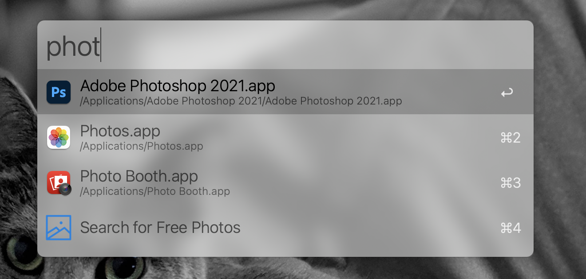
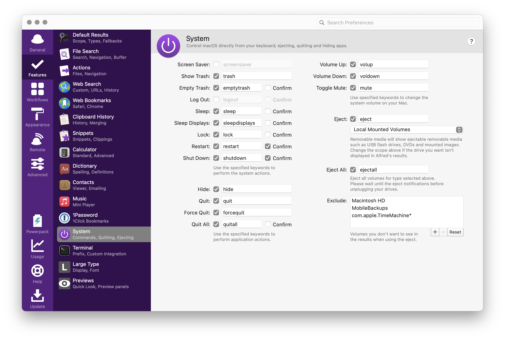
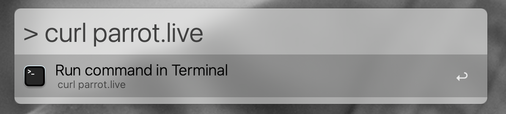
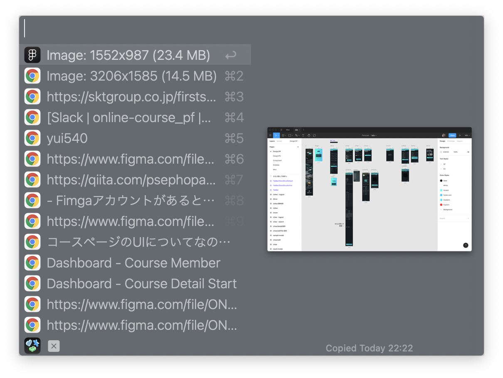
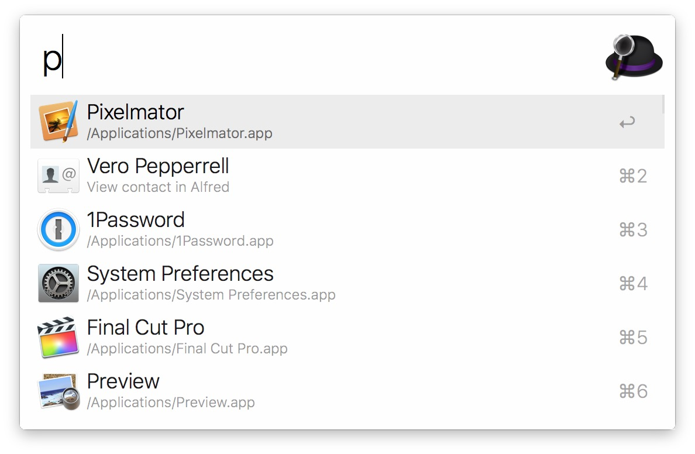
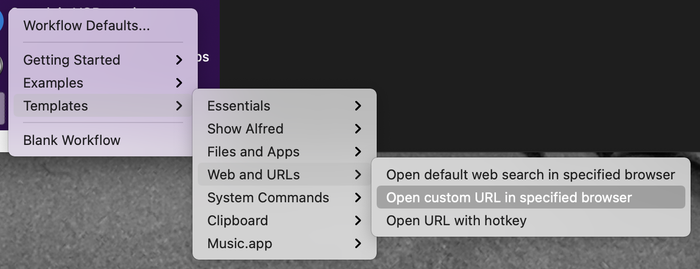
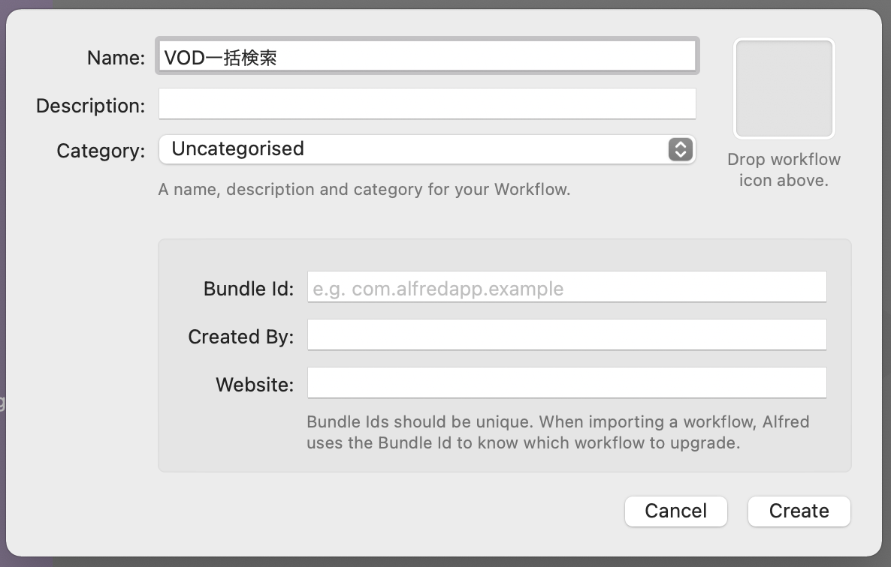
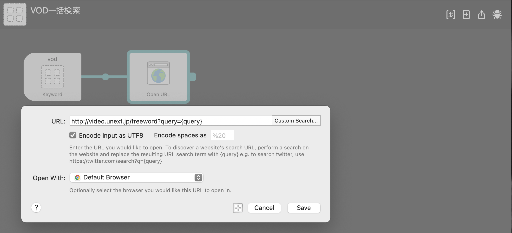
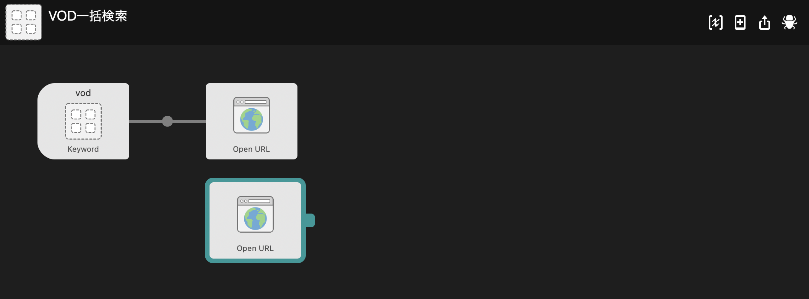

import EmbedCard from '@/components/Blog/EmbedCard.astro';

## What is Alfred?
<EmbedCard
    url="https://www.alfredapp.com/"
    title="Alfred - Productivity App for macOS"
    site="www.alfredapp.com" />

Alfred is a popular launcher app for Mac. Its main feature is a search box that pops up via a shortcut, where you type an app name or file name to launch it quickly. Along with [BetterTouchTool](https://folivora.ai/) and [Keyboard Maestro](https://www.keyboardmaestro.com/main/), it's one of the staple productivity apps on Mac.

The concept is almost identical to Mac's built-in [Spotlight search](https://support.apple.com/en-us/HT204014) feature, so you'll be using it as a replacement.

A lot of users only seem to use the search functionality, but Alfred is incredibly multi-functional and can do all sorts of things.

## Basic Usage
This section assumes most readers already know the basics, so feel free to skip ahead if you're already using it.

### Launch
The search box appears via a shortcut like `⌥ Space`. Of course, the shortcut is customizable. Basically, all features are operated through this box.

### Search for apps
Type in an app name to search and launch it quickly. Usually typing the first one or two letters is enough to find it.

### Search for files and directories
First, press `Space` or `'` to enter file search mode.

From here, type a file or directory name to quickly open the target file.

### Web search
If you type a word that has no matching results, Alfred will launch your default browser and run a Google search.

### Search browser bookmarks
Press `b` and then type some text to search your default browser's bookmarks and open them quickly.

### Calculator
Type in a number to calculate. Pressing Enter copies the result, which is handy.

### Run system commands
You can type things like `sleep`, `restart`, or `emptytrash` to restart your Mac, empty the trash, and so on. There are plenty of other commands shown in the image below.

### Run terminal commands
Type `>` followed by a Zsh command to launch the terminal and run that command. The terminal app to launch is configurable.

### Settings
Alfred is an app you really need to customize, so you'll be opening the settings screen often. The fastest way is to press `⌘,` while the search box is open.

You can also open it by typing "al" in the search box and selecting `Show Alfred Preferences`, or by clicking the icon in the Mac status bar.

## Powerpack
[Alfred Powerpack - Take Control of Your Mac and macOS](https://www.alfredapp.com/powerpack/)

This is Alfred's paid plan. It's a one-time purchase, available either as a plan tied to a specific version or as a lifetime license with free upgrades.

It's not cheap at a little over 7,000 yen, but I think it's well worth the price. Below, I'll mainly introduce the paid features, so please consider it.

If you're going to use the free version, honestly Mac's Spotlight might be enough.

## Clipboard
This is incredibly useful. I'd say it's worth paying 7,000 yen just for this.

It's a feature that lets you browse your copy history on Mac and paste from it again. There are various standalone apps that just do this, and I used to use [Paste](https://apps.apple.com/us/app/paste-clipboard-manager/id967805235), but Alfred's implementation feels superior.

You can call it up with a shortcut like `⌘⇧V` to view your copy history at any time. Not just text — your **image copy history** is saved too.

Use the up/down arrows to choose what to paste again, then `Enter` to paste. If you copied Word or HTML content, it pastes with formatting, but you can also use `⇧Enter` to paste as plain text.

While in this state, you can type a keyword to search through your copy history. Type "Image" and you'll see a list of copied images.

You can also save frequently pasted phrases under Features → Snippets in the settings. I save things like dummy text used in design and DNS addresses.

## Appearance
Alfred is a fantastic app, but the default search box looks awful and you really can't use it as-is.

You can customize the appearance quite freely, including colors and padding. You can also download themes published by other users and apply them.

* [Alfred Theme - Glass--dark](https://www.alfredapp.com/extras/theme/jlgqHifMRw/)
* [Alfred Theme - Smoke](https://www.alfredapp.com/extras/theme/AUkf1A6h2G/)

## Web Search
You can run searches on specific websites directly from Alfred at any time.

To be precise, this is a feature that **opens a URL based on the keyword you type**.

Many websites include the search keyword in their URL, and that's the assumption here. For example, when you search "Let's Play" on YouTube, the URL looks like this:
> <pre>https://www.youtube.com/results?search_query=Let%27s+Play</pre>

By taking this URL and replacing the search word part with `{query}`, you can run searches quickly:
> <pre>https://www.youtube.com/results?search_query={query}</pre>

You can apply this to other things too, like quickly running translations on DeepL.

> <pre>https://www.deepl.com/translator#ja/en/{query}</pre>

## Workflow
Workflows are plugins that add various features to Alfred. You can build your own, and there are tons of free ones made by other users.

For example, there's a [Workflow that lets you search and quickly copy emojis](https://github.com/meyer/alfred-emoji-workflow), and many other things.

Honestly, plenty of people have already covered Workflows, and what you need varies by profession, so I recommend Googling things like "[designer Alfred recommended](https://www.google.com/search?q=designer+Alfred+recommended)" or "[engineer Alfred recommended](https://www.google.com/search?q=engineer+Alfred+recommended)".

### Building a Workflow that searches across multiple websites
Building Workflows can require programming knowledge, but I'll show you an easy and useful search workflow you can build.

The "Web Search" feature mentioned above is convenient, but you can only search one site at a time. By making it a Workflow, you can fulfill requests like "**I want to search for free stock photos across multiple stock photo sites at once**" or "**I want to search for products across multiple e-commerce sites at once**".

As an example, I'll show you how to build a Workflow that searches multiple VOD services at once.

1. In Alfred's settings screen, open "Workflow" and press the `+` button at the bottom-left. Choose `Templates → Web and URLs → Open custom URL in specified browser`.

2. The Workflow creation screen opens, so fill in the info as needed. Only Name is required, so give it a clear name.

3. Double-click the `Keyword` block that was created. Here, set the alphanumeric keyword used to call this Workflow.

4. Next, configure the websites you want to open when running. Double-click the `Open URL` block and set the search URL like in [Web Search](#web-search).

5. Since we want to open the search pages of multiple websites this time, duplicate the `Open URL` block. Click to select it, then copy and paste with `⌘C` → `⌘V`. Double-click the duplicated block and set a different URL the same way.

6. Drag a line from `Keyword` to the newly duplicated `Open URL` block to connect them.

7. Once you've made as many `Open URL` blocks as the websites you want to open, you're done. You can run it with the Keyword you set earlier.

8. When you run it, the browser opens all the searches at once. Super handy.

## Recommended Settings

### Advanced → Force Keyboard
If you set this to `Alphanumeric`, the input language always switches to English when Alfred launches. Alfred Keywords are in English, so enabling this saves you the hassle of toggling input mode each time.

### Advanced → Syncing
You can save your config files to Dropbox or Google Drive to sync them across devices.

## Features I Couldn't Cover
Alfred has even more features, and which ones people use most varies a lot. I personally don't use them much, but:

* 1Password integration
* Apple Music controls
* Searching contacts and dictionary

might be useful for those who do use them. There's also [Alfred Remote](https://www.alfredapp.com/remote/), a feature that lets you control your Mac from your iPhone.

Try out various things and enjoy a comfortable Alfred life.

End
