import EmbedCard from '@/components/Blog/EmbedCard.astro';

## Background

Mobile apps have many UIs with **Bar** in their names: `Tab bar`, `Toolbar`, `Status bar`, `Menu bar`, `Navigation bar`, `Sidebar`, `App bar`, `Gesture bar`, and so on.

Do you know which UI each of these refers to, and properly understand their purposes and constraints? And do you understand that **the same name can refer to different UIs or have different behaviors** between iOS and Android?

Also, did you know that following the [OS26 announcement](https://www.apple.com/jp/newsroom/2025/06/apple-introduces-a-delightful-and-elegant-new-software-design/) and the [Material 3 Expressive announcement](https://m3.material.io/blog/building-with-m3-expressive) in 2025, those names quietly changed?

This article aims to give an at-a-glance overview, so designers and engineers should make sure to read the official specs thoroughly. The official Figma files are also well organized and worth checking out — they make it easy to understand "Oh, this is what this look is called."

* Apple
    * [Human Interface Guidelines | Apple Developer Documentation](https://developer.apple.com/design/human-interface-guidelines/)
    * [iOS and iPadOS 26 | Figma](https://www.figma.com/community/file/1527721578857867021)
* Google
    * [Material Design 3 - Google's latest open source design system](https://m3.material.io/)
    * [Material 3 Design Kit | Figma](https://www.figma.com/community/file/1035203688168086460)

## Summary of Names by Section

Below is a summary of the names and appearances of Bar-style UIs. Where possible, each name links to the official documentation, but iOS doesn't keep older docs around so those have no links.

### The bar UI at the very top of the OS

|  | iOS | Android |
| :--: | :--: | :--: |
| Current | 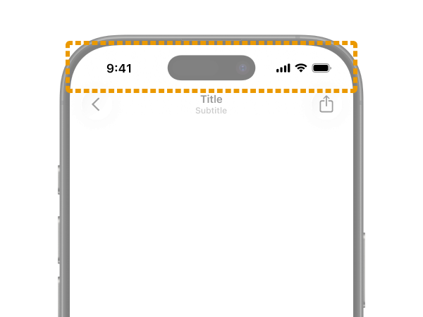   [Status bar](https://developer.apple.com/design/human-interface-guidelines/status-bars) |     [Status bar](https://developer.android.com/design/ui/mobile/guides/foundations/system-bars#status-bar) |
| Previous | 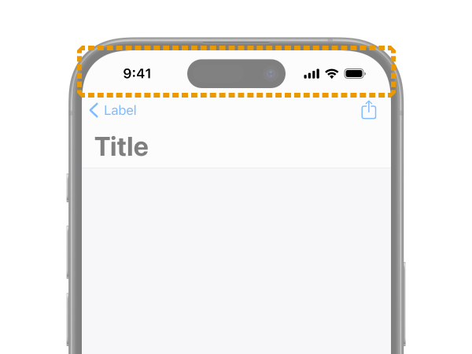   No name change | 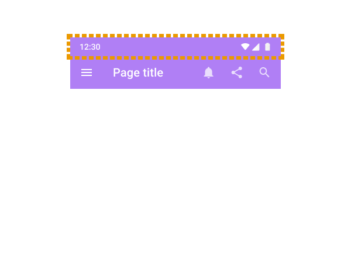    [No name change](https://m2.material.io/design/platform-guidance/android-bars.html#status-bar) |

This one is straightforward. It's the system UI that displays things like the clock, network, and battery — i.e., system status.

In general, there's not much developers can customize. You can hide it for full-screen content like video players or games.

### The bar UI at the very bottom of the OS

|  | iOS | Android |
| :--: | :--: | :--: |
| Current |    Home indicator | 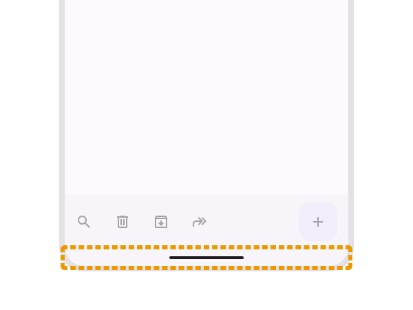    Gesture bar (the name used in the [official Figma](https://www.figma.com/community/file/1035203688168086460)) |
| Previous | 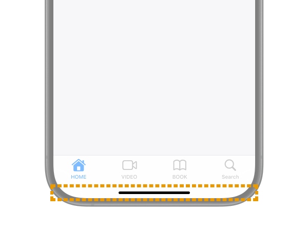   No name change | 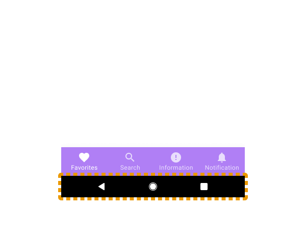    [Android navigation bar](https://m2.material.io/design/platform-guidance/android-bars.html#android-navigation-bar) |

It's the system UI for returning to the OS home screen or switching apps. Just like the `Status bar`, developers don't usually need to think about it much.

I couldn't find an official guideline for `Home indicator` itself, but it's a name that often appears in developer documentation ([example](https://developer.apple.com/documentation/uikit/uiviewcontroller/prefershomeindicatorautohidden)) and user help articles.

On Android, this is sometimes grouped with the `Status bar` and called the `System bar`. The name `Gesture bar` isn't actually used in the official guidelines, and some Google articles still refer to it as `Navigation bar`. However, since `Navigation bar` in Material Design 3 now refers to the tab UI described later, this is probably becoming incorrect going forward.

### The Bar at the top inside an app

|  | iOS | Android |
| :--: | :--: | :--: |
| Current | 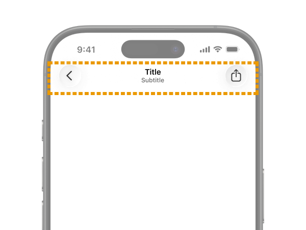   [Toolbars](https://developer.apple.com/design/human-interface-guidelines/toolbars) |     [App bars](https://m3.material.io/components/app-bars/overview) |
| Previous |    Navigation bar |     [App bars: top (Top app bar)](https://m2.material.io/components/app-bars-top) |

The Bar that shows the current location within the app or holds the back button. In the web world, it's often called a `Header`.

This is the most difficult and confusing one. Be sure to check it together with "The Bar at the bottom inside an app" coming up next.

On iOS, `Navigation bar` was the official UI name, but starting with the HIG update for OS26, both the top and bottom were **consolidated** into `Toolbars`. However, the HIG includes the following note:

> In iOS, a navigation-specific toolbar is sometimes called a navigation bar.

So apparently it's still acceptable to refer to the top Bar as `Navigation bar`. This is probably because the name still appears in many docs and implementation APIs, but it's confusing.

On Android, **the opposite happened**: previously both the top and bottom were called `App bar`, but they were **split** so the top is `App bar` and the bottom is `Toolbar`. Ahh, so confusing...

### The Bar at the bottom inside an app

|  | iOS | Android |
| :--: | :--: | :--: |
| Current | 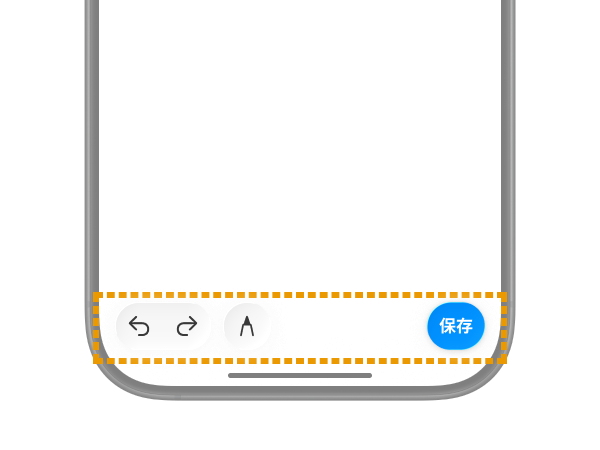   [Toolbars](https://developer.apple.com/design/human-interface-guidelines/toolbars) | 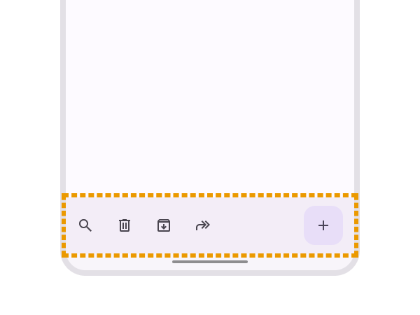    [Toolbars](https://m3.material.io/components/toolbars/overview) |
| Previous | 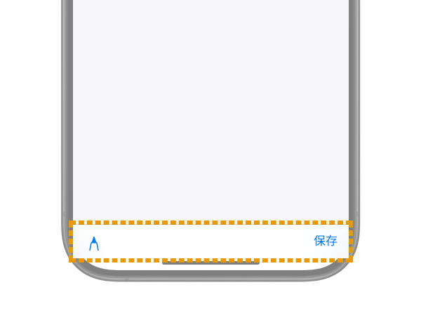   No name change |     [App bars: bottom (Bottom app bar)](https://m2.material.io/components/app-bars-bottom) |

This is the Bar for performing actions on the current screen. It doesn't appear that often. In the web world, it's often called a `Footer`.

It's displayed in the same location as the next "Tab bar for global navigation" and looks similar, but it's a clearly distinct UI.

### Tab bar for global navigation

|  | iOS | Android |
| :--: | :--: | :--: |
| Current |    [Tab bars](https://developer.apple.com/design/human-interface-guidelines/tab-bars) |     [Navigation bar](https://m3.material.io/components/navigation-bar/overview) |
| Previous | 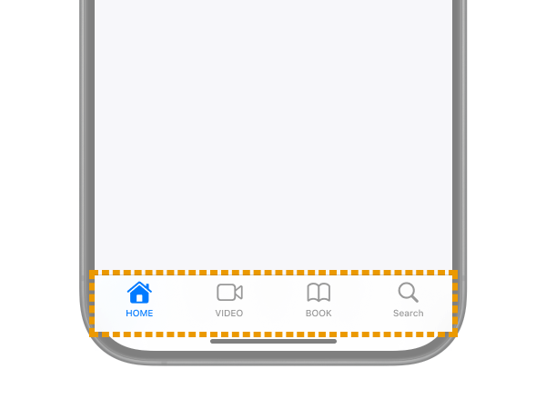   No name change |     [Bottom navigation](https://m2.material.io/components/bottom-navigation) |

Yes, the name `Navigation bar` shows up again. On Android, the bottom tab UI is now called `Navigation bar` going forward.

On iOS, it has always been `Tab bars` and the name hasn't changed. However, its behavior and appearance have been getting major updates frequently, which is rough on developers. In OS26, as you can see, it now has a glass-like appearance and floats and morphs in placement.

<small class="reference">
    Reference: <a href="https://www.apple.com/jp/newsroom/2025/06/apple-introduces-a-delightful-and-elegant-new-software-design/" target="_blank">Apple introduces a delightful and elegant new software design - Apple</a>
</small>

### The Bar shown for notifications

|  | iOS | Android |
| :--: | :--: | :--: |
| Current | None |     [Snackbar](https://m3.material.io/components/snackbar/overview) |
| Previous | None |     [No name change](https://m2.material.io/components/snackbars) |

This is the auto-dismissing notification UI defined in Material Design. It's commonly called a "Toast" UI, but on Android, **the OS-displayed error UI is sometimes called `Toast` and distinguished from this**, so be careful.

[Toasts overview  |  Android Developers](https://developer.android.com/guide/topics/ui/notifiers/toasts)

On Apple platforms, this kind of <b>auto-dismissing</b> toast-style notification UI doesn't exist natively. Apps often implement similar UIs themselves, and they're conventionally called `HUD` (Head Up Display) or `Toast`. Native iOS notification UIs include [Alerts](https://developer.apple.com/design/human-interface-guidelines/alerts) and [Action sheets](https://developer.apple.com/design/human-interface-guidelines/action-sheets).

## Bonus: Other UIs with "Bar" in their names
So far I've mainly covered phone UIs, but if you add **iPad**OS, a few more come into play.

### Sidebar

<EmbedCard
    url="https://developer.apple.com/design/human-interface-guidelines/sidebars"
    img="https://developer.apple.com/tutorials/developer-og.jpg"
    title="Sidebars | Apple Developer Documentation"
    site="developer.apple.com" />

Like `Tab bar`, this is a navigation UI for moving between sections within an app. On iPadOS, it's recommended to either show `Tab bar` at the top or use `Sidebar` instead. You can also implement it so `Tab bar` and `Sidebar` are integrated, letting users switch between them.

https://developer.apple.com/design/human-interface-guidelines/tab-bars#iPadOS

`Sidebar` is intended for use on iPadOS, macOS, and visionOS, and **is not recommended on iOS (iPhone)**, so be careful. If you have a similar purpose on iOS, it's appropriate to use `Tabbar` or [Sheet](https://developer.apple.com/design/human-interface-guidelines/sheets).

On Android, [Navigation drawer](https://m3.material.io/components/navigation-drawer/overview), [Navigation rail](https://m3.material.io/components/navigation-rail/overview), and [Side Sheets](https://m3.material.io/components/side-sheets/overview) are used in similar contexts. None of them include `Bar` in their names.

### The menu bar

<EmbedCard
    url="https://developer.apple.com/design/human-interface-guidelines/the-menu-bar"
    img="https://developer.apple.com/tutorials/developer-og.jpg"
    title="The menu bar | Apple Developer Documentation"
    site="developer.apple.com" />

A horizontal menu UI that appears at the very top of the screen, **outside** the app. It's a staple of macOS and Windows desktop apps. Starting with iPadOS 26, it will be displayed in every app on iPad as well.

A similar pattern shows up in Android (or rather Material Design) with [Menu](https://m3.material.io/components/menus/guidelines#9a6467a3-ad1f-4975-a122-73cdd45dc8e6), used in similar ways on certain screens.

It's a **mouse-centric UI**, so you don't need to think about it for phone-sized screens.

## Wrapping up
If you have questions or corrections, please reach out via [X](https://x.com/psephopaiktes) or similar.

While we're at it, let's recap. `Navigation bar` means:
* On Apple-family OSes, the header UI at the top of an app (this is a legacy name; the current official name is `Toolbars`)
* On the **current** Android OS, the tab UI at the bottom of the app
* On the **older** Android OS, the system UI for returning to home (some official docs still use this meaning)

That was confusing.
