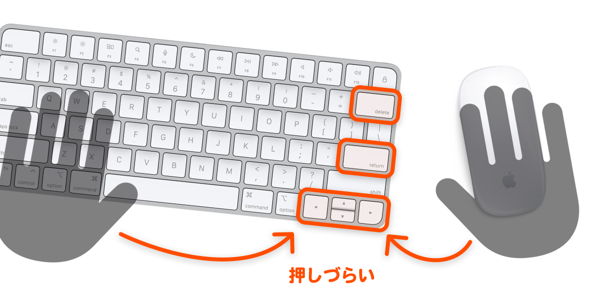
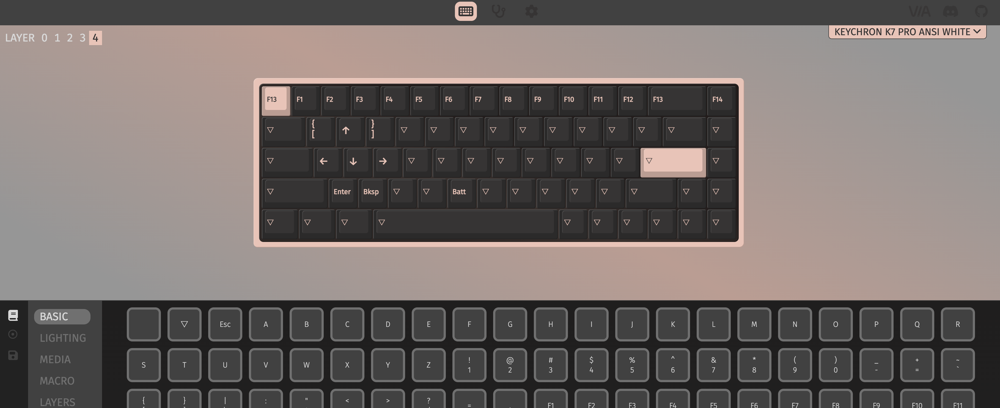

import EmbedCard from '@/components/Blog/EmbedCard.astro';

This is a productivity article aimed at people like:

* Those who work with a mouse in their right hand
* Especially people using software like Figma or Adobe products
* Those considering introducing a so-called left-hand device

## Key keys are far away when using a mouse

In design software like Figma and Adobe products, you use the following keys constantly via keyboard shortcuts:

* Enter
* Delete
* Up/Down/Left/Right (arrow) keys

You also use them all the time in Office software, while playing back videos, and in countless other situations. Yet they are all placed on the **right side of the keyboard**. So when you're using a mouse, these keys are hard to press — whether with your right or left hand, the distance your hand has to travel is long, which is really inefficient.

<small>Far from both sides!</small>

It's also bad for rounded shoulders and tendinitis. Outside of typing text, ideally your right hand stays on the mouse the whole time and your left hand stays in its left-side keyboard position. So as the title says, this article introduces **solutions for easily pressing those right-side keys**.

## Solution 1: Make the key keys pressable from the left side of the keyboard

This is what I do. I hold down the `Fn` key while pressing keys like `W`, `A`, `S`, `D` to trigger the arrow keys and Enter.

I have the setup below, and it's incredibly comfortable. I can run various shortcuts with just my left hand. I've also swapped out the keycaps for clearer-looking ones.

In my case, I've also assigned keys I use often in Figma to `Q`, `E`, `C`, and so on. There are two ways to make this work.

### Configure it on the hardware side
This means using a keyboard that lets you change the key layout. The [Keychron](https://amzn.to/3VWQLEn) keyboard I use supports a method called VIA, which makes layout changes very easy.

### Configure it on the software side
This means using a resident app that lets you freely change keyboard shortcuts. On Mac, classics include [BTT](https://folivora.ai/) and [Keyboard Maestro](https://www.keyboardmaestro.com/main/). You can use the same functionality even when you don't have your external keyboard with you (e.g., when out and about).

I've prepared the BTT preset I use myself, so feel free to download it and try it out in BTT.

<a class="download" href="/download/WASD.bttpreset" download="WASD.bttpreset">WASD.bttpreset</a>

 
## Solution 2: Make the key keys triggerable on the mouse side

This is a method that designers Miyazawa-san and Nagafuji-san have been sharing for a long time. Both have set up Enter, Delete, and the arrow keys to be triggered entirely from the mouse. Their diagrams are super easy to understand.

<blockquote class="twitter-tweet">
使いやすさを模索しながら随時アップデートしてるマウスのボタンのデフォルト設定。現在はこんな感じ。 さらに、アプリごとにボタンの割り振りを変えてます。 （Logicool G604 と SteerMouse を使用） <a href="https://t.co/S0datz4B5i">pic.twitter.com/S0datz4B5i</a>
&mdash; 宮澤聖二｜三階ラボ (@onthehead) <a href="https://twitter.com/onthehead/status/1623967176163201026?ref_src=twsrc%5Etfw">February 10, 2023</a></blockquote> 

<blockquote class="twitter-tweet">
マウスにReturn, Delete, カーソルキーを割り振るとめっちゃ作業がはかどりますよ〜！ <a href="https://twitter.com/hashtag/steermouse?src=hash&amp;ref_src=twsrc%5Etfw">#steermouse</a> <a href="https://t.co/Jo3TE2Xb5f">pic.twitter.com/Jo3TE2Xb5f</a>
&mdash; 長藤寛和 (@kanwa) <a href="https://twitter.com/kanwa/status/1024857936323960833?ref_src=twsrc%5Etfw">August 2, 2018</a></blockquote> 

I also use a multi-button mouse, but I've assigned a lot of browser-related gestures to it, so I didn't go this route. (Also, personally, triggering key inputs with a mouse doesn't feel intuitive to me.)

## Solution 3: Use a left-hand device

There are many **left-hand devices** in the world, and lots of creators are big fans of them. They're extension devices placed on the left side of the keyboard, and many of them let you assign any shortcut or function to each key.

They're a staple for illustrators who draw on iPads or pen tablets. Personally, they're a no-go for me because they clutter my desk and make combo shortcuts like `⌘⌫` or `⇧←` hard to press. They also require more left-hand movement.

I'll introduce a few I considered.

### Typical left-hand devices
I considered a few good-looking ones in this category.

* [XPPen](https://amzn.to/3JbBNCU)
* [HUION](https://amzn.to/3vOvzFX)
* [Razer Tartarus V2](https://amzn.to/4aSe6vj)
* [YesWord X-20](https://amzn.to/4apPqu8)

<small class="reference">
    Reference: <a href="https://www.xp-pen.jp/product/1369.html" target="_blank">XPPen</a>
</small>

### Numpads with arrow keys
The barrier to entry is low, so I'd recommend these as a first try. You can also type numbers with your left hand, which might be nice for heavy Excel users.

* [Cateck](https://amzn.to/4apPwSw)
* [Satechi](https://amzn.to/49uv5Tm)

<small class="reference">
    Reference: <a href="https://satechi.net/products/bluetooth-extended-keypad" target="_blank">SATECHI</a>
</small>

### Stream Deck-style
A go-to keyboard for streamers, but if you set them up, they can of course also work as numpads or arrow keys. Whether they're easy to use is questionable, but they can do various other things, so they might be good for some people.

* [Stream Deck MK.2](https://amzn.to/4aQRVFx)
* [Loupedeck Live S](https://amzn.to/49uZNf8)

Reference: [Loupedeck Live S: Useful Settings I Found as a Beginner](https://jagadget.com/loupedecklives/#toc7)

<small class="reference">
    Reference: <a href="https://www.elgato.com/jp/ja/p/stream-deck-plus-black" target="_blank">Elgato</a>
</small>

### Bluetooth controllers
Mainly aimed at illustrators. They might be slightly off from this article's use case.

* [TourBox Lite](https://amzn.to/4cNDEvh)
* [Clip Studio Tabmate 2](https://amzn.to/3xw9fBA)
* [8BitDo Micro](https://amzn.to/43V7r14)

The 8BitDo Micro is a gaming device, but older models have been hugely popular among iPad illustrators.

<small class="reference">
    Reference: <a href="https://www.tourboxtech.com/jp/" target="_blank">tourbox</a>
</small>

### DIY
If you build your own, every problem is solved — both look and function are entirely up to you. The barrier is high.

<EmbedCard
    url="https://hoshinotabibito.com/hidarite-device-for-ipad/"
    img="https://hoshinotabibito.com/wp-content/uploads/2020/10/ipad-hidaritedeviceforipad-eyecatch.png"
    title="iPad Left-hand Device for Procreate! A Guide to DIY Keyboards | Hoshi-no Tabibito"
    site="hoshinotabibito.com" />
