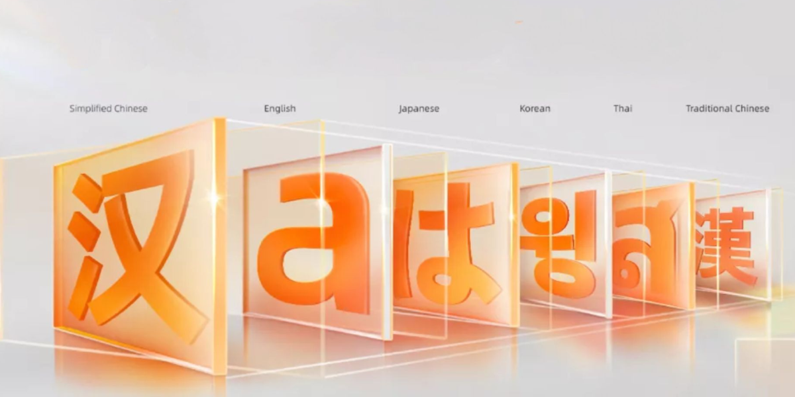

import EmbedCard from '@/components/Blog/EmbedCard.astro';

I've published an OSS starter template for multilingual sites.

<EmbedCard
    url="https://astro-i18n-starter.pages.dev/"
    img="https://astro-i18n-starter.pages.dev/ogp.png"
    title="Astro i18n Starter"
    site="astro-i18n-starter.pages.dev" />

One thing I quietly agonized over while working on this project was what font to use. On a multilingual site, Japanese, English, and Chinese end up mixed together on the same page most of the time, so the criteria for picking a typeface shift a bit from a typical site.

Here's a summary of the candidates I considered and the font I eventually went with.


## Let the system fonts handle it

This is the easiest path, honestly.

Users browsing the site obviously have their native language fonts installed on their devices, so if you just line up the OS-standard fonts in CSS `font-family`, an appropriate typeface will show up in each environment. The web font download cost is zero, too.

```css
font-family: -apple-system, BlinkMacSystemFont, system-ui, sans-serif;
```

The flip side is that you can end up with a style you didn't intend, and you can't really establish brand consistency.


## Alibaba Sans (adopted on this site)

<EmbedCard
    url="https://www.alibabafonts.com/#/home"
    img=""
    title="Alibaba PuHuiTi"
    site="www.alibabafonts.com" />

This is the font I went with for this blog. It's a **multilingual font that Alibaba publishes for free**, and commercial use is also free. Alibaba is a major Chinese tech company, and these days its B2B platform and other enterprise-facing businesses have grown significantly. Providing this font to the world for free is part of their corporate-brand font strategy.

The most striking feature of this font is **the sheer breadth of language coverage**. Centered on Latin script, it **covers 178 languages**, including not just Chinese (Simplified / Traditional), Japanese (hiragana, katakana, kanji), and Korean, but also Arabic, Thai, Bengali, and pretty much every major Asian language.

As a typeface, the defining trait is that its **signature R (rounded corners)** is applied consistently across every language. Whether kanji or Latin script, the corner treatment feels unified, so when you switch the page's language there's zero "wait, did the typeface just change?" awkwardness.



If you actually flip the language on this site, you'll get a feel for the consistency. Give it a try!


## Noto Sans

<EmbedCard
    url="https://fonts.google.com/noto"
    img="https://www.gstatic.com/images/icons/material/apps/fonts/1x/catalog/v5/opengraph_color.png"
    title="Noto - Google Fonts"
    site="fonts.google.com" />

The **classic go-to** for multilingual web fonts is Noto Sans. It's a massive font family co-developed by Google and Monotype, built for the web.


The name comes from "**No Tofu**", meaning **"eliminate tofu (those white squares that show up when characters can't render) from the world"**, which is the ambition the whole project was built around. Today it covers **over 150 writing systems and more than 1,000 languages**, literally aiming for "every script on Earth rendered in a single typeface".

It's licensed under the SIL Open Font License, so commercial use is of course free. When in doubt, you can't go wrong with this one. It is, however, **so much of a default** that it's hard to give your site any distinct character. It's nice that a **Serif version**, [Noto Serif](https://fonts.google.com/noto/specimen/Noto+Serif), is also available.

By the way, the Japanese version is `Noto Sans JP`, the Simplified Chinese version is `Noto Sans SC`, and so on, with each language provided as a separate family. Loading them per language from Google Fonts is the typical setup.


## LINE Seed

<EmbedCard
    url="https://seed.line.me/index_jp.html"
    img="https://seed.line.me/src/images/favicon/ogTag.jpg"
    title="LINE Seed"
    site="seed.line.me" />

This is the typeface LY Corporation (LINE Yahoo) publishes as its corporate font. The Japanese version, `LINE Seed JP`, was recently made available for free on Google Fonts and is now usable commercially too.

> [LY Corporation begins offering its corporate font "LINE Seed JP" on Google Fonts | LY Corporation](https://www.lycorp.co.jp/ja/news/release/020040/)

Supported languages are five: **Japanese, English, Korean, Traditional Chinese, and Thai**. The lineup clearly reflects the Asian markets LINE operates in. <b>Simplified Chinese</b> not being included is a bit of a shame...

The letterforms have a **slightly rounded, friendly vibe** that fits UI- and SNS-oriented contexts well. Since LINE built every language under one brand, the tonal consistency across languages is genuinely impressive.


It's licensed under the SIL Open Font License 1.1, so the conditions are relatively loose, but at the end of the day it's a **corporate font tied to LINE the company**, so you'll want to be a bit selective about where you use it.


## Wrap-up

Roughly summarized:

- Lightweight, low implementation cost → **System fonts**
- Breadth of language support and design consistency → **Alibaba Sans**
- A safe, classic choice → **Noto Sans**
- Friendly, modern, UI-flavored → **LINE Seed**

For this blog I ultimately picked Alibaba Sans. It covers all the languages I wanted to support in a single typeface, and its distinctive look matched the tone of the blog—that combination sealed it for me.

If you switch the language from the site's menu, you'll see how the typeface presents itself across each language at a glance. If you're curious, give it a try.
