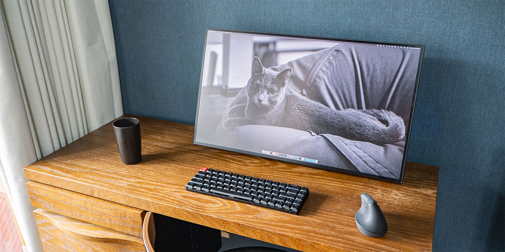
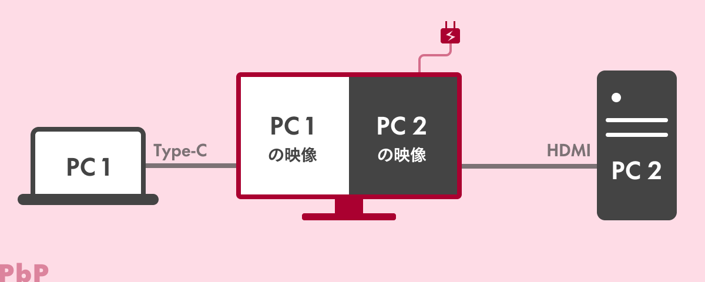
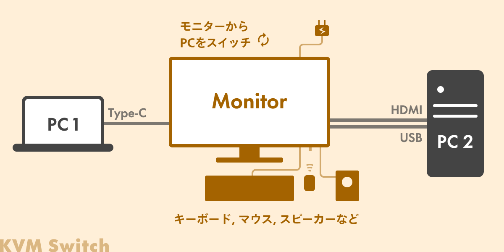
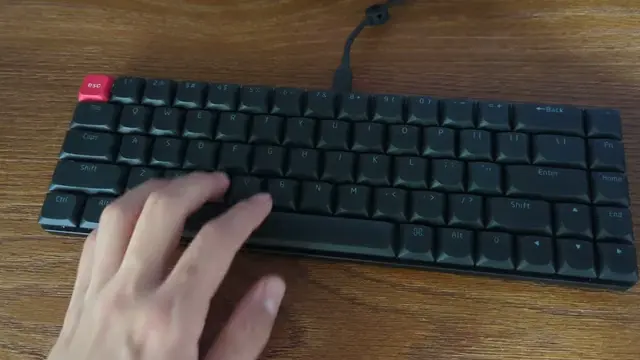
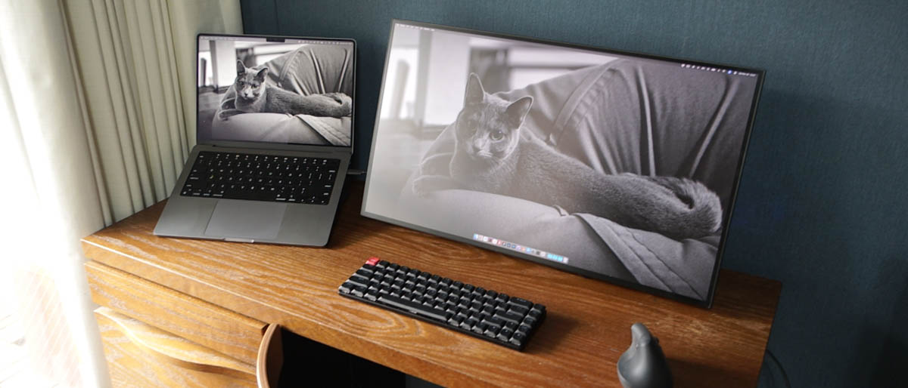

import EmbedCard from '@/components/Blog/EmbedCard.astro';

## Background: I recently bought a new monitor

The [LG UltraFine 4K](https://www.lg.com/jp/monitors/4k-5k-monitors/24md4kl-b/) monitor I'd been using for about five years started showing noise, so I had my work monitor replaced.

The previous monitor was fully optimized for Mac, which was convenient in its own way. But lately, due to my work, I often use STB devices (like Google TV or Fire TV) and connect Windows PCs as well, so I picked a monitor that's easy to use with multiple devices.

I looked for a good-looking monitor that meets the following kinds of specs:

- 4K or higher
- 27 inches or smaller for 16:9, or 34 inches or smaller for 21:9
- 99% sRGB or higher, or 96% DCI-P3 or higher, with a contrast ratio of 1000:1
- VESA mount support
- Looks: black back, three-side bezel-less or more

I won't go into too much detail since it'd be a digression, but it took quite a while to choose...

<blockquote class="twitter-tweet">
新しいPCディスプレイ買うために業務時間の大半を費やしてる<a href="https://t.co/rCSk0MWKQy">https://t.co/rCSk0MWKQy</a> <a href="https://t.co/5o6qfJHLa1">pic.twitter.com/5o6qfJHLa1</a>
&mdash; 平田 / U-NEXT (@psephopaiktes) <a href="https://twitter.com/psephopaiktes/status/1719912642717081990?ref_src=twsrc%5Etfw">November 2, 2023</a></blockquote> 

In addition, when using a monitor with multiple devices, support for the following three features is convenient:

1. **PD power delivery + USB hub function**
1. **PbP/PiP function**
1. **KVM switch function**

### The PC monitor used in this article

There were several candidates that supported these features (introduced at the end), but I ultimately chose JAPANNEXT's [JN-27IPSB4FLUHDR-HSP](https://jp.japannext.com/products/jn-27ipsb4fluhdr-hsp) because it looked the best. It happened to be a gaming monitor, but I really like it: the four-side frameless design and easy-to-use controls are great.

<EmbedCard
    url="https://amzn.to/3GwHsSN"
    img="https://ws-fe.amazon-adsystem.com/widgets/q?_encoding=UTF8&ASIN=B0CDB5XX86&Format=_SL250_&ID=AsinImage&ServiceVersion=20070822&WS=1"
    title="Amazon.co.jp: JAPANNEXT JN-27IPSB4FLUHDR-HSP 27-inch IPS BLACK 4K (3840x2160) LCD Monitor, four-side frameless, height-adjustable stand, USB-C (up to 65W power delivery), HDMI, DP, KVM function, sRGB 100%, DCI-P3 98% : Computer & Peripherals"
    site="amazon.co.jp" />

## 1. PD and USB hub functions

This is becoming standard these days, and many of you may already know about it (though it's still rare on gaming monitors). By connecting a laptop and the monitor with just a single Type-C cable, you can:

* Charge the laptop
* Output video and audio
* Use the monitor as a USB hub (connecting wired LAN, USB drives, etc.)

Just one cable means your desk gets really tidy.

I'll skip the details in this article.

Reference: [Tidy connection with a single cable. EIZO USB Type-C Monitors | EIZO Corporation](https://www.eizo.co.jp/products/eizo_usbtype-c_monitors/index.html)

## 2. PbP/PiP function

When two PCs are connected to a monitor, this function lets you display both video signals on the monitor <b>at the same time</b>.

PbP (Picture by Picture) displays the two video signals side by side on the left and right.

PiP (Picture in Picture) overlays one video signal as a small window on top of the other. Note that many monitors only support one or the other.

This isn't strictly a monitor feature, but it works really well with Logicool's mouse feature [Logi Flow](https://www.logicool.co.jp/ja-jp/software/logi-options-plus.html).

Logi Flow lets you share the mouse cursor between PCs on the same Wi-Fi network, so you can switch devices smoothly just by moving the cursor to the left or right edge of the screen. Below is a video of using Logi Flow with a Mac on the left and Windows on the right shown via PbP.

Reference: [ASCII.jp: Auto-switching & copy-paste are seriously convenient — Logicool's new mouse "Flow" feature is amazing (1/3)](https://ascii.jp/elem/000/001/497/1497389/)

## 3. KVM switch function

A KVM switch is originally a hardware switch that lets you share peripheral devices like a mouse, keyboard, or speakers between multiple PCs.

<EmbedCard
    url="https://amzn.to/47HgJPb"
    img="https://ws-fe.amazon-adsystem.com/widgets/q?_encoding=UTF8&ASIN=B0BD4KX6WC&Format=_SL250_&ID=AsinImage&ServiceVersion=20070822&WS=1"
    title="Amazon.co.jp: UGREEN HDMI KVM Switch, 2-In 1-Out, Share Keyboard, Mouse, and Monitor, for 2 PCs, 4K@60Hz USB 2.0 4-Port Switch, HDMI 2.0 Only, No Driver Needed, Easy to Connect, with Hand Switch & USB Cable : Computer & Peripherals"
    site="amazon.co.jp" />

This function is built right into the monitor. When you switch the input on the monitor, **the mouse and keyboard automatically connect to the selected PC**. The mouse/keyboard connection to the monitor can also be **wireless via USB**. Until I used the KVM function, I thought "Bluetooth is fine for mice and keyboards," but I came to appreciate the convenience of wired and USB wireless connections.

However, when connecting via HDMI, you also need to connect a separate USB cable as shown in the diagram. With a Type-C cable, one cable does the job.

Below is a video of the KVM switch in use. It's a bit hard to tell because the wallpapers are the same, but when I switch the monitor input from Mac to Windows, you can see the mouse and keyboard work seamlessly.

## Recommended monitors that support these features

For reference, here are the monitors I had on my final shortlist. They all look great (important!) and support PD, KVM, and PIP or PBP.

<small>* There may be subtle differences in behavior, so please check the official site before purchasing. Also be sure to check the number of ports you need.</small>

<EmbedCard
    url="https://amzn.to/3t635Gr"
    img="https://ws-fe.amazon-adsystem.com/widgets/q?_encoding=UTF8&ASIN=B0CC1WW2BR&Format=_SL250_&ID=AsinImage&ServiceVersion=20070822&WS=1"
    title="Amazon.co.jp: ASUS 4K Monitor ProArt PA279CRV 27-inch / IPS / 3-year no-bright-pixel warranty / 99% DCI-P3 / 99% Adobe RGB / USB-C PD 96W / color accuracy ΔE<2 / VESA DisplayHDR 400 / ergonomic stand / Japan domestic edition : Computer & Peripherals"
    site="amazon.co.jp" />

<EmbedCard
    url="https://amzn.to/47Ho7u4"
    img="https://ws-fe.amazon-adsystem.com/widgets/q?_encoding=UTF8&ASIN=B0C1H25ZNZ&Format=_SL250_&ID=AsinImage&ServiceVersion=20070822&WS=1"
    title="Amazon.co.jp: PHILIPS Monitor Display 27E1N8900/11 (27-inch / OLED / 4K / HDMI 2.0 x2, DisplayPort 1.4 x1, USB Type-C x1 / USB 3.2 ports x4 / tilt / frameless / height adjust, pivot / blue light filter / Adobe RGB 99.6%) : Computer & Peripherals"
    site="amazon.co.jp" />

<EmbedCard
    url="https://amzn.to/3RqL7ry"
    img="https://ws-fe.amazon-adsystem.com/widgets/q?_encoding=UTF8&ASIN=B09VGGKZDZ&Format=_SL250_&ID=AsinImage&ServiceVersion=20070822&WS=1"
    title="Amazon.co.jp: [Amazon.co.jp Limited] Dell U2723QX 27-inch 4K Hub Monitor (3-year no-bright-pixel exchange warranty / IPS Black, anti-glare / USB Type-C, DP, HDMI / frameless / pivot, height adjust / VESA DisplayHDR 400 / Rec.709 100%) : Computer & Peripherals"
    site="amazon.co.jp" />

<EmbedCard
    url="https://amzn.to/3Nbz0vX"
    img="https://ws-fe.amazon-adsystem.com/widgets/q?_encoding=UTF8&ASIN=B0BR6F1F79&Format=_SL250_&ID=AsinImage&ServiceVersion=20070822&WS=1"
    title="Amazon.co.jp: BenQ AQCOLOR Series Designer Ergonomic Monitor 4K 27-inch PD2705UA, IPS / non-glare / wide color gamut / HDR10 / USB-C 65W power delivery / HDMI / DP / KVM / PIP・PBP / speakers (2.5W x2) / height adjust / pivot / flicker-free / blue light reduction / monitor arm : Computer & Peripherals"
    site="amazon.co.jp" />

<EmbedCard
    url="https://amzn.to/3uMvYbe"
    img="https://ws-fe.amazon-adsystem.com/widgets/q?_encoding=UTF8&ASIN=B0CBMDH33B&Format=_SL250_&ID=AsinImage&ServiceVersion=20070822&WS=1"
    title="Amazon.co.jp: JAPANNEXT 34-inch curved IPS panel UWQHD (3440 x 1440) ultrawide monitor JN-IPSC34UWQHDR-C65W-H, USB-C power delivery (up to 65W), HDMI, DP, KVM, sRGB 99%, height-adjustable stand : Computer & Peripherals"
    site="amazon.co.jp" />

You can also filter for monitors with these features on Kakaku.com.

<EmbedCard
    url="https://kakaku.com/pc/lcd-monitor/itemlist.aspx?pdf_Spec013=1&pdf_Spec040=1&pdf_Spec041=1&pdf_Spec060=1&pdf_Spec066=1"
    img=""
    title="Kakaku.com - PC Monitor / LCD Display Comparison, 2023 Best-Selling Ranking (USB PD, KVM Switch (PC switch))"
    site="kakaku.com" />

## Bonus: List of other devices in use

Here's a quick rundown of the devices in the photos.

### Mouse: [Logi Lift](https://amzn.to/41c0Ii3)

I bought it because I was starting to worry about tendinitis and rounded shoulders. It's really good. You can customize the behavior in great detail with the official app. As mentioned earlier, it pairs well with PbP, and being USB-wireless makes it convenient with KVM too.

### Keyboard: [Keychrone K7 Pro](https://www.keychron.com/products/keychron-k7-pro-qmk-via-wireless-custom-mechanical-keyboard)

A popular keyboard. It's easy to remap the layout, so I've customized it for both Windows and Mac. I didn't like the default keycap colors, so I swapped to [these keycaps](https://amzn.to/3R9jKkk). The letters are translucent so the backlight shows through nicely — I love them.

### PCs: MacBook Pro & Windows Desktop

I do my best to hide them behind the TV. Steve Jobs would probably be furious.

Ideally I'd lay things out like the photo above for maximum usability,

but the cat-position issue made me give up on it.
