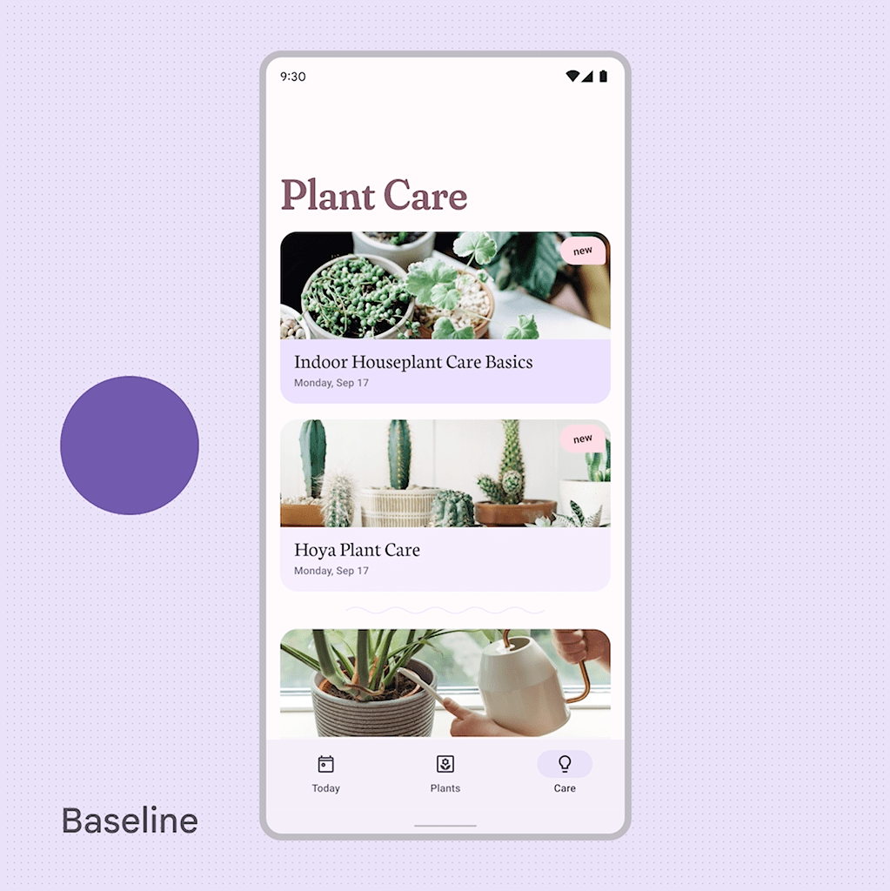
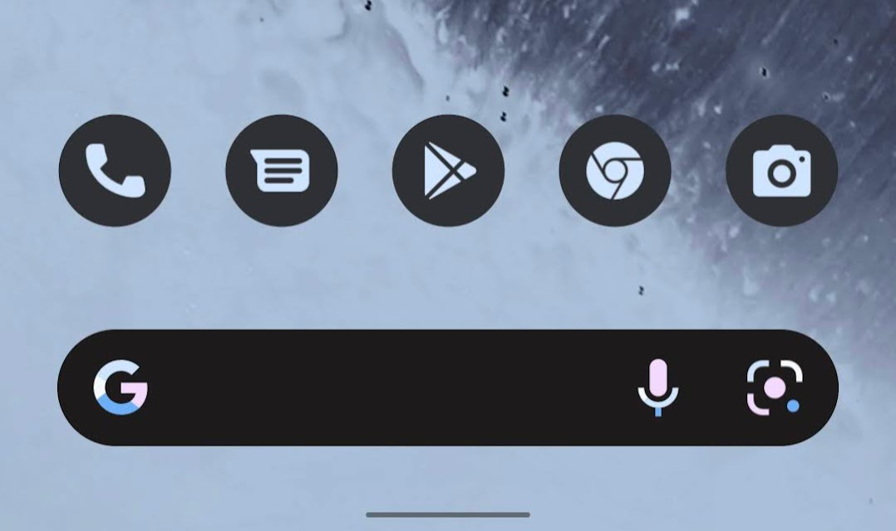
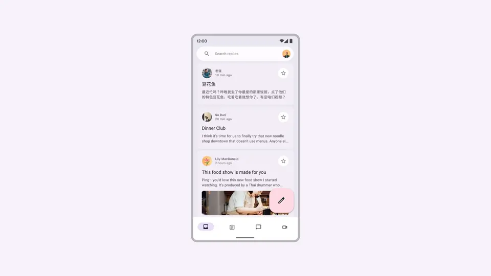

import EmbedCard from '@/components/Blog/EmbedCard.astro';

Here's the official Material Design 3 page that was recently released.

<EmbedCard
    url="https://m3.material.io/"
    img="https://lh3.googleusercontent.com/ycLf6lYhnFiUyNNo0VANuWxgsYMbx3lyrkbiXib9DJEKjfJhXDQcyQZeJsm-sxl4T8SsSez5zFOYAzlsNpCWAkzAKf6ZNfPKFMDOUW5Leiv8unhgjg"
    title="Material Design 3"
    site="m3.material.io" />

It's not an update to [material.io](https://material.io/); it's hosted at a separate URL [m3.material.io](https://m3.material.io/), so it doesn't seem to be the official version yet. The Material Design 3 UI Kit is also published on [Google's official Figma](https://www.figma.com/@materialdesign).

## Dynamic Color

<small>https://m3.material.io/foundations/customization</small>

**Dynamic Color**, which changes the system UI colors based on the user's wallpaper, has been defined. To get a feel for which colors are produced from a given image, try the [official tool](https://material-foundation.github.io/material-theme-builder/).

### M3 Color System
Dynamic Color isn't just for the system UI — you can use it inside your own apps, too. By defining colors as tokens within the M3 Color System, design and engineering can manage colors with a shared understanding. It defines hues across a few categories such as Accent, Neutral, and Error, each split into 13 tone steps.

If you design UIs in Figma, you can use the official [Figma Plugin](https://www.figma.com/community/plugin/1034969338659738588) to design with this M3 color system.

I couldn't find detailed documentation on it, but it looks like app icons themselves will also be able to dynamically change based on the user's custom colors. On Pixel + Android 12, some icons can already be changed.

## Adaptive Design

<small>https://m3.material.io/foundations/adaptive-design/overview</small>

UI design now needs to support a more seamless experience across mobile displays, tablets, desktops, foldable devices, and various portrait/landscape states. The big driver behind this is likely the rising support for Android apps on Chromebook and Windows 11, the rumored release of Pixel Fold, and Android being used on a wider range of display sizes overall.

Large-screen and foldable support is a big topic, so I plan to cover it in a separate article.

## Interaction states

<EmbedCard
    url="https://m3.material.io/foundations/interaction-states"
    img="https://lh3.googleusercontent.com/Ys3RRncgsuJT5SYNr5hJEUi1gq-ME_htiTHQfP_5vyzrOOWwVo7NJvwiGlpQ8DUBobilt6vpPsKFJ72sz7ET_Ycm5TX2LBsWOF6xvWHgKloYxoR6uQ"
    title="Interaction states – Material Design 3"
    site="m3.material.io" />

More careful definitions have also been added for interactions in response to user actions. They were previously defined in the [Surfaces](https://material.io/design/environment/surfaces.html) page and the pages for various components, but they're now described in tighter coordination with tokens, making them easier to manage in design and implementation.

## Typography
Typography variations have been reduced and simplified. Token-based management is supported here as well. On top of that, the new <b>Adaptive type scale</b> lets you dynamically manage font sizes according to device size.

<small>https://m3.material.io/styles/typography/overview</small>

## Component
The styles of components like the Floating Action Button and Bottom Navigation have been significantly changed overall. The aforementioned Dynamic Color is adopted, with a lot of rounded shapes and softer color palettes. Drop shadows have been reduced quite a bit, making the UI hierarchy easier to read. The styles have changed a lot overall, but at a glance the rules and use cases don't seem to have changed much. (Which, naturally, makes sense.)

If anything, the variety of [Top App Bars](https://m3.material.io/components/top-app-bar/overview) has expanded and become easier to work with. As devices get taller, demand for larger top UIs is high, so this is appreciated.

<small>https://m3.material.io/components/top-app-bar/overview</small>

As always, the Material Design documentation does a great job of clearly explaining UI use cases and rules.

## Wrap-up and personal thoughts
Overall, the focus seems to be on:

* Improved maintainability via tokens
* Responsive support for multi-device

Dynamic Color is catchy, but it feels more like an extra to me.

On Android 12, while it's nice that the system picks colors from your wallpaper, personally I'd rather choose every color myself. The very distinct design of the official widgets is also something I really dislike.
