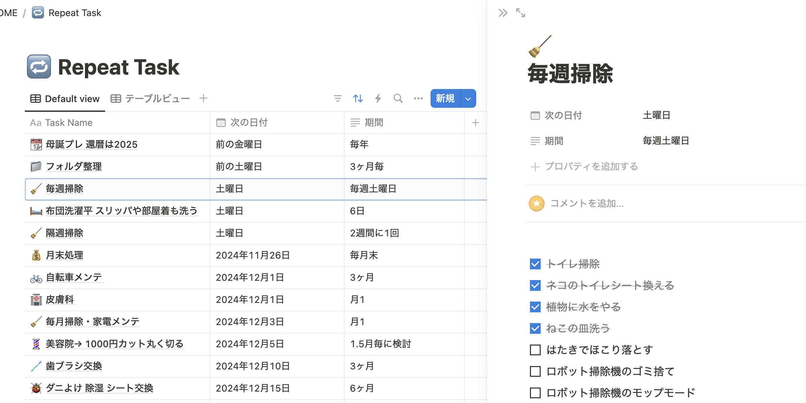
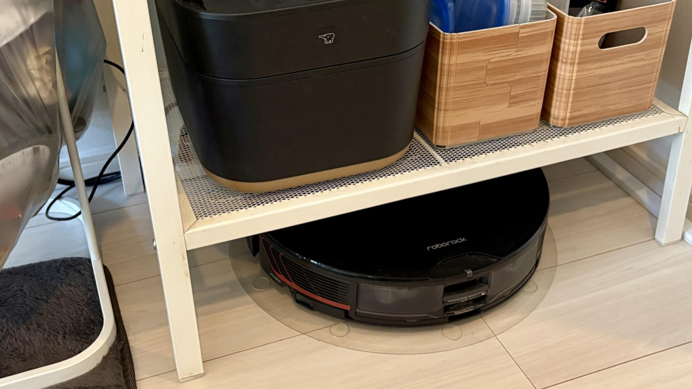
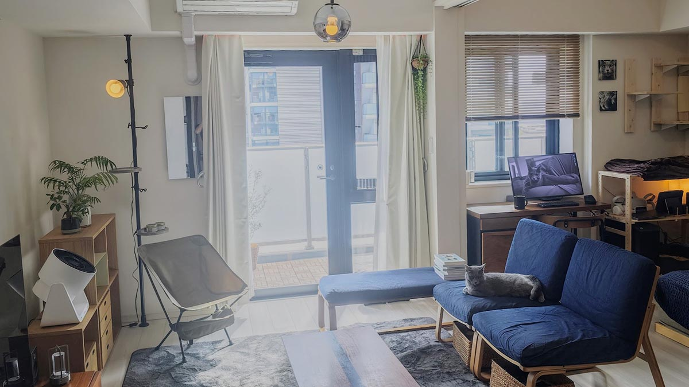
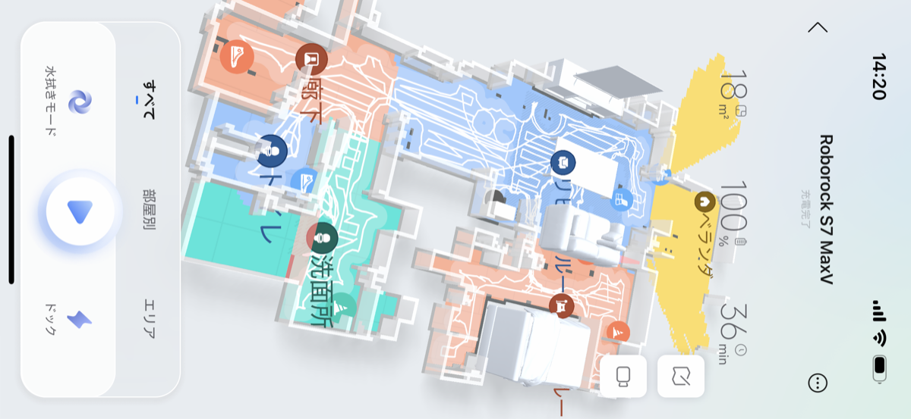
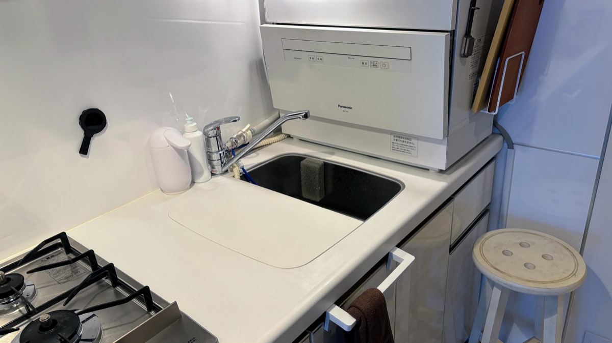
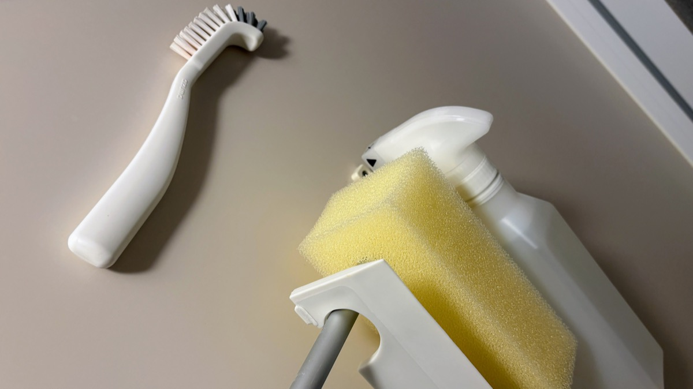
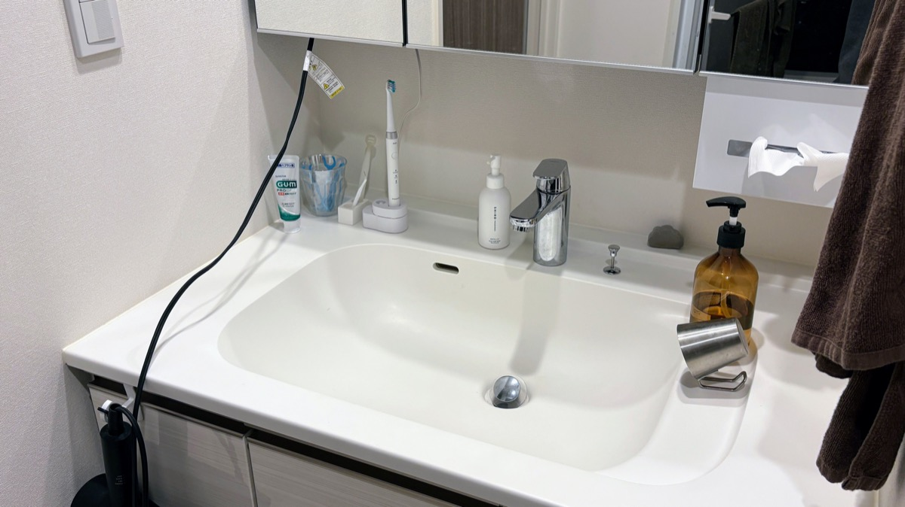
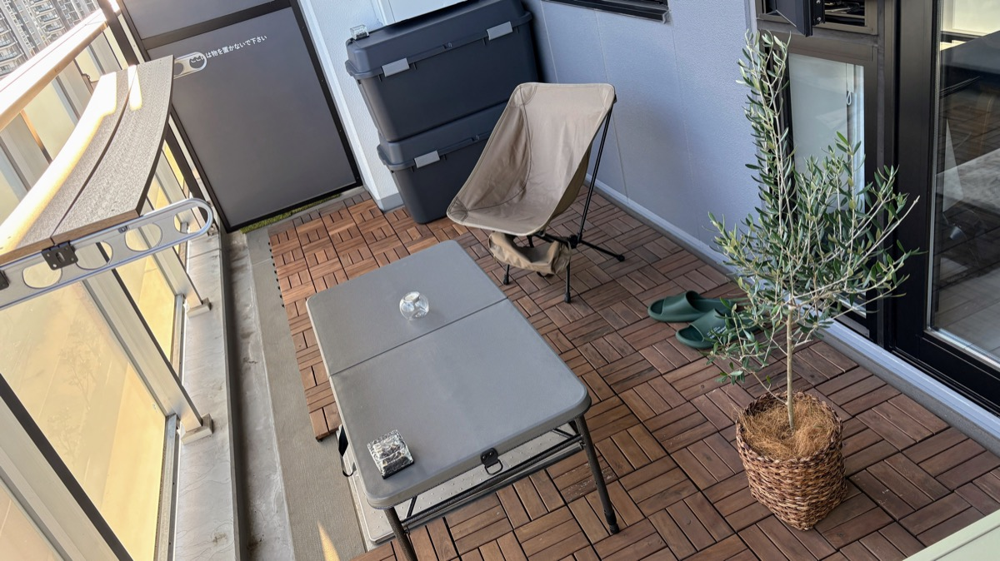

import EmbedCard from '@/components/Blog/EmbedCard.astro';

## Principles

### 🔁 Turn it into a recurring task and get reminders

This is the most important point for me personally. Lazy people will never "clean once it gets dirty," and you don't even notice it's dirty when you live there every day. It's far more efficient to routinize what you do weekly and monthly, and only do it then.

The reminder app can be your usual calendar, a task app, or even paper — anything works. I manage mine in a [Notion](https://notion.so) database.

Also, when you buy an appliance, the "care" instructions in its manual are best added to these recurring tasks. For reference, I summarize the tasks I have set up [later in this article](#example-of-my-recurring-tasks).

### 🤖 Buy a robot vacuum

You should have one. Realistically, covering the whole place with a manual vacuum, mop, or lint roller isn't practical. If you live in a tiny one-room apartment, you might be fine without one.

In my case, with <b>rhinitis & cats & atopy</b>, I can't keep up without a robot vacuum and an air purifier.

Roomba is expensive for what it offers, so [Roborock](https://www.roborock.jp/), [ECOVACS](https://www.ecovacs.com/jp), or [Anker](https://www.ankerjapan.com/collections/cleaner-all) might be better options. I use the [Roborock S7 MaxV](https://amzn.to/40MyJXW).

* For a rental, a model around 50,000 yen is plenty.
* There are random and mapping types, but you should **definitely go with mapping**. Random types take longer and miss spots more often.
* These days, many models come with a mop water-spray feature by default. I run it in mop mode only on weekends.
* For a 1R to 2LDK place, you don't need the auto-collection dock. Without one, the vacuum can fit under shelves and saves space.

The [IKEA Lerberg](https://www.ikea.com/jp/ja/p/lerberg-shelf-unit-white-70315935/) shelving rack is cheap, and the robot vacuum fits perfectly under it — recommended.

I'd personally also strongly recommend a dishwasher, but it takes up a lot of space in a rental, which is the dilemma. Lately [Panasonic has released smaller models](https://amzn.to/3Z9osnu), so something this size might fit.

### 👋 The moment something gets dirty is when it's easiest to clean
For kitchen grease, mirror water spots, or toilet splashes, **cleaning right when something gets dirty is, in the end, the easiest path**.

Even more importantly, **detergents and cleaning tools should be within easy reach**. That's why low-profile, nice-looking tools are great. I'll touch on this in each location section below.

### 🫧 Basically one detergent + α is enough
You'll find all kinds of household detergents at the drugstore, but you don't need to stock up on them. The minimum recommended detergents are basically these three:

* Acidic dirt (like grease) → remove with alkaline detergent or baking soda
* Alkaline dirt (like water spots) → remove with acidic detergent or citric acid
* Other → remove with neutral detergent

**Use a neutral detergent for everything by default**, and only prepare specialty detergents for spots that don't come clean with it. My recommended neutral detergent is below.

<EmbedCard
    url="https://amzn.to/3VkvRhB"
    img="https://m.media-amazon.com/images/I/71SfLarPZaL._AC_SY879_.jpg"
    title="Amazon | Quickle Home Reset Foam Cleaner, 300ml | Quickle | Kitchen Cleaner"
    site="www.amazon.co.jp" />

<EmbedCard
    url="https://amzn.to/3UW7Ih2"
    img="https://m.media-amazon.com/images/I/41YufpGXw3L._AC_PIbundle-2,TopRight,0,0_SH20_.jpg"
    title="Amazon | Toho Utamaro Cleaner, Body + Refill Set, 2-Pack Assortment | Utamaro | Multi-Cleaner"
    site="www.amazon.co.jp" />

It's a small but nice perk that you can **buy several spray bottles to scatter around the house and only need one type of refill**. On TikTok, Utamaro fans seem more common, but I personally prefer Home Reset because <b>it looks natural even left in an easy-to-reach spot in the room</b>. [MUJI also has a similar product](https://www.muji.com/jp/ja/store/cmdty/detail/4550344144794).

### 👯 Inviting people over occasionally keeps the place clean
If you can, having guests over regularly is a great excuse to do a mini deep clean — recommended.

## Cleaning and prevention by area

### 🛋️ Living room / bedroom

On weekdays, I basically just run the robot vacuum every morning. I time it to run at my wake-up time and use it as an alarm clock.

It's also important to leave clear paths the robot vacuum can travel through. My place is set up so it covers almost everything except the balcony and the bathroom.

Only on weekends, I do the following:
* Knock dust off shelves and on top of furniture with a mop and blower
* Move desks and chairs that are usually a hassle to shift
* Then run the robot vacuum in wet-mop mode

<EmbedCard
    url="https://amzn.to/40XIh2t"
    img="https://m.media-amazon.com/images/I/51Ec8GJX8GL._AC_SX679_.jpg"
    title="Amazon | Sanwa Direct Electric Air Duster, Rechargeable, 4-Step Airflow Adjustment, Gas-Free, Auto/Manual Mode, with Silicone Nozzle, Aluminum, Gray, 200-CD076GY | Air Duster | Stationery & Office Supplies"
    site="www.amazon.co.jp" />

<EmbedCard
    url="https://amzn.to/40ZDXQ8"
    img="https://m.media-amazon.com/images/I/61XbZfQV2PL._AC_SX679_.jpg"
    title="Amazon | Kao Quickle Wiper Floor Cleaning Tool Handy Black, Body + Black Refill 8-Pack Set + Kunutonn Original Logo Bonus | Duster / Dust Picker - Online Shopping"
    site="www.amazon.co.jp" />

<EmbedCard
    url="https://amzn.to/4fEXAkR"
    img="https://m.media-amazon.com/images/I/71GCMCLYN8L._AC_SX679_.jpg"
    title="Amazon.co.jp: Yamazaki Industries Handy Wiper Stand, Black, About W7.5 x D7.5 x H15 cm, Tower, Case, Storage, 2770 : Home & Kitchen"
    site="www.amazon.co.jp" />

I also use a [Shark](https://amzn.to/3Zm9ivh) as a secondary vacuum, for tight gaps the robot can't reach or when I need to clean immediately.

It's also a small but useful thing to keep wet wipes within easy reach. I keep [non-alcohol sanitizing wipes](https://amzn.to/3CLC1Rq) inside [MUJI's wet-wipe case](https://amzn.to/3V74Ca9).

### 🍴 Kitchen

Around the stove, **bothering to clean every time you cook is ultimately the easier path**. Once grease cools and hardens, it really won't come off... and bugs show up too.

For the sink, I just give it a quick wash with dish soap when I'm doing the dishes. I tried a [coating agent](https://amzn.to/3CIxiQp) at my previous place to prevent dirt buildup, but honestly I couldn't tell it did much.

Putting a filter on the range hood is worth doing. It turns pitch black in about half a year. They sell them at 100-yen shops too, but find one that fits your range hood.

<EmbedCard
    url="https://amzn.to/4eKJ4qs"
    img="https://m.media-amazon.com/images/I/71WbuL8132L._AC_SX679_.jpg"
    title="Amazon.co.jp: Toyo Aluminium Range Hood Filter, Adhesive Type for Rectifier Plate, with Cutting Perforations, Approx. 64cm x 91cm, 1 Sheet, Filtan S3074 : DIY, Tools & Garden"
    site="www.amazon.co.jp" />

I clean the microwave with the product below. There are methods using lemon or baking soda, but I'm sticking with this because the disposable wipe is so easy.

<EmbedCard
    url="https://amzn.to/3Z4QfEh"
    img="https://m.media-amazon.com/images/I/71UPPHh0qKL._AC_SX679_.jpg"
    title="Amazon.co.jp: [Bulk Buy] Chin! Shitefuku Dake — Microwave-Specific Cleaning Wipes, 3 Bags x 3 : Home & Kitchen"
    site="www.amazon.co.jp" />

By the way, I run my burner grates and the sink drain in the dishwasher about once a month. It's overwhelmingly easier — recommended.

### 🚽 Toilet

The two-pack of Scrubbing Bubbles is the strongest combo.

For grime around the seat and the body, I just dampen toilet paper with the product below and wipe.

<EmbedCard
    url="https://amzn.to/4i4qTPx"
    img="https://m.media-amazon.com/images/I/71DhUvGXp6L._AC_SX679_.jpg"
    title="Amazon | Scrubbing Bubbles Disinfectant Push-Type, Alcohol-Based, for Toilet, 300ml | Scrubbing Bubbles | Toilet Cleaner"
    site="www.amazon.co.jp" />

For the bowl itself, basically without using a brush, just pouring this liquid in for 5 minutes takes most of the dirt off.

<EmbedCard
    url="https://amzn.to/3OuyHfL"
    img="https://m.media-amazon.com/images/I/71lfGt06QBL._AC_SX679_.jpg"
    title="Amazon | [Amazon.co.jp Limited] Scrubbing Bubbles Super Strong Toilet Cleaner, 400g x 3 Bottles, with Cleaning Gloves, Toilet Cleaner / Bowl Cleaner / Yellow Stains / Toilet Cleaning / Bulk Buy / Detergent | Scrubbing Bubbles | Toilet Cleaner"
    site="www.amazon.co.jp" />

I dislike toilet brushes because the brush itself gets dirty. When something just won't come off, I use a 50-yen disposable brush.

<EmbedCard
    url="https://amzn.to/3CRfBxQ"
    img="https://m.media-amazon.com/images/I/71b-e1IVO-L._AC_SX679_.jpg"
    title="Amazon.co.jp: Sowa Toilet Yellow-Stain Remover Sticks, 20-Pack, Cleaning Supplies, Made in Japan, SOUWA : Drugstore"
    site="www.amazon.co.jp" />

By the way, I don't use mats or seat covers because they add to cleaning effort. For the floor, the robot vacuum's mop + handheld vacuum does the job.

Also, men, please don't pee standing up — it makes cleaning 100x harder.

### 🛁 Bathroom

First, about mold: **definitely run the exhaust fan 24/7**. Mold growth is dramatically reduced and the electricity cost is a few hundred yen ([reference](https://enepi.jp/articles/510)). The toilet exhaust fan can also run 24/7.

In recent years, [anti-mold smoke fumigators](https://amzn.to/4fXTfcr) and [hanging-type anti-mold products](https://amzn.to/4fXTfZZ) are popular as preventive cleaning, but I didn't really feel any effect, so I stopped using them. I do recommend putting [100-yen-store masking tape](https://jp.daisonet.com/products/4550480298399) on the rubber gaskets.

It's also a classic to avoid placing shampoo etc. directly on shelves or the floor. Hanging them with [dedicated hooks](https://amzn.to/494eRl3) or sticking them on the wall with magnets is good. They're sold at 100-yen shops too.

<EmbedCard
    url="https://amzn.to/4fB2O18"
    img="https://m.media-amazon.com/images/I/61EN44jcDYL._AC_SY879_.jpg"
    title="Amazon | Yamazaki Industries Magnet Dispenser with Generous Detergent Output, Shampoo, Black, W7×D8×H25cm, Tower, Floating Storage, Refill Bottle, Shampoo Bottle, 1533 | Soap & Shampoo Dispensers - Home & Kitchen Online Shopping"
    site="www.amazon.co.jp" />

Next, for water spots: when I take a bath and notice grime, I clean with **the cold water flow while the shower warms up**. You can clean efficiently during the wait — recommended. Again, having a sponge and detergent within reach is key. I'm not picky about detergents; I hang the MUJI one.

I clean the mirror basically the same way. White haze on the mirror is mostly tap-water stains, so wiping the water off with a squeegee after a bath does a lot to prevent it.

Lastly, before getting out of the bath, give the walls and floor a cold-water rinse. It cuts steam to prevent mold and reduces soap scum from splashed shampoo and the like. As an aside, splashing cold water on your hands and feet is supposed to help regulate your autonomic nervous system ([reference](https://weathernews.jp/s/topics/202001/160125/)), so I do this at the same time.

Also, apparently if you wipe the bathroom walls and floor with the towel you used to dry yourself after bathing, you get virtually no mold or grime — but that's too much hassle for me.

For the drain, I put a 100-yen-shop net in and replace it about once a month (it'll vary depending on hair length and how many people live there).

Towels left wet in the washing machine grow bacteria and start to smell, so dry them properly before tossing them in. I hang mine on the door handle until I take them in the next day (I'm in the camp that swaps face towels daily).

### 🪞 Bathroom sink

Take the original drain piece out, store it until move-out, and put a 100-yen-shop trash guard there to use as a disposable, replaced about once a month. There are many types, but I like the [one with a privacy cover](https://jp.daisonet.com/products/4582281739917). The 2-pack is cheap and surprisingly looks like metal — quite natural.

For the mirror, like the bathroom, the key is to wipe off splashed water droplets every time. Stash a small microfiber cloth in an easy-to-grab spot.

For the dirt and hair around the sink, I keep a small [absorbent sponge](https://netshop.cando-web.co.jp/view/item/000000001005) from the 100-yen shop there and clean only when I notice. Though this sponge gets stiff and hard to use, so I'll probably switch to either [marna](https://amzn.to/418tu4O) or [Yamazaki Industries](https://amzn.to/3ZaRr9o).

Oh, if your washing machine hose is the corrugated type, it's a good idea to wrap it in plastic wrap ([reference](https://compactlife-50.com/drain-hose/)). It makes dust cleanup at move-out much easier.

### ☀️ Balcony / windows

Balconies vary in how dirty they get based on location and environment, so it's tricky, but if you have Karcher's portable type, you can pretty much handle everything.

<EmbedCard
    url="https://amzn.to/4i6MO8X"
    img="https://m.media-amazon.com/images/I/61WQIrIqAtL._AC_SX679_.jpg"
    title="Amazon.co.jp: Karcher Multi Cleaner OC 3 Foldable, Cordless, USB Rechargeable, No Water Tap Connection Required, Disaster Prep / Higher Pressure than Tap (Not a High-Pressure Cleaner) / Simple Shower / Foldable Compact / Lightweight / Tank-Integrated / Wide Range of Optional Accessories / Car Wash, Gravestone Cleaning, Sand Removal at the Beach, Mud, Bicycle, A/C Filter, 1.599-302.0 : DIY, Tools & Garden"
    site="www.amazon.co.jp" />

USB-C charging, no water-tap needed, compact storage — pretty excellent. Some water gets splashed around, but it works on window sashes too.

For windows, just wipe with the [Home Reset](https://amzn.to/3VkvRhB) mentioned earlier and a microfiber cloth.

## Other

### 👯 Cleaning I only do when guests are coming over
Honestly, things I don't care about for myself but do tackle when people are coming over — those are the spots you don't notice in your own place but stand out in someone else's.

- [ ] Wipe the windows
- [ ] Wipe the kitchen and bathroom faucets: wipe off finger smudges with neutral detergent. The impression changes easily — recommended.
- [ ] Re-check the kitchen, toilet, bathroom, and sink water areas. Are they presentable to others?
- [ ] Check the entryway for dust
- [ ] Spray deodorizer on the sofa and rug

### 🌷 Fragrance
If you have a cat, most fragrances are off-limits, so we just put deodorizers everywhere. I buy refill deodorizer beads and place them in lots of spots throughout the home: toilet, cat litter, shoe cabinet, kitchen, living room, etc.

<EmbedCard
    url="https://amzn.to/4i5uyMU"
    img="https://m.media-amazon.com/images/I/71uH0KV5k-L._AC_SX679_.jpg"
    title="Amazon | Shoshu-Riki Ion Deodorizing Plus, for Rooms / Toilets, Stand Type, Unscented, Extra Large, Refill, 1.5kg, Clear Beads, for Rooms / Entryways / Living Rooms / Kitchens / Toilets / Tobacco, Deodorizer, Air Freshener | Shoshu-Riki | Stand Type"
    site="www.amazon.co.jp" />

The container can be the official one, but <b>I think any container you grab from a 100-yen shop works</b>.

### 🐛 Pest control
For about 5 years now, I haven't seen a single cockroach. I've reduced fruit flies a lot too.

* Ventilate the bathroom, kitchen, sink area, etc., and don't leave wet/dirty residue.
* Clean drains regularly.
* Don't leave trash or dirty dishes lying around.

That's the basics. Recommended products:

* [Smoke fumigator](https://amzn.to/3AIZqCo) (every spring)
* [Black Cap](https://amzn.to/411C19L) (every spring)
* [MUJI insect spray](https://www.muji.com/jp/ja/store/cmdty/detail/4550583525279) (low-profile, easy to leave in the room)
* [Fly-be-gone spray](https://amzn.to/40VS9cZ)
* [Air conditioner hose anti-bug cap](https://amzn.to/492FLty) (sold at 100-yen shops too)
* [Gap putty](https://amzn.to/3V7FtMq) (to seal entry routes under the sink)

For fruit fly traps, [store-bought ones](https://amzn.to/3Z4VyDz) work, but they get expensive if you buy them often, so DIY is good too.

[Super Easy "Fruit Fly Trap with a PET Bottle" | AUT FUN | Aichi University of Technology](https://www.aut.ac.jp/autfun/5090/)

I put mine in the container below.

<EmbedCard
    url="https://amzn.to/3Z1GqHk"
    img="https://m.media-amazon.com/images/I/71dI7ZM5YlL._AC_SX679_.jpg"
    title="Amazon.co.jp: Yamazaki Industries Fruit Fly & Deodorizing Pot, White, Approx. W9.5×D9.5×H6cm, Tower, Fruit Fly Trap Case, Bug Repellent, 5740 : Home & Kitchen"
    site="www.amazon.co.jp" />

### 🧹 Hiring a pro for water-area cleaning is also an option

If you're in the <b>time over money</b> camp, hiring a housekeeping or cleaning service once every six months to a year is also fine. I tried CaSy once. Having a pro handle the chores you've been putting off is a great feeling. They covered the kitchen, toilet, bath, and windows in 2 hours for about 6,000 yen.

For housekeeping services, note that you usually need to provide the cleaning supplies yourself.

If you're interested, here's a 1,000-yen-off CaSy referral link →
https://casy.co.jp/invite/ycOWk

## Example of my recurring tasks

Finally, here's the actual list of tasks I have set up. Tasks and frequencies will vary widely based on your living environment and family setup, so use this as a rough guide.

For dishwashers, air purifiers, vacuums, and all sorts of appliances, I also set up maintenance tasks based on their manuals, but I'll skip those here. Manuals tend to be on the strict side, so in practice I do maintenance less often than the manual suggests.

Each time I do a task, I think "this could be done less often" or "I really need to do this more..." and update accordingly. That iteration is important.

Incidentally, I manage things like "go to the dentist," "emergency food expiration dates," and "PC data cleanup" in the same place too.

### Weekly
- [ ] Replace the homemade fruit fly trap (summer only)
- [ ] Replace the cat litter sheet
- [ ] Minimal toilet cleaning
- [ ] Empty the robot vacuum's bin
- [ ] Knock down dust with a blower and handy mop
- [ ] Run the robot vacuum on high-power → mop-water mode
- [ ] Swap the hand towels in the kitchen and bathroom
- [ ] Wash bedding, slippers, and loungewear

### Monthly
- [ ] Check and refill the [deodorizer](https://amzn.to/4i5uyMU) in each room
- [ ] [Wipe the microwave](https://amzn.to/3Z4QfEh)
- [ ] Replace the [bathroom-sink trash guard](https://jp.daisonet.com/products/4582281739917)
- [ ] Replace the bathroom drain net; clean if it's especially dirty
- [ ] Wash the bathroom floor mat

### Every 3 months
- [ ] Bicycle maintenance
- [ ] Replace the electric toothbrush head
- [ ] Check the range hood filter
- [ ] Run kitchen drain and burner grates through the dishwasher
- [ ] Clean the inside of the fridge

### Every 6 months
- [ ] Run a [washing machine drum cleaner](https://amzn.to/497rPOX)
- [ ] Clean the air conditioner's internal filter
- [ ] Wash the rug and sofa cover thoroughly
- [ ] Disassemble and clean the PC keyboard
