import EmbedCard from '@/components/Blog/EmbedCard.astro';

## Background and Intro
Android OS, unlike iOS, has always been designed with the assumption that it will run on many different devices. While iOS only runs on Apple's own iPhone and iPad, Android is installed on tons of smartphones and tablets made by companies other than Google, and is used in all sorts of environments.

On top of that, the fact that **Android apps can now run on Chromebook (Chrome OS) and Windows 11**, along with the launch of foldable devices (folding smartphones) and so on, suggests Android will be used across an even wider range of display sizes going forward.

<small>Just a small sample of devices that run Android</small>

Material Design has also placed greater importance on multi-device and foldable support, with many guidelines added recently. This time, I'll summarize the new official guidelines and link out to relevant resources.

Related article:

<EmbedCard
    url="https://hira.page/blog/material-design-3"
    img="https://hira.page/blog/material-design-3/cover_hub34f4e74b23e8e316755c9b2c3e891e8_210618_1280x640_fit_q80_box_3.png"
    title="A Quick Summary of Material Design 3 | WEBA"
    site="hira.page" />

### What Even Is a Foldable Device (Folding Smartphone)?
You've probably been hearing more about <b>folding smartphones</b> lately. These are devices whose screens can bend and fold thanks to flexible <b>OLED displays</b> (some use LCDs with physical hinges instead).

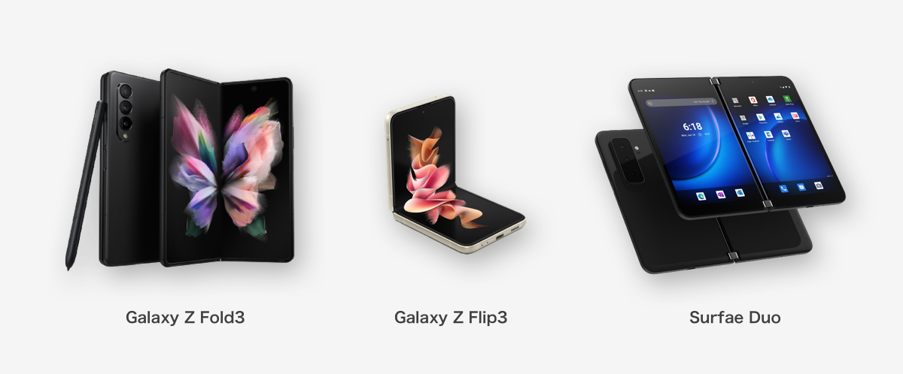

Since they can be used in all sorts of states—small screen, large screen, vertically split, horizontally split—you have to consider an enormous range of UI states with just one device. A real designer's headache.

They're still extremely expensive, often more than twice the price of a typical high-end smartphone. The user base probably won't grow much for a while, so you don't really need to worry too much about foldable support itself just yet.

There are also rumors—coming and going—that Google is officially making a "Pixel Fold" device…

### Android 12L
That said, as I mentioned, large devices in general (not just foldables) are clearly increasing. Google has announced **Android 12L**, an OS optimized for tablets, scheduled for the second half of 2022.

<EmbedCard
    url="https://developer.android.com/about/versions/12/12L/summary"
    img="https://developer.android.com/images/social/android-developers.png"
    title="12L features and changes  |  Android 12  |  Android Developers"
    site="developer.android.com" />

Along with optimizations to the notification area and lock screen, multitasking aids like split-screen and a taskbar have been beefed up. The behavior seems heavily influenced by iPadOS.

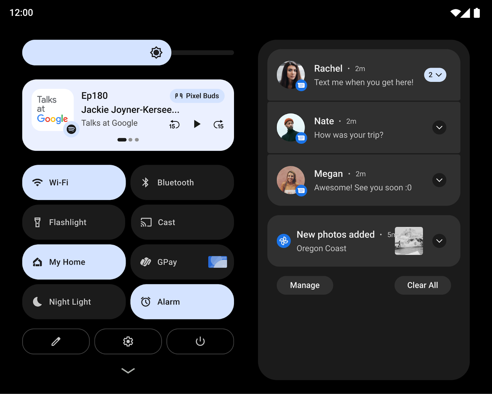
<small>Two-column display of notifications and quick settings</small>

<small>Taskbar display, split-screen via drag-and-drop</small>

<small>Split layout for the Settings screen</small>

## UI Design Considerations
Now we're getting to the main part. As I mentioned, you have to assume apps will be used not only on larger screens but also at <b>aspect ratios you've never seen before</b> due to split-screen layouts. I'll summarize what we did for our app, along with the major official guidelines, and lay out what you can do.

### The Three Steps Material Design Recommends
Google has published several articles on supporting larger screens (linked below). Three steps in particular are emphasized consistently across them.

#### Layout Grid / Reconsider Your Column Grid

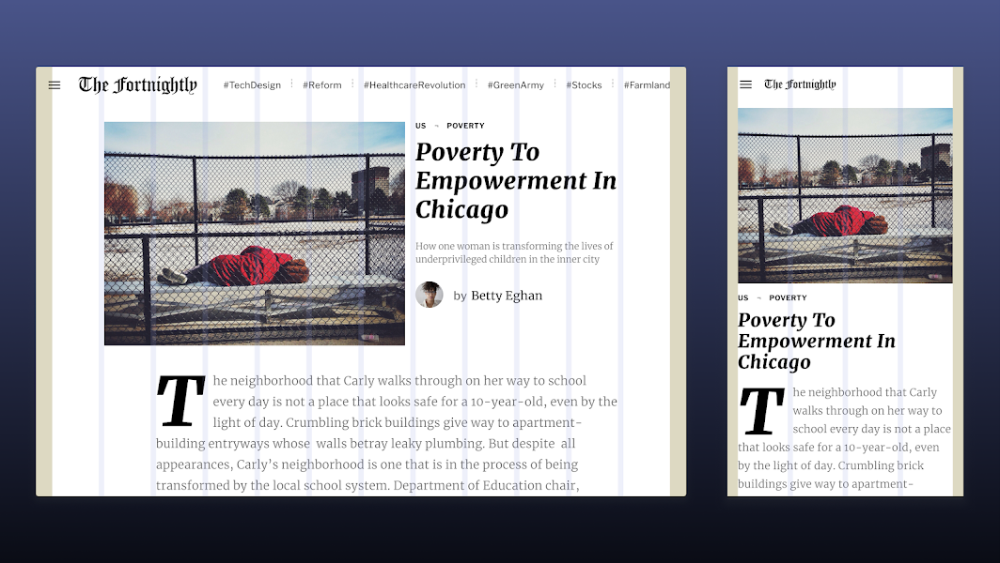

Material Design defines a [Layout Grid](https://material.io/design/layout/responsive-layout-grid.html). It's a concept used since the days of ancient Web Design, but turning columns into a grid-based rule makes it much easier to flexibly change layout per breakpoint (device width).

#### Adaptive Composition / Scale the Compositional Elements
A single screen typically contains multiple compositional elements like the following:

* Global menus such as Bottom Navigation
* Information display areas such as Top App Bars
* Scroll regions made up of components like Cards

Material Design recommends rethinking the overall placement of these elements based on screen size.

* When placing multiple elements on a large screen, use cards or dividers to make groups visually distinct
* Cap the maximum line length at around 60 characters per line to keep text readable

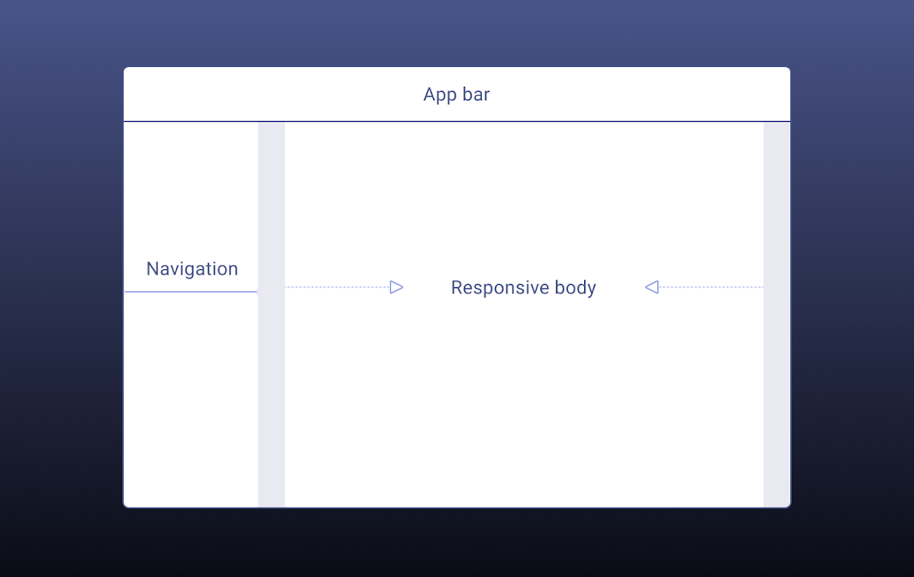

Reconsider the placement and behavior of compositional elements based on screen size—including adopting things like Navigation Rail, which I'll mention later.

Related articles:

* [Foldables – Material Design 3](https://m3.material.io/foundations/adaptive-design/foldables/compositions)
* [Material Design](https://material.io/design/layout/understanding-layout.html)
* [5 Exercises to Prepare Your App for Large Screens - Material Design](https://material.io/blog/5-steps-large-screen-apps)

#### Component Behavior / Per-Component Adjustments
In Material Design, individual components also flexibly adjust their behavior based on the screen. For example, [Snackbars](https://material.io/components/snackbars) span the full screen width on mobile devices, but a maximum width is defined for large screens.

In recent updates, the following Component pages have added definitions for large screens:

[App bars (top)](https://material.io/components/app-bars-top#behavior) / [Bottom navigation](https://material.io/components/bottom-navigation#behavior) / [Buttons](https://material.io/components/buttons#behavior) / [Cards](https://material.io/components/cards#behavior) / [Dialogs](https://material.io/components/dialogs#behavior) / [Image lists](https://material.io/components/image-lists#behavior) / [Lists](https://material.io/components/lists#behavior) / [Menus](https://material.io/components/menus#behavior) / [Navigation drawers](https://material.io/components/navigation-drawer) / [Bottom sheets](https://material.io/components/sheets-bottom#behavior) / [Side sheets](https://material.io/components/sheets-side#behavior) / [Snackbars](https://material.io/components/snackbars#behavior) / [Tabs](https://material.io/components/tabs#behavior) / [Text fields](https://material.io/components/text-fields)

### Think About Where to Place Frequently Tapped Elements
When using a smartphone with one hand, you should avoid placing frequently tapped elements at the top of the screen where your fingers can't reach. On foldable devices, area 2 in the image below is considered the easiest to tap. Area 3 is at the bottom, but it's actually very hard to tap, and placing things like FABs there isn't recommended.

<small class="reference">[Reference: Foldables – Material Design 3](https://m3.material.io/foundations/adaptive-design/foldables/overview)</small>

Also, placing important elements too far down can cause them to fall outside the first viewport at awkward aspect ratios, hiding them.

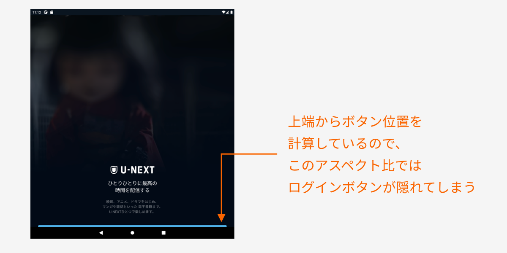

This kind of thing seems to call for layout logic that calculates positions from the bottom up, among other tricks.

### Considering Input Devices
Responsive design on Android isn't just about handling various screen sizes. As I mentioned earlier, since your app may be used on Chromebooks or Windows, you also have to consider that **users may be operating it with a mouse and keyboard**.

For that reason, ideally your app should support hover and click interactions, navigating elements with the Tab key, executing with Enter, and so on. A lot of this seems to be handled automatically when you implement with Material Design–related libraries.

Also, you might want to consider:

* For a video app, supporting the spacebar for play/pause and other keyboard shortcuts
* For a game app, supporting controller input
* Whether to assume use of a stylus / touch pen

### Table Top Mode Support

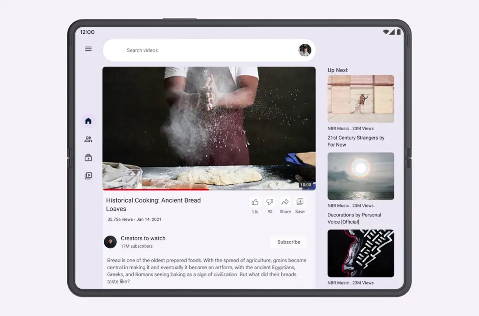
<small class="reference">[Reference: Foldables – Material Design 3](https://m3.material.io/foundations/adaptive-design/foldables/overview)</small>

Foldable devices can be folded horizontally and stood up on a desk. In that state, playing video on the upper half while displaying controls on the lower half makes for a great experience.

This is mainly a UX assumption for video playback or video calls. Since it's foldable-specific, the priority feels low.

### Sliding Pane Layout
For settings-style screens, or list-to-detail navigation flows, consider adopting a <b>Sliding Pane Layout</b> with the list and detail side by side.

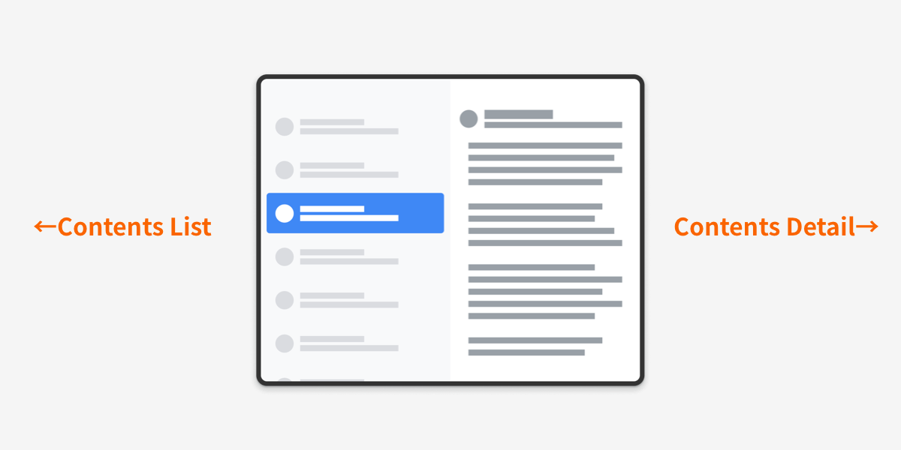

This is the same kind of screen used by the Settings app on iPad. Android 12L is also planned to use it on its Settings screen.

### Motion on Resize
When the screen size changes, animating the added or removed elements appropriately helps users understand the UI change.

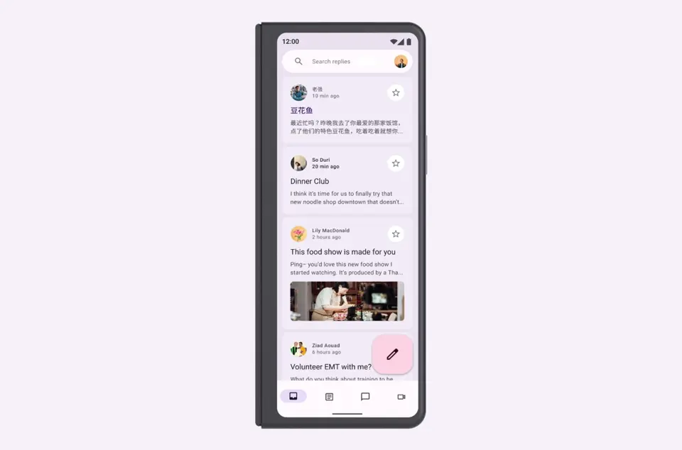
<small class="reference">[Reference: Foldables – Material Design 3](https://m3.material.io/foundations/adaptive-design/foldables/motion)</small>

That said, foldable devices are about the only ones where you have to assume frequent size changes, so this will inevitably be lower priority.

### Adaptive Type Scale
This is a font rule defined since Material Design 3 that allows dynamic size changes.

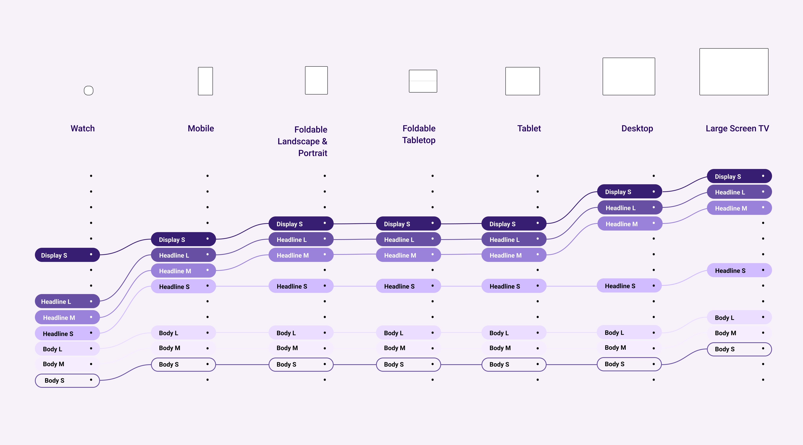

By defining size rules per design token (variables like Headline, Body), you can dynamically change sizes using shared rules between design and implementation. That said, Android fonts vary by device's pre-installed fonts, and font sizes are often implemented in sp (Scalable Pixel), so it's complex—I have a feeling this will be quite a hassle in practice.

<EmbedCard
    url="https://m3.material.io/styles/typography/overview"
    img="https://lh3.googleusercontent.com/Lc3oIPeZ04n3xRik87uNS90GHKzm2hgtqMs3h9PL4rvGlsYEGpWLmocZ-8HFSX0wflnR7wYfraQSganO2EDgxglzqOAAZfNIf1Etdds2JSofOutRsZBs"
    title="Typography – Material Design 3"
    site="m3.material.io" />

### Display as a Modal Window
By displaying certain screens in a modal window, you can reuse the same layout as the mobile app. For example, in the U-NEXT app, the title detail screen is displayed in a tall, narrow modal so it can be reused with nearly the same layout as on mobile.

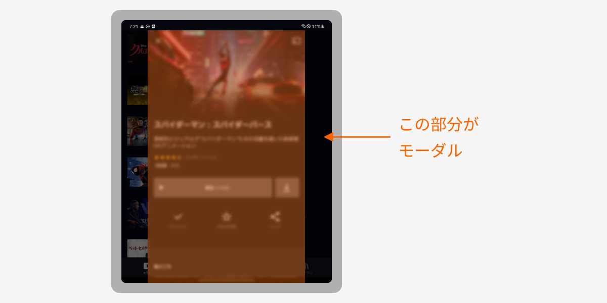

You can't use this for every screen, but it's a small trick that cuts down on design and implementation costs.

### Adopting Navigation Rail
This is a relatively new component added to Material Design about two years ago.

<EmbedCard
    url="https://material.io/components/navigation-rail"
    img="https://lh3.googleusercontent.com/ejEwgniW0-KTBP5oD3Ygc9KqdwgfSr5LEEnVLpKLEcsmZsG6C4UvIpypLRF4bmrgnm88qaS_fTkMSEYUKFlaoQ1nB0llc9XIxT5mow"
    title="Navigation rail - Material Design"
    site="material.io" />

In the U-NEXT app, when the screen width exceeds 600dp, it's displayed in place of the Bottom Navigation.

By the way, an Android engineer at our company has put together a slide deck with implementation insights.

<EmbedCard
    url="https://speakerdeck.com/tomoya0x00/yi-wai-tojian-dan-navigation-raildao-ru-falseohua"
    img="https://files.speakerdeck.com/presentations/4e2c0e2749f742b2b7de60d4556e3644/slide_0.jpg?19566124"
    title="Easier Than Expected? A Story About Adopting Navigation Rail - Speaker Deck"
    site="speakerdeck.com" />

### Adopting Side Sheets
This is also a Material Design Component. It works on mobile apps too, but it's especially well suited to large-screen devices since you can show additional content without completely covering the screen.

<EmbedCard
    url="https://material.io/components/sheets-side#usage"
    img="https://lh3.googleusercontent.com/Te8S0q-tAnCvwza29GS4VcNoKjlHuYavR8UrPJ8NKO2kPR1TWatGwBBIEradXZTymf7vF_zl0bKbPSG-R97ApWhrbfVagTdq3V2r1g"
    title="Sheets: side - Material Design"
    site="material.io" />

In the U-NEXT app, the table of contents in the book viewer is displayed as:

* Full-screen Dialogs on mobile
* Side Sheets on tablets

<small class="reference">[Reference: Ancient Mesopotamian Cuisine—The Epic of Gilgamesh and the Oldest Recipes ©Masashi Endo, Daiwa Shobo](https://video.unext.jp/book/title/BSD0000420559/BID0000708428)</small>

### Avoid the Hinge
On the unfolded screen of a foldable device, avoid placing tappable elements within 48dp around the central hinge.

A common bad example is displaying a Modal Dialog as-is right over the central hinge.

### Minimize Finger Travel
On large screens, you have to be aware that finger travel becomes longer. By displaying a popup near the UI element the user just operated, you let users continue to operate efficiently.

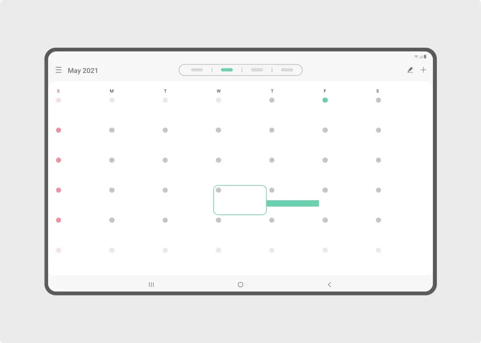
<small class="reference">[Reference: Samsung Developers](https://developer.samsung.com/one-ui/foldable-and-largescreen/intro.html)</small>

## Case Studies
Google has gathered examples of foldable / large-screen apps on the site below. It's super useful, so definitely give it a look.

<EmbedCard
    url="https://developer.android.com/large-screens/stories"
    img="https://developer.android.com/images/social/android-developers.png"
    title="Large screen success stories  |  Android Developers"
    site="developer.android.com" />

## Summary
Lastly, here's a roundup of the official information I could find on foldable / responsive design.

* [Responsive layout grid - Material Design](https://material.io/design/layout/responsive-layout-grid.html#columns-gutters-and-margins)
* [Adaptive design – Material Design 3](https://m3.material.io/foundations/adaptive-design/overview)

↑ The likely-relevant sections of Material Design v2 and v3, respectively. Sticking to these should cover most of what you need.

* [Introducing Material Design Guidance for Large Screens - Material Design](https://material.io/blog/material-design-for-large-screens)
* [Start Here: 5 Exercises to Prepare Your App for Large Screens - Material Design](https://material.io/blog/5-steps-large-screen-apps)

↑ More like blog posts than guidelines. Good for getting a rough overview.

* [Design an Adaptive Layout with Material Design – Figma](https://www.figma.com/community/file/976547042961041487)

↑ Google's official tutorial Figma file.

* [Build apps that support foldables  |  Android Developers](https://developer.android.com/guide/topics/ui/foldables)
* [Get started with large screens  |  Android Developers](https://developer.android.com/guide/topics/ui/responsive-layout-overview#case_studies)

↑ Developer guidelines, but they touch on expected behaviors, so it's worth a quick skim.

* [Introduction—Large screen UI | Samsung Developers](https://developer.samsung.com/one-ui/foldable-and-largescreen/intro.html)
* [Build apps for dual-screen and foldable devices - Dual-screen | Microsoft Docs](https://docs.microsoft.com/ja-jp/dual-screen/)

↑ Samsung and Microsoft, who develop folding smartphones themselves, have also published their own design guidelines.

## Bonus
U-NEXT is a service that also supports e-books, but if you're going to read a book on a foldable device, this↓ is a bit sad, isn't it?

<small class="reference">[Reference: Yowamushi Pedal SPARE BIKE ©Wataru Watanabe, Akita Shoten](https://video.unext.jp/book/title/BSD0000104373/BID0000323211)</small>

So we quietly shipped an update so you can read in a two-page spread, just like a real book.

<blockquote class="twitter-tweet">
U-NEXT updated yesterday to support foldable smartphones like the Galaxy Z Fold.  You can now read manga in a two-page spread, just like a real book. Surprisingly few smartphone apps can actually do this—U-NEXT is probably the first. <a href="https://t.co/ADeYvSgKVs">pic.twitter.com/ADeYvSgKVs</a>
&mdash; Hirata / U-NEXT (@psephopaiktes) <a href="https://twitter.com/psephopaiktes/status/1458268803549175809?ref_src=twsrc%5Etfw">November 10, 2021</a></blockquote> 

<small class="reference">[Reference: Detective Conan ©Gosho Aoyama, Shogakukan](https://video.unext.jp/book/title/BSD0000036696/BID0000812653)</small>
