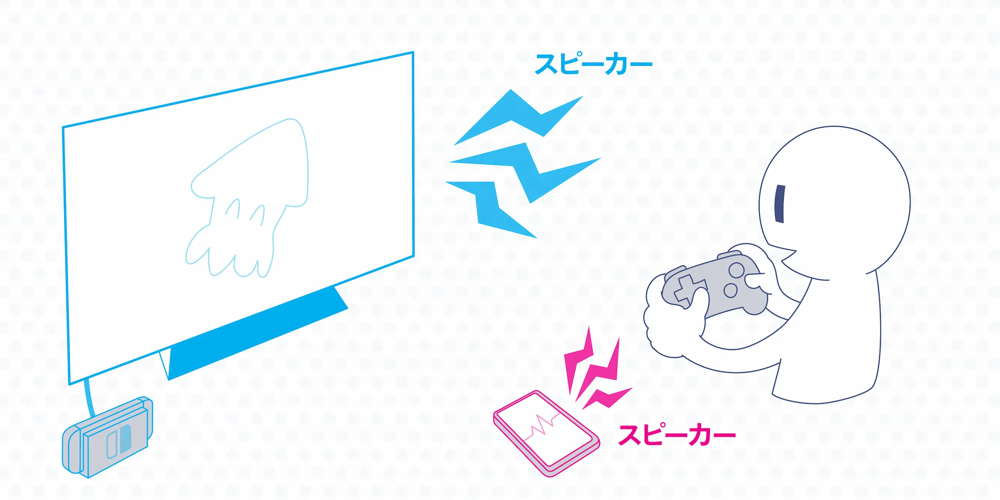
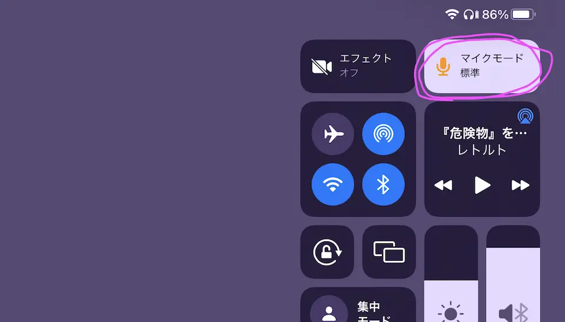
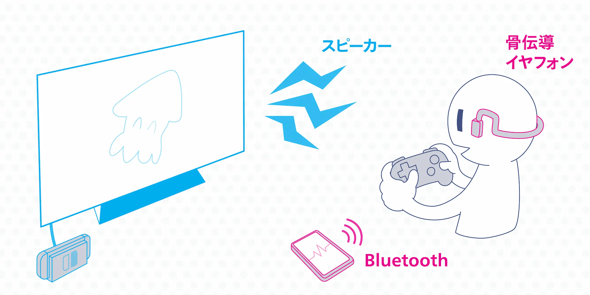
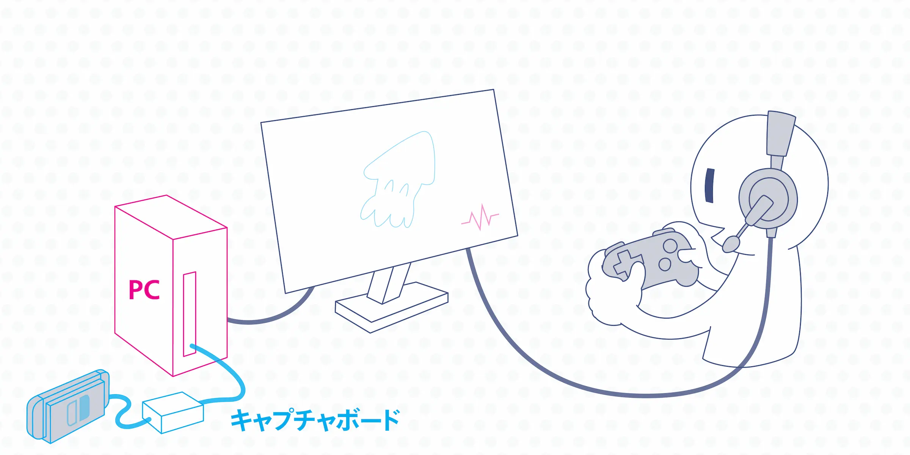
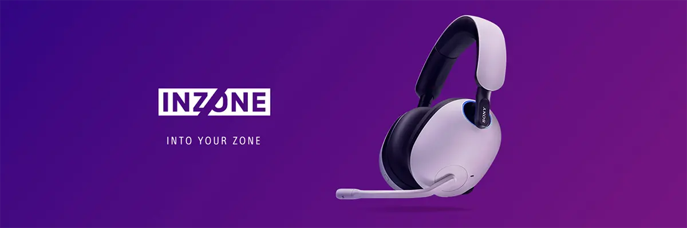
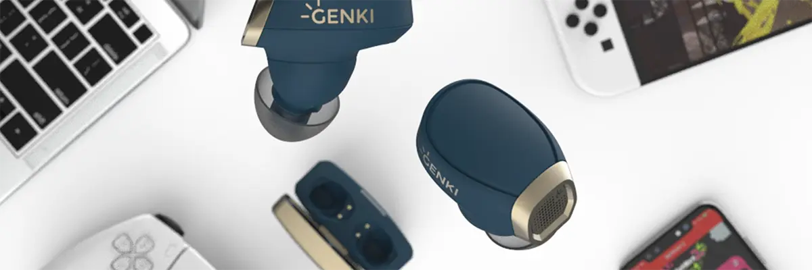

import EmbedCard from '@/components/Blog/EmbedCard.astro';

## Quick conclusion
If you have the budget, go with [HS70 Bluetooth](https://amzn.to/3T7bO3j) ([Option 4](#option-4-use-bluetooth-earphones-that-support-dual-connection-and-mixing)) or [SHOKZ OPENMOVE](https://amzn.to/3K40zEM) ([Option 2](#option-2-use-earphones-that-let-you-hear-your-surroundings-such-as-bone-conduction)). If you don't have much to spend, HORI's [headset](https://amzn.to/3dHjtFl) ([Option 1](#option-1-use-a-mixer)) will mostly do the job.

## Voice chat on Switch is inconvenient
I got hooked on Splatoon last year and started playing online with friends over voice chat. We use LINE, Discord, the official Nintendo app and so on, talking through our phones—but if you use the speaker, the phone's microphone picks up the game's noise.

But if you put earphones on for one of them, naturally you can't hear the other side properly.

### On PlayStation, the built-in features handle it
By the way, on PlayStation this kind of headache doesn't exist. The console itself has online voice chat, so you don't need a separate phone call. Just plug your earphones into the controller and you can hear the game audio while doing voice chat right on the PlayStation.

It would be great if the Switch eventually got built-in voice chat through a system update...

### On Switch you need a setup that lets you hear both game audio and voice chat at the same time
Whatever it takes, while playing on the Switch I want to nicely hear both the game and the call at the same time, and have my own voice come through the mic without picking up extra noise. Below I've put together the approaches I can think of right now. I'll explain assuming you're playing in TV mode, and I'll also cover handheld mode in the wrap-up at the end.

## Option 0: Use the iPhone's noise reduction feature
I'm going to introduce a bunch of earphones below, but before that, the easiest thing to try is the iPhone's noise reduction.

<EmbedCard
    url="https://support.apple.com/ja-jp/guide/iphone/iphb54d5dee2/ios"
    title="Change FaceTime audio settings on iPhone - Apple Support"
    site="support.apple.com" />

While in a call app, open Control Center, tap "Mic Mode," and switch to "Voice Isolation"—this filters out almost all noise other than your own voice with surprising accuracy.

It's iPhone-only, but even if you're on a speaker call, the other party will barely hear any of your game audio. It's an easy and effective method.

That said, it's really just a stopgap, so if you want to actually hear the game audio properly, please consider the options below as well. Sound play is important in Splatoon.

## Option 1: Use a mixer

This is the standard approach you can pull off most cheaply. You use a device called a **mixer** that combines the game audio and voice chat audio into a single stream. As shown below, you just connect your earphones, the Switch (or a TV that has the Switch plugged in), and your phone to the mixer.

There are various options out there, but I'm using a mixer that came bundled with HORI earphones. It's an officially licensed Nintendo product so it looks the part, and it's a great choice if you also want a new pair of earphones.

<EmbedCard
    url="https://amzn.to/3AfMcbV"
    img="https://c.media-amazon.com/images/I/61zyC8da1GL._AC_SX679_.jpg"
    title="Amazon | [Officially licensed by Nintendo] HORI Gaming Headset In-Ear with Mixer for Nintendo Switch, Black [Compatible with Nintendo Switch Online voice chat] | Accessories"
    site="amazon.co.jp" />

There's even a Splatoon 3 model now.

<EmbedCard
    url="https://amzn.to/3AdAdLV"
    img="https://c.media-amazon.com/images/I/612jkOVsoPL._AC_SX679_.jpg"
    title="Amazon | [Officially licensed by Nintendo] Splatoon 3 HORI Gaming Headset Standard for Nintendo Switch [Also compatible with Lite and OLED] | Accessories"
    site="amazon.co.jp" />

If you don't need earphones, ELECOM sells [a mixer-only product](https://amzn.to/3pBwFOG) for around 2,000 yen.

Note that recent smartphones often don't have a headphone jack, so you may need an adapter cable in many cases.

- [For iPhone (Lightning)](https://www.apple.com/jp/shop/product/MMX62J/A/)
- [For Android (Type-C)](https://amzn.to/3QFB5Q9)

I'll cover this later in [Option 5](#option-5-use-a-bluetooth-capable-audio-mixer), but Bluetooth-connected mixers also exist.

### Pros
Pretty cheap. You can use wired earphones you already own.

### Cons
The wiring gets fairly messy. Especially in handheld mode the cables get in the way, and even in TV mode you have to plug the mixer into the TV and your phone every time you make a call.

## Option 2: Use earphones that let you hear your surroundings, such as bone conduction

Lately, **open-ear earphones that let you hear your surroundings while wearing them** have been on the rise. Thanks to bone conduction or directional speaker technology, they don't block your ear canal, so you can still hear ambient sound with them on. They usually have a built-in mic too, so you can use them for the phone call and just listen to the game through the speaker.

Earphones like the following are well suited:

- [ambie sound earcuffs](https://amzn.to/3pmzuDi):
Ear-cuff style open-ear earphones. They look great and your ears don't start hurting even after long sessions. Call quality isn't that high, though.
- [Anker Soundcore Frames](https://amzn.to/3SQTw6c): Glasses-shaped earphones. Several manufacturers, including Huawei, sell similar products.
- [SHOKZ OPENMOVE](https://amzn.to/3K40zEM): The most well-known maker of bone-conduction earphones. [They have several tiers](https://jp.shokz.com/collections/all-products). If you look around you can also find similar cheap Chinese products.

I own ambie and an older SHOKZ model, and I've been able to play and call comfortably with both. I haven't tried it myself, but apparently you can do something similar with AirPods using their <b>Transparency mode</b> ([reference](https://twitter.com/tkackey/status/1539201509912502273)).

By the way, the `Bone-Conduction Empera EP`—the starting gear of the Splatoon 3 protagonist—looks like it's modeled on bone-conduction earphones.

### Pros
If you already own a pair of open-ear earphones, this is a solid first option to try. The wiring is also nice and clean, which makes things much easier.

### Cons
Depending on the earphones, the mic may pick up some of the game audio, so call quality can be on the lower side. The way you hear sound can also feel weird until you get used to it. Compared to wired earphones, you also have to keep them charged.

## Option 3: Use a capture card and do everything—gaming and calling—on a PC (PC only)

This is common among streamers and pro gamers. You output the Switch's audio and video to a PC and play the game on the PC's monitor. You can do voice chat on LINE or Discord on the same PC, so you just plug your earphones into the PC—done.

I tried it with a small, inexpensive [ShadowCast](https://amzn.to/3BW1ogI), but the latency was very noticeable and I gave up on it.

As a cheaper compromise, you can keep the game video on the TV and only route the audio to the PC. However, the PC needs both an Audio-in (for game audio) and an Audio-out (for earphones), which basically requires a desktop PC. There are also workarounds like USB converters or HDMI splitters, but they get complicated, so I'll skip the details.

### Pros
Gaming, calling, and recording all happen on a single PC, so once you've set up the wiring, it's very convenient. With this kind of setup you can also stream and record gameplay right out of the box.

### Cons
The capture card alone runs around 20,000 yen, and pulling off a low-latency, comfortable setup often requires a fairly high-spec gaming PC. It takes both money and a decent amount of know-how. And of course, you can't pull this off with just a smartphone.

## Option 4: Use Bluetooth earphones that support dual connection and mixing

This is the most cutting-edge approach. You use earphones that can connect to the Switch and your phone via 2.4 GHz wireless and Bluetooth/wired connections, **and let you listen to both at the same time (mixing)**. As shown below, you connect to the Switch via a 2.4 GHz dongle (transmitter) for zero latency, and to the phone via Bluetooth or a wired connection.

### Background: about wireless earphones suitable for FPS
When using wireless earphones for FPS or rhythm games, you have to worry about latency. Wireless earphones roughly fall into two transmission types: **2.4 GHz Wi-Fi** and **Bluetooth**, and Bluetooth itself is split into several codecs.

| Format | Latency |
| --- | --- |
| 2.4 GHz Wi-Fi | 16ms |
| aptX LL | 40ms |
| aptX Adaptive | 50–80ms |
| aptX | 70ms |
| AAC | 120ms |
| SBC, LDAC | 200ms+ |

References:
* [Bluetooth vs. USB Wireless | SteelSeries](https://steelseries.com/blog/bluetooth-vs-usb-wireless-120)
* [Building the dream wireless gaming setup with "GO blu" and "BT-W4"](https://news.denfaminicogamer.jp/kikakuthetower/220617c)

The latency humans can perceive is said to be up to about 25 ms, so in theory with 2.4 GHz Wi-Fi you'd feel **no latency at all**. For FPS games, picking something with at least under 100 ms latency is a good idea.

Below are my recommended earphones. *Prices are as of writing.

#### 1. SteelSeries ARCTIS 7P+ WIRELESS

- [Amazon](https://amzn.to/3DvlRdc)
- [Official site](https://jp.steelseries.com/gaming-headsets/arctis-7p-plus)

A newly released headphone from gaming brand SteelSeries. It supports dual connections in various forms, including 2.4 GHz Wi-Fi, audio cable, and Type-C.

The longstanding [SteelSeries ARCTIS 9 WIRELESS](https://amzn.to/3vUPUWW) from the same maker is a pioneer in this category—it's on the heavier side, but reviews are good.

Weight: 354g, Battery: up to 30 hours, Price: ~23,000 yen

#### 2. INZONE H7

- [Amazon](https://amzn.to/3A0165K)
- [Official site](https://www.sony.jp/inzone/products/INZONE_H7/)

A gaming headset announced by Sony. Naturally it's aimed at the PS5, but since it supports mixing, it's a great fit for the Switch too. There's also a higher-end H9 model with noise cancelling.

Weight: 325g, Battery: up to 40 hours, Price: ~28,000 yen

#### 3. CORSAIR HS70 Bluetooth

- [Amazon](https://amzn.to/3wgYEHd)
- [Official site](https://www.corsair.com/kr/ja/カテゴリー/製品/ゲーミングヘッドセット/ステレオ-ヘッドセット/HS70-BLUETOOTH-Multi-Platform-Gaming-Headset/p/CA-9011227-AP)

This one doesn't support 2.4 GHz Wi-Fi, but it can <b>mix wired and Bluetooth audio</b>. So you can use it the same way as the others by connecting to the phone over Bluetooth and to the Switch via wire, and play with mixed audio.

Since the Switch side is wired, it's **relatively cheap, and if you plug it into the TV it's also easy to use with a PS5 in parallel**. There's only one cable, so the wiring is simple. I really recommend it.

Weight: 352g, Battery: up to 20 hours, Price: ~13,000 yen

The same maker recently released a [2.4 GHz-compatible model](https://amzn.to/3QT327c), but apparently it doesn't support Switch ([reference](https://kakakumag.com/game/?id=17886)). That said, you can probably do the same trick of connecting to the Switch via wire and using Bluetooth for the phone call. (Unverified.)

{/*
Other wired + Bluetooth options
* [ARCTIS 3 | Bluetooth-compatible gaming headset | SteelSeries](https://jp.steelseries.com/gaming-headsets/arctis-3-bluetooth)
* [H3 Hybrid Black Bluetooth®-equipped sealed gaming headset](https://www.eposaudio.com/ja/jp/gaming/products/h3-hybrid-black-bluetooth-gaming-headset-1000890)
https://howmew.com/19357/
 */}

#### 4. GENKI: Waveform Earphones

This isn't 2.4 GHz Wi-Fi either, but it looks promising so I'll just leave a link. It connects to the game side via Bluetooth aptX Adaptive. Note that it's currently a crowdfunded product.

- [Official site](https://www.kickstarter.com/projects/humanthings/genki-waveform)

### Caution: even some products marketed as "dual wireless" can't actually play both at once!
There are quite a few products that can connect to both 2.4 GHz and Bluetooth, but only **let you switch between them—not listen to both at the same time**. For example, things like the Quantum TWS or RAZER Barracuda have product descriptions like "answer phone calls during gameplay and seamlessly switch back to game audio," which means you can really only hear one source at a time. It's honestly hard to tell, so check review articles and the like to make sure it can truly play both simultaneously before buying.

### Pros
The wiring becomes incredibly clean. There are no noise issues, so call quality is good too.

### Cons
It's pretty expensive. And compared to wired earphones, you have to keep them charged. If you also share the earphones with a PS5, you have to swap the Wi-Fi dongle's connection target.

## Option 5: Use a Bluetooth-capable audio mixer
This was announced just as I was writing this article, so I hurried to add it. I-O DATA is releasing a mixer that connects to the Switch via wire and to a smartphone over Bluetooth. Looking at the [diagram](https://www.iodata.jp/lib/manual/pdf2/ad-btmix_hn_manu.pdf), it's clearly aimed at Splatoon players.

<EmbedCard
    url="https://amzn.to/3z6KxsD"
    img="http://page-edit.iodata.jp/image/ad-btmixhn_l.jpg"
    title="Amazon.co.jp: Bluetooth Gaming Mixer (Model: AD-BTMIX/HN): Games"
    site="amazon.co.jp" />

The wiring looks like this. The downside is that it needs a power supply.

I haven't seen anything like this from other companies, so I think it's a pretty interesting product. Personally though, if I were going to spend that much, I'd rather pay a bit more and go with the [CORSAIR HS70 Bluetooth](#3-corsair-hs70-bluetooth) from Option 4.

### Pros
Reasonably affordable. You can use wired earphones you already own. Compared to the mixer in Option 1, the upside is that you can connect to the phone via Bluetooth.

### Cons
The unit itself needs a power supply, so in the end the wiring still gets fairly messy.

## Wrap-up

Here's a rough table summarizing the pros and cons of each option.

|  | Call device | Switch Lite   / handheld mode | Price guide | Use with PS5 | Audio quality
| --- | --- | --- | --- | --- | --- |
| Option 1: Mixer | Phone / PC | △ | From 2,000 yen | ◯ | ◯ |
| Option 2: Open-ear | Phone / PC | ◯ | From 10,000 yen | ◯ | △ |
| Option 3: Capture card | PC | ✗ | From 50,000 yen | ◯ | ◯ |
| Option 4: Dual wireless | Phone / PC | △ | From 20,000 yen | △ | ◯ |
| Option 5: Bluetooth mixer | Phone / PC | △ | 5,000 yen | ◯ | ◯ |
