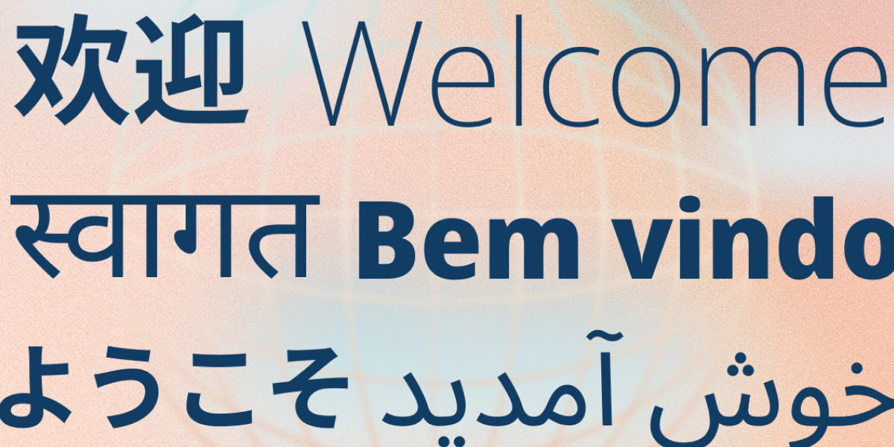

import EmbedCard from '@/components/Blog/EmbedCard.astro';

OSSで多言語サイトのスターターテンプレートを作って公開しています。

<EmbedCard
    url="https://astro-i18n-starter.pages.dev/"
    img="https://astro-i18n-starter.pages.dev/ogp.png"
    title="Astro i18n Starter"
    site="astro-i18n-starter.pages.dev" />

このプロジェクト内で、地味に悩んだのがフォントをどうするかという話です。多言語サイトでは日本語・英語・中国語などを1つのページにまたがって混在させることがほとんどなので、書体選びの基準が普通のサイトとちょっと変わってきます。

検討した候補や、最終的に選んだフォントをまとめておきます。


## システムフォントにまかせる

まぁ、これが一番楽です。

サイトを見ているユーザーの端末には当然母国語のフォントが入っているわけで、CSSの `font-family` でOSの標準フォントを並べておけば、それぞれの環境で適切な書体が表示されます。Webフォントのダウンロードコストもゼロ。

```css
font-family: -apple-system, BlinkMacSystemFont, system-ui, sans-serif;
```

ただ、当然意図しないスタイルのフォントになる可能性もあり、ブランドの一貫性も出せません。


## Alibaba Sans (当サイトで採用)

<EmbedCard
    url="https://www.alibabafonts.com/#/home"
    img=""
    title="阿里巴巴普惠体"
    site="www.alibabafonts.com" />

このブログで採用したのがこのフォントです。**Alibabaが無償で公開している多言語対応フォント** で、商用利用も無料。Alibabaは中国の大手テック企業で、最近は B2B プラットフォーム向けなど企業向けの事業も大きい。そのコーポレートブランドとしてのフォント戦略の一環として、このフォントを世界中に無料で提供しているわけです。

**対応言語と規模の圧倒性** がこのフォントの最大の特徴です。ラテン文字を中心に **178言語をカバー** していて、中国語(簡体・繁体)・日本語(ひらがな・カタカナ・漢字)・韓国語はもちろん、アラビア語・ハングル・タイ語・ベンガル語など、アジア圏の主要言語をほぼすべてカバーしています。

書体としての特徴は、**独特のR(角丸)** が全言語で一貫して使われていることです。漢字でもラテン文字でも角の処理に統一感があるので、ページの表示言語を切り替えても「別の書体に変わった」という違和感がまったく発生しません。


実際にこのサイトで表示言語を切り替えてみると、書体の一貫性が伝わると思います。ぜひ試してみてください！


## Noto Sans

<EmbedCard
    url="https://fonts.google.com/noto"
    img="https://www.gstatic.com/images/icons/material/apps/fonts/1x/catalog/v5/opengraph_color.png"
    title="Noto - Google Fonts"
    site="fonts.google.com" />

多言語Webフォントの **王道** がNoto Sansです。GoogleとMonotypeが共同で開発した、Web向けに作られた巨大フォントファミリー。




名前の由来は「**No Tofu**」、つまり **「豆腐(=文字化けで表示される白い四角)を世界からなくす」** という野望のもとに作られています。現在では **150以上の書記体系・1,000を超える言語** をカバーしていて、文字通り「地球上のあらゆる文字を1つの書体で表示できる」状態を目指したプロジェクトです。

ライセンスはSIL Open Font Licenseなので、もちろん商用無料。迷ったらこれでOKです。ただ**あまりにも定番**なので、特色は出しづらいです。**Serif体**である[Noto Serif](https://fonts.google.com/noto/specimen/Noto+Serif)も選べるのが嬉しい。

ちなみに日本語版は `Noto Sans JP`、中国語簡体字版は `Noto Sans SC` のように、言語ごとに別ファミリーとして提供されています。Google Fontsから言語ごとに読み込む構成が一般的ですね。


## LINE Seed

<EmbedCard
    url="https://seed.line.me/index_jp.html"
    img="https://seed.line.me/src/images/favicon/ogTag.jpg"
    title="LINE Seed"
    site="seed.line.me" />

LINEヤフーが自社のコーポレートフォントとして公開している書体です。日本語版の `LINE Seed JP` は最近Google Fontsでも無料公開されて、商用利用もできるようになりました。

> [LINEヤフー、コーポレートフォント「LINE Seed JP」をGoogle Fontsで提供開始｜LINEヤフー株式会社](https://www.lycorp.co.jp/ja/news/release/020040/)

対応言語は **日本語・英語・韓国語・繁体字中国語・タイ語** の5つ。LINEが展開しているアジア圏のサービスを意識した構成ですね。<b>簡体字</b>が無いのが残念・・・。

字形は **少し丸みのある親しみやすい雰囲気** で、UI寄り・SNS寄りのコンテキストによく合います。LINEブランドで全言語を統一して作っているおかげで、各言語のテイストの揃いっぷりはかなり良いです。


ライセンスはSIL Open Font License 1.1で条件は緩めですが、あくまでも**LINEという企業のコーポレートフォント**ではあるので、使う場面は選んだほうがいいですね。


## まとめ

ざっくり整理するとこんな感じです。

- 軽さ・実装コスト重視 → **システムフォント**
- 対応言語の幅とデザインの一貫性 → **Alibaba Sans**
- 王道で迷いたくない → **Noto Sans**
- 親しみやすさ・モダンなUI寄せ → **LINE Seed**

このブログでは最終的にAlibaba Sansを選びました。対応したかった言語をひとつの書体でカバーでき、独特の特色を持つ見た目がブログのトーンとも合っていたのが決め手です。

サイトのメニューから言語を切り替えると、書体の見え方が一発でわかると思います。気になったらぜひ。
