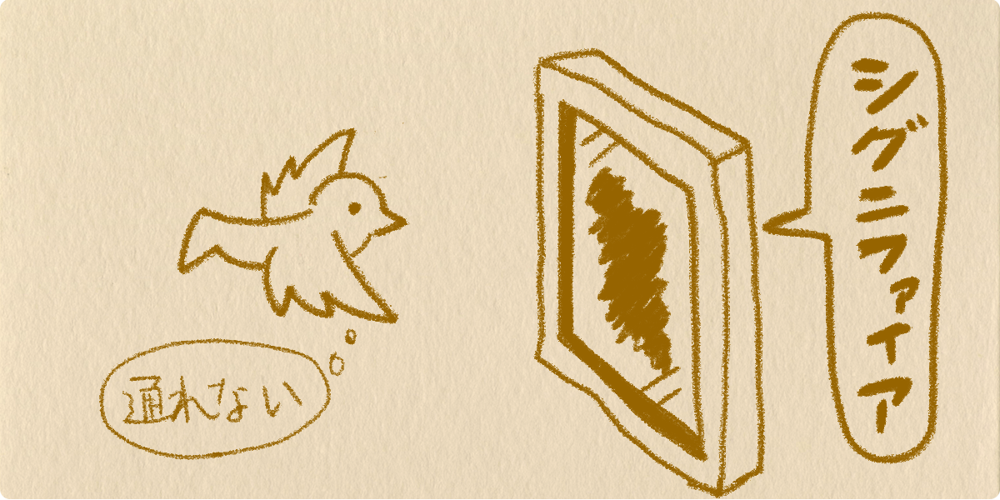

import EmbedCard from '@/components/Blog/EmbedCard.astro';

## 前言
大家有没有听说过 **可供性(Affordance)** 和 **指意符(Signifier)** 这两个词? 如果你只听说过 <b>可供性</b>,那么要小心了。你以为的"可供性",也许其实是 <b>指意符</b>。这是 UX 设计中非常重要的概念,但很容易被误解,理解起来也并不容易。网上的相关文章解释得不太到位,所以我打算用最简单的方式来讲解一下。如果你之前两个都没听说过,正好借此机会一并记下来吧。

## 被误解的背景
在大众认知中,有很多人把"指意符"误以为是"可供性"。这背后有这样一段故事。
<b>可供性(Affordance)</b>是 D.A. 诺曼(D.A. Norman)在 1990 年出版的[《设计心理学》](https://www.amazon.co.jp/dp/478850362X/ref=cm_sw_r_tw_dp_x_.Vl5zbYK2K00R)一书中介绍后一举成名的词。这本书成为畅销书,被翻译到世界各国,被无数人阅读。然而,诺曼本人在 2015 年出版的[《设计心理学(增补・改订版)》](https://amzn.to/2yAmeln)中,记录了自己 <b>当年错误地介绍了"可供性"这个词</b> 的事实。诺曼在旧版书中 **把"指意符"错误地当作"可供性"** 介绍了出去。正因如此,错误意义上的"可供性"在大众间根深蒂固地流传开来。

## 术语解释
那么,我们来解释这两个术语的含义。它们都是 UX 设计的 <b>交互(Interaction)</b> 中受到重视的概念,涉及世间一切事物(产品、服务、自然物、人造物)与使用主体(人)之间产生的关系。下面我会尽量用图示简单讲解,请耐心读下去。

### 什么是可供性
是指某事物与使用主体(人)之间的 **关系本身**。这个世界上的一切物理事物(从自然存在到人造物)与人之间,都存在着"能做什么"的关系性。

例如,"人"和"椅子"之间存在"可以坐"的关系。另外,大多数"人"也可以"举起""椅子"。这种 **"能做什么"的关系,就被称作"可供性"。** 此时虽然说法有点奇怪,但也可以说"椅子<b>提供(afford)</b>给人坐的可供性""椅子<b>提供</b>给人举起的可供性"。

即便是同一事物、同一主体,只要对象变了,可供性也会变。在前面的例子里,如果"人"是"婴儿",那么"举起""椅子"这个可供性就不存在了。其他比如

- "玻璃"提供"空气""可穿过"的可供性
- "玻璃"<b>不</b>提供"水""可穿过"的可供性
- "空气"提供"水""可穿过"的可供性

等等。这样的实例在自然界中本来就大量存在。

### 什么是指意符
是指 **告知某事物与使用主体(人)之间关系的标记**。也就是说,它是 <b>提示"可供性"是什么</b> 的提示物。在设计中尤为重要的就是这个概念。

举个例子,假设有一只"鸽子",一个"什么也没装的木框",还有一个"装了玻璃的木框"。此时,"什么也没装的木框"对"鸽子"来说提供了"可以穿过"的可供性( = "鸽子"和"什么也没装的木框"之间存在"可以穿过"的关系 )。"装了玻璃的木框"对"鸽子"来说不提供"可以穿过"的可供性( = "鸽子"和"装了玻璃的木框"之间存在"无法穿过"的关系 )。但当玻璃足够透明时,鸽子看到时会以为两个框都能穿过。然而,如果在玻璃上用油漆涂上颜色,鸽子就能注意到"无法穿过"这个可供性。这种情况下,油漆就是"指意符"。这种 **告知"能做什么"的标记就是指意符。** 指意符只有在被知觉到的时候,才作为指意符发挥作用。

为了便于理解,这里我把范围限定在视觉,但严格来讲是"如何被知觉",所以听觉、嗅觉也都可以。例如,"甜甜的气味"作为指意符,向"生物"传达"可以食用"的信息。指意符既可以是天然存在,也可以被有意地附加。

## 指意符的实例
对可供性和指意符是不是有所理解了? 那么,这些概念又是如何与设计产生关联的呢? 直觉敏锐的人应该已经发现了——指意符是向用户传递信息的强有力的工具。在产品和服务中有意识地准备指意符,就能让使用它的用户理解操作方式、引导其行为,或反过来限制其行为。

### 传达操作方式的指意符
- 门
    - 在诺曼的书里也举了大量"门"的实例。
    - 比如根据门的不同,人和门之间存在"可以推""可以拉""可以滑动"等各种各样的可供性。理想的状态是有合适的标记,让人能恰当地知觉到这扇门可以怎样操作。
    - 装着圆形门把手就是"转一下拉",装一块平板就是"推",凹陷的凹槽就是用手钩住"可以滑动",这些都是可以利用的指意符。
- Web 或 App
    - "带颜色和下划线的"文字让人知觉到这是"可以跳转到其他页面"的链接(具有这种可供性)。 → [This is Link Text !!](https://twitter.com/psephopaiktes)
    - "做成按钮形状"的 UI 是表示"可以点击"的指意符。
    - 缩略图横向排列时,"只有一部分下一张缩略图露了出来",这种指意符让人能注意到"可以滚动"的可供性。
    

### 提示危险的指意符
- 城市煤气的气味是有意添加的,作为告知"煤气泄漏,有危险"的指意符发挥作用。
- 卡车被规定在倒车时必须发出"警报声"。

指意符的例子隐藏在世间的各种产品和服务里。重要的是让目标用户能自然地知觉到、并且容易理解。例如"软盘"图标,在各种应用程序中作为引导"保存"操作的按钮指意符使用。但对于没用过软盘的年轻一代来说,完全不知道这个图标代表什么。设计师的工作,就是深入理解目标用户,准备合适的指意符,把产品想要传达的信息有效地传递出去。希望大家不要用僵化的脑袋来决定设计,而要做能用灵活的思维帮助用户的设计师。

## 结语
开头介绍的[《设计心理学(增补・改订版)》](https://amzn.to/2yAmeln)不仅深受设计师喜爱,对于所有与产品相关的人来说也是必读之书。书中除了详细讲解本文介绍的"可供性"和"指意符"之外,还介绍了大量关于产品和服务的重要思维方法和技术。虽然篇幅较长,读起来不轻松,但还是非常推荐至少读一次。文笔即便是非设计师也能轻松看懂,完全不必担心阅读门槛。请不要不小心买到旧版了。
