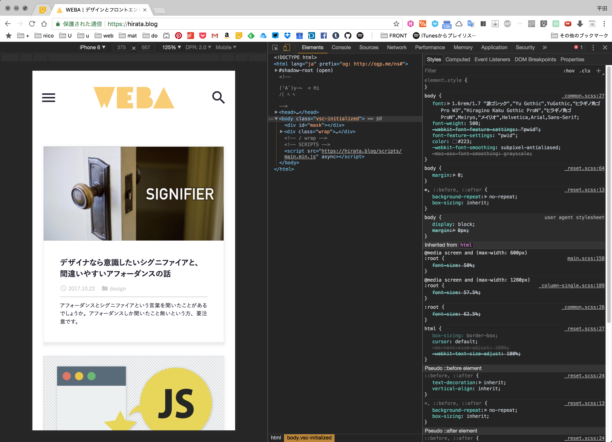

import EmbedCard from '@/components/Blog/EmbedCard.astro';

## 操作方法
打开终端,切换到正在工作的目录,执行以下命令:
```
python -m http.server
```
这样就会启动 Python 的本地服务器,连接到同一个 WIFI 的设备就可以访问了。在手机浏览器等设备上输入 PC 的 IP 地址和端口号即可访问。IP 地址在 Mac 上可以通过 <b>系统偏好设置→网络</b> 查看,也可以用 `ifconfig` 命令确认。端口号默认是 `8000`。例如 IP 地址是 `192.168.11.11`,那么访问 `192.168.11.11:8000` 就能进行预览了。

## 说明
在制作网站或 Web 应用时,经常会想用手机尺寸来确认在 PC 上做的网页效果。基本上虽然可以用 Chrome 的移动端预览模式 ( 打开 Dev 工具,点击手机图标,或者按 `⌘⌥I` → `⌘⇧M` ),但要看真机的 CSS 实际表现,或者向他人展示真实的设计效果,还是不够的。



或者如果使用了 Gulp、Rails 等环境,自带开发服务器的话用它们的功能就行,但只是想用手机看一下手头的静态 HTML 时,每次都搭一套开发环境实在麻烦。这种时候,在 Mac 上利用默认安装的 <b>Python</b> 功能,就可以通过上面那条命令简便地架起服务器。
