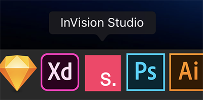
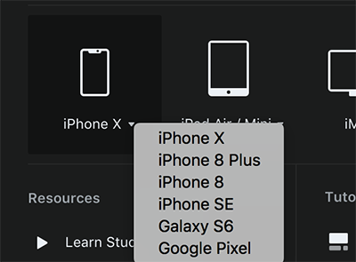
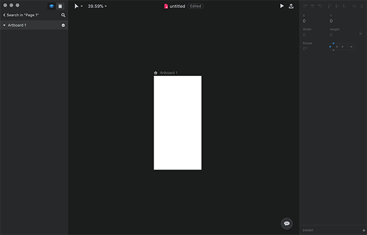
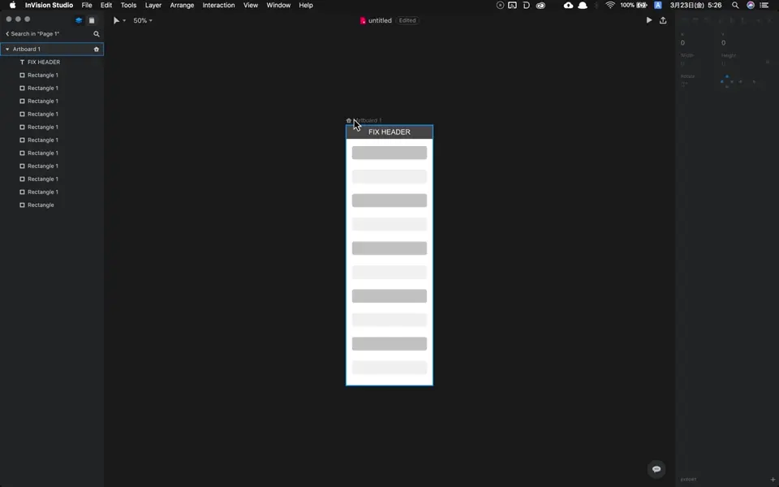

import EmbedCard from '@/components/Blog/EmbedCard.astro';

[Studio.](https://www.invisionapp.com/studio) 是去年原型设计 Web 服务大厂 [inVision](https://www.invisionapp.com/) 发布宣传视频后,因其功能丰富而被人们期待"<b>有这么多功能、又好用又轻量的话,Sketch 和 XD 怕不是要消失了…?</b>"的软件。

<EmbedCard
    url="https://www.invisionapp.com/studio"
    img="https://s3.amazonaws.com/www.invisionapp.com-studio/static/img/social/facebook.png"
    title="InVision Studio | Screen Design. Redesigned. "
    site="www.invisionapp.com" />

现在[官方网站](https://www.invisionapp.com/studio)已经解禁了功能介绍,简单来说有:

- 支持 MacOS 和 Windows 跨平台
- 像 Sketch、XD 那样的设计稿制作功能
- 像 Sketch 那样的符号管理、库管理功能
- 像 Abstract 那样的设计层面版本管理、评审・沟通功能
- 利用 Keyframe 设置动画
- 当然还有像 InVision 那样的画面跳转原型

等等,功能堆得显然有点夸张,但最强感简直爆棚。再加上他们还想做[设计系统的工具](https://www.invisionapp.com/blog/announcing-invision-design-system-manager/),完全是奔着"独我独尊"去的。

虽然今年 1 月就计划开放下载,但一直被延期,让不少人焦急等待。这次,我终于收到了邀请邮件,马上来试试它实际能用到什么程度。主要是与 Sketch 做对比。

## 安装・启动
从收到的邀请邮件里的"GET STUDIO NOW"进入下载页面,像往常一样从 .dmg 文件在 Mac 上安装即可。这部分省略。图标长这样,虽然简洁但很显眼。

启动了。这个画面似乎叫做 Launcher。看到"Open Studio or Sketch File"这一行字…它似乎也支持 Sketch 格式。我试着打开了手头的 Sketch 文件,但是外观相当错乱,所以这件事就当没发生过吧。左下角的"Learn Studio"只是会打开 [YouTube 上的视频](https://www.youtube.com/watch?v=LkEOaR4Bl5M&amp=&feature=youtu.be)。

不起眼的地方在于模板很多,挺棒的。

不出所料,基本的 UI 面板布局和 Sketch 很接近。

顺便提一下也有 Light 主题。

## 教程中介绍的功能
先把 Launcher 画面里的三个 Tutorials 都做一遍。点击它会打开带说明的练习文件。XD 也有类似的教程,这种形式真的非常浅显易懂,挺好的。

### Layout
- 一上来就感动了。简而言之就是 **可以把图层对象的尺寸,以相对于画板的百分比来设置的功能**。反倒不知道为什么 Sketch 一直没做这个。
- 在此之上,还可以指定父元素调整大小时,子元素相对父元素的对齐位置。这点和 Sketch 符号的 Resizing 功能一致。

<video src="./capture-layout.mp4" width="1247" height="830" controls autoplay></video>

### Animation
- InVision 的本职服务——画面跳转原型——的制作功能
- 和最近刚发布的 [Sketch 的原型功能]( controls) 非常像…而且画面右上角可以直接上传到 InVision 本家服务,这一领域 Sketch 也许已经没什么胜算了。

<video src="./capture-animation.mp4" width="1280" height="800" controls autoplay></video>

### Scroll
- 这同样是画面原型的功能。可以制作部分固定 + 部分可滚动的画面。

## 其他功能

### 上传到 InVision
当然可以。反正 Sketch 也常用 Craft 来传,这部分省略。 

### 移动端预览
也有类似 Sketch Mirror 的功能。制作好原型后,从右上角画面显示二维码, 

 
然后用 [InVision app](https://itunes.apple.com/app/invision-design-collaboration/id990700027) 的相机扫码,即可在手机上预览。

### 组件 ( 符号 )
那么,关于重要的符号功能。在 studio. 里似乎不叫"符号",而是叫做 **组件(Component)**。在如今 Web 开发世界里模块化思维成为主流的背景下,这个名字应该比"符号"更合适。虽然名字不同,但组件化(嫌麻烦还是写"符号化"吧)的流程几乎一样。选中要符号化的图层,按 `⌘K` 快捷键,或者点击上方工具栏里这个螺母图标即可。

 
管理符号的位置,在 Sketch 里是 Symbols 图层(严格说是任意图层),但 studio. 在图层面板里准备了一个名为"Library"的专用区域。下面是来自官方视频的截图↓

 
我以为符号的 Override 当然也能做,但似乎没找到…。再者视频中演示的多人共享这个 Library 以及在这里管理文本样式等功能,目前似乎还未实装。

## 其他评价

### 文档结构
- 页面、图层和符号的结构与 Sketch 略有不同,但上手以后立刻就能习惯。

### 快捷键
- 大部分 Sketch 的快捷键都能用,不会迷茫。`⌘.`、`⌘⇧↓` 之类的都能正常用,GOOD。
- 字号变更和重复操作的快捷键可能稍有不同。

### 中日文文本支持
- 你懂的。

### 性能
操作相当 <b>流畅</b>。缩放的动画带点滑稽的滑动感,稍微有点别扭。文件启动比 Sketch 慢得多。

### 文件格式
果然和 Sketch 一样是 JSON 格式。把生成的 `.studio` 文件后缀改成 `.zip` 解压,结果不出所料。

## 总评
- **几乎就是 Sketch 嘛…!!** 习惯 Sketch 的人完全不用迷茫就能上手。
- 功能仍处于一部分小试身手的阶段,毕竟 <b>这只是 early access 版</b>。下面这些功能还没看到…
    - 版本管理・评审
    - 符号库的共享
- 另外,符号功能目前也比较简易,要在正式项目中使用可能还撑不住。
- **易用性相当好,值得期待**。当然只是浅尝辄止,稳定性和细节还没仔细看。如果今后功能能按计划充实起来,也许会有一个大家都沉浸在 InVision 生态系统中的未来…
- 还有就是希望尽快支持插件。Runner 是必备的。

以上,有新发现还会继续追加。
