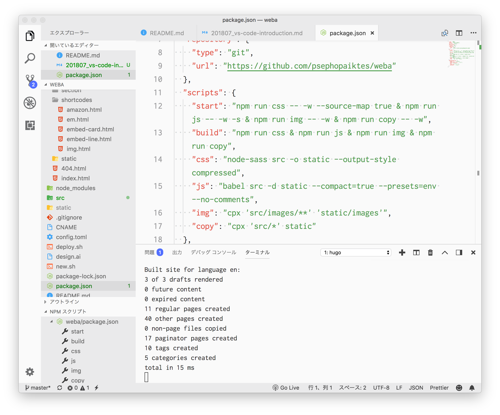

import EmbedCard from '@/components/Blog/EmbedCard.astro';

## 概要
本文是一篇面向Atom、Sublime,顺带还有Brackets等用户的VS CODE安利文章。对于使用Vim、Dreamweaver或JetBrains系列编辑器的用户,本文并未过多考虑。

### 什么是VS CODE
VS CODE(正式名称为Visual Studio Code)是Microsoft开发的一款文本编辑器。可在Windows、Mac、Linux上运行。从分类上来说,它属于与Sublime Text、Atom、Brackets、Coda等同类的富文本编辑器。相比这些编辑器,它作为IDE(集成开发环境)的一面更强一些,内置了丰富的面向开发者的功能。它是用Electron环境制作的[OSS(开源软件)](https://github.com/Microsoft/vscode),使用费用完全<b>免费</b>。这一点和Atom很相似呢。

可以从以下页面下载。

<EmbedCard
    url="https://code.visualstudio.com/"
    img="https://code.visualstudio.com/opengraphimg/opengraph-home.png"
    title="Visual Studio Code - Code Editing. Redefined"
    site="code.visualstudio.com" />

那么,以下就来介绍一下VS CODE的优点。
另外,所介绍的键盘快捷键会因设备环境而异,仅供参考。

## 稳定的运行性能
从启动到打开大文件,速度和性能都非常稳定,使用起来很顺畅。与同样基于Electron的Atom相比,明显更加流畅。到目前为止也没有发生过死机的情况。

当然,如果只看重速度和性能的话,Sublime是压倒性的胜利。不过VS CODE在运行方面也完全没有问题,可以稳定使用。

参考: [Atom vs Visual Studio Code 速度比较!! Electron系文本编辑器两大决战!!](https://ryuta46.com/379)

## 默认功能丰富
即使不安装多少扩展,从一开始就具备相当多的功能。在Atom和Sublime中,有些事情如果没有扩展就做不到,而在VS CODE中却能轻松完成。在官方支持下能使用各种功能,这种安心感是不一样的。当然,VS CODE通过扩展也能进一步扩大可用范围。至少,我在Sublime或Atom中所需要的功能,在VS CODE中几乎不存在缺失。功能的一些示例包括:

- 终端
- Git客户端
- 调试器

这些都是从一开始就内置的。

## 内置终端
这一点真的非常方便。即使是设计师或Coder,多多少少也会用到终端的场景吧,而能在编辑器内使用真的非常轻松。通过「Ctrl + ` 」的快捷键,<b>会在正在编辑的文件所在的文件夹中</b>启动终端,可以立即执行操作。通过快捷键可以在编辑器部分和终端部分之间切换,所以可以一直保持手放在原位。也可以同时打开多个终端。

虽然Atom和Sublime也可以通过扩展使用编辑器内终端,但要么外观不好看、运行不稳定、要么只能开一个,做工有些差强人意……。

## 出色的设计自定义性
和Atom、Sublime一样,公开了各种各样的颜色主题、语法主题。另外,显示的UI也可以进行细致的自定义,可以设置成自己喜欢的外观。当然也可以根据系统设置切换暗黑模式。

另外,应用的菜单栏部分不是Mac默认的,而是配色统一、外观干净漂亮,这一点很棒。顺便说一下,Atom也可以通过设置改变,但Sublime似乎无法更改。

## 可以使用熟悉的快捷键
这是推荐从其他编辑器迁移过来的理由之一。VS CODE支持Atom、Sublime、Vim等的键位绑定,无需再去记新的键盘快捷键。

<EmbedCard
    url="https://code.visualstudio.com/docs/getstarted/keybindings"
    img="https://code.visualstudio.com/assets/docs/getstarted/keybinding/customization_keybindings.png"
    title="Visual Studio Code Key Bindings"
    site="code.visualstudio.com" />

## 作为Markdown编辑器也是最棒的
VS CODE作为Markdown编辑器也很方便。默认情况下也支持预览和语法,但
通过安装[Markdown All in One](https://marketplace.visualstudio.com/items?itemName=yzhang.markdown-all-in-one)和[Paste Image](https://marketplace.visualstudio.com/items?itemName=mushan.vscode-paste-image)这两个扩展,就成为了最棒的Markdown编辑器。

Markdown All in One是一个集合了各种功能的便利型插件。
可以通过快捷键加粗(`** **`),也可以根据文件中的标题自动生成目录,如果要写Markdown的话是必装的插件。有没有它的舒适度完全不一样。

Paste Image是一个可以把复制的图片粘贴到Markdown文件(.md文件)的插件。粘贴的图片保存到哪个文件夹也是可以设置的。

可以通过右键复制网页图片,或者用Mac的截图功能复制(`Command + Shift + 4` → `按住Ctrl键拖动`)后立即粘贴图片,真的非常方便。

这种程度的舒适感在Atom和Sublime上是无法实现的。

## 设置可以在云端管理和同步
这是Atom、Sublime也能做到的事情,但可以在云端管理设置和扩展。通过用GitHub账户或Microsoft账户登录,可以自动同步保存设置。

<EmbedCard
    url="https://code.visualstudio.com/docs/editor/settings-sync"
    img="https://code.visualstudio.com/opengraphimg/opengraph-docs.png"
    title="Settings Sync in Visual Studio Code"
    site="code.visualstudio.com" />

另外,据说从version 1.25开始引入了名为[便携模式](https://code.visualstudio.com/docs/editor/portable)的功能,可以用USB驱动器或云存储等,把整个软件管理在一个文件夹里。

## 在Web浏览器上也能运行
准确地说虽然是另一回事,但也有在浏览器上运行的VS CODE。而且有2种。无论哪种,通过用前面提到的账户登录,都可以使用与本地版相同的设置。

<EmbedCard
    url="https://github.co.jp/features/codespaces"
    img="https://github.githubassets.com/images/modules/site/social-cards/codespaces.png"
    title="Codespaces | GitHub"
    site="github.co.jp" />

这是搭载了VS Code Server的虚拟机上运行的、几乎可以使用全部功能的开发环境。

<EmbedCard
    url="https://github.com/github/dev"
    img="https://opengraph.githubassets.com/bae4cad5d745ae9e84b7aa281283ad831b14dfd907075b9b87d3d624220f9699/github/dev"
    title="github/dev: Press the . key on any repo"
    site="github.com" />

这是只有Editor(没有Terminal)的简单版本。在GitHub的仓库上按`.`键就能立即使用。

**在iPad上也可以使用**,只是快捷键大多不能用,实际上还很难受……。

## 项目(文件夹)的切换非常方便
在Atom或Sublime中开发Web网站或应用时,应该不会一个个直接打开`index.html`或`style.css`,而是会注册有这些文件的文件夹后再开始作业吧。

那时,是每次把文件夹拖放到编辑器中打开吗?还是从编辑器的菜单中打开文件夹呢?之后想切换到别的项目时又是怎么做的呢?

在VS CODE中,一旦注册过的项目,可以用`Ctrl + R`的快捷键快速切换。

按住`Ctrl`键并按`R`键进行选择,松开按键后当前窗口就切换为该项目。如果想取消切换,按`Esc`键。

如果想在另一个窗口新开,按住`Ctrl`键再按`Enter`即可。

顺便说一下,如果做了下面这两个设置,无论是从GUI还是CUI都可以立即用VS CODE打开文件夹,非常方便。

[ASCII.jp:在Mac的Finder工具栏中添加应用的小技巧让作业更高效!]
(https://ascii.jp/elem/000/001/025/1025457/)

[从终端启动Visual Studio Code的方法【官方方法】 - Qiita]
(https://qiita.com/naru0504/items/c2ed8869ffbf7682cf5c)

## 可以为每个项目分别自定义扩展和设置,也可以与成员共享
多人开发时,根据项目不同,缩进等的规则可能也不同。
在VS CODE中,只要在项目根目录下放置一个名为`.vscode`的设置文件夹,每个项目的设置就会自动反映到编辑器中。设置方法很简单,打开VS CODE的基本设置,执行「工作区设置」就会自动创建`.vscode`文件夹。把这个文件夹通过GitHub等共享就OK了。

共享的例子:
[Microsoft/TypeScript: TypeScript is a superset of JavaScript that compiles to clean JavaScript output.](https://github.com/Microsoft/TypeScript)

## 可以多人同时编辑同一文件
通过添加名为LIVE Share的官方扩展,可以通过在线方式同时编辑同一文件。结对编程等场景非常便利。

<EmbedCard
    url="https://visualstudio.microsoft.com/ja/services/live-share/"
    img="https://visualstudio.microsoft.com/wp-content/uploads/2018/05/indroducing-visual-studio-live-share.jpg"
    title="Visual Studio Live Share: 实时代码协作工具"
    site="visualstudio.microsoft.com" />

## 官方文档非常详细
这是Visual Studio系列整体上都能说的事情,文档详细且丰富,非常通俗易懂。

<EmbedCard
    url="https://code.visualstudio.com/docs"
    img="https://code.visualstudio.com/opengraphimg/opengraph-gettingstarted.png"
    title="Documentation for Visual Studio Code"
    site="code.visualstudio.com" />

文档由Github管理,任何人都可以立即在浏览器上编辑,通过Pull Request提交编辑请求。下面这篇文章里总结得很好,这真是相当出色的管理体制……。

[向产品文档发送Pull Request的机制非常厉害 - Qiita](https://qiita.com/amay077/items/8823376f307235a7f651)

另外,更新时在编辑器内显示的发布说明也非常好看,操作通过Gif动画进行说明,可以马上理解新功能。

## 我所感受到的VS CODE的弱点
以上就是VS CODE的安利。真的是没有什么不满的编辑器。硬要说的话,大概也就这些吧↓

### 比Sublime慢
不过总体也足够流畅,算不上是弱点。

### 图标不好看
颜色变过几次,但总之就是不好看。

### ~~设置仅有CUI~~
编辑器的设置基本上是用JSON编写,对不习惯的人来说有些不友好。现在可以使用GUI版的设置页面了。

## 最后
我开始写这篇文章是觉得如果VS CODE人口增加,通过`.vscode`共享会让作业更轻松,大家觉得如何呢。

VS CODE随着Microsoft推出的Alt语言「TypeScript」的人气,作为其专用编辑器而出名,但除了这个用途之外,还有许多其他编辑器没有的魅力。顺便说一下,我的编辑器使用经历是 Sublime2(1年)→ Brackets(半年)→ Sublime 3beta(1年)→ Atom + Sublime 3(3年)→ VS CODE(半年)这样的感觉。Dreamweaver和WebStorm也短期使用过。这篇文章就是其结论。

不过,编辑器被称为宗教,人们的喜好都很强烈,每个人想要的东西都不同的世界,这是当然的。最终用习惯的东西最好,但如果能让大家对CODE稍微感兴趣,我会很高兴。

之后我也想再写介绍扩展、主题、推荐用法等的文章。

<EmbedCard
    url="https://code.visualstudio.com/"
    img="https://code.visualstudio.com/opengraphimg/opengraph-home.png"
    title="Visual Studio Code - Code Editing. Redefined"
    site="code.visualstudio.com" />

顺便说一下,Atom的开发方GitHub虽然被Microsoft收购了,但据说[Atom的开发没有停止的计划](https://www.itmedia.co.jp/enterprise/articles/1806/13/news052_2.html)。

## 附带
说点无关紧要的吹嘘,平田在以前举办的VS CODE官方角色大赛中获得过优秀奖。

<blockquote class="twitter-tweet" data-lang="ja">
【優秀賞】平田章サマ。オメデトウ～♪ 作品はAzure Webサイトで公開されてるのヨ! <a href="https://t.co/xPB6X9kF0q">https://t.co/xPB6X9kF0q</a><a href="https://twitter.com/hashtag/vsjp2525?src=hash&amp;ref_src=twsrc%5Etfw">#vsjp2525</a> <a href="https://t.co/NUuk79NZQR">pic.twitter.com/NUuk79NZQR</a>
&mdash; クラウディア窓辺(終了) (@Claudia_Azure) <a href="https://twitter.com/Claudia_Azure/status/667022885781794816?ref_src=twsrc%5Etfw">2015年11月18日</a></blockquote>

