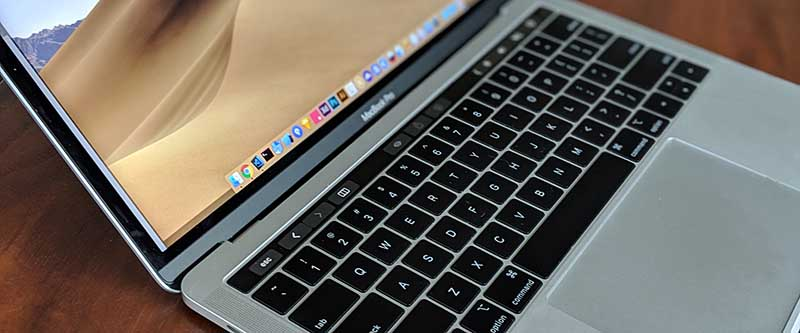
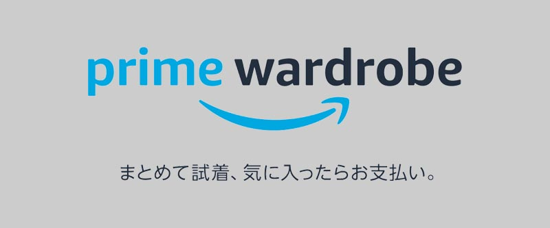
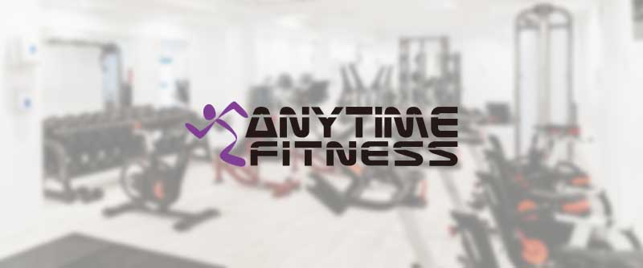
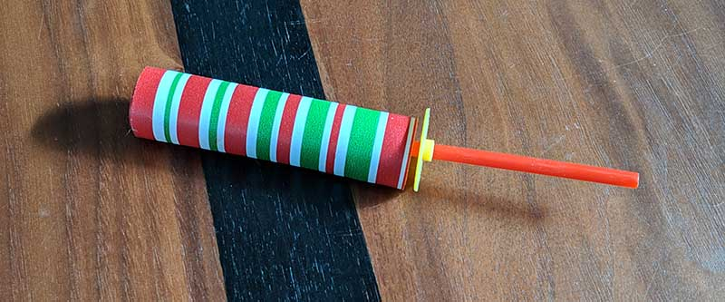
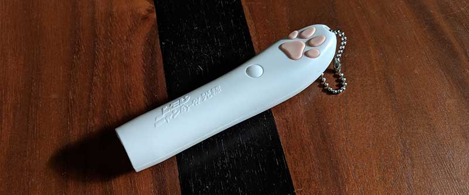
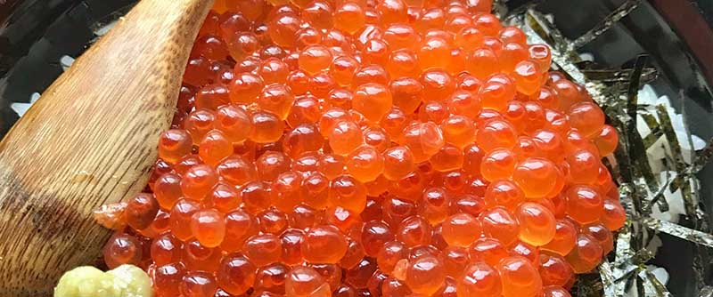

import EmbedCard from '@/components/Blog/EmbedCard.astro';

汇总了2018年购买、签约后觉得不错的东西。今年的目标是提升生活品质,所以买了不少东西。按数码产品、订阅服务、猫咪、其他类别分类。每个类别中大致按购入后觉得最满意的顺序来写。

## 值得购买的好物 ― 数码产品篇
PC、手机等数码产品相关。

### [Pixel 3](https://store.google.com/jp/product/pixel_3)

对我来说是今年最大的一笔购买。在购入Pixel3之前我一直用着Nexus6P和iPhone7,但Pixel3是与它们截然不同的手机……。Android Pie 9.0做得非常好,个人觉得比iOS更好用更喜欢(这一点可能反对意见也很多,但我觉得有这种感觉的人只是不习惯Android而已)。

另外相机的体验也是压倒性地好。

- 前置相机是超广角,不需要自拍杆
- 人像拍摄非常虚化。而且拍完后可以改变虚化的位置
- 夜景模式即使在几乎没光的黑暗中也能拍得不错
- 可以无限量地保存原画质照片到Google Photos
  - 与云端的联动非常顺畅,大量照片的加工和管理也很简单
- AR功能可以与漫威或星球大战的角色一起拍摄
- 通过机器学习识别被摄物体,并从Web上检索的Google Lens
- 可以「双击电源键启动相机→用旁边的音量键拍摄」,所以一旦想拍就能立即拍摄,无论竖持还是横持
 
不像iPhone那样增加镜头本身或提升性能,而是通过拍摄后基于机器学习的加工来制作出好照片的样子。这方面的详细介绍可以参考[@goando](https://twitter.com/i/moments/1057656588255674369)氏的Twitter Moment。

### [LG UltraFine 4K Display](https://www.apple.com/jp/shop/product/HKMY2J/A/lg-ultrafine-4k-display) + [HP单显示器支臂 BT861AA](https://amzn.to/2GbHJhM)

作为Mac用官方显示器销售的LG液晶显示器,以及HP的显示器支臂。在公司的桌子上(用经费)引入了它们。

显示器支臂虽然挂着HP(惠普)的名字,但实际上是Ergotron的OEM产品,与Ergotron LX几乎相同。Ergotron LX是显示器支臂的经典款,位置调整操作便利,很受欢迎。BT861AA是只更改了Ergotron LX的涂装的产品,哑光黑的质感与LG UltraFine 4K Display搭配得非常好。另外,LG UltraFine 4K Display原本是无法纵向旋转(pivot)的,但加上支臂后就能做到了。

LG UltraFine 4K Display完全是为Mac专用而设计,显示器侧没有任何多余的按钮。连接就开机,断开就关机,亮度可以从连接的Mac的TouchBar上更改。而且这款显示器的精彩之处在于,**电源、存储、LAN、视频、音频可以仅通过一根USB Type-C电缆来管理**。把AC适配器、LAN线、HDD等连接到显示器一侧,只需用一根电缆连接Mac和显示器,所有设备就都能与Mac连接。所以,桌子上只能看到一根电缆。

费了相当大的功夫去寻找,这些组合完美地漂亮,我非常满意。

### [MacBook Pro 2018later](https://www.apple.com/jp/macbook-pro/)

带TouchBar的Mac中,2018年下半年推出的型号。

初期型号上的「键盘按起来困难、显示输出不稳定」等问题已经基本解决,使用得很顺畅。Mac OS 12也没什么不满,通过`⌘⇧5`可以使用的截图功能非常方便。

### [Oculus GO](https://www.oculus.com/go/)

Facebook今年发售的廉价VR HMD(头戴式显示器)。搭载了定制的AndroidOS,无需PC或手机就能独立运行。使用感非常好,可以保持休眠状态放着,想用的时候立刻就能用。
对以前的<b>价格高、重、启动麻烦</b>等缺点进行了相当大的克服,可以说是为HMD的普及做出了巨大贡献的名机。只是电池有点短。

用Google Earth能模拟实际去到指定地点的[Wander](https://www.oculus.com/experiences/go/1887977017892765/)这款应用特别棒,可以去到以前住过的地方,然后被切意感杀死。默认安装的应用也有很多有趣的。

不过明年预计发售的[Oculus Quest](https://www.oculus.com/quest/)买了之后,这个可能就卖掉了。

### [Kindle Paperwhite 2018later型号](https://amzn.to/2QqfZur)

虽然是2018年12月才买的,但还是把它加进了这篇文章。是上个月刚发售的Kindle新型号。这次起变成了**防水**。原本我用iPhone7一边泡澡一边读书,但一直想用Kindle来读,所以马上购买了。

在Amazon Cyber Monday的促销中以减4000日元的价格买入,如果是定价的话可能稍贵。外观也有些变化,但目前除了变成防水以外,没感受到大的变化。

### [SONY 蓝牙耳机 WI-SP500](https://amzn.to/2L0yoIb)

SONY今年发售的蓝牙耳机。同时发售也推出了完全左右分离型和降噪型号,但这种形状最简单也最好用。世上似乎也有[从耳朵里垂下乌冬](https://www.google.co.jp/search?q=耳からうどん&tbm=isch)而沉浸其中的人,但我认为这种形状的蓝牙耳机才是完成形(再加上无线充电就完美了)。

顺便说音质并不怎么好(之前用的[JBL那款](https://amzn.to/2G3M3iL)更好)。

### [附加: 买了觉得一般的Surface Go](https://www.microsoft.com/ja-jp/p/surface-go/)

我一直「想要一台10英寸还能正常开发的设备」,特别是「希望Surface的10英寸出来」(已经5年左右了),所以发布的瞬间就立刻预订并购买了。可能是期望太大了,比预想的还要遗憾,很失望。

首先到货的键盘是与设想不同的JIS布局键盘,马上打电话退货换货了。商店的照片全部是US布局键盘,规格上也只写了「Qwerty布局」,但据说在日本商店销售的是JIS布局。[2018年12月现在还没修正](https://www.microsoft.com/ja-jp/p/surface-go-signature-type-cover/90KBCCPW6FSV),是非常容易让人误解的页面……。而且日本只能买到MS Office捆绑版,白白变贵了,这一点也让人不满。

接着是实际产品方面,运行起来非常生涩,显示Bug和死机也很多,让人很烦躁。我理解性能低,但即便如此,Windows这个OS的UI、UX水平很低,在慢的设备上根本没法正常使用。(顺便说我以前一直是Windows用户,所以并非不习惯。)我也想用它画画所以买了笔,但延迟太严重,稍微快点动笔线条就跟不上了。

不过硬件外观本身做得很好。尺寸感也刚好,质感也很棒。如果能正常运行,本来会是平时随身携带的爱机的……。如果是给孩子的玩具,或偶尔作为兴趣使用的程度,可能是一台合适的设备。

---

## 值得购买的好物 ― 订阅服务篇
按月付费可以使用的服务、设备等。算是「签约后觉得好的东西」。

### [Prime Wardrobe](https://www.amazon.co.jp/b/?node=5425661051)

Amazon从今年开始的面向Prime会员的服务。一次最多寄送8件衣服、鞋子、包等到家中,**只购买中意的、不需要的可以退回**的服务。退回手续也很简单,把不需要的商品装回送来的纸箱,贴上一同送来的到付运单,委托雅马多等收货即可。买衣服想花时间慢慢考虑,而且**可以与家里现有的衣服一起试穿**,非常方便。虽然只用过3次左右,但今后也打算一直用下去。目前商品种类还不算丰富。

### [YouTube Premium](https://www.youtube.com/premium)

终于在日本也能用的YouTube付费方案。无论是应用还是Web都没有广告,后台播放等非常舒适。

另外,加入Premium后可以使用YouTube Music服务,这一点特别让我中意。([YouTube Music的单独方案](https://www.youtube.com/musicpremium)也有。)我不怎么用Spotify或AppleMusic所以避免比较,但单纯地说原本就用YouTube听音乐,所以变得很方便很舒适。功能也做得很好,什么都不用想光听推荐曲目就能感到幸福。

3个月可以免费使用,本来就在YouTube听音乐的人请务必试试。

### [Waterstand](https://waterstand.jp)

可以出温水、冷水的净水机。不是所谓的换水箱式饮水机,而是<b>直接连接自来水,完全不需要换水的工夫</b>。随时可以立即使用热水和冷水,在烹饪和饮品上非常重宝。原本在冰箱里做大麦茶,这个工夫也省了。我买了2个[保温保冷壶](https://amzn.to/2KZCG2l),把冷水和咖啡放在身边喝。

月费4000日元左右有点贵,但还是相当满意。

### [ANYTIME FITNESS](https://www.anytimefitness.co.jp/)

健身房。签约后可以24小时,在世界任何分店使用。

我想要轻松、随意地坚持下去,所以彻底减少行李,有意识地培养习惯。行李只有[袋装蛋白粉](https://amzn.to/2KWsiII)、[足袋型训练鞋](https://amzn.to/2KWI5HJ)和短裤,平时的背包能轻松装下。在健身房换两次衣服也麻烦,所以选了离家近的健身房,运动后直接回家在家洗澡。↑前面介绍的Pixel3、蓝牙耳机、YouTube Music用来播放让人兴奋的播放列表一边跑步。

每次1小时左右,多亏如此每周大致能去3、4次。

---

## 值得购买的好物 ― 猫咪篇
献给我家养的猫的好物。

### [纸溜溜球](https://amzn.to/2KXR9fj)

**就是节日夜市上常卖的、抖动会拉伸的纸棒**。原来叫这个名字。会很快坏掉的消耗品,但便宜又好玩。

### [Karikari Machine SP 自动喂食器](https://amzn.to/2G0JNcb)

自动喂食器。可以在固定时间出固定量的食物,还可以从家外出食、用相机看情况、说话等。用了几次都没出问题,2泊3日的旅行程度够用。性价比高,我很满意。

### [爱丽思欧雅玛 地毯清洁器](https://amzn.to/2KYU5bA)

同样养猫的[@onthehead](https://twitter.com/onthehead)氏教给我的好物。猫在换季时会大量掉毛,用它来粘毛。黑色衣服一瞬间就会满是毛,所以对养猫者来说是必备品。当然平时也可以在地毯上滚。和一般的滚刷不同,粘性的纸是斜着切开的,可以简单地丢弃脏了的部分。

### [Jare-neko LED Nyandaro Beam 逗猫激光笔](https://amzn.to/2L5aRpL)

激光笔。猫咬得不行,而且和逗猫棒不同人不会累。非常轻松。

---

## 值得购买的好物 ― 其他篇

### [快递箱](https://amzn.to/2KXVLC7)

我经常在amazon购物,但收件麻烦所以引入了它。在自家门前用链子拴上放着即可。引入成本低,但生活品质却大幅提升。
※ 根据住所不同,很多时候不能放在自家门前,建议事先确认。

### 故乡纳税

虽说不上是「买」,但今年开始尝试故乡纳税。回礼品从人气排名前列的中随便选,得到了**冷冻三文鱼籽1kg、冷冻猪肉杂烩、米15kg**。冷冻三文鱼籽既好吃,又能保存近一年,真是太棒了。

通过[乐天故乡纳税](https://event.rakuten.co.jp/furusato/)申请,手续也很简单。

---

## 结尾

以上。我一直想写这种文章,所以非常开心。明年打算购买洗衣机、吸尘器之类。喜欢数码产品的各位如果能给我各种指点就太好了。顺便,关于今后想买的东西,我整理在[Amazon愿望清单](https://amzn.asia/eoKfIyd),随时欢迎支援🤗

感谢各位陪伴读完。
