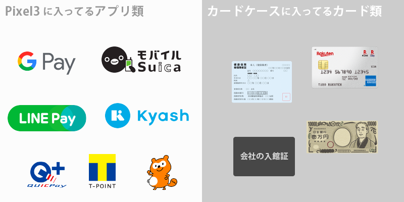
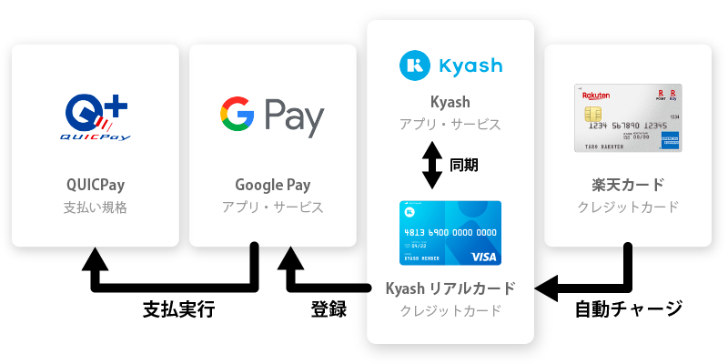

import EmbedCard from '@/components/Blog/EmbedCard.astro';

前几天买了 Pixel3 这款手机以后,我就不再带钱包出门了。**随身携带的只有 Pixel3 和卡包**,主要靠支付应用 Google Pay 和信用卡完成所有支付。

把这种生活坚持了两个月,下面整理一下这样做的好处和坏处,然后详细介绍我目前的具体配置。

## 好处

### 🙆 在收银台花的时间大幅减少
听到金额、从钱包里掏出合适的钱、等店员处理、收下找零……这些麻烦事都消失了。**简单来说就是超方便**。另外,我也尽量把积分卡都放进手机里,所以找卡的时间也大大减少。

### 🙆 去 ATM 的次数大幅减少
压根就不会出现"啊,钱不够了"这种情况。

### 🙆 与朋友间的往来也变轻松了
多亏了后面提到的转账 App,AA 制结账时变得轻松多了。

像是"我现在没带钱,等下再还给你"、"你能换开 5000 日元吗?""能找零吗?"、或者一个人帮大家垫付后被一堆零钱塞满钱包之类的事,现在想想真挺无聊的。

### 🙆 行李变少了
我之前一直在用 [abrAsus 的薄钱包](https://superclassic.jp/?pid=16355432),但即便如此,如今也觉得它已经太大了。

### 🙆 留下清晰的记录
Google Pay 的支付,以及转账 App 的使用,都会自动留下记录。也可以与经典记账 App [MoneyForward](https://moneyforward.com/) 联动。

经常有人说"不用现金的话会失去金钱感、容易花太多",但其实只要习惯了,反而能管理得更清楚。

### 🙆 日常支付能拿到现金返还
众所周知,信用卡每用一次都会有积分等返利。

而且对我来说,每次还能拿到 Kyash 的 2% 积分返还,加上乐天卡的 1% 返还,**等于每笔支付能拿到 3% 的返利**(具体配置后面会介绍)。

## 坏处

### 🙅 零钱很碍事
绝大多数店铺都能用电子支付,但个人经营的餐饮店、拉面馆很多都只收现金。

这种时候我就拿出藏在卡包里的备用万元纸币付款。零钱只能含泪塞进口袋,回家再扔进存钱罐。攒下的零钱再拿到 ATM 存回去。

### 🙅 跟没在用转账 App 的人打交道很麻烦
跟没在用转账 App 的朋友 AA 制结账时挺麻烦的。零头可以忽略不计,但因为我身上一般只带万元纸币,反而会让对方花点功夫。

## 支付方式的详情
具体来说,我用了什么样的服务和工具来完成支付。

### 配置

- Pixel3(Android 手机)
  - Kyash, LINE Pay
  - Google Pay
      - QUICPay
      - Suica、Suica 月票
      - 各类积分卡

- 卡包
  - 信用卡
  - 健康保险证
  - 公司门禁卡
  - 一张备用万元纸币

### Kyash, LINE Pay
是转账 App。可以让用户之间互相转账,AA 结账时非常实用。<b>大多数人要么用 Kyash 要么用 LINE Pay,所以装上这两个基本就够了</b>。

<EmbedCard
    url="https://kyash.co/"
    img="https://kyash.co/img/company_og.png"
    title="钱包应用 Kyash - 让日常支付立享 2% 优惠"
    site="kyash.co" />

<EmbedCard
    url="https://line.me/ja/pay"
    img="https://d.line-scdn.net/n/line_lp/img/ogimage.png"
    title="LINE Pay"
    site="line.me" />

付款方通过信用卡或银行账户联动来转账,收款方则会以积分形式收到钱。

Kyash 和 LINE Pay **都能各自申请联动的信用卡,并把收到的积分作为信用卡来消费**。

### Google Pay
我用 Google Pay 来进行 QUICPay、Suica 等非接触式支付,以及显示各种积分卡。

基本上和 Apple Pay 没什么大区别。Apple Pay 支持的服务更多,但便利性方面 Google Pay 给我感觉更好。不过目前支持非接触支付的 Android 手机还很少。

此外还能使用 nanaco、WAON、Edy 等。和 Apple Pay 不同的是,**不必每次启动手机选择支付方式,直接把手机靠近支付终端就会自动用对应的方式付款**。

<small>※ 顺便一提,PayPay 这种需要展示二维码的我也装了,但操作太麻烦,根本提不起兴趣继续用。[这篇文章](https://note.mu/takashi0zo/n/nf5c11a0baa0e)总结得很清楚,我觉得它还远没到能日常使用的水平。</small>

### QUICPay(信用卡)
这是我主要的支付方式。在支持的收银台"嘀"一下就能完成支付。

整理一下,QUICPay 是<b>支付的规范</b>,实际是从绑定的信用卡里扣款。

类似的规范还有 iD。具体用哪一种,取决于绑定的手机 App 和信用卡的组合。把乐天卡绑到 Apple Pay 上就是 QUICPay,绑亚马逊卡就是 iD,大致是这样。两者在大部分便利店和连锁店都能用。

我自己的话,是把 Kyash 的信用卡绑定到 Google Pay 上。可能稍微有点绕,具体配置如下。

### Suica、Suica 月票
QUICPay 用不了的地方,Suica 有时候能用。需要事前充值,而且没有积分返还,所以我用得不多。月票也设成了 Suica,所以过闸机也是一靠就走。

### 各类积分卡
**Google Pay App 里能显示条形码,可以当作积分卡使用**。它支持下面这些服务。真希望全世界的积分卡都改成 App 形式。

- T 卡
- NITORI(宜得利)
- IKEA(宜家)
- 松本清
- 乐天积分卡
- 等等……

ponta 卡在 Google Pay 里没法很好地使用,所以我额外装了[官方的 ponta 卡 App](https://play.google.com/store/apps/details?id=jp.ponta.myponta)。

### 卡包
是兼有橡皮筋功能的卡包。仅作为备用,基本只靠手机搞定一切。只放最低限度的卡片。美容院的卡和银行卡之类的另放在一个卡包里收在包里。

<EmbedCard
    url="https://www.madera.com.au/collections/wallets/products/union-wallet-in-cherry"
    img="//cdn.shopify.com/s/files/1/0261/7319/products/UNION-NEW-FRONT-CHERRY-ORIGINALSIZE_03_medium.jpg?v=1464762846"
    title="Madera - Union Wallet in Cherry"
    site="www.madera.com.au" />

## 总结
虽然有不少不方便的地方,但总体来说放弃钱包让我感觉非常好。只要拉面馆还存在,真正的无现金化看来还有点遥远,但我觉得现在已经是放弃钱包好处更大的时代了。

总之,如果可以的话,光是在便利店 **使用 Apple Pay 或 Google Pay 支付** 我就强烈推荐。一旦习惯了收银台的极速体验,你就会渐渐讨厌起现金了。

完。
