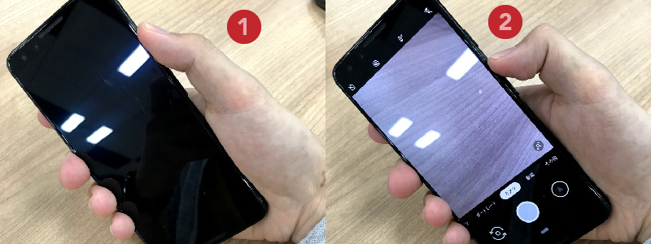
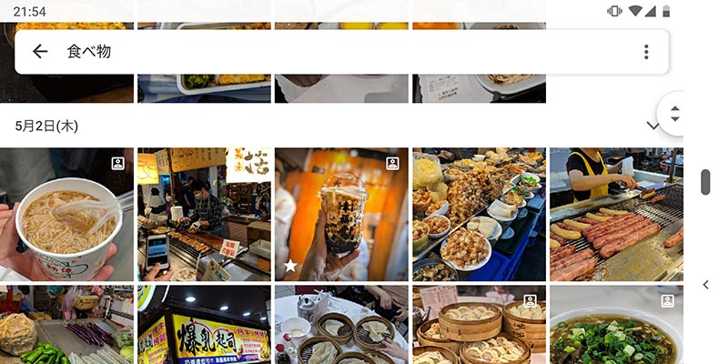
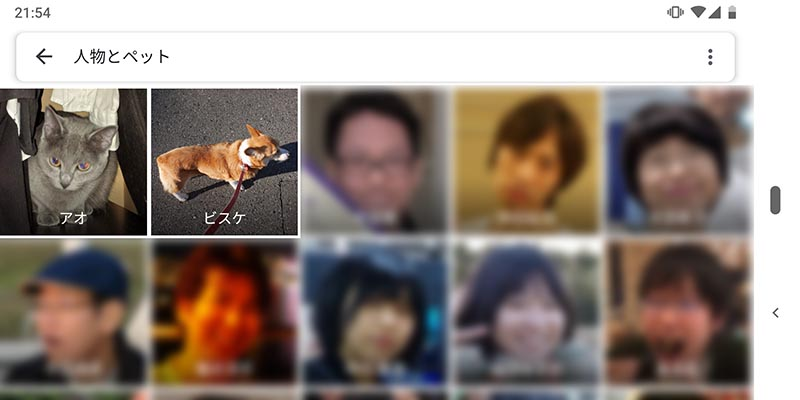
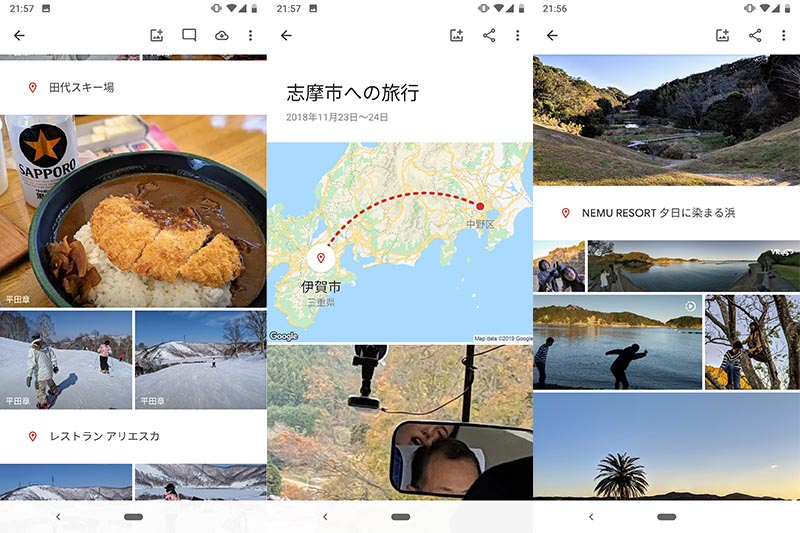
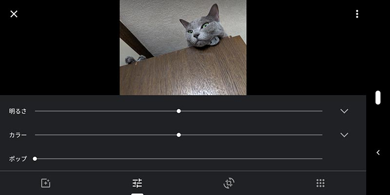
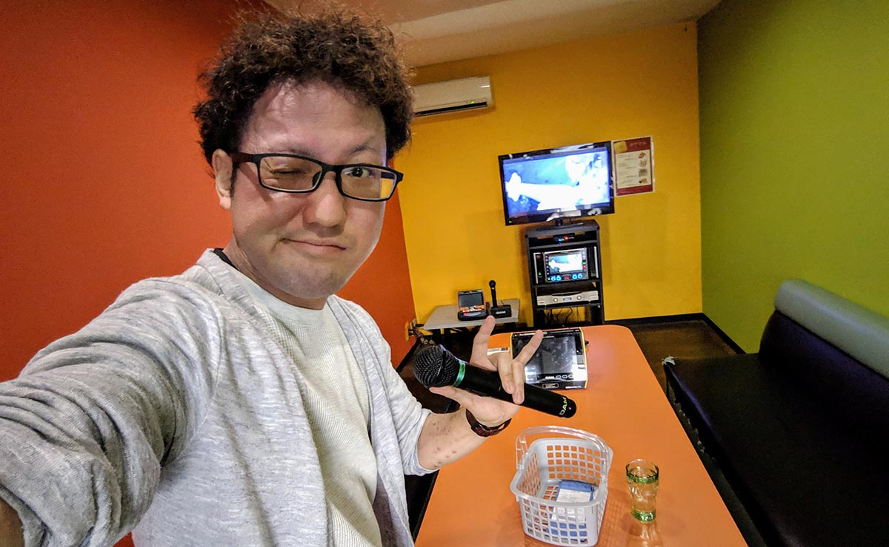
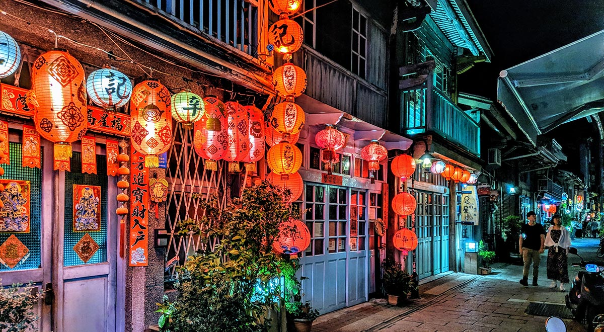

import EmbedCard from '@/components/Blog/EmbedCard.astro';

在前几天的 Google I/O 2019 活动上,[Pixel3](https://store.google.com/jp/product/pixel_3) 的廉价版 [Pixel3a](https://store.google.com/jp/product/pixel_3a) 发布了。

<EmbedCard
    url="https://store.google.com/jp/product/pixel_3a"
    img="https://lh3.googleusercontent.com/-Ez9MiTstK6r-Rm8r9VNQmlYCw1qgo5ZgdLlJ5ol1wJqqytdUXd2fW8JoNl8fNSbo6M"
    title="Pixel 3a ＆ Pixel 3a XL - 实现这一切的手机 - Google Store"
    site="store.google.com" />

Pixel3是Google制造的智能手机。从发售之初相机的优秀就备受关注,在各种地方都被介绍过。

当然相机性能本身也很出色,但**Pixel3真正优秀的地方在于它「拍摄体验」之好**。借此机会,请允许我介绍一下我一直以来感受到的Pixel的优点。

## 1. 拍摄的快速性

在Pixel3上,**双击电源键即可启动相机,然后直接按音量键就能拍摄**。不仅是Pixel3,很多Android手机都能通过物理按键即时启动相机。你可能会想:那又怎样?但这真的非常非常棒。

iPhone也可以通过锁屏左滑启动相机,但无论是操作的简单性还是快速性,都远不及Android。

物理按键的位置也很合理,**从自然握住手机的状态出发,几乎不用改变手的姿势就能完成拍摄**。

而用iPhone拍摄,无论如何都得改变握法,手指要做较大幅度的移动。

使用Pixel3的话,**无论是右手还是左手,无论是竖着拿还是横着拿,即使戴着手套或者没看着手机,**都能极快地启动相机并稳稳地完成拍摄。无论是在滑雪时、走路时,还是手里拿着大量行李时,只要想拍就能立刻拍。在旅行等需要大量拍摄的场景中,差距尤为明显。

## 2. 照片管理的便利性

Pixel3的照片在Google Photos应用中进行管理。Google Photos会自动保存到云端,因此:

- 不需要备份
- 偶尔从设备上删除照片就行,不会占用手机容量
- 与他人共享相册也很简单
- 在PC或其他设备上也能查看和管理照片

诸如此类,好处多多。而且<b>容量无限</b>。

如前所述,Pixel3因为可以随便拍,所以照片量会变得非常庞大。但即使照片再多,有Google Photos也不用担心。Google Photos借助机器学习的力量,**就算放任不管也能整理海量照片**。

<b>会自动识别照片中的内容,因此可以用「狗」或「咖喱」等自然语言搜索</b>

<b>通过人脸识别识别人物或宠物,相当准确地分组归类</b>

<b>旅行时会根据位置信息和时间段自动创建相册并推荐给你</b>

<b>编辑功能简单易用,且功能强大</b>

诸如此类,非常方便。类似的服务还有iCloud照片图库或Adobe Lightroom等,但如果你拥有Pixel3,我认为Google Photos是唯一的选择。

## 3. 相机性能
如前所述,Pixel3的相机性能也是顶级的优秀。尤其是**暗处的拍摄性能**和**广角自拍镜头**,其他手机望尘莫及。

接下来的内容已经被介绍过无数次了,所以只是简单回顾一下。如果想了解技术细节,可以参考[@goando 的Twitter](https://twitter.com/i/moments/1057656588255674369)。

### 人像模式

这是一种将被摄主体以外的部分大幅虚化的拍摄模式。能够轻松拍出像单反相机那样时尚的照片。

iPhoneX也有这个模式,两者都能以很高的质量进行拍摄。拍摄后还能编辑虚化程度,这一点也是相同的。

不过,iPhoneX是通过双镜头获取景深信息,而Pixel则是通过机器学习的图像处理来实现虚化。各自的实现方式不同,但从体感上来说两者的性能差距不大。

### 前置广角镜头

Pixel3前面有两个镜头,其中一个是超广角镜头。因此,**即使没有自拍杆也可以多人合拍**。超方便。不过,<b>这个广角镜头在Pixel3a上是没有的</b>,请注意。

### Night Mode

夜景等**昏暗环境下的拍摄,Pixel3是现有手机中最顶级的**。这据说也是AI图像处理的力量。与iPhoneX相比,优秀程度甚至有些残酷。

### PlayGround

附赠一项。AR功能很有趣。在默认的相机应用中可以与复仇者联盟、星球大战、宝可梦的角色合影。

## 总结

以上就是全部内容。在旅行等需要大量拍照的场景中真的非常实用。比起使用iPhone时,我明显感觉**拍摄量和拍摄质量都得到了提升**。无论是爱自拍的女高中生,还是喜欢旅行的大叔,都买Pixel3吧。

完。
