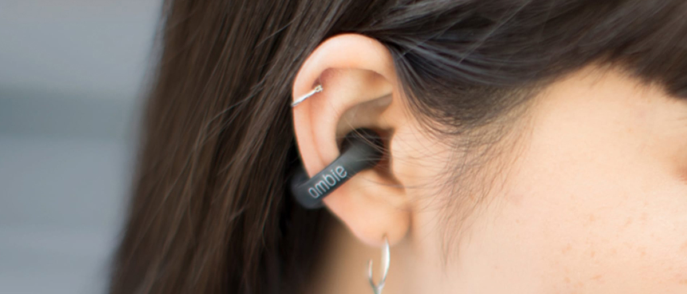
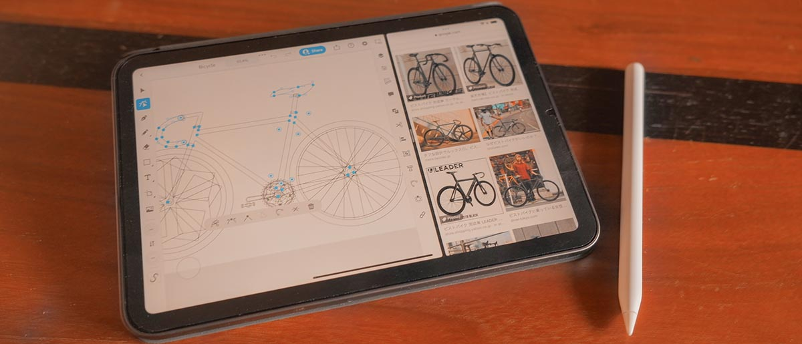
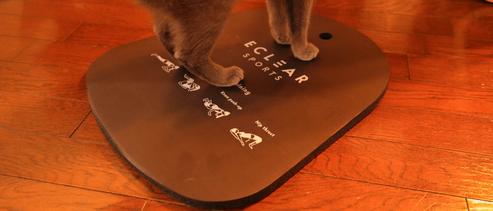
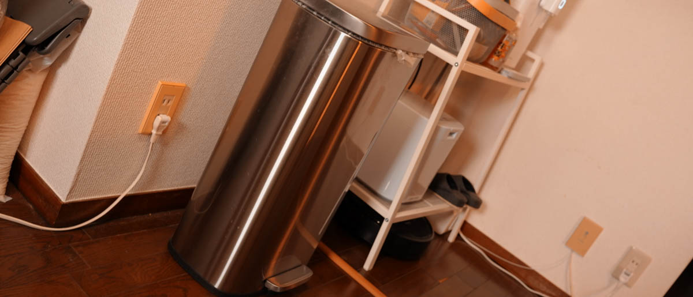
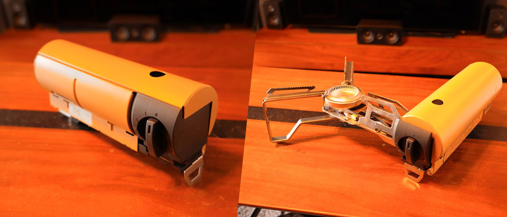
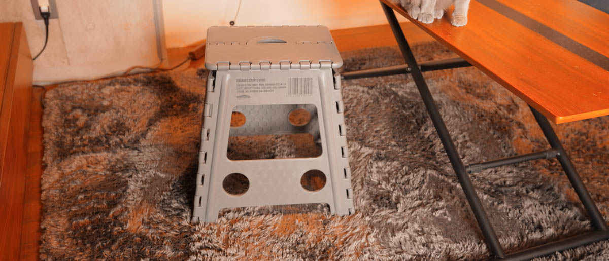
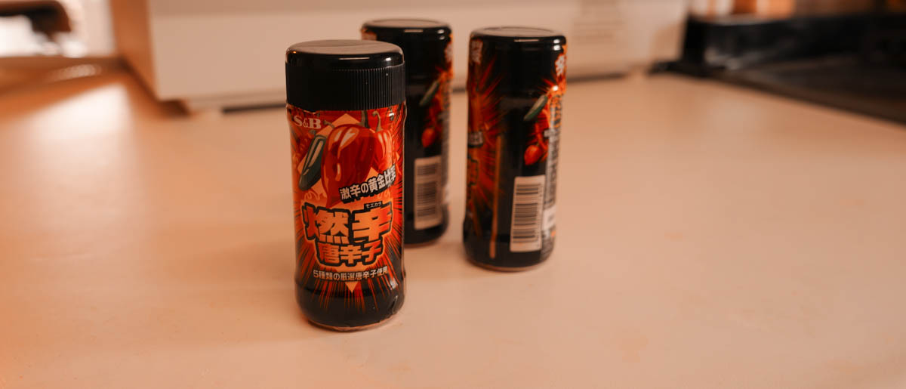
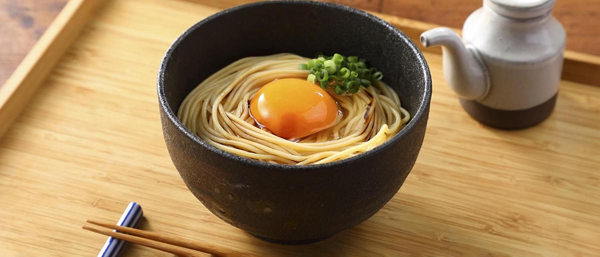

import EmbedCard from '@/components/Blog/EmbedCard.astro';

## 数码类

### Ambie AM-TW01

<small class="reference">[参考来源: ambie](https://ambie.co.jp/soundearcuffs/tws/)</small>

左右分离式的蓝牙耳机。最大的特点是<b>不堵塞耳朵</b>的结构,因此可以听到周围的声音。所以非常适合运动或移动中使用。像耳钉一样的外观非常帅气,我相当爱用。而且可能是因为符合我耳朵的形状,即使长时间佩戴也不会有任何疼痛感,这一点我很满意。当然,在想要屏蔽周围声音的时候就用不了了。

* [Amazon](https://amzn.to/33tMRtU)
* [官方网站](https://ambie.co.jp/soundearcuffs/tws/)

### iPad mini

iPad mini 长期没有更新换代,我想很多人都期待着新机型。虽然价格很高,但如愿以偿地推出了搭载 Type-C 和 Apple Pencil 2 等期待已久功能的新机型。我用它来制作后面提到的[Illustrator](#illustrator-ipad)矢量插画,以及连接单反相机进行RAW显影作业等。作为Mac的外接显示器使用的[Sidecar功能](https://support.apple.com/ja-jp/HT210380)也超级方便。

* [Amazon](https://amzn.to/3Icl8wq)
* [官方网站](https://www.apple.com/jp/ipad-mini/)

### Desk Hack
设置在桌子背面后,可以隔着桌面进行无线充电的充电器。充电速度相当慢,但反正手机一直放在PC旁边,感觉上就像手机在自动充电一样。

<blockquote class="twitter-tweet">
<a href="https://twitter.com/hashtag/deskHack?src=hash&amp;ref_src=twsrc%5Etfw">#deskHack</a> 導入した  こんなん...こんなん最高やん  ⚡️アイコンはキズ補修マニュキュアで描いた<a href="https://t.co/YUyH1bN84f">https://t.co/YUyH1bN84f</a> <a href="https://t.co/TNRACIBT9S">pic.twitter.com/TNRACIBT9S</a>
&mdash; 平田 / U-NEXT (@psephopaiktes) <a href="https://twitter.com/psephopaiktes/status/1429345207145754624?ref_src=twsrc%5Etfw">August 22, 2021</a></blockquote> 

* [Amazon](https://amzn.to/3y6Xxbg)

### SOUND SPHERE

去年ONKYO在做众筹的产品。是一款可以**几乎无线构建5.1ch环绕音响**的扬声器系统。营造了相当清爽的电影观看环境,我很满意。不满意的地方有:

* 虽然只是一点点,但<b>有延迟,所以不适合FPS游戏等</b>
* 即使是立体声也会从后面发出声音,所以很难判断是否正确以Dolby Atmos等环绕模式输出(其他公司的一般产品好像会显示出来⋯⋯)

诸如此类。

* [众筹页面(已结束)](https://greenfunding.jp/lab/projects/4622)
* [官方网站](https://onkyo.com/audiovisual/hometheater/soundsphere/sksss51x/)

## 搬家・家具相关
去年夏天,我从中野搬到了横滨。因为工作是全远程,所以花了相当长时间来挑选家具和居家环境。

### Midori 纸箱切割刀

用来快速切割纸箱包装和胶带、折叠纸箱非常实用。带磁铁可以贴在门上,东西到了就立刻用它开箱折叠。如果常用Amazon或网购,推荐购买。

* [Amazon](https://amzn.to/3qz2oBj)

### 可剥离壁纸RILM

新居的墙壁一半是混凝土,一半是石膏板,看起来有些怪,所以我在石膏板部分贴了蓝色牛仔布风格的翻新贴。贴的时候有点麻烦,但质感和外观都变得超级好,我很满意。听说退租时使用剥离剂可以干净地撕下来。

* [乐天](https://a.r10.to/hMCQAE)

### 无印良品 客厅餐厅两用沙发椅
<blockquote class="twitter-tweet">
昇降机と無印ソファの組み合わせ、我ながら天才  リビング配置にもダイニング配置にもすぐ変えられる <a href="https://t.co/88jDYWypI2">pic.twitter.com/88jDYWypI2</a>
&mdash; 平田 / U-NEXT (@psephopaiktes) <a href="https://twitter.com/psephopaiktes/status/1432976688070094850?ref_src=twsrc%5Etfw">September 1, 2021</a></blockquote> 

是二手购入的,只换了套子。做工很扎实,所以是一款也能当工作椅或餐椅使用的沙发。平时是L字形布置,有客人时可以快速改变布局。和[升降桌](https://a.r10.to/hkVJVO)非常搭配。

* [官方网站](https://www.muji.com/jp/ja/store/cmdty/section/S2000607)
* [Amazon](https://amzn.to/3FIXTZo)

### BALMUDA GreenFan C2

充电底座式的,只要拿起来就可以轻松移动的空气循环扇。(※[充电底座是另售的](https://store.balmuda.com/disp/CBlSfSelectGoodsPage.jsp?DISP_TP=1&PRODUCT_SERIES=EGF-P100)) 因为很贵所以相当犹豫,但买了之后非常满意。我把它和Nature Remo联动,设置成从手机打开空调时自动启动。

* [Amazon](https://amzn.to/3rznAGu)
* [官方网站](https://www.balmuda.com/jp/greenfan-c2/)

### 宜丽客 训练垫 点状训练垫

之前有一张瑜伽垫,但占地方且取放麻烦,最后还是扔了。这个尺寸的话可以塞进缝隙,要用时也很快。我自己只做平板支撑、腹肌轮、健身环冒险这些,这种程度这个尺寸就够了。

* [Amazon](https://amzn.to/3rxYbwV)
* [官方网站](https://www.elecom.co.jp/products/HCF-YMCLBK.html)

### Amazon Basics 垃圾桶

Amazon自营品牌的垃圾桶。外观不错,而且是钢制的,所以表面脏了也能立刻擦干净。盖子也能静音关闭。最让我满意的是,因为四角是圆的,所以更换垃圾袋很简单。

* [Amazon](https://amzn.to/3tL915L)

### Snow Peak 燃气炉 GS-600KH

可以圆筒状紧凑收纳的燃气炉。可以使用一般家用燃气罐。户外使用很方便,在房间里吃火锅也完全够用。很帅气。

* [Amazon](https://amzn.to/3tGqBYC)
* [官方网站](https://ec.snowpeak.co.jp/snowpeak/ja/%E3%82%AD%E3%83%A3%E3%83%B3%E3%83%97/%E3%83%92%E3%83%BC%E3%83%86%E3%82%A3%E3%83%B3%E3%82%B0/HOME%EF%BC%86CAMP-%E3%83%90%E3%83%BC%E3%83%8A%E3%83%BC-%E3%82%AB%E3%83%BC%E3%82%AD/p/129399)

### WHATNOT梯凳

为了搬家随便买的,但用得相当频繁。超级轻,可以折叠得很薄,所以可以塞进冰箱或家具的缝隙,要用时立刻就能拿出来。来客多的时候,也可以作为自己的凳子使用。

* [Amazon](https://amzn.to/3fF2ykk)

### 米家便携2000mAh充电式无线电动螺丝刀

小米的时尚的、可以Type-C充电的电动螺丝刀。有人告诉我搬家时电动螺丝刀和电子卷尺是必备品,确实超级方便。一般来说[博世](https://www.bosch.co.jp/pt/products/?id=IXO6_2021)是经典款。

* [Amazon](https://amzn.to/3IjHmN0)

### 木甲板
<blockquote class="twitter-tweet">
ウッドデッキ敷いた <a href="https://t.co/WR5AT69M5y">pic.twitter.com/WR5AT69M5y</a>
&mdash; 平田 / U-NEXT (@psephopaiktes) <a href="https://twitter.com/psephopaiktes/status/1431469401862070276?ref_src=twsrc%5Etfw">August 28, 2021</a></blockquote> 

新居的阳台特别大,想着光脚出去,所以引入了木甲板。[IKEA](https://www.ikea.com/jp/ja/cat/outdoor-flooring-21957/)是经典款,但我购买了在[家电批评](https://amzn.to/3KhY7dk)中评价很高的Kohnan的产品。也有传言说背面会积泥成为虫子的温床,但目前还感觉不错。

* [官方网站](https://www.kohnan-eshop.com/shop/g/g4522831933389/)

## 食品・烹饪相关

### ZEYO
<blockquote class="twitter-tweet">
筑波大生なら全員が知ってる世界一美味しい(たぶん)カレーうどん <a href="https://twitter.com/ZEYO298?ref_src=twsrc%5Etfw">@ZEYO298</a> が、冷凍販売を開始  つくってみたけどかなーり再現度たかい！チャーシューもついてくるのがありがたい<a href="https://t.co/7yUsKy8U8M">https://t.co/7yUsKy8U8M</a> <a href="https://t.co/MSYEWA5FiD">pic.twitter.com/MSYEWA5FiD</a>
&mdash; 平田 / U-NEXT (@psephopaiktes) <a href="https://twitter.com/psephopaiktes/status/1379366770897735681?ref_src=twsrc%5Etfw">April 6, 2021</a></blockquote> 

由于新冠,很多拉面店和餐厅都开始销售冷冻食品。位于筑波的咖喱乌冬店ZEYO非常美味,推荐。也有故乡纳税。

* [官方网站](https://zeyo298.stores.jp/)

### 燃辛辣椒

去年非常喜欢,持续回购的调味料。比一味辣椒更辣,没有怪味,适合各种料理。

* [Amazon](https://www.sbfoods.co.jp/products/detail/15789.html)
* [官方网站](https://www.sbfoods.co.jp/products/detail/15789.html)

### ZENB

<small class="reference">[参考来源: ZENB](https://zenb.jp/blogs/noodlerecipes)</small>

去年试了不少营养食品,这个是BEST。是普通意大利面的替代食品,但完全由100%大豆制成,糖质降低3成。最重要的是Q弹好吃。我把常备的意大利面换成了这个。和市售的拉面汤也很搭。

* [官方网站](https://zenb.jp/)

### 洗碗机 松下 NP-TH4-W

一直想要,但因为搬到了大房子,去年终于买到了。很贵,而且超级占地方,很碍事。但是,不用洗碗真是太棒了。在家做饭的次数也增加了。

<blockquote class="twitter-tweet">
食洗機のダッサい裏面、ホワイトボードシート貼ってごまかすことにした  かしこい <a href="https://t.co/lXQYW4CG6o">pic.twitter.com/lXQYW4CG6o</a>
&mdash; 平田 / U-NEXT (@psephopaiktes) <a href="https://twitter.com/psephopaiktes/status/1432970498434949120?ref_src=twsrc%5Etfw">September 1, 2021</a></blockquote> 

吧台厨房被破坏了,但背面贴了白板贴来掩盖。结果还是有人说,住嵌入式洗碗机的房子比较好。

* [Amazon](https://amzn.to/3rzciCa)
* [官方网站](https://panasonic.jp/dish/products/NP-TH4.html)

## 数字内容
是去年我个人喜欢的作品等。我看漫画看得很多,所以只介绍一本。漫画在粉丝网站[アル上整理了我喜欢的书](https://alu.jp/user/IOeXFqQeiAQprdHNh3LvOJzoVdl2/shelf/IMiIeYyDucwdf6lJxeLS),有兴趣可以去看看。

### Splatoon2
说来已晚,我大约一年前才开始玩。完全沉迷其中,成为我历代游玩时间最长的游戏。我以前完全不会玩在线对战的FPS或TPS,但喷射战士按键少、规则简单,即使是新手也能贡献的团队对战让我深深陷入。

今年Splatoon3也要发售了,请一定一起玩。

* [Amazon](https://amzn.to/3AbPCMq)
* [官方网站](https://www.nintendo.co.jp/software/feature/splatoon/index.html)

### 派出所女子的逆袭
是被影视化、动画化的超人气漫画。每出一卷都让人觉得像换了一部漫画一样,呈现出各种侧面,越看越有趣。读到第1卷就停就太可惜了。搞笑和严肃的平衡很绝妙,警察职务的描写非常详细也很有趣,配角也非常出彩。读完17卷之后再读同系列的「派出所女子 Unbox」,在时间线上不会混乱。

* [Amazon](https://amzn.to/3rqdeZu)
* [U-NEXT](https://video.unext.jp/book/title/BSD0000210418/BID0000339313)
* [官方网站](https://morning.kodansha.co.jp/c/hakozume/)

### BioHazard4
为Oculus Quest重新制作的、人气僵尸游戏的VR版。开发深度由Facebook参与,控制器和整体的操作性都质量极高。想做的操作都能精准实现,这一点很棒。※ 已经更名为Meta了。

* [官方网站](https://www.oculus.com/experiences/quest/2637179839719680/)

### Illustrator iPad
在介绍[iPad](#ipad-mini)时也提到过,是Adobe Illustrator的iPad OS版本。可以使用笔操作,矢量绘图可能比鼠标更方便。在外面随时画线稿相当方便。最好配上类纸膜。

* [官方网站](https://www.adobe.com/jp/products/illustrator/ipad.html)
* [App Store](https://apps.apple.com/jp/app/id1018784575)

## 结语

以上就是全部内容。去年配合搬家相当散财,所以总结起来很开心。
