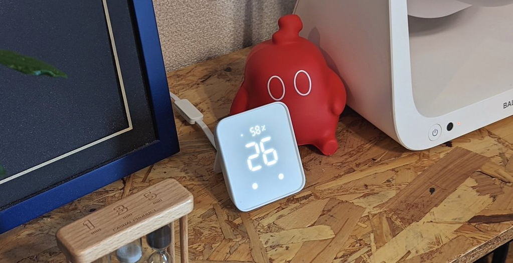
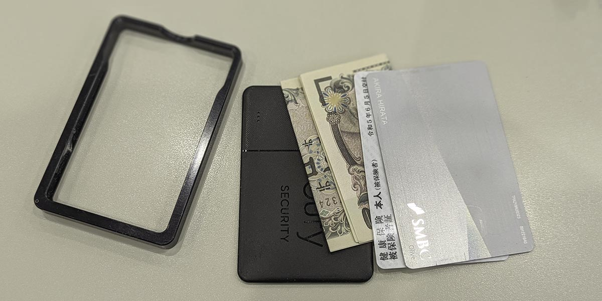

import EmbedCard from '@/components/Blog/EmbedCard.astro';

因为有熟人说意外地参考了这些内容,所以今年也来写一下。

* [2022年](/blog/2022-best-buy)
* [2021年](/blog/2021-best-buy)

## 数码类

### 鼠标和键盘

* [Logi LIFT M800](https://amzn.to/48AYLOy)
* [Keychrone K7 Pro](https://www.keychron.com/products/keychron-k7-pro-qmk-via-wireless-custom-mechanical-keyboard)

在[这篇文章](https://hira.page/blog/kvm-display#おまけ-その他使用しているデバイスまとめ)中也介绍过。

### [Switchbot](https://amzn.to/3S74OF8) 系列

把房间里的IoT设备几乎全部换成了Switchbot的产品。具体如下↓

* [智能锁](https://amzn.to/3tIAKX2)
* [智能Hub](https://amzn.to/3TQYLG7)
* [窗帘](https://amzn.to/3vtSohO)
* [SwitchBot按键开关](https://amzn.to/3TQYLG7)
* [加湿器](https://amzn.to/3TNoGhT)
* [LED灯泡・灯带](https://amzn.to/41R9Xob)
* [智能插座](https://amzn.to/47n03eR)

之前是单独购买便宜的中国制造产品,但每个厂家都需要在各自的应用上设置,非常麻烦。现在只用Switchbot和Google Home两个应用就能管理,非常轻松,我很满意。外观也非常时尚,可以显示房间的温度・湿度。

例如,对Google Home说「晚安」就会执行以下场景。如果家电较多,例如有空气循环扇或氛围灯,我非常推荐。

>关闭所有灯,关上窗帘,用加湿器将卧室湿度保持在40%以上,空调预约7小时后启动

## 日常・生活类

### [NIUM CLASSIC](https://amzn.to/3vygeJ0)

薄款钱包我尝试了各种知名品牌,这个成为了我的最佳选择。虽然和[之前在这里介绍的配置](/blog/201901_cashless)几乎没变,但它非常小巧不占空间,真的太棒了。

里面还放了[Anker的GPS卡](https://amzn.to/3vygtno),即使丢了也能放心。

### [THREE 眉笔](https://www.threecosmetics.com/onlineshop/g/gt4b052/)

我有特应性皮炎,所以做不了认真化妆这种事,但听从时尚熟人「只画眉毛就能轻松取得很大效果」的推荐,一直在用。※还需要替换芯,请注意。

### [Braun 身体修剪器 PRO X XT5300](https://amzn.to/3RHDo7m)

<EmbedCard
    url="https://amzn.to/3RHDo7m"
    img="https://m.media-amazon.com/images/I/51C7Wk618ZL._AC_SX679_.jpg"
    title="Amazon | Braun 身体修剪器 PRO X XT5300-b 身体 身体剃须器 修整为自然长度/剃光 进化的4D刀片 切割面积扩大2倍 手臂 手指 腿 腋下 私密区域 脸部 6个配件 身体修剪器 【Amazon.co.jp 限定】 | Braun | 男士剃须器 通信销售"
    site="amazon.co.jp" />

小巧好用的身体修剪器・修剪器。可以快速剃掉头发的两侧推平部分,或稍微剪短小腿毛等,非常方便。对骑自行车的人来说是必备品。胡子也通过脱毛减少了不少,所以剃须用这个也基本够用了。

## 烹饪・食品类

### [Toffy 手动切碎机迷你Ⅱ K-HC5](https://amzn.to/3TPJwNq)

<EmbedCard
    url="https://amzn.to/3TPJwNq"
    img="https://m.media-amazon.com/images/I/61TvAoPxIAL._AC_SX679_.jpg"
    title="Amazon | 【Toffy】 手动切碎机Ⅱ K-HC6(灰白色) 新款 无需电源 手动 食物处理器 切碎 切碎机 食物切割器 搅拌器 时尚 可爱 简单 K-HC6-AW | TOFFY | 手持搅拌机 通信销售"
    site="amazon.co.jp" />

很少使用的食物处理器换成了这个。又轻又比食物处理器更容易清洗,完全够用。

### [Epicurean 木制 砧板](https://amzn.to/3Ohx063)

<EmbedCard
    url="https://amzn.to/3Ohx063"
    img="ttps://m.media-amazon.com/images/I/61xRsu+SNAL._AC_SX679_.jpg"
    title="Amazon.co.jp: Epicurean 木制 砧板 切菜板 M 自然色 洗碗机适用 日本正规品 户外 露营 001-120901 : 家居&厨房"
    site="amazon.co.jp" />

小巧轻便的合适尺寸的砧板。操作便利不易脏,简直完美。

### [like-it 漏勺 碗 套装](https://amzn.to/3Sb3BNc)

<EmbedCard
    url="https://amzn.to/3Sb3BNc"
    img="https://m.media-amazon.com/images/I/51yPhGdj5IL._AC_SX679_.jpg"
    title="Amazon|like-it 漏勺 碗 塑料 微波炉适用 Colander&Bowl 也能用来淘米 漏勺与碗 灰色 6件套 日本制 滤水 滤汤可用 耐热碗|碗 在线通信销售"
    site="amazon.co.jp" />

省空间的漏勺和碗的套装。时尚且尺寸正好,可以直接端上餐桌很方便。

### 装食品微波加热的那种

感觉今年在超市经常能看到这种装肉或意大利面进去微波加热的产品。又轻松又超级好吃,种类也多,我相当频繁地回购。

* [Pakit](https://amzn.to/3Sa3Jwc)
* [蓬松鸡肉](https://amzn.to/3SaazSn)

## 内容・体验类

### [哥斯拉-1.0](https://godzilla-movie2023.toho.co.jp/)
画面、剧情、演出全部都很棒⋯⋯。个人喜好上比新哥斯拉更喜欢这部。

### 漫画
* [Chikita★GUGU](https://video.unext.jp/book/title/BSD0000483296/BID0000818431)
    * 是熟人画的漫画,时隔几年再读觉得超级有趣,所以介绍一下。可爱又奇幻,是带有轻搞笑的世界观,但偶尔会有些猎奇或沉重。
* [用税金买的书](https://video.unext.jp/book/title/BSD0000499999/BID0000851179)
    * 去年也写过,最近这种既能学到知识又有趣的漫画越来越多,真好。
* [律师的渣滓](https://video.unext.jp/book/title/BSD0000036374/BID0000058634)
    * 是被影视化的著名作品,但我现在才读。这部也充分涉及法律知识,剧情也超级好。

### [ChatGPT GPT-4](https://openai.com/gpt-4)
当然付费了。明明只用了大约半年,但已经离不开AI了⋯⋯。
