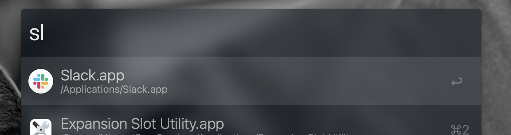
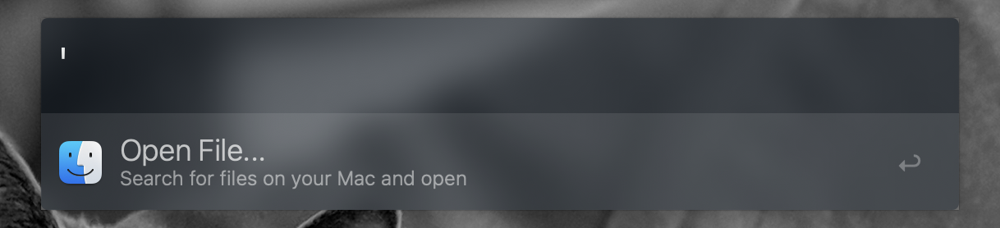
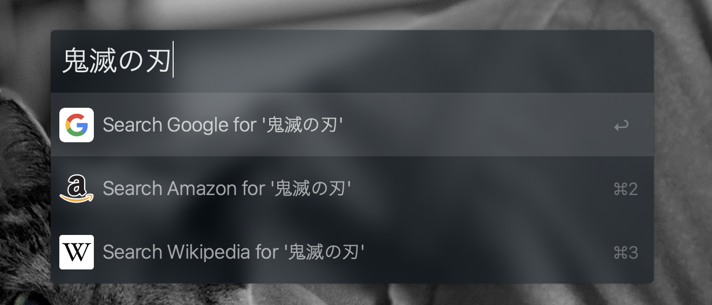
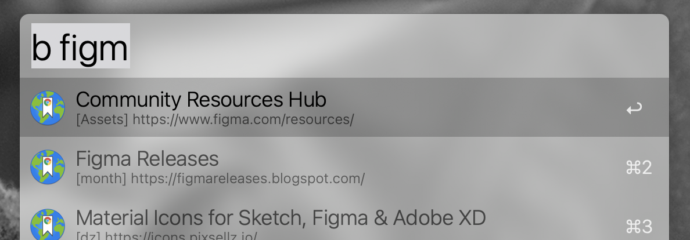
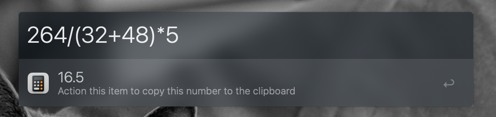
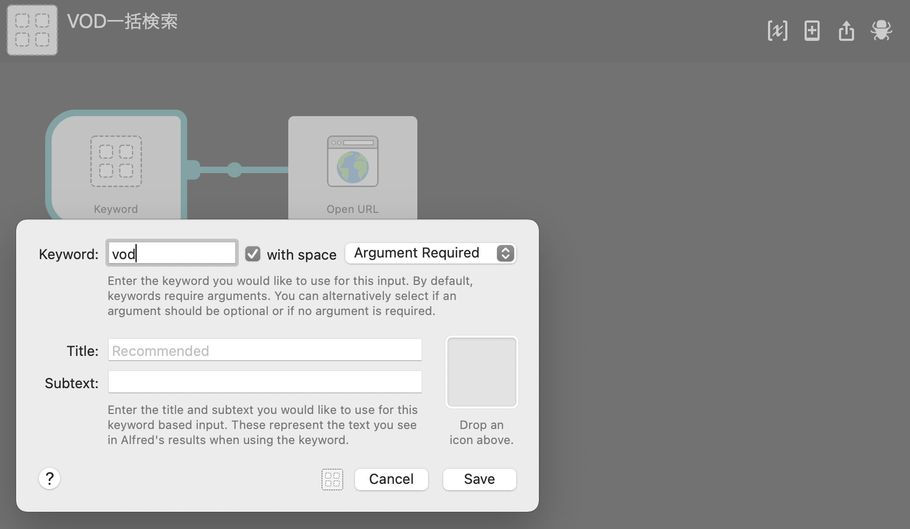

import EmbedCard from '@/components/Blog/EmbedCard.astro';

## 什么是 Alfred
<EmbedCard
    url="https://www.alfredapp.com/"
    title="Alfred - Productivity App for macOS"
    site="www.alfredapp.com" />

是 Mac 上很受欢迎的启动器应用。最主要的功能是,通过快捷键唤出搜索框,在里面输入应用名或文件名就能快速启动它们。和 [BetterTouchTool](https://folivora.ai/) 以及 [Keyboard Maestro](https://www.keyboardmaestro.com/main/) 一样,都是 Mac 上极其经典的工作效率化应用。

由于它和 Mac 默认自带的 [Spotlight 搜索](https://support.apple.com/ja-jp/HT204014) 功能基本上是同一个理念,所以一般会用它来代替 Spotlight。

很多用户其实只用了它的搜索功能,但 Alfred 其实功能非常丰富,可以做各种各样的事情。

## 基本用法
这部分大家应该都比较熟悉,如果已经在用了可以直接跳过。

### 启动
通过 `⌥ Space` 之类的快捷键唤出搜索框。当然快捷键也可以自定义。基本上所有功能都从这个框里执行。

### 搜索应用
输入应用名进行搜索,即可快速启动。一般输入前 1~2 个字符就能立刻找到。

### 搜索文件・目录
先输入 `Space` 或 `'`,即可进入文件搜索模式。

在这个状态下输入文件名或目录名,就能快速打开目标文件。

### 网页搜索
输入找不到匹配结果的关键字时,Alfred 会启动默认浏览器,通过 Google 帮你搜索。

### 搜索浏览器书签
按下 `b` 然后输入文字,就能搜索默认浏览器的书签并快速打开。

### 计算器
输入数字就能进行计算。按 Enter 后结果会自动复制,非常方便。

### 执行系统命令
输入 `sleep`、`restart`、`emptytrash` 之类的命令,可以重启 Mac 或清空回收站等。还能完成下图中的各种系统操作。

### 执行 Terminal 命令
先输入 `>`,再输入 Zsh 命令,就会启动终端并执行该命令。要启动的终端应用可以在设置中指定。

### 设置
Alfred 是一个不定制就玩不出花样的应用,所以经常需要打开设置界面。在搜索框显示的状态下输入 `⌘,` 是最快的方式。

也可以在搜索框输入「al」选择 `Show Alfred Preferences`,或点击 Mac 状态栏的图标来打开。

## Powerpack
[Alfred Powerpack - Take Control of Your Mac and macOS](https://www.alfredapp.com/powerpack/)

这是 Alfred 的付费方案。买断制,但分两种:仅在特定版本可用的方案,以及永久免费升级的终身授权。

价格在 7,000 日元出头,虽然不算便宜,但完全值得购买。下面主要介绍付费版的功能,有需要的话不妨考虑入手。

说实话,如果只用免费版,感觉用 Mac 自带的 Spotlight 就够了。

## Clipboard
这个功能极其方便。光为了它就值 7,000 日元。

它能把 Mac 上复制过的历史以列表形式列出,让你重新粘贴。光做这件事的同类应用有不少,我之前也用过 [Paste](https://apps.apple.com/jp/app/paste-clipboard-manager/id967805235),不过我觉得 Alfred 这个更好用。

通过 `⌘⇧V` 等快捷键即可调出,随时查看复制历史。不仅是文字,**图片的复制历史**也会被保存。

用上下方向键选中要再次粘贴的项目,按 `Enter` 就会粘贴。如果复制时是 Word 或 HTML 格式,会带格式粘贴,但按 `⇧Enter` 也能仅以纯文本形式粘贴。

在该状态下输入关键字,就能搜索复制历史。输入 Image 还会列出复制过的图片清单。

另外,经常需要粘贴的内容可以在设置的 Features→Snippets 里保存下来。我会保存设计中常用的占位文本、DNS 地址等。

## Appearance
Alfred 是个非常优秀的应用,但默认的搜索框样子真的丑得离谱,完全没法直接用。

外观从颜色到边距都可以非常自由地设置。也可以下载并应用社区分享的 Theme。

* [Alfred Theme - Glass--dark](https://www.alfredapp.com/extras/theme/jlgqHifMRw/)
* [Alfred Theme - Smoke](https://www.alfredapp.com/extras/theme/AUkf1A6h2G/)

## Web Search
让你能在 Alfred 中随时直接搜索特定网站。

更准确地说,这是 **基于输入的关键字打开对应 URL** 的功能。

很多网站的搜索关键字都包含在 URL 里,这个功能就是基于这个前提的。比如在 YouTube 搜索「游戏实况」时,URL 是这样的:
> <pre>https://www.youtube.com/results?search_query=游戏实况</pre>

把这个 URL 中关键字部分替换为 `{query}` 来设置,就可以快速执行搜索:
> <pre>https://www.youtube.com/results?search_query={query}</pre>

举一反三的话,还可以快速用 DeepL 翻译。

> <pre>https://www.deepl.com/translator#ja/en/{query}</pre>

## Workflow
Workflow 是给 Alfred 添加各种功能的插件。可以自己制作,也能免费获取大量社区作者制作的功能。

例如 [可以搜索表情符号并快速复制的 Workflow](https://github.com/meyer/alfred-emoji-workflow) 等等,种类繁多。

老实说 Workflow 已经有很多人介绍过了,而且不同岗位需要的也不一样,直接搜索「[设计师 Alfred 推荐](https://www.google.com/search?q=设计师+Alfred+推荐)」「[工程师 Alfred 推荐](https://www.google.com/search?q=工程师+Alfred+推荐)」之类的关键字会更合适。

### 制作一个能在多个网页中同时搜索的 Workflow
Workflow 的制作有时需要编程知识,这里介绍一种简单又推荐的搜索类 Workflow 做法。

上面介绍的「Web Search」功能很方便,但一次只能在一个网站上执行搜索。做成 Workflow 的话就能满足「**想在素材网站上一次性搜索免费素材**」「**想同时在多个电商网站搜索商品**」之类的需求。

下面以「在多个 VOD 服务上同时搜索」的 Workflow 为例介绍做法。

1. 在 Alfred 设置界面打开「Workflow」,点击左下角的 `+` 按钮。依次选择 `Templates→Web and URLs→Open custom URL in specified browser`。

2. 打开 Workflow 新建页面,适当填写信息。必填的只有 Name,起一个好认的名字即可。

3. 双击创建出来的模块中的 `Keyword`。这里设置用来调用此 Workflow 的英文关键字。

4. 接着设置执行时要打开的网站。双击 `Open URL` 模块,和 [Web Search](#web-search) 一样地配置搜索 URL。

5. 这次想打开多个网站的搜索页,所以复制 `Open URL` 模块。点击选中后用 `⌘C`→`⌘V` 复制粘贴。双击复制出来的模块,设置另一个 URL。

6. 从 `Keyword` 拖动连线到新复制出来的 `Open URL`。

7. 想打开多少个网站,就建多少个 `Open URL`,这样就完成了。可以使用刚才设置的 Keyword 来执行。

8. 执行后会一口气在浏览器里搜索全部网站。超级方便。

## 推荐设置

### Advanced→Force Keyboard
设为 `Alphanumeric` 后,启动 Alfred 时一定会切到英文输入。Alfred 的 Keyword 都是英文,启用这个就不用每次切换输入法,稍微更轻松。

### Advanced→Syncing
可以把设置文件保存到 Dropbox 或 Google Drive 同步。

## 没介绍到的其他功能
Alfred 的功能其实还有很多,大家爱用的功能也因人而异。我自己几乎不用,但下面这些功能,有些人用起来可能很方便:

* 与 1Password 联动
* 控制 Apple Music
* 搜索通讯录或词典

之类的。除此之外,还有让 iPhone 远程控制 Mac 的 [Alfred Remote](https://www.alfredapp.com/remote/) 功能等等。

各位可以多尝试,享受顺手的 Alfred 生活。

完
