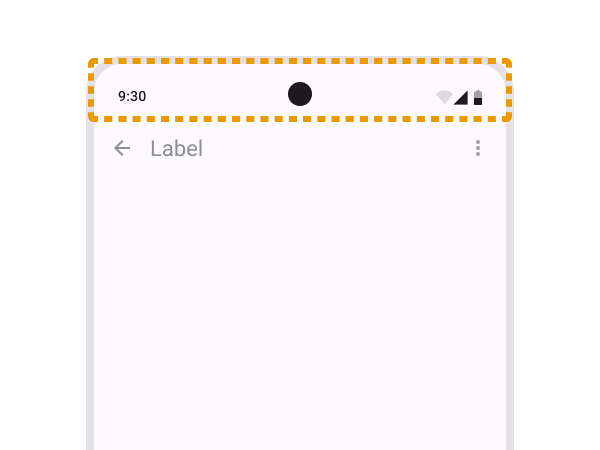
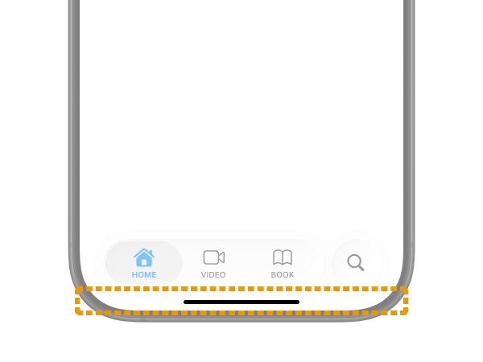
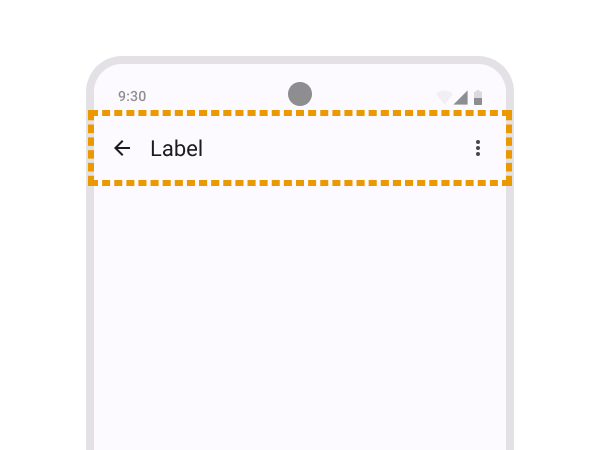
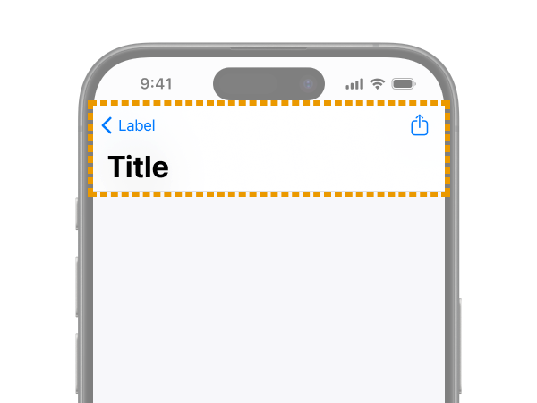
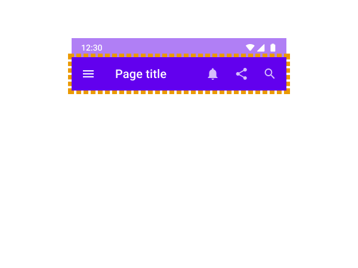
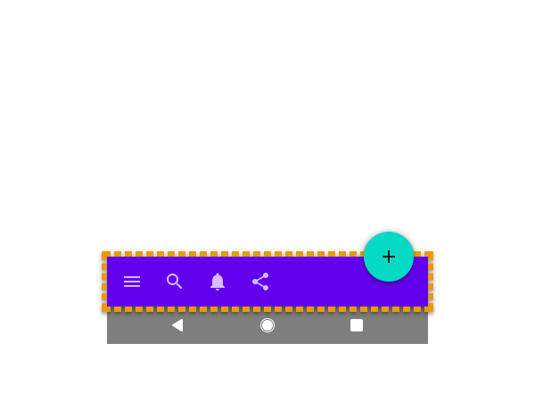
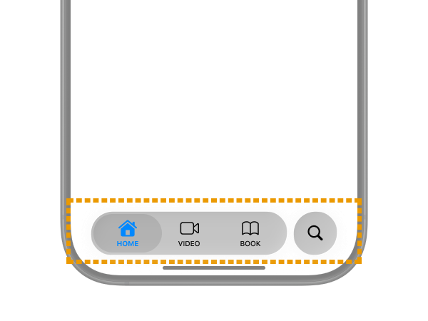
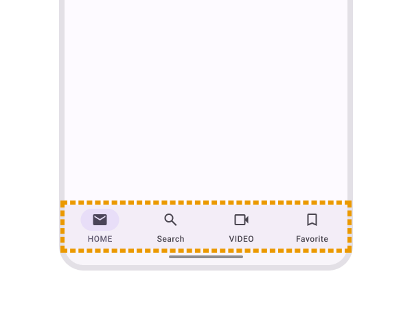
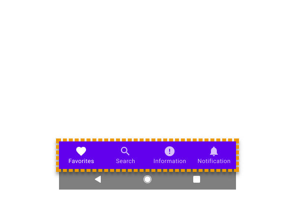

import EmbedCard from '@/components/Blog/EmbedCard.astro';

## 背景

移动应用中存在大量带 **Bar** 的 UI,如 `Tab bar`、`Toolbar`、`Status bar`、`Menu bar`、`Navigation bar`、`Sidebar`、`App bar`、`Gesture bar` 等等。

你是否清楚这些 UI 分别指什么、它们的目的与限制?以及在 iOS 和 Android 上,**同一个名字可能指向不同的 UI、行为也不同**这件事,你是否了解?

另外 2025 年 [OS26 的发布](https://www.apple.com/jp/newsroom/2025/06/apple-introduces-a-delightful-and-elegant-new-software-design/) 和 [Material 3 Expressive 的发布](https://m3.material.io/blog/building-with-m3-expressive) 之后,这些名称又都被悄悄地改过了,你知道吗?

本文目的是从总体上一览这些 UI,所以建议设计师和工程师们认真阅读官方规范。官方的 Figma 文件整理得也很清楚,推荐看一下,对于「这种外观叫这个名字」的对应关系会一目了然。

* Apple
    * [人机界面指南 | Apple Developer Documentation](https://developer.apple.com/jp/design/human-interface-guidelines/)
    * [iOS and iPadOS 26 | Figma](https://www.figma.com/community/file/1527721578857867021)
* Google
    * [Material Design 3 - Google's latest open source design system](https://m3.material.io/)
    * [Material 3 Design Kit | Figma](https://www.figma.com/community/file/1035203688168086460)

## 各部位的名称汇总

下面整理 Bar 系 UI 各部位的名称与外观。各名称尽量附上官方文档链接,但 iOS 早期文档已不存在,所以没有链接。

### 操作系统最顶部的 Bar UI

|  | iOS | Android |
| :--: | :--: | :--: |
| 当前 |    [Status bar](https://developer.apple.com/design/human-interface-guidelines/status-bars) |     [Status bar](https://developer.android.com/design/ui/mobile/guides/foundations/system-bars#status-bar) |
| 以前 |    名称未变 |     [名称未变](https://m2.material.io/design/platform-guidance/android-bars.html#status-bar) |

这个比较好理解。是显示时间、网络、电量等系统状态的系统级 UI。

基本上开发侧能定制的部分很少。如果是视频播放器或游戏应用想全屏显示,可以将其隐藏。

### 操作系统最底部的 Bar UI

|  | iOS | Android |
| :--: | :--: | :--: |
| 当前 |    Home indicator |     Gesture bar ※[官方 Figma](https://www.figma.com/community/file/1035203688168086460) 中的称呼 |
| 以前 |    名称未变 |     [Android navigation bar](https://m2.material.io/design/platform-guidance/android-bars.html#android-navigation-bar) |

是用来回到操作系统主屏幕、切换应用的系统 UI。和 `Status bar` 一样,开发者通常不太需要考虑它。

`Home indicator` 的官方指南我没找到,但在面向开发者的文档([例如这里](https://developer.apple.com/documentation/uikit/uiviewcontroller/prefershomeindicatorautohidden))和用户帮助里经常出现这个名称。

在 Android 中,它和 `Status bar` 合称为 `System bar`。`Gesture bar` 这个名字其实并没有出现在官方指南中,目前 Google 的部分文章里仍然写作 `Navigation bar`。但在 Material Design 3 中,`Navigation bar` 已经指代后面会讲到的 Tab UI,所以这种用法以后会逐渐变成错误。

### 应用内顶部的 Bar

|  | iOS | Android |
| :--: | :--: | :--: |
| 当前 |    [Toolbars](https://developer.apple.com/design/human-interface-guidelines/toolbars) |     [App bars](https://m3.material.io/components/app-bars/overview) |
| 以前 |    Navigation bar |     [App bars: top (Top app bar)](https://m2.material.io/components/app-bars-top) |

用于在应用内显示当前位置、放置返回上一屏按钮的 Bar。Web 世界里通常被称为 `Header` UI。

这个最难、也最容易混淆。请和接下来要讲的「应用内底部的 Bar」一起对照看。

在 iOS 中,`Navigation bar` 原本是这种 UI 的正式名称,但在 OS26 的 HIG 更新中,顶部和底部都被 **合并** 进了 `Toolbars`。不过 HIG 中也有这样的描述:

> In iOS, a navigation-specific toolbar is sometimes called a navigation bar.

所以继续把顶部 Bar 叫做 `Navigation bar` 也并不算错。大概是因为大量文档和 API 中还残留着这个名字吧,真是让人困惑。

而在 Android 上 **正好相反**:之前顶部和底部都叫 `App bar`,现在被 **拆分** 为顶部叫 `App bar`、底部叫 `Toolbar`。啊真乱……

### 应用内底部的 Bar

|  | iOS | Android |
| :--: | :--: | :--: |
| 当前 |    [Toolbars](https://developer.apple.com/design/human-interface-guidelines/toolbars) |     [Toolbars](https://m3.material.io/components/toolbars/overview) |
| 以前 |    名称未变 |     [App bars: bottom (Bottom app bar)](https://m2.material.io/components/app-bars-bottom) |

是对当前页面执行某种操作的 Bar,出现频率较低。Web 世界里常被叫做 `Footer` UI。

它和接下来要讲的「全局导航的 Tab Bar」位置相同、外形相似,但属于明确不同的 UI。

### 全局导航的 Tab Bar

|  | iOS | Android |
| :--: | :--: | :--: |
| 当前 |    [Tab bars](https://developer.apple.com/design/human-interface-guidelines/tab-bars) |     [Navigation bar](https://m3.material.io/components/navigation-bar/overview) |
| 以前 |    名称未变 |     [Bottom navigation](https://m2.material.io/components/bottom-navigation) |

好的,`Navigation bar` 这个名称又出现了。在 Android 上,以后底部的 Tab UI 才叫 `Navigation bar`。

iOS 这边长期以来都叫 `Tab bars`,名字没变。但最近行为和外观更新得比较频繁,让开发者头疼。OS26 中如图所示变成了玻璃质感,布局也变成浮动 + 可变形。

<small class="reference">
    参考: <a href="https://www.apple.com/jp/newsroom/2025/06/apple-introduces-a-delightful-and-elegant-new-software-design/" target="_blank">Apple 发布令人愉悦且优雅的全新软件设计 - Apple</a>
</small>

### 用于通知的 Bar

|  | iOS | Android |
| :--: | :--: | :--: |
| 当前 | 无 |     [Snackbar](https://m3.material.io/components/snackbar/overview) |
| 以前 | 无 |     [名称未变](https://m2.material.io/components/snackbars) |

是 Material Design 中定义的、会自动消失的通知 UI。一般也常被叫做「Toast」UI,但在 Android 中 **OS 显示的错误 UI 也叫 `Toast`,有时会作区分**,需要注意。

[Toasts overview  |  Android Developers](https://developer.android.com/guide/topics/ui/notifiers/toasts)

Apple 没有在 Native 层面提供这种 <b>会自动消失</b> 的 Toast 类通知 UI。但很多应用会自定义出类似的 UI,通常按惯例称为 `HUD` (Head Up Display) 或 `Toast`。iOS 原生的通知 UI 包括 [Alerts](https://developer.apple.com/design/human-interface-guidelines/alerts)、[Action sheets](https://developer.apple.com/design/human-interface-guidelines/action-sheets) 等。

## 番外篇: 其他还有哪些带 Bar 的 UI
之前主要介绍的是手机上的 UI,加上 **iPad**OS 还会有更多。

### Sidebar

<EmbedCard
    url="https://developer.apple.com/design/human-interface-guidelines/sidebars"
    img="https://developer.apple.com/tutorials/developer-og.jpg"
    title="Sidebars | Apple Developer Documentation"
    site="developer.apple.com" />

和 `Tab bar` 类似,是用于在应用内不同板块间切换的导航 UI。在 iPadOS 中推荐 `Tab bar` 显示在顶部,或者直接换成 `Sidebar`。也可以将 `Tab bar` 与 `Sidebar` 整合实现,让用户可以切换使用。

https://developer.apple.com/design/human-interface-guidelines/tab-bars#iPadOS

`Sidebar` 主要面向 iPadOS、macOS、visionOS 使用,**在 iOS(iPhone) 上不被推荐,需要注意**。在 iOS 上有相同目的时,使用 `Tabbar` 或 [Sheet](https://developer.apple.com/design/human-interface-guidelines/sheets) 更合适。

Android 中类似上下文使用的有 [Navigation drawer](https://m3.material.io/components/navigation-drawer/overview)、[Navigation rail](https://m3.material.io/components/navigation-rail/overview)、[Side Sheets](https://m3.material.io/components/side-sheets/overview) 等。它们的名字里都没有 `Bar`。

### The menu bar

<EmbedCard
    url="https://developer.apple.com/design/human-interface-guidelines/the-menu-bar"
    img="https://developer.apple.com/tutorials/developer-og.jpg"
    title="The menu bar | Apple Developer Documentation"
    site="developer.apple.com" />

显示在屏幕最顶部、应用 **外** 的横向贯穿型菜单 UI。在 macOS 或 Windows 的桌面应用中是经典存在。从 iPadOS26 开始,所有应用在 iPad 上也都会显示。

Android(或者说 Material Design)的 [Menu](https://m3.material.io/components/menus/guidelines#9a6467a3-ad1f-4975-a122-73cdd45dc8e6) 中也会有类似用法的画面。

由于这是 **以鼠标操作为前提** 的 UI,在手机尺寸上基本不需要考虑。

## 结尾
如果有疑问或指正,请通过 [X](https://x.com/psephopaiktes) 等渠道联系我。

最后顺便复习一下,`Navigation bar` 是指:
* 在 Apple 系操作系统中,是应用顶部的 Header UI(※不过这是过去沿用的称呼,当前正式名称是 `Toolbars`)
* 在 **当前的** Android 系统中,是应用底部的 Tab UI
* 在 **以前的** Android 系统中,是用来回到主屏幕的系统 UI(※但仍有部分官方资料还在使用这个名称)

就是这样。太难了。
