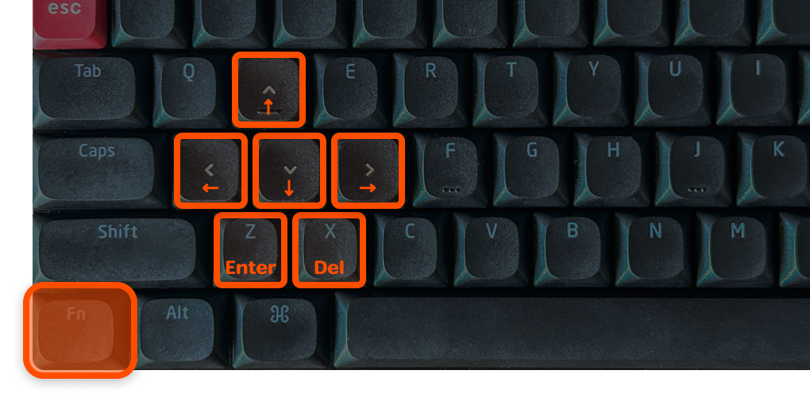
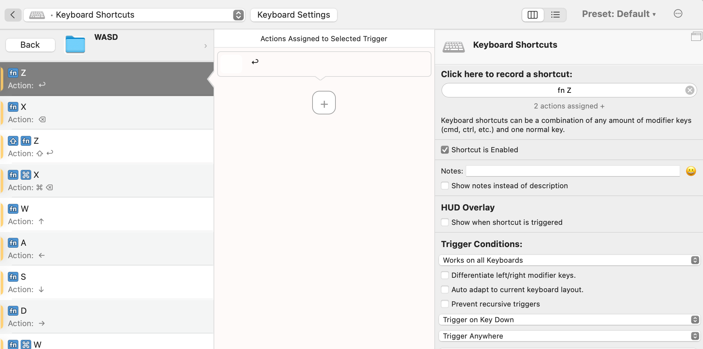
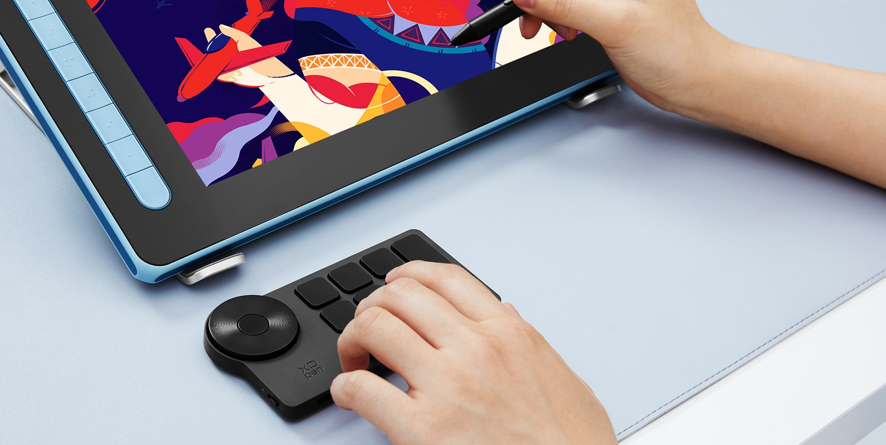
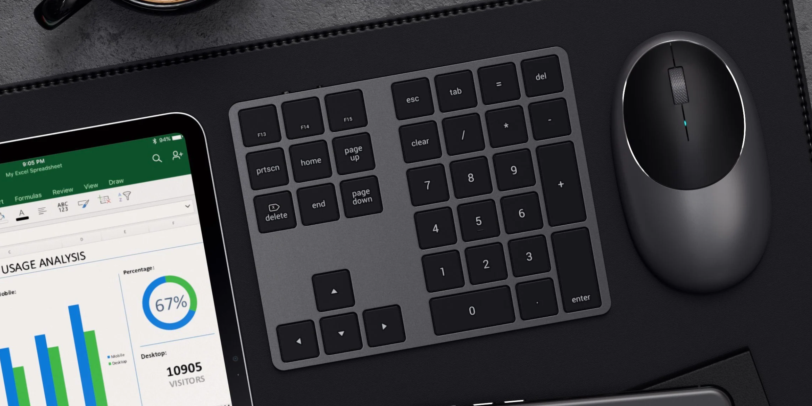
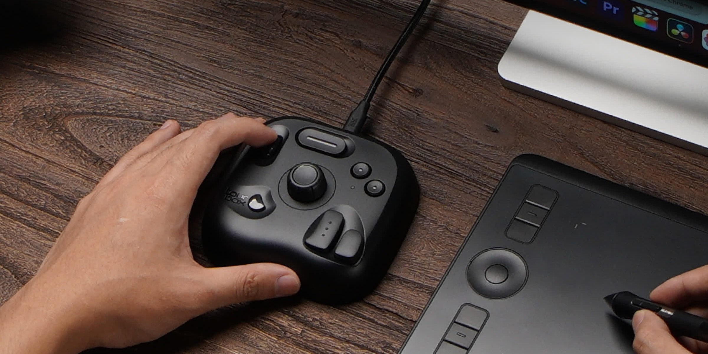

import EmbedCard from '@/components/Blog/EmbedCard.astro';

这是一篇面向以下人群的工作效率化文章:

* 用右手握鼠标工作的人
* 尤其是经常使用 Figma 或 Adobe 系等软件的人
* 正在考虑入手所谓「左手设备」的人

## 用鼠标时,常用的关键键位都太远了

在 Figma 或 Adobe 系的设计软件中,以下这些键的快捷键使用频率非常高:

* Enter
* Delete
* 上下左右(方向)键

此外在 Office 类软件、视频播放过程中等各种场景里,这些键也都用得很多。然而这些键都被排在了键盘的 **右侧**。所以,在使用鼠标时,无论是用右手还是左手按,这些键都不好按,手要移动的距离都太远,效率非常糟糕。

<small>无论从左还是从右都太远!</small>

而且这对圆肩和腱鞘炎也很不友好。除了输入文字时之外,理想状态是:右手一直握着鼠标,左手保持在键盘左侧的位置不动。所以本文将如标题所说,介绍 **能轻松按到右侧键位的解决方案**。

## 解决方案 1:让键盘的左侧也能按到主要键位

我用的就是这个方法。我把它设置成:按住 `Fn` 键的同时按 `W`、`A`、`S`、`D` 等键,可以触发方向键或 Enter 键。

我做了下图这样的设置,使用极其顺手。各种快捷键都可以仅用左手完成。我连键帽都换成更直观的样式了。

我还把 `Q`、`E`、`C` 等键也设置成了 Figma 中常用的键。要实现这点有以下两种方式。

### 在硬件上设置
使用可自由更改键位映射的键盘。我用的 [Keychrone](https://amzn.to/3VWQLEn) 采用 VIA 方式,改起来非常简单。

### 在软件上设置
使用可自由更改键盘快捷键的常驻软件。Mac 上经典的有 [BTT](https://folivora.ai/) 或 [Keyboard Maestro](https://www.keyboardmaestro.com/main/)。在外出没有外接键盘时,也能享受同样的功能。

我准备了一份自己使用的 BTT 设置预设,有兴趣的话可以下载在 BTT 中导入使用。

<a class="download" href="/download/WASD.bttpreset" download="WASD.bttpreset">WASD.bttpreset</a>

 
## 解决方案 2:让鼠标也能触发主要键位

这是设计师宫泽先生和长藤先生从很早就在介绍的方法。两位都把 Enter、Delete、方向键都设置成可以仅用鼠标触发。配图非常清晰易懂。

<blockquote class="twitter-tweet">
使いやすさを模索しながら随時アップデートしてるマウスのボタンのデフォルト設定。現在はこんな感じ。 さらに、アプリごとにボタンの割り振りを変えてます。 (Logicool G604 と SteerMouse を使用) <a href="https://t.co/S0datz4B5i">pic.twitter.com/S0datz4B5i</a>
&mdash; 宮澤聖二|三階ラボ (@onthehead) <a href="https://twitter.com/onthehead/status/1623967176163201026?ref_src=twsrc%5Etfw">February 10, 2023</a></blockquote> 

<blockquote class="twitter-tweet">
マウスにReturn, Delete, カーソルキーを割り振るとめっちゃ作業がはかどりますよ〜! <a href="https://twitter.com/hashtag/steermouse?src=hash&amp;ref_src=twsrc%5Etfw">#steermouse</a> <a href="https://t.co/Jo3TE2Xb5f">pic.twitter.com/Jo3TE2Xb5f</a>
&mdash; 長藤寛和 (@kanwa) <a href="https://twitter.com/kanwa/status/1024857936323960833?ref_src=twsrc%5Etfw">August 2, 2018</a></blockquote> 

我自己也用多按键鼠标,但更多是分配给浏览器操作类的手势,所以没有采用这种方案。(另外个人觉得用鼠标按键来输入键不太直观。)

## 解决方案 3:使用左手设备

世面上有很多 **左手设备**,被很多创作者所喜爱。这是放在键盘左侧使用的扩展设备,通常每个键都能自定义快捷键或功能。

在 iPad 或数位屏上画画的画师中尤其常见。我个人不喜欢的原因是会让桌面变乱,而且 `⌘⌫` 或 `⇧←` 这种与其他键组合的快捷键会很难按。左手的移动也会变多。

下面介绍一些我考察过的设备。

### 所谓的「左手设备」
我考察过几款外观不错的:

* [XPPen](https://amzn.to/3JbBNCU)
* [HUION](https://amzn.to/3vOvzFX)
* [Razer Tartarus V2](https://amzn.to/4aSe6vj)
* [YesWord X-20](https://amzn.to/4apPqu8)

<small class="reference">
    参考: <a href="https://www.xp-pen.jp/product/1369.html" target="_blank">XPPen</a>
</small>

### 带方向键的数字小键盘
入门门槛低,推荐先尝试。也能用左手敲数字,所以经常用 Excel 的人可能会喜欢。

* [Cateck](https://amzn.to/4apPwSw)
* [Satechi](https://amzn.to/49uv5Tm)

<small class="reference">
    参考: <a href="https://satechi.net/products/bluetooth-extended-keypad" target="_blank">SATECHI</a>
</small>

### Stream Deck 系
是直播主们的常用键盘,但配置一下当然也能当作数字键盘或方向键来用。是否好用见仁见智,但还能干别的事,因人而异可能会喜欢。

* [Stream Deck MK.2](https://amzn.to/4aQRVFx)
* [Loupedeck Live S](https://amzn.to/49uZNf8)

参考: [【Loupedeck Live S】初学者使用后觉得方便的设置介绍](https://jagadget.com/loupedecklives/#toc7)

<small class="reference">
    参考: <a href="https://www.elgato.com/jp/ja/p/stream-deck-plus-black" target="_blank">Elgato</a>
</small>

### 蓝牙手柄
主要面向插画师,可能和本文的使用场景略有不同。

* [TourBox Lite](https://amzn.to/4cNDEvh)
* [Clip Studio Tabmate 2](https://amzn.to/3xw9fBA)
* [8BitDo Micro](https://amzn.to/43V7r14)

8BitDo Micro 本身是游戏手柄,但从更早的型号起就在 iPad 画师中极其受欢迎。

<small class="reference">
    参考: <a href="https://www.tourboxtech.com/jp/" target="_blank">tourbox</a>
</small>

### 自制
自己动手做就能解决一切,外观和功能都自由可控。门槛较高。

<EmbedCard
    url="https://hoshinotabibito.com/hidarite-device-for-ipad/"
    img="https://hoshinotabibito.com/wp-content/uploads/2020/10/ipad-hidaritedeviceforipad-eyecatch.png"
    title="【iPad 左手设备】也能用于 procreate!自制键盘的推荐!| 星ノ旅ビト"
    site="hoshinotabibito.com" />
