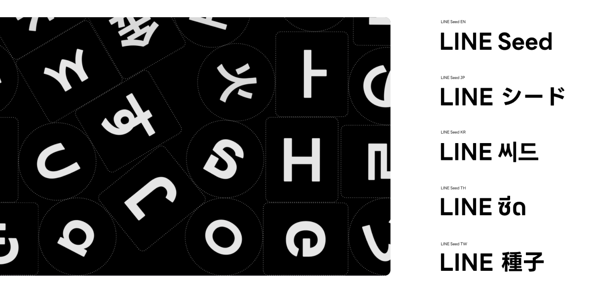

import EmbedCard from '@/components/Blog/EmbedCard.astro';

我做了一个用于多语言站点的 OSS 启动模板,并已经公开。

<EmbedCard
    url="https://astro-i18n-starter.pages.dev/"
    img="https://astro-i18n-starter.pages.dev/ogp.png"
    title="Astro i18n Starter"
    site="astro-i18n-starter.pages.dev" />

在这个项目里,默默纠结过的一个问题就是字体怎么选。多语言网站常常会在同一个页面里混合日语、英语、中文等内容,所以字体选择的标准会和普通网站有所不同。

下面整理一下我考虑过的候选,以及最终选定的字体。


## 交给系统字体

说实话,这是最省事的方案。

访问网站的用户设备里自然会装着本国语言的字体,所以只要在 CSS 的 `font-family` 里排好各 OS 的标准字体,各个环境就会显示合适的字形。Web 字体的下载成本也是零。

```css
font-family: -apple-system, BlinkMacSystemFont, system-ui, sans-serif;
```

只不过,这样也可能出现意料之外的字形样式,品牌一致性也很难体现。


## Alibaba Sans (本站采用)

<EmbedCard
    url="https://www.alibabafonts.com/#/home"
    img=""
    title="阿里巴巴普惠体"
    site="www.alibabafonts.com" />

本博客最终采用的就是这款字体。这是 **阿里巴巴免费公开的多语言字体**,商用也免费。阿里巴巴是中国大型科技企业,近年来面向 B2B 平台等企业级业务的规模也很大。把这款字体免费提供给全世界,正是其企业品牌字体战略的一环。

这款字体最大的特征是 **覆盖语言数量极为压倒性**。以拉丁文为中心,**覆盖了 178 种语言**,中文 (简体・繁体)・日语 (平假名・片假名・汉字)・韩语自不必说,阿拉伯语・谚文・泰语・孟加拉语等,亚洲地区的主要语言基本上都有覆盖。

作为字体本身,**独特的 R (圆角)** 在所有语言中都保持一致地使用,是它的特色。无论是汉字还是拉丁文,字角处理都很统一,所以即便切换页面显示语言,也完全不会有"字体换了一种"的违和感。


实际在这个网站上切换显示语言,应该能感受到字体的一致性。欢迎试一试!


## Noto Sans

<EmbedCard
    url="https://fonts.google.com/noto"
    img="https://www.gstatic.com/images/icons/material/apps/fonts/1x/catalog/v5/opengraph_color.png"
    title="Noto - Google Fonts"
    site="fonts.google.com" />

多语言 Web 字体的 **王道** 是 Noto Sans。这是 Google 和 Monotype 共同开发、专为 Web 制作的庞大字体家族。


名字的由来是 "**No Tofu**",也就是 **"让豆腐 (=文字显示不出时出现的白色方块) 从世界上消失"** 这一宏大的目标。如今已经覆盖 **超过 150 种书写体系・1,000 多种语言**,真的是朝着 "用一种字体显示地球上一切文字" 的目标进发的项目。

许可证是 SIL Open Font License,商用当然免费。不知道选什么的时候,选它就准没错。不过也正因为 **过于经典**,反而很难做出特色。还有 **Serif 字体** 的 [Noto Serif](https://fonts.google.com/noto/specimen/Noto+Serif) 可以选,这点也让人开心。

顺带一提,日语版叫 `Noto Sans JP`,简体中文版叫 `Noto Sans SC`,是按语言分成不同字体家族提供的。通常的做法是从 Google Fonts 按语言分别加载。


## LINE Seed

<EmbedCard
    url="https://seed.line.me/index_jp.html"
    img="https://seed.line.me/src/images/favicon/ogTag.jpg"
    title="LINE Seed"
    site="seed.line.me" />

这是 LINE Yahoo 公司作为自家企业字体公开的字形。日语版 `LINE Seed JP` 最近也在 Google Fonts 上免费公开,可以商用了。

> [LINE Yahoo 在 Google Fonts 上开始提供企业字体「LINE Seed JP」| LINE Yahoo 株式会社](https://www.lycorp.co.jp/ja/news/release/020040/)

支持的语言有 **日语・英语・韩语・繁体中文・泰语** 五种,可以看出是基于 LINE 在亚洲地区业务的考量。<b>简体中文</b>没有支持,有点遗憾……

字形带有 **略微圆润、亲切的氛围**,很适合 UI 类・社交类的场景。因为是 LINE 品牌统一打造所有语言版本,所以各语言之间的调性一致性相当出色。



许可证是 SIL Open Font License 1.1,条件比较宽松,但说到底它是 **LINE 这家企业的企业字体**,所以使用场景还是要稍微挑一挑。


## 总结

简单整理一下大致如此:

- 追求轻量・实装成本 → **系统字体**
- 语言覆盖广度与设计一致性 → **Alibaba Sans**
- 王道、不想纠结 → **Noto Sans**
- 亲切感・偏现代 UI → **LINE Seed**

本博客最终选了 Alibaba Sans。想要覆盖的语言可以用一种字体搞定,而独特的外观也和博客的整体调性吻合,这是决定性因素。

从网站菜单切换语言,就能一眼看出字体在各语言下的呈现效果。感兴趣的话欢迎试试。
