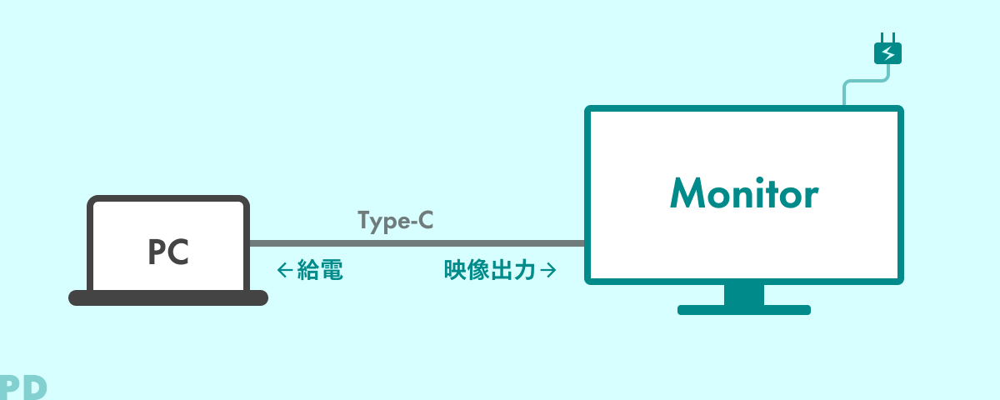
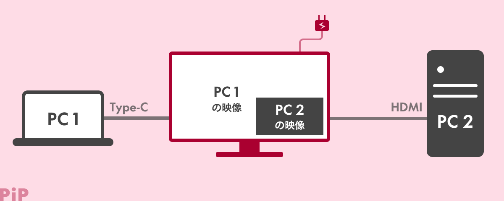
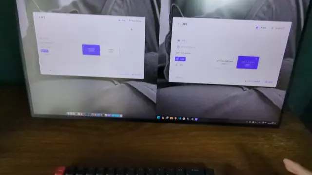
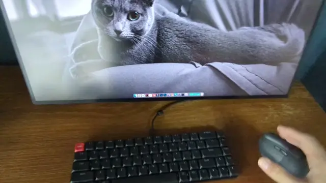
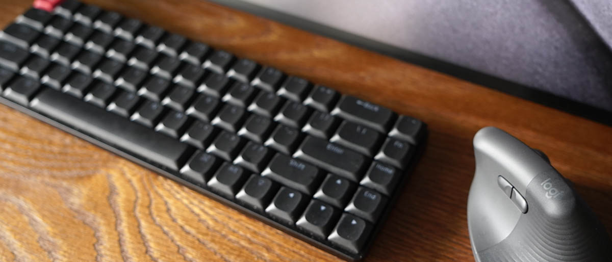
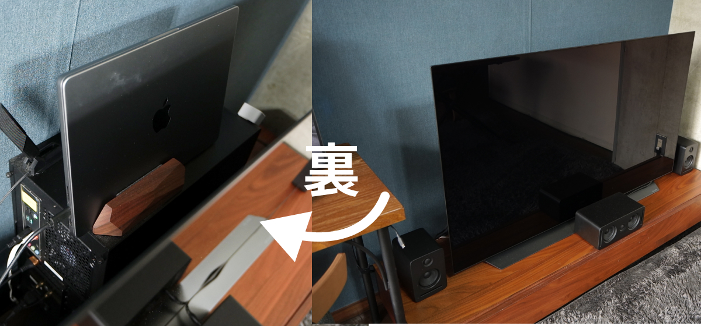
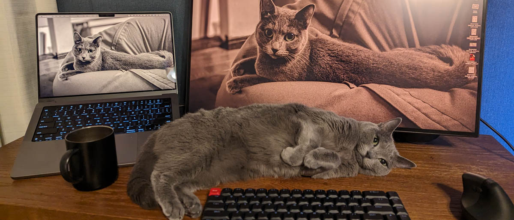

import EmbedCard from '@/components/Blog/EmbedCard.astro';

## 背景：最近换了新显示器

我用了将近 5 年的 [LG UltraFine 4K](https://www.lg.com/jp/monitors/4k-5k-monitors/24md4kl-b/) 显示器最近开始出现噪点，于是公司给我换了一台新显示器。

之前那台显示器是为 Mac 完全优化的，用起来确实很方便。但最近因为工作的关系，经常需要连接 STB 设备（Google TV、Fire TV）或 Windows PC，所以这次我选了一台更适合多设备使用的显示器。

我以以下规格为基准，挑选外观也不错的显示器：

- 4K 以上
- 16:9 时不超过 27 英寸 / 21:9 时不超过 34 英寸
- sRGB 99% 以上 或 DCI-P3 96% 以上、对比度 1000:1
- 支持 VESA 安装
- 外观：背面黑色、至少三边窄边框

虽然有点跑题不细写了，但挑选过程真的花了我相当多的时间……。

<blockquote class="twitter-tweet">
新しいPCディスプレイ買うために業務時間の大半を費やしてる<a href="https://t.co/rCSk0MWKQy">https://t.co/rCSk0MWKQy</a> <a href="https://t.co/5o6qfJHLa1">pic.twitter.com/5o6qfJHLa1</a>
&mdash; 平田 / U-NEXT (@psephopaiktes) <a href="https://twitter.com/psephopaiktes/status/1719912642717081990?ref_src=twsrc%5Etfw">November 2, 2023</a></blockquote> 

另外，多设备共用的显示器如果支持以下三个功能就非常方便：

1. **PD 供电 + USB-HUB 功能**
1. **PbP/PiP 功能**
1. **KVM 切换器功能**

### 本文中使用的显示器

虽然有几台候选机型也支持上述功能（文末会介绍），但最终我选择了外观最满意的 JAPANNEXT [JN-27IPSB4FLUHDR-HSP](https://jp.japannext.com/products/jn-27ipsb4fluhdr-hsp)。虽然没特意选游戏显示器但它是一台游戏显示器，四边窄边框、操作便利，我非常喜欢。

<EmbedCard
    url="https://amzn.to/3GwHsSN"
    img="https://ws-fe.amazon-adsystem.com/widgets/q?_encoding=UTF8&ASIN=B0CDB5XX86&Format=_SL250_&ID=AsinImage&ServiceVersion=20070822&WS=1"
    title="Amazon.co.jp: JAPANNEXT JN-27IPSB4FLUHDR-HSP 27 英寸 IPS BLACK 4K(3840x2160) 液晶显示器 四边窄边框 升降式支架 USB-C(最大 65W 供电) HDMI DP KVM 功能 sRGB100% DCI-P3 98%"
    site="amazon.co.jp" />

## 1. PD、USB-HUB 功能

这是近年来逐渐普及的功能，相信很多人都已经知道（不过游戏显示器中比较少见）。只需要用一根 Type-C 线连接笔记本电脑和显示器，就能实现：

* 给笔记本电脑供电
* 视频和音频输出
* 把显示器当作 USB Hub（连接有线网卡或 U 盘等）

只要一根线就能搞定，桌面会变得非常清爽。

本文不再展开细节。

参考：[只需一根线，连接清爽。EIZO USB Type-C 显示器 | EIZO 株式会社](https://www.eizo.co.jp/products/eizo_usbtype-c_monitors/index.html)

## 2. PbP/PiP 功能

当显示器同时连接两台 PC 时，可以将两台 PC 的画面<b>同时显示</b>在一块屏幕上的功能。

PbP（Picture by Picture）是将两个画面左右并排显示的功能；

PiP（Picture in Picture）则是将其中一个画面以小窗形式叠加显示在另一个画面之上的功能。请注意，很多显示器只支持其中之一。

虽然不是显示器自身的功能，但它和罗技鼠标的 [Logi Flow](https://www.logicool.co.jp/ja-jp/software/logi-options-plus.html) 功能搭配起来非常合适。

Logi Flow 可以在同一个 WiFi 网络下的多台 PC 之间共享鼠标光标，只要把光标移到屏幕的左右边缘，就能流畅地切换设备。下图是把 Mac 显示在左侧、Windows 显示在右侧（PbP），并使用 Logi Flow 操作的样子。

参考：[ASCII.jp：自动切换、复制粘贴超级方便，罗技新款鼠标搭载的"Flow"功能太强了 (1/3)](https://ascii.jp/elem/000/001/497/1497389/)

## 3. KVM 切换器功能

KVM 切换器原本是一种用于在多台 PC 之间共享鼠标、键盘、扬声器等外设的硬件切换装置。

<EmbedCard
    url="https://amzn.to/47HgJPb"
    img="https://ws-fe.amazon-adsystem.com/widgets/q?_encoding=UTF8&ASIN=B0BD4KX6WC&Format=_SL250_&ID=AsinImage&ServiceVersion=20070822&WS=1"
    title="Amazon.co.jp: UGREEN HDMI KVM 切换器 二进一出 共享键盘鼠标显示器 双 PC 用 4K@60Hz USB2.0 4 端口 切换器 HDMI2.0 专用 免驱 简单连接 桌面开关 & 附 USB 线"
    site="amazon.co.jp" />

而这个功能被内置到了显示器中。在显示器侧切换输入信号时，**鼠标和键盘会自动连接到所选的 PC**。与显示器的连接也**可以是 USB 无线**。在使用 KVM 功能之前，我一直觉得"鼠标键盘全部走蓝牙就行了"，但用过之后才感受到有线或 USB 无线连接的便利。

不过如果使用 HDMI 连接，就需要像图中那样另外连一根 USB 线。Type-C 线的话一根就够了。

下图是使用 KVM 切换器的样子。由于壁纸相同可能不太容易看清，但当显示器从 Mac 切换到 Windows 输入时，可以看到鼠标和键盘是直接可用的。

## 推荐的兼容显示器

顺便分享一下我最终入围的几款显示器。它们都拥有不错的外观（重点），并且都支持 PD、KVM，以及 PIP 或 PBP。

<small>※ 各机型的具体行为可能略有差异，请在购买前查阅官方网站确认。同时也务必确认接口数量是否满足需求。</small>

<EmbedCard
    url="https://amzn.to/3t635Gr"
    img="https://ws-fe.amazon-adsystem.com/widgets/q?_encoding=UTF8&ASIN=B0CC1WW2BR&Format=_SL250_&ID=AsinImage&ServiceVersion=20070822&WS=1"
    title="Amazon.co.jp: ASUS 4K 显示器 ProArt PA279CRV 27 英寸/IPS/三年无亮点保证/99% DCI-P3/99% Adobe RGB/USB-C PD 96W/色准 ΔE<2/VESA DisplayHDR 400/人体工学支架/日本国行正品"
    site="amazon.co.jp" />

<EmbedCard
    url="https://amzn.to/47Ho7u4"
    img="https://ws-fe.amazon-adsystem.com/widgets/q?_encoding=UTF8&ASIN=B0C1H25ZNZ&Format=_SL250_&ID=AsinImage&ServiceVersion=20070822&WS=1"
    title="Amazon.co.jp: PHILIPS 显示器 27E1N8900/11 (27 英寸/OLED/4K/HDMI 2.0x2、DisplayPort1.4x1、USB Type-Cx1 /USB3.2 端口 x4/可调俯仰/窄边框/可调高度（升降）、可旋转（竖屏）/防蓝光/AdobeRGB 99.6%)"
    site="amazon.co.jp" />

<EmbedCard
    url="https://amzn.to/3RqL7ry"
    img="https://ws-fe.amazon-adsystem.com/widgets/q?_encoding=UTF8&ASIN=B09VGGKZDZ&Format=_SL250_&ID=AsinImage&ServiceVersion=20070822&WS=1"
    title="Amazon.co.jp:【Amazon.co.jp 限定】Dell U2723QX 27 英寸 4K Hub 显示器（三年无亮点更换保证/IPS Black、防眩光/USB Type-C、DP、HDMI/窄边框/可旋转、升降/VESA DisplayHDR 400/Rec.709 100%）"
    site="amazon.co.jp" />

<EmbedCard
    url="https://amzn.to/3Nbz0vX"
    img="https://ws-fe.amazon-adsystem.com/widgets/q?_encoding=UTF8&ASIN=B0BR6F1F79&Format=_SL250_&ID=AsinImage&ServiceVersion=20070822&WS=1"
    title="Amazon.co.jp: BenQ AQCOLOR 系列 设计师人体工学显示器 4K 27 英寸 PD2705UA IPS/防眩光/广色域/HDR10/USB-C 65W 供电/HDMI/DP/KVM 功能/PIP・PBP/带扬声器（2.5W x2）/可调高度/可旋转/无频闪/防蓝光/显示器支架"
    site="amazon.co.jp" />

<EmbedCard
    url="https://amzn.to/3uMvYbe"
    img="https://ws-fe.amazon-adsystem.com/widgets/q?_encoding=UTF8&ASIN=B0CBMDH33B&Format=_SL250_&ID=AsinImage&ServiceVersion=20070822&WS=1"
    title="Amazon.co.jp: JAPANNEXT 34 英寸曲面 IPS 面板 UWQHD(3440 x 1440) 分辨率 超宽显示器 JN-IPSC34UWQHDR-C65W-H USB-C 供电（最大 65W）HDMI DP KVM 功能 sRGB99% 升降式支架"
    site="amazon.co.jp" />

另外，也可以在价格.com 上按这些功能筛选。

<EmbedCard
    url="https://kakaku.com/pc/lcd-monitor/itemlist.aspx?pdf_Spec013=1&pdf_Spec040=1&pdf_Spec041=1&pdf_Spec060=1&pdf_Spec066=1"
    img=""
    title="价格.com - PC 显示器・液晶显示器 比较 2023 年人气热销排行榜（USB PD、KVM 切换器功能（电脑切换））"
    site="kakaku.com" />

## 附：其他正在使用的设备一览

简单列出一下照片里出现的其他设备。

### 鼠标：[Logi Lift](https://amzn.to/41c0Ii3)

因为有腱鞘炎和圆肩问题就买了，超级好用。官方应用可以非常细致地自定义其行为。如前所述，它和 PbP 搭配使用很顺手，并且支持 USB 无线，KVM 场景下也很方便。

### 键盘：[Keychron K7 Pro](https://www.keychron.com/products/keychron-k7-pro-qmk-via-wireless-custom-mechanical-keyboard)

非常受欢迎的键盘，可以方便地修改布局，所以我自定义成了 Windows/Mac 都好用的设置。原配的键帽颜色我不喜欢，于是换成了[这款键帽](https://amzn.to/3R9jKkk)，文字部分透明、背光显示效果好，我很满意。

### PC：MacBook Pro & Windows 桌面

我努力把它们藏在了电视背后。乔布斯看到大概会发火吧。

理想情况下按上图这样摆放使用起来真的非常方便，

但因为有"猫位问题"只好放弃。
