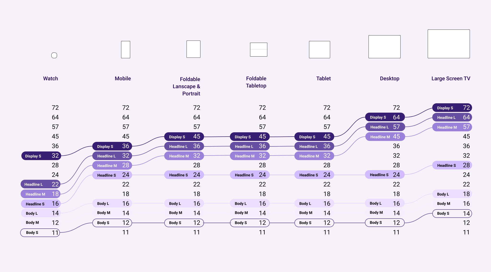
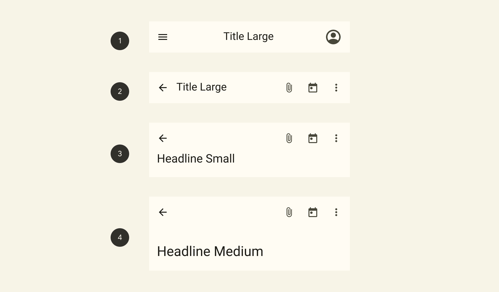

import EmbedCard from '@/components/Blog/EmbedCard.astro';

这是不久前发布的 Material Design 3 官方页面。

<EmbedCard
    url="https://m3.material.io/"
    img="https://lh3.googleusercontent.com/ycLf6lYhnFiUyNNo0VANuWxgsYMbx3lyrkbiXib9DJEKjfJhXDQcyQZeJsm-sxl4T8SsSez5zFOYAzlsNpCWAkzAKf6ZNfPKFMDOUW5Leiv8unhgjg"
    title="Material Design 3"
    site="m3.material.io" />

它并不是 [material.io](https://material.io/) 本身的更新，而是另起了一个新的 [m3.material.io](https://m3.material.io/) URL，所以看起来还不是正式版本。另外，[Google 官方的 Figma](https://www.figma.com/@materialdesign) 上也已经公开了 Material Design 3 的 UI Kit。

## Dynamic Color

<small>https://m3.material.io/foundations/customization</small>

这次定义了一项新的 **Dynamic Color**，会根据用户的壁纸来动态变化系统 UI 的颜色。具体哪种图片会得到怎样的配色，可以通过[官方工具](https://material-foundation.github.io/material-theme-builder/)上手体验，很容易理解。

### M3 颜色系统
Dynamic Color 不仅用于系统 UI，也可以用在自家应用里。它使用 M3 Color System 这套体系，将颜色作为 token 进行定义，让设计与实现可以基于同一套认知来管理颜色。色相由 Accent、Neutral、Error 等几组定义，每组又被划分为 13 级色调以便使用。

如果你正在用 Figma 进行 UI 设计，可以使用官方的 [Figma Plugin](https://www.figma.com/community/plugin/1034969338659738588) 直接基于 M3 颜色系统推进设计。

另外，虽然没找到详细文档，但应用图标本身似乎也能根据用户的自定义色动态变化。在 Pixel + Android 12 上，部分图标已经可以变化了。

## Adaptive Design

<small>https://m3.material.io/foundations/adaptive-design/overview</small>

从手机屏幕到平板、桌面，再到可折叠设备，以及它们的横竖状态，越来越要求 UI 设计能够无缝适配。这背后的原因主要是 Chromebook、Windows 11 对 Android 应用的支持，以及传闻中的 Pixel Fold 等等——Android 今后将在更多尺寸的屏幕上被使用。

由于大屏适配、折叠屏适配的内容比较多，我会另写文章介绍。

## Interaction states

<EmbedCard
    url="https://m3.material.io/foundations/interaction-states"
    img="https://lh3.googleusercontent.com/Ys3RRncgsuJT5SYNr5hJEUi1gq-ME_htiTHQfP_5vyzrOOWwVo7NJvwiGlpQ8DUBobilt6vpPsKFJ72sz7ET_Ycm5TX2LBsWOF6xvWHgKloYxoR6uQ"
    title="Interaction states – Material Design 3"
    site="m3.material.io" />

针对用户操作产生的交互状态，这次也有了更细致的定义。其实之前在 [Surfaces](https://material.io/design/environment/surfaces.html) 以及各组件页面里就有相关定义，但现在以更贴合 token 的形式进行讲解，便于在实现和设计上做统一管理。

## Typography
排版的种类被精简，整体更加简洁。和颜色一样，现在也可以通过 token 进行管理。此外还新增了能根据设备尺寸动态调整字号的 <b>Adaptive type scale</b>。

<small>https://m3.material.io/styles/typography/overview</small>

## Component
Floating Action Button、Bottom Navigation 等组件的样式整体都做了较大调整。前面提到的 Dynamic Color 被广泛采用，整体偏圆润的形状和柔和的配色用得很多。投影也减少了不少，UI 的层级关系更清晰了。整体样式变化很大，但大致看下来规则和用途好像没怎么变。（这也是当然的）

非要说的话，[Top App Bars](https://m3.material.io/components/top-app-bar/overview) 的种类增加了，使用起来更方便。随着设备屏幕越来越长，把顶部 UI 做大的需求也很高，这个变化挺让人感激。

<small>https://m3.material.io/components/top-app-bar/overview</small>

Material Design 的文档一如既往，对 UI 的使用场景和规则讲得清楚明了。

## 总结与个人感想
整体来看：

* 通过 token 提升可维护性
* 多设备的响应式适配

这两点似乎被特别强调。Dynamic Color 虽然吸睛，但感觉更像是顺带的彩蛋。

Android 12 能根据壁纸自动配色当然不错，不过个人来说还是更想自己挑选所有颜色来定制……。官方小部件也总是端出风格非常独特的设计，我也挺难受的。
