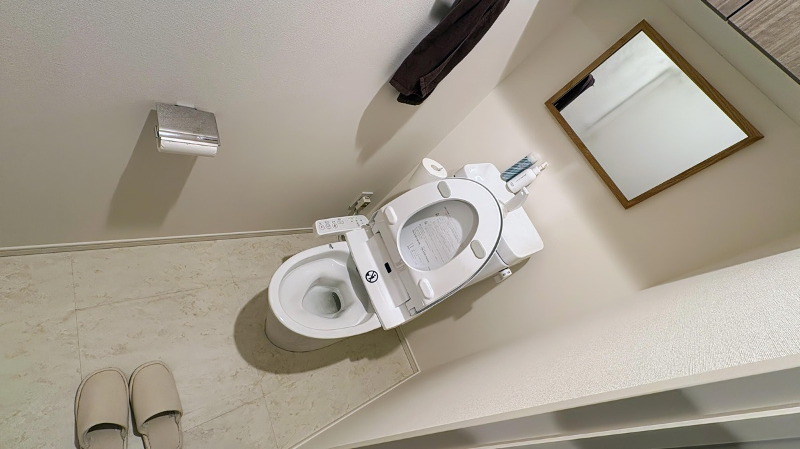

import EmbedCard from '@/components/Blog/EmbedCard.astro';

## 原则

### 🔁 把打扫定期化、用提醒来执行

这条对我个人来说最重要。懒人是绝对不会"脏了再打扫"的，而且每天住在里面其实根本意识不到东西脏了。把每周做的、每月做的事项设为例行任务，到点就做，是最高效的方式。

提醒工具用日常的日历、待办事项 App，甚至纸笔都行。我用的是 [Notion](https://notion.so) 数据库来管理。

另外，购买家电时说明书里写的"日常保养"，最好也加进这些任务中。我自己的任务示例放在了[文章后半部分](#我的定期任务示例)，可作参考。

### 🤖 扫地机器人买就对了

强烈建议入手。靠手动吸尘器、拖把、滚毛器去覆盖整个房间是不太现实的。如果是面积非常小的单间也许可以省掉。

特别是我自己有<b>鼻炎 + 养猫 + 特应性皮炎</b>，没有扫地机器人和空气净化器根本撑不住。

iRobot 的 Roomba 性价比偏低，推荐 [Roborock](https://www.roborock.jp/)、[ECOVACS](https://www.ecovacs.com/jp)、[Anker](https://www.ankerjapan.com/collections/cleaner-all) 这几家。我自己用的是 [Roborock S7 MaxV](https://amzn.to/40MyJXW)。

* 出租屋的话，5 万日元左右的型号就完全够用。
* 有随机式和地图建模式，**一定要选地图建模式**。随机式不仅耗时长，还容易漏扫。
* 最近大多数机型默认带有湿拖功能。我只在周末开启湿拖模式。
* 1R ~ 2LDK 大小的房间不需要自动集尘基站。没有的话能放进柜子下方，更省空间。

[宜家 Lerberg](https://www.ikea.com/jp/ja/p/lerberg-shelf-unit-white-70315935/) 货架，不仅便宜，扫地机器人正好能塞进它下方，强烈推荐。

我个人也很想推荐洗碗机，但出租屋里它非常占空间，比较纠结。最近 [Panasonic 也推出了小型款](https://amzn.to/3Z9osnu)，这种尺寸或许还放得下。

### 👋 弄脏的瞬间是最容易打扫的时机
厨房的油污、镜子的水渍、马桶的飞溅，**任何脏污都是在弄脏的当下立刻擦掉最轻松**。

而且，**让清洁剂和工具放在伸手可及的地方**也非常重要。为此，那些低调好看的工具就成了 GOOD 选择。后面的"分场所讲解"里也会再提到。

### 🫧 清洁剂基本只需 1 种 + α 即可
去药妆店会看到种类繁多的家用清洁剂，但其实根本不需要全凑齐。常说的最低限度清洁剂大致是以下三类：

* 酸性污渍（油污等）→ 用碱性清洁剂、小苏打去除
* 碱性污渍（水渍等）→ 用酸性清洁剂、柠檬酸去除
* 其他 → 用中性清洁剂去除

**基本上一切都先用中性清洁剂**，只有在它去不掉污渍的地方才另备专用清洁剂即可。中性清洁剂推荐以下两款。

<EmbedCard
    url="https://amzn.to/3VkvRhB"
    img="https://m.media-amazon.com/images/I/71SfLarPZaL._AC_SY879_.jpg"
    title="Amazon | Quickle Home Reset 泡沫清洁剂 本体 300ml | Quickle | 厨房清洁剂"
    site="www.amazon.co.jp" />

<EmbedCard
    url="https://amzn.to/3UW7Ih2"
    img="https://m.media-amazon.com/images/I/41YufpGXw3L._AC_PIbundle-2,TopRight,0,0_SH20_.jpg"
    title="Amazon | 东邦 Utamaro Cleaner 本体 + 替换装套装 二件随机组合 | Utamaro | 多用途清洁剂"
    site="www.amazon.co.jp" />

**多买几瓶喷雾分散放在各处时，只需要补一种替换液**也是个不那么起眼但很贴心的优点。TikTok 上 Utamaro 的粉丝很多，但我个人更喜欢 Home Reset，因为<b>放在房间显眼的位置也不会突兀</b>。[无印良品也推出了类似概念的产品](https://www.muji.com/jp/ja/store/cmdty/detail/4550344144794)。

### 👯 偶尔请人来家里，房间就会变干净
如果可能的话，建议定期请人来家里，这是触发小型大扫除的好契机。

## 分场所打扫与预防式打扫

### 🛋️ 客厅・卧室

工作日基本就是每天早上让扫地机器人跑一圈。我会让它在我起床时间启动，相当于闹钟。

另外，让扫地机器人能尽量畅通无阻地走遍房间也很重要。我家除了阳台和浴室，几乎所有地方都能扫到。

只有周末才做以下打扫：
* 用拖把和气吹清掉柜子和家具上的灰尘
* 把平时懒得移动的桌椅挪开
* 然后用扫地机器人的湿拖模式扫一遍

<EmbedCard
    url="https://amzn.to/40XIh2t"
    img="https://m.media-amazon.com/images/I/51Ec8GJX8GL._AC_SX679_.jpg"
    title="Amazon | Sanwa Direct 电动气吹 充电式 4 档风量调节 不使用气罐 自动/手动喷射 附硅胶喷嘴 铝制 灰色 200-CD076GY"
    site="www.amazon.co.jp" />

<EmbedCard
    url="https://amzn.to/40ZDXQ8"
    img="https://m.media-amazon.com/images/I/61XbZfQV2PL._AC_SX679_.jpg"
    title="Amazon | 花王 Quickle Wiper 地板用清洁工具 手持款 黑色 本体 + 黑色 替换装 8 片入 各 1 套 + Kunutonn 原创 Logo 小附赠 | 掸子・除尘"
    site="www.amazon.co.jp" />

<EmbedCard
    url="https://amzn.to/4fEXAkR"
    img="https://m.media-amazon.com/images/I/71GCMCLYN8L._AC_SX679_.jpg"
    title="Amazon.co.jp: 山崎实业 (Yamazaki) Handy Wiper 立式收纳座 黑色 约 W7.5×D7.5×H15cm tower 系列 收纳 2770"
    site="www.amazon.co.jp" />

副吸尘器我用的是 [Shark](https://amzn.to/3Zm9ivh)。处理扫地机器人进不去的缝隙，或临时想吸时就用它。

另外把湿巾放在伸手可及的地方也很重要。我用[无印良品的湿巾盒](https://amzn.to/3V74Ca9)装[无酒精除菌湿巾](https://amzn.to/3CLC1Rq)。

### 🍴 厨房

炉灶周围**就算麻烦，每次做完饭都顺手擦干净反而最轻松**。油污一旦冷却凝固就真的擦不掉了……还容易招虫。

水槽基本上洗碗时顺便用一次洗洁精擦一擦就够了。防污[涂层剂](https://amzn.to/3CIxiQp)我在上一个家试过，但说实话效果不太明显。

油烟机贴张滤网是非常推荐的。半年左右就会变得乌黑。百元店里也有，请挑选适合你家油烟机的型号。

<EmbedCard
    url="https://amzn.to/4eKJ4qs"
    img="https://m.media-amazon.com/images/I/71WbuL8132L._AC_SX679_.jpg"
    title="Amazon.co.jp: 东洋铝业 油烟机 滤网 整流板 直接粘贴 带切割虚线 约 64cm×91cm 1 张入 Filtan S3074"
    site="www.amazon.co.jp" />

微波炉用下面这款产品来打扫。也有用柠檬或小苏打的方法，但用一次性湿巾更省事，所以我比较依赖它。

<EmbedCard
    url="https://amzn.to/3Z4QfEh"
    img="https://m.media-amazon.com/images/I/71UPPHh0qKL._AC_SX679_.jpg"
    title="Amazon.co.jp:【批量装】叮一下擦干净 微波炉专用清洁湿巾 3 袋 ×3 个"
    site="www.amazon.co.jp" />

顺便一提，灶头炉架和水槽滤网我每月会丢进洗碗机里洗一次。比手洗轻松太多，强烈推荐。

### 🚽 厕所

Scrubbing Bubbles 的两款搭配最强。

马桶座圈和马桶外侧的污渍，用厕纸蘸一点下面这个稍微擦一下就好。

<EmbedCard
    url="https://amzn.to/4i4qTPx"
    img="https://m.media-amazon.com/images/I/71DhUvGXp6L._AC_SX679_.jpg"
    title="Amazon | Scrubbing Bubbles 除菌剂 按压式 酒精除菌 厕所用 本体 300ml | Scrubbing Bubbles | 厕所清洁剂"
    site="www.amazon.co.jp" />

马桶基本不用刷，把这个液体倒进去等 5 分钟，大部分污渍都能去掉。

<EmbedCard
    url="https://amzn.to/3OuyHfL"
    img="https://m.media-amazon.com/images/I/71lfGt06QBL._AC_SX679_.jpg"
    title="Amazon |【Amazon.co.jp 限定】Scrubbing Bubbles 超强力厕所清洁剂 400g×3 瓶 附打扫手套 厕所洗剂 黑垢 厕所打扫 清洗 批量装 | Scrubbing Bubbles | 厕所清洁剂"
    site="www.amazon.co.jp" />

马桶刷我不喜欢，因为刷子本身会变脏。实在去不掉时，我会用一根 50 日元的一次性刷子。

<EmbedCard
    url="https://amzn.to/3CRfBxQ"
    img="https://m.media-amazon.com/images/I/71b-e1IVO-L._AC_SX679_.jpg"
    title="Amazon.co.jp: 创和 厕所黄渍清洁棒 20 根装 打扫用品 日本制造 SOUWA"
    site="www.amazon.co.jp" />

另外，我也不用厕所地垫和马桶套，因为它们会增加打扫负担。地面用扫地机器人湿拖 + 手持吸尘器搞定。

还有，男士请坐着小便，否则打扫工作量会增加 100 倍。

### 🛁 浴室

关于霉菌，**排气扇请务必 24 小时开着**。霉菌的发生会大幅减少，电费一个月也只多几百日元（[参考](https://enepi.jp/articles/510)）。厕所也可以 24 小时开。

近年作为预防式打扫流行的[防霉烟雾剂](https://amzn.to/4fXTfcr)、[悬挂式防霉剂](https://amzn.to/4fXTfZZ)，我个人觉得效果不太明显，所以不再使用。但在密封胶条处贴上[百元店的纸胶带](https://jp.daisonet.com/products/4550480298399)是非常推荐的。

另外，不把洗发水等直接放在架子或地板上也是常识。建议用[专用挂钩](https://amzn.to/494eRl3)挂起来，或者用磁吸贴墙。百元店也有卖。

<EmbedCard
    url="https://amzn.to/4fB2O18"
    img="https://m.media-amazon.com/images/I/61EN44jcDYL._AC_SY879_.jpg"
    title="Amazon | 山崎实业 (Yamazaki) 大容量出液 磁吸 沐浴瓶 黑色 W7×D8×H25cm tower 系列 悬浮收纳 替换瓶 1533"
    site="www.amazon.co.jp" />

接下来是水渍。我洗澡时如果发现污渍，会**利用花洒等待冷水变热的水流**顺手清理一下。等待时间被利用得很高效，强烈推荐。这里同样需要把海绵和清洁剂放在伸手可及的地方。清洁剂没特别讲究，我用的是无印良品的，挂在挂钩上。

镜子基本和上面方法一样。镜子上的白色污渍几乎都是自来水留下的水垢，洗完澡用刮水器把水刮干净就能很好地预防。

最后，洗完澡出去前用冷水冲一下墙壁和地板。能抑制水蒸气、预防霉菌，并减少飞溅的洗发水皂垢。题外话，据说手脚冲冷水有调节自律神经的效果（[参考](https://weathernews.jp/s/topics/202001/160125/)），所以我顺便也会冲一下。

顺便一提，据说洗完澡后用擦完身体的毛巾把浴室墙地的水分擦干，霉菌和污渍真的都不会出现，但太麻烦我没坚持做。

下水口我装着百元店的滤网，大约一个月换一次（具体频率取决于头发长度和居住人数）。

毛巾如果湿着扔进洗衣机里会滋生细菌产生臭味，所以一定要先晾干再放进去。我会把毛巾挂在门把手上晾到第二天再用（我是每天换面巾派）。

### 🪞 洗脸台

原装的下水口滤网请直接拆下来收好，等退租时再装回。然后放上百元店的滤网袋，每月换一次用。各种款式都有，我喜欢[带遮挡的](https://jp.daisonet.com/products/4582281739917)，2 个一组很便宜，意外地像金属看起来很自然。

镜子和浴室一样，及时擦掉飞溅的水滴很重要。在伸手可及的地方备好一块小号超细纤维布。

水槽里的污渍和头发，我会放一块[小号吸水海绵](https://netshop.cando-web.co.jp/view/item/000000001005)（百元店有卖），有需要时随手清理一下。不过这种海绵会变硬不太好用，我可能会换成 [marna](https://amzn.to/418tu4O) 或者[山崎实业](https://amzn.to/3ZaRr9o)的。

哦对，洗衣机软管是波纹管样式的话，建议缠上一层保鲜膜（[参考](https://compactlife-50.com/drain-hose/)）。退租时清理灰尘会轻松很多。

### ☀️ 阳台・窗户

阳台的脏污方式因地段而异，比较难一概而论，但有一台凯驰的便携式产品基本就能搞定。

<EmbedCard
    url="https://amzn.to/4i6MO8X"
    img="https://m.media-amazon.com/images/I/61WQIrIqAtL._AC_SX679_.jpg"
    title="Amazon.co.jp: Karcher 多功能清洗机 OC 3 Foldable 无线 USB 充电 无需自来水接驳 防灾用/比自来水更高水压清洗（非高压清洗机）简易花洒/可折叠紧凑 轻量 一体水箱 丰富附件/洗车 墓碑清洁 海边除沙 泥土 自行车 空调滤网 1.599-302.0"
    site="www.amazon.co.jp" />

Type-C 充电、不需要接水、紧凑收纳，性能相当出色。多少会有些水花飞溅，但窗框轨道也能清。

窗户的话，用前面提到的[Home Reset](https://amzn.to/3VkvRhB)和超细纤维布擦一擦就好。

## 其他

### 👯 只在客人来访时才做的打扫
说实话一个人住可以不在意，但客人来时还是想打扫一下的项目。自己住时不太注意，但出现在别人家就会显眼的部位。

- [ ] 擦窗户
- [ ] 擦厨房和洗脸台的水龙头：用中性清洁剂擦掉手垢。能轻松带来观感变化，强烈推荐
- [ ] 重新检查厨房・厕所・浴室・洗脸台的水区是否能让外人看
- [ ] 检查玄关的灰尘
- [ ] 给沙发和地毯喷除臭剂

### 🌷 香氛
养猫的家庭里大多数香氛产品都不能用，所以我家专门放各种除臭剂。买替换装的除臭珠，分别放在厕所、猫砂盆、鞋柜、厨房、客厅等家中各个角落。

<EmbedCard
    url="https://amzn.to/4i5uyMU"
    img="https://m.media-amazon.com/images/I/71uH0KV5k-L._AC_SX679_.jpg"
    title="Amazon | 消臭力 Ion 消臭 Plus 房间用 厕所用 摆放型 无香料 特大 替换装 1.5kg 透明珠粒 房间用 玄关 客厅 厨房 厕所 香烟 除臭剂 除臭 香氛 | 消臭力 | 摆放型"
    site="www.amazon.co.jp" />

容器用官方款也行，<b>但用百元店随便买的容器也完全可以</b>。

### 🐛 防虫对策
近 5 年我家蟑螂一只都没出现过。果蝇也减少了不少。

* 浴室・厨房・洗脸台等保持通风，不要放着湿污
* 定期清理下水口
* 不放任垃圾和脏餐具

是基本原则。推荐的对策产品如下：

* [烟雾杀虫剂](https://amzn.to/3AIZqCo)（每年春季）
* [Black Cap](https://amzn.to/411C19L)（每年春季）
* [无印良品的杀虫喷雾](https://www.muji.com/jp/ja/store/cmdty/detail/4550583525279)（外观低调，方便摆在房间）
* [让果蝇消失喷雾](https://amzn.to/40VS9cZ)
* [空调排水管防虫盖](https://amzn.to/492FLty)（百元店也有卖）
* [缝隙密封土](https://amzn.to/3V7FtMq)（封住水槽下方虫子的入侵路径）

果蝇陷阱用[市售款](https://amzn.to/3Z4VyDz)也行，但买多了也贵，自制也不错。

[超简单的"塑料瓶果蝇捕捉器" | AUT FUN | 爱知工科大学](https://www.aut.ac.jp/autfun/5090/)

我把它放进下面这个容器里。

<EmbedCard
    url="https://amzn.to/3Z1GqHk"
    img="https://m.media-amazon.com/images/I/71dI7ZM5YlL._AC_SX679_.jpg"
    title="Amazon.co.jp: 山崎实业 (Yamazaki) 果蝇 & 除臭 罐 白色 约 W9.5×D9.5×H6cm tower 果蝇捕捉盒 防虫 5740"
    site="www.amazon.co.jp" />

### 🧹 水区偶尔请专业人士也是个好选择

<b>金钱比时间</b>更重要派的人，每半年到一年请一次家政服务或专业保洁公司也很好。我自己用过一次 CaSy，把麻烦的活交给专业人士确实很赞。我请的是厨房・厕所・浴室・窗户四处共 2 小时，费用约 6 千日元。

家政服务的话，需要自己准备打扫工具，请注意。

如果你想试一下 CaSy，欢迎使用我的 1000 日元优惠链接 → 
https://casy.co.jp/invite/ycOWk 

## 我的定期任务示例

最后分享一下我实际设置并执行的任务列表。任务内容和频率会因住宅环境、家庭构成而大不相同，仅供参考。

洗碗机、空气净化器、吸尘器等所有家电的保养都按照说明书任务化了，但这里就不一一展开。说明书的保养建议通常都偏严，实际上我执行的频率会比说明书更低一些。

每次执行任务时也要思考"这个任务可以再降低频率"或"这个打扫频率不够了……"并不断更新，这一点也很重要。

顺带一提，我把"看牙医"、"应急食品保质期"、"电脑数据清理"等也放在同一个地方管理。

### 每周
- [ ] 自制果蝇陷阱更换（仅夏季）
- [ ] 给猫换猫砂盆尿垫
- [ ] 最低限度的厕所打扫
- [ ] 倒掉扫地机器人的尘盒
- [ ] 用气吹和手持掸子掸去灰尘
- [ ] 扫地机器人高功率模式 → 湿拖模式
- [ ] 换厨房和洗脸台的擦手毛巾
- [ ] 洗被子・拖鞋・家居服

### 每月
- [ ] 检查并补充各房间的[除臭剂](https://amzn.to/4i5uyMU)
- [ ] [擦微波炉](https://amzn.to/3Z4QfEh)
- [ ] 更换[洗脸台滤网袋](https://jp.daisonet.com/products/4582281739917)
- [ ] 更换浴室下水口滤网，脏的话顺便打扫
- [ ] 洗浴室脚垫

### 每 3 个月
- [ ] 自行车保养
- [ ] 电动牙刷刷头更换
- [ ] 检查油烟机滤网
- [ ] 用洗碗机清洗厨房水槽滤网和灶头炉架
- [ ] 冰箱内部清理

### 每半年
- [ ] 使用[洗衣槽清洁剂](https://amzn.to/497rPOX)
- [ ] 清洗空调内部滤网
- [ ] 清洗地毯、沙发套
- [ ] 拆开清洁 PC 键盘
