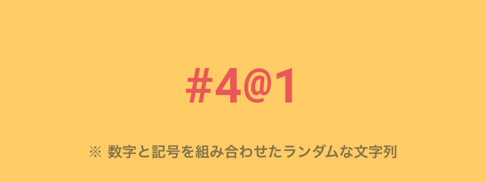
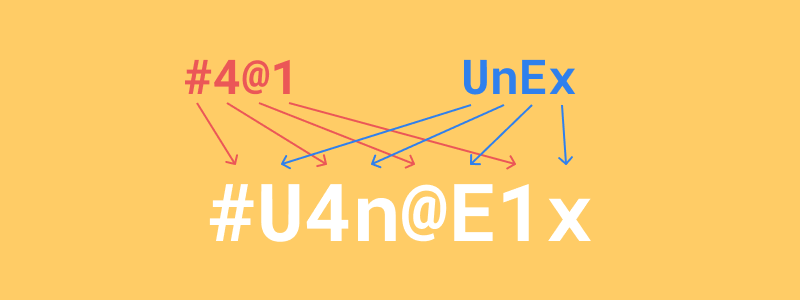

import EmbedCard from '@/components/Blog/EmbedCard.astro';

前提是,如果你已经在使用[LastPass](https://www.lastpass.com/)或[1Password](https://1password.com/jp/)等<b>密码管理应用</b>,本文对你来说可能并非必需。不过即便与它们配合使用,本文介绍的技巧依然有参考价值。

## 密码的安全风险
首先,我们简单确认一下网络服务和应用的密码会面临哪些风险。如果你已经了解,可以直接跳过这部分。

### 撞库攻击
所谓的"账户信息泄露"一旦发生就会带来风险。攻击者会利用从某个网站泄露出的"账户ID与密码"组合,尝试登录其他网站。在多个网站使用相同ID和密码组合的人最容易遭受此类攻击。

为了避免这种情况,**需要为每个服务、每个应用使用不同的密码**。

### 暴力破解(穷举)攻击
只要把所有可能的字符组合一一尝试,密码总有一天会被破解。当然,人类逐个尝试是不现实的,但通过计算机程序自动处理,简单的密码很短时间就能被攻破。

例如,仅由英文字母组成的4位密码大约只需3秒就能被破解。相对地,使用大小写英文+数字+符号的8位密码,大约需要1000年才能破解。([参考](https://cybersecurity-jp.com/column/17426))

也就是说,**需要使用包含大小写英文、数字、符号等的复杂密码**。

### 字典攻击
许多人会使用`password`、`12345678`、`qwerty`等简单的密码。这些都被攻击者所熟知,登录尝试会非常容易。此外,字典中常见的`banana`、`love`等单词也经常被穷举尝试。为了避免这种情况,**不要使用常见密码或简单的单词作为密码**。

### 密码猜测导致的账户被盗
如果密码使用生日或喜欢的词汇,可能会被家人朋友猜出,或被调查过你个人信息的攻击者推测出来。如果是熟人,顶多只是开个小玩笑还好,但也有可能让孩子用你的信用卡进行高额消费等风险。

为了避免这种情况,**不要使用生日等容易被猜到的信息**。

以上就是密码相关安全风险的简要总结。想了解更多的话,可以参考下面这本书。

<EmbedCard
    url="https://amzn.to/4aNVwVJ"
    img="https://ws-fe.amazon-adsystem.com/widgets/q?_encoding=UTF8&ASIN=B017SH8GZ8&Format=_SL250_&ID=AsinImage&ServiceVersion=20070822&WS=1"
    title="徳丸浩的Web安全课堂(日经BP Next ICT精选) | 徳丸 浩 | 工学 | Kindle商店 | Amazon"
    site="amazon.co.jp" />

简单来说,**需要为每个服务使用强壮且不同的密码**,但实际上并没有那么容易做到,要全部记住也并不现实。

## 安全又轻松记忆的密码管理方法
正题来了。这个方法就是,**根据要注册的服务名称,通过自定义的规则将其转换成密码**。Google账户就用`google`,Instagram账户就用`instagram`这样的英文字符串作为密码的基础。当然直接这样使用还是弱密码,因此我们要自己制定一套单词转换规则,从而生成强壮的密码。

### 自定义规则示例
例如,可以考虑以下规则。
<small>※ 当然,不要直接照搬,需要自己设计一套规则。</small>

> 1.  准备一组由4位随机数字和符号组成的字符串。(这部分要努力记住)
> 2.  取出服务名称的前4个字母,交替使用大小写英文。
> 3.  把1和2交错组合,即可完成。

听起来好像有点难,但实际操作起来很简单。

### 实际生成密码的例子
让我们假设要在[U-NEXT](https://video.unext.jp/)这个服务上注册账户并设置密码。这种情况下,以`unext`作为字符串来生成密码。

#### 1. 准备4位随机数字和符号的组合
首先,准备一组4位的、由数字和符号随机组成的关键词。这部分会反复使用,所以一定要记牢。

#### 2.  取出服务名称的前4个字母,交替使用大小写英文
取出服务名称的前4个字母,然后让它们交替大小写。如果服务名称比较短,可以重复使用。(例:[alu](https://alu.jp/)→`alua`)

#### 3. 把1和2交错组合,即可完成
最后只要把这两个字符串交错组合就完成了。

### 自定义规则的其他例子
自定义规则越复杂,生成的密码就越强壮、越难破解。例如下面这些转换规则,在思考自己的规则时可以作为参考。

* 不直接使用服务名称,而是把每个字母按字母表顺序错开1位
    * U-NEXT → unex → UnEx → `VoFy`
* 用服务名称构造8位字符串,把偶数位用关键词替换
    * U-NEXT → unextune + #4@1 → u#e4t@n1e

另外,各服务允许使用的字符、符号、密码位数都不一样,如果规则能兼顾这些情况就更完美了。

### 担心记不住自定义规则怎么办?
如果担心忘记规则或关键词,可以写在纸上保存在安全的地方。这听起来有点危险,但安全专家[徳丸老师也表示,把密码写在纸上保存本身是安全的](https://www.motex.co.jp/nomore/column/1036/)。当然,把密码写在便利贴上贴在所有人都能看到的地方就另当别论了……。

## 总结
该方法的优点如下:

* 能创建组合了字母、数字、符号的**强壮密码**,**对字典攻击和暴力破解攻击有抵抗力**
* 可以为每个服务**使用不同的密码**,**对撞库攻击有抵抗力**
* 只要记住4位短语和自定义规则就够了,**轻松简单**

感谢阅读。我并不是安全方面的专家,如果有更熟悉这方面的朋友,欢迎留言交流。
