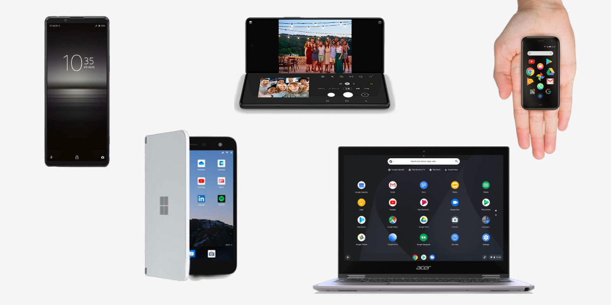
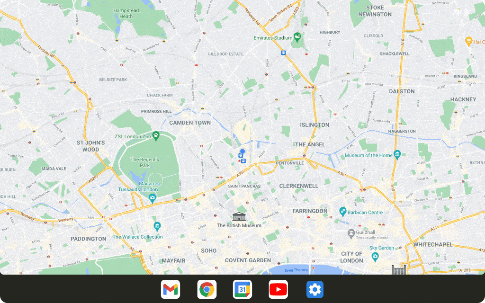
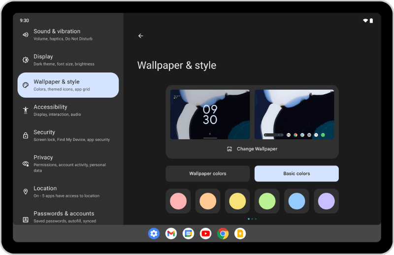
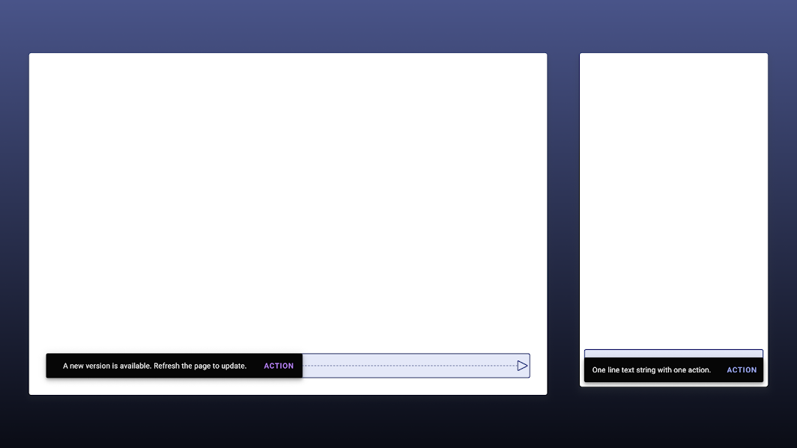
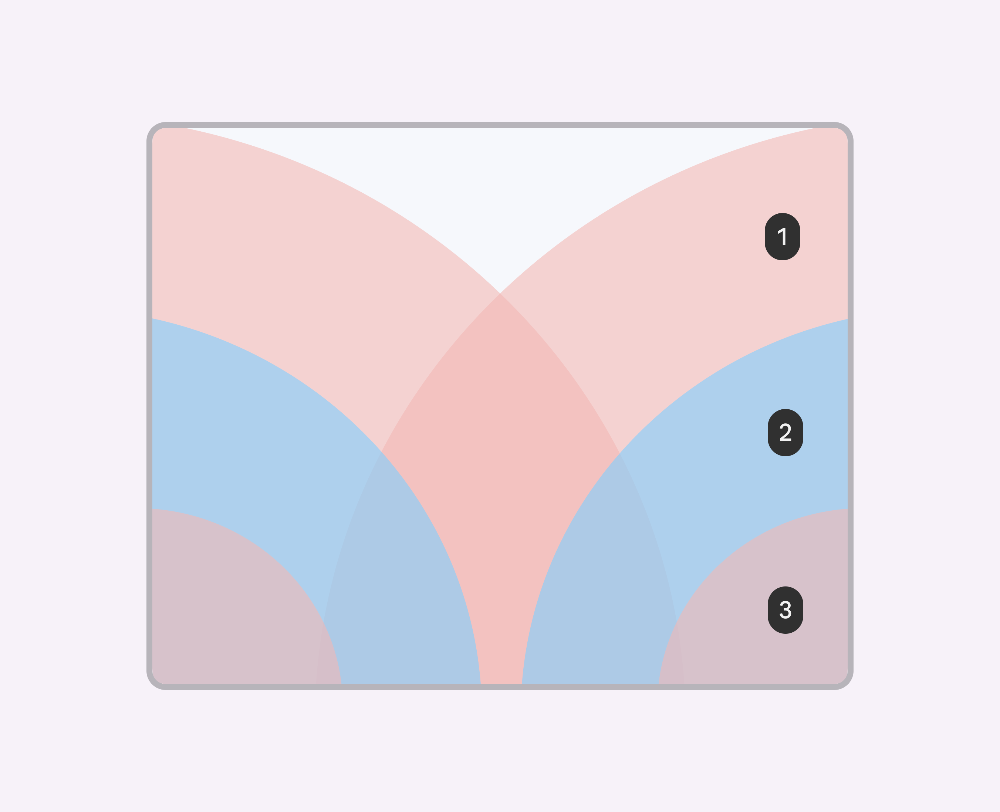
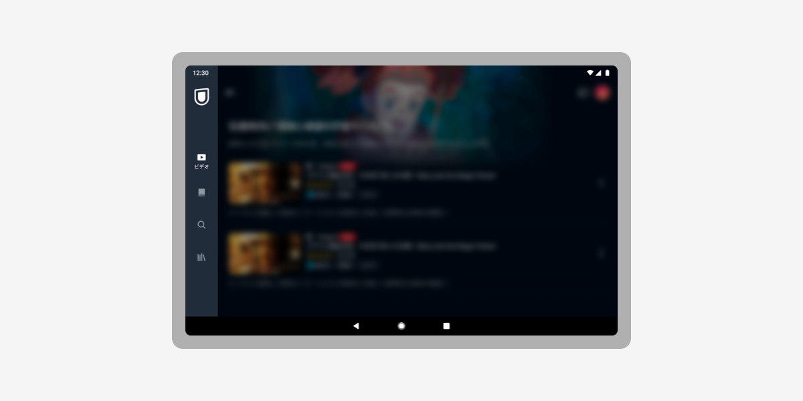
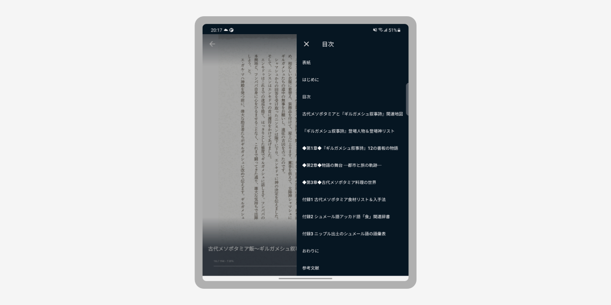
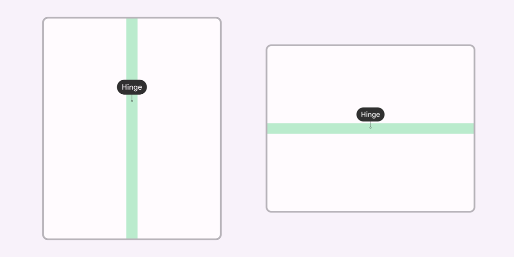
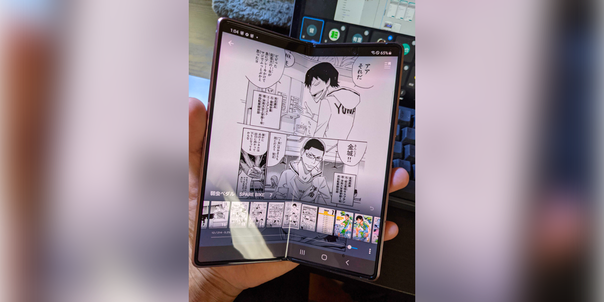

import EmbedCard from '@/components/Blog/EmbedCard.astro';

## 背景·前言
Android OS 与iOS不同,从一开始就被设计为运行在多种设备上。iOS只在自家研发的iPhone、iPad上使用,而Android则被安装在Google之外众多厂商生产的智能手机和平板上,运行在各种各样的环境中。

加之最近 **Chromebook (Chrome OS) 和 Windows11 上也能运行Android应用**,以及Foldable设备(折叠屏手机)等新产品的发布,可以预见Android今后将在越来越多种类的屏幕尺寸上被使用。

<small>能运行Android的设备的一小部分例子</small>

Material Design 也开始重视多设备适配和可折叠设备适配,新增了大量的指南。本次将以官方新增的指南为中心,整理相关内容和链接。

相关文章:

<EmbedCard
    url="https://hira.page/blog/material-design-3"
    img="https://hira.page/blog/material-design-3/cover_hub34f4e74b23e8e316755c9b2c3e891e8_210618_1280x640_fit_q80_box_3.png"
    title="Material Design 3 简要总结 | WEBA"
    site="hira.page" />

### 那么,可折叠设备(折叠屏手机)究竟是什么?
最近频繁听到的<b>折叠屏手机</b>。它通过具有柔韧性的<b>OLED显示屏</b>,可以让屏幕弯曲并折叠起来(也有采用液晶屏+物理铰链结构的)。

可以在小屏幕、大屏幕、纵向2屏、横向2屏等多种状态下使用,因此仅这一台设备就需要考虑相当多种UI状态。简直是设计师的噩梦。

目前价格还非常昂贵,大多比一般高端智能手机贵一倍以上。预计用户数量短期内不会大幅增加,所以暂时不需要太在意可折叠适配本身。

关于Google官方推出"Pixel Fold"设备的传闻也时有时无……。

### Android 12L
不过,正如前面所说,大尺寸设备(不仅限于可折叠)的确正在增加。Google已宣布将于2022年下半年推出针对平板优化的OS,即 **Android 12L**。

<EmbedCard
    url="https://developer.android.com/about/versions/12/12L/summary"
    img="https://developer.android.com/images/social/android-developers.png"
    title="12L 的功能和变更点  |  Android 12  |  Android Developers"
    site="developer.android.com" />

除了通知区域和锁屏的优化外,还增强了分屏功能、任务栏等多任务辅助。其行为似乎在很大程度上受到了iPad OS的影响。

<small>通知·快速设置的双列显示</small>

<small>任务栏的显示,通过拖拽实现的分屏</small>

<small>设置界面的分割</small>

## UI设计的应对
那么,从这里开始进入正题。如前所述,我们不仅要应对更大的屏幕,还要考虑分屏等场景下应用<b>会以从未有过的宽高比</b>使用。本次将以自家应用的适配内容和各官方指南为中心,总结一下可以做的应对。

### Material Desing 推荐的3个步骤
关于大屏适配,Google官方公开了几篇文章(后述)。其中始终被一致重视的是以下3个步骤。

#### Layout Grid / 重新审视纵向列网格布局

Material Design 中定义了 [Layout Grid](https://material.io/design/layout/responsive-layout-grid.html)。这是从远古的 Web Design 时代就开始使用的概念,把列作为网格规则化之后,可以根据断点(设备宽度)灵活地改变布局。

#### Adaptive Composition / 让构成元素可缩放
一个屏幕中通常包含多个构成要素(Composition),例如:

* Bottom Navigation 等全局菜单
* Top App Bars 等信息显示区域
* 由 Cards 等构成的滚动区域

Material Design 推荐根据屏幕大小来重新审视这些元素的整体布局。

* 在大屏上排列多个元素时,要通过卡片或分隔线让视觉上能识别出分组
* 每行最多显示约60个字符,以保证文章的可读性

包括后述的 Navigation Rail 在内,要根据屏幕大小重新审视构成元素的布局和性质。

相关文章:

* [Foldables – Material Design 3](https://m3.material.io/foundations/adaptive-design/foldables/compositions)
* [Material Design](https://material.io/design/layout/understanding-layout.html)
* [5 Exercises to Prepare Your App for Large Screens - Material Design](https://material.io/blog/5-steps-large-screen-apps)

#### Component Behavior / 各组件的应对
Material Design 中,每个 Component 也会根据屏幕灵活地调整自身的行为。例如 [Snackbars](https://material.io/components/snackbars) 在移动设备上会铺满整个屏幕宽度,而在大屏幕上则定义了显示的最大宽度。

在最近的更新中,以下 Component 页面新增了大屏相关的定义。

[App bars (top)](https://material.io/components/app-bars-top#behavior) / [Bottom navigation](https://material.io/components/bottom-navigation#behavior) / [Buttons](https://material.io/components/buttons#behavior) / [Cards](https://material.io/components/cards#behavior) / [Dialogs](https://material.io/components/dialogs#behavior) / [Image lists](https://material.io/components/image-lists#behavior) / [Lists](https://material.io/components/lists#behavior) / [Menus](https://material.io/components/menus#behavior) / [Navigation drawers](https://material.io/components/navigation-drawer) / [Bottom sheets](https://material.io/components/sheets-bottom#behavior) / [Side sheets](https://material.io/components/sheets-side#behavior) / [Snackbars](https://material.io/components/snackbars#behavior) / [Tabs](https://material.io/components/tabs#behavior) / [Text fields](https://material.io/components/text-fields)

### 思考频繁点击元素的位置
单手使用智能手机时,应避免把频繁使用的点击元素放在手指够不到的顶部。此外在可折叠设备上,下方图中的2号区域被认为是最容易点击的区域。3号虽然位于下方,但被认为是非常难以点击的区域,不推荐放置FAB等元素。

<small class="reference">[参考: Foldables – Material Design 3](https://m3.material.io/foundations/adaptive-design/foldables/overview)</small>

另外,如果把重要元素放得太靠下,在中等宽高比的屏幕上可能无法进入首屏,被隐藏起来。

这部分需要在布局逻辑上下功夫,例如从底部开始计算位置等。

### 输入设备的考量
Android的响应式适配,不仅仅是适配各种屏幕尺寸。如前所述,考虑到也会在 Chromebook 和 Windows 上使用,**应用还可能被鼠标和键盘操作**。

因此,理想情况下应当支持悬停和点击时的交互、Tab键移动元素、Enter键执行等操作。这部分如果使用Material Design相关的库实现,很多情况下会自动支持。

此外,可能还需要考虑:

* 视频应用是否需要支持空格键播放/暂停等键盘快捷键
* 游戏应用是否要支持手柄输入
* 是否考虑使用触控笔/手写笔

### Table Top Mode 适配

<small class="reference">[参考: Foldables – Material Design 3](https://m3.material.io/foundations/adaptive-design/foldables/overview)</small>

可折叠设备可以横向折叠,立在桌上使用。这时上半部分播放视频,下半部分显示控制器,使用起来非常方便。

主要适用于视频播放或视频通话场景。这是可折叠设备专属的适配,优先级看起来不高。

### Sliding Pane Layout
在设置型界面、或者从列表→详情页跳转的界面中,可以考虑采用<b>Sliding Pane Layout</b>把列表和详情左右并排显示。

iPad的设置应用中也采用了这种界面。Android 12L 中同样计划在设置界面中采用。

### 尺寸变化时的Motion
当屏幕尺寸发生变化时,通过对新增或删除的元素进行恰当的动画处理,可以让用户更容易理解UI的变化。

<small class="reference">[参考: Foldables – Material Design 3](https://m3.material.io/foundations/adaptive-design/foldables/motion)</small>

不过,需要频繁应对尺寸变化的也就只有可折叠设备,优先级估计还是会被往后推。

### Adaptive Type Scale
这是 Material Design 3 中定义的、可以动态调整尺寸的字体规则。

通过为每个设计令牌(Headline、Body等变量)定义尺寸规则,设计与实现就能基于共同的规则动态地改变字体大小。但是Android的字体在每台设备上的预装字体都不一样,而且文字大小往往使用sp(Scalable Pixel)实现,情况相当复杂,实际操作起来恐怕会比较麻烦。

<EmbedCard
    url="https://m3.material.io/styles/typography/overview"
    img="https://lh3.googleusercontent.com/Lc3oIPeZ04n3xRik87uNS90GHKzm2hgtqMs3h9PL4rvGlsYEGpWLmocZ-8HFSX0wflnR7wYfraQSganO2EDgxglzqOAAZfNIf1Etdds2JSofOutRsZBs"
    title="排版设计–Material Design 3"
    site="m3.material.io" />

### 以模态窗口形式显示
通过把特定界面以模态窗口的方式显示,可以复用与移动应用相同的布局。例如U-NEXT应用中,作品的详情页就以细长的模态形式显示,几乎复用了与移动端相同的布局。

虽然不能用于所有界面,但这是一个能减少设计与开发成本的小技巧。

### 采用 Navigation Rail
这是大约2年前被加入 Material Design 的新Component。

<EmbedCard
    url="https://material.io/components/navigation-rail"
    img="https://lh3.googleusercontent.com/ejEwgniW0-KTBP5oD3Ygc9KqdwgfSr5LEEnVLpKLEcsmZsG6C4UvIpypLRF4bmrgnm88qaS_fTkMSEYUKFlaoQ1nB0llc9XIxT5mow"
    title="Navigation rail - Material Design"
    site="material.io" />

在U-NEXT应用中,当横向宽度达到600dp以上时,会用它来替代 Bottom Navigation 显示。

顺便一提,关于实现层面的经验,我们公司的Android工程师做了一份幻灯片总结。

<EmbedCard
    url="https://speakerdeck.com/tomoya0x00/yi-wai-tojian-dan-navigation-raildao-ru-falseohua"
    img="https://files.speakerdeck.com/presentations/4e2c0e2749f742b2b7de60d4556e3644/slide_0.jpg?19566124"
    title="意外简单?Navigation rail 引入心得 - Speaker Deck"
    site="speakerdeck.com" />

### 采用 Side Sheet
这同样是 Material Design 的Component。虽然在移动应用中也可以使用,但因为它能在不完全遮挡屏幕的前提下显示附加元素,与大屏设备搭配尤其合适。

<EmbedCard
    url="https://material.io/components/sheets-side#usage"
    img="https://lh3.googleusercontent.com/Te8S0q-tAnCvwza29GS4VcNoKjlHuYavR8UrPJ8NKO2kPR1TWatGwBBIEradXZTymf7vF_zl0bKbPSG-R97ApWhrbfVagTdq3V2r1g"
    title="Sheets: side - Material Design"
    site="material.io" />

U-NEXT应用中,电子书阅读器的目录:

* 在移动端使用 Full-screen Dialogs
* 在平板上使用 Side Sheets

来显示。

<small class="reference">[参考: 古代美索不达米亚饮食～吉尔伽美什史诗与最古老的食谱 ©遠藤雅司,大和書房](https://video.unext.jp/book/title/BSD0000420559/BID0000708428)</small>

### 避开铰链
在可折叠设备的展开屏幕上,中央铰链周边48dp范围内,应避免放置可点击元素。

常见的反例是,把 Modal Dialog 直接叠加在中央铰链上显示。

### 缩短手指的移动距离
在大屏幕上,要意识到手指的移动距离会变长。通过在用户操作过的UI元素附近显示弹出窗,可以让用户更高效地完成操作。

<small class="reference">[参考: Samsung Developers](https://developer.samsung.com/one-ui/foldable-and-largescreen/intro.html)</small>

## 案例研究
Google在以下网站整理了可折叠·大屏适配应用的案例。非常有参考价值,推荐看一遍。

<EmbedCard
    url="https://developer.android.com/large-screens/stories"
    img="https://developer.android.com/images/social/android-developers.png"
    title="大屏案例介绍  |  Android 开发者  |  Android Developers"
    site="developer.android.com" />

## 总结
最后,把可折叠·响应式相关的、能找到的官方信息整理一下。

* [Responsive layout grid - Material Design](https://material.io/design/layout/responsive-layout-grid.html#columns-gutters-and-margins)
* [Adaptive design – Material Design 3](https://m3.material.io/foundations/adaptive-design/overview)

↑Material Design version2和3各自相关的项目。遵守这些应该就基本没问题了。

* [Introducing Material Design Guidance for Large Screens - Material Design](https://material.io/blog/material-design-for-large-screens)
* [Start Here: 5 Exercises to Prepare Your App for Large Screens - Material Design](https://material.io/blog/5-steps-large-screen-apps)

↑与其说是指南,不如说是博客文章。想了解大致概要的话很合适。

* [Design an Adaptive Layout with Material Design – Figma](https://www.figma.com/community/file/976547042961041487)

↑Google官方的 Tutorial Figma 文件。

* [构建支持折叠式设备的应用  |  Android 开发者  |  Android Developers](https://developer.android.com/guide/topics/ui/foldables)
* [大屏入门指南  |  Android 开发者  |  Android Developers](https://developer.android.com/guide/topics/ui/responsive-layout-overview#case_studies)

↑虽然是面向开发者的指南,但里面提到了应有的行为模式,简单浏览一下也不错。

* [IntroductionLarge screen UI | Samsung Developers](https://developer.samsung.com/one-ui/foldable-and-largescreen/intro.html)
* [为双屏和折叠式设备创建应用 - Dual-screen | Microsoft Docs](https://docs.microsoft.com/ja-jp/dual-screen/)

↑同样在开发折叠屏手机的 Samsung、Microsoft 也公开了设计指南。

## 番外
U-NEXT是一个也能阅读电子书的服务,但好不容易在可折叠设备上看书,变成下面这样↓ 就有点遗憾了。

<small class="reference">[参考资料: 弱虫ペダル　SPARE BIKE ©渡辺航,秋田書店](https://video.unext.jp/book/title/BSD0000104373/BID0000323211)</small>

所以我悄悄做了改造,让它能像现实中的书那样跨页阅读。

<blockquote class="twitter-tweet">
U-NEXT 通过昨天的更新,适配了 Galaxy Z Fold 等可折叠手机。  可以像翻书一样以跨页方式阅读漫画。能做到这一点的智能手机应用意外地少,U-NEXT 大概是首例。 <a href="https://t.co/ADeYvSgKVs">pic.twitter.com/ADeYvSgKVs</a>
&mdash; 平田 / U-NEXT (@psephopaiktes) <a href="https://twitter.com/psephopaiktes/status/1458268803549175809?ref_src=twsrc%5Etfw">November 10, 2021</a></blockquote> 

<small class="reference">[参考资料: 名探偵コナン ©青山剛昌,小学館](https://video.unext.jp/book/title/BSD0000036696/BID0000812653)</small>
