import EmbedCard from '@/components/Blog/EmbedCard.astro';

## 先说结论
有钱的话就买 [HS70 Bluetooth](https://amzn.to/3T7bO3j) ([方案4](#方案4-使用支持双连接和混音的-bluetooth-耳机)) 或者 [SHOKZ OPENMOVE](https://amzn.to/3K40zEM) ([方案2](#方案2-使用骨传导等能听到周围声音的耳机)),钱不够的话就买 HORI 的 [耳麦](https://amzn.to/3dHjtFl) ([方案1](#方案1-使用混音器)),基本就稳了。

## Switch 的语音聊天很不方便
去年起我迷上了《喷射战士》,和熟人一边线上通话一边玩游戏的场合多了起来。我们用 LINE、Discord、任天堂官方 App 等在手机上做语音聊天,但用扬声器的话游戏的杂音就会混进通话麦克风。

但只要其中一个用耳机,自然就听不清另一个的声音了。

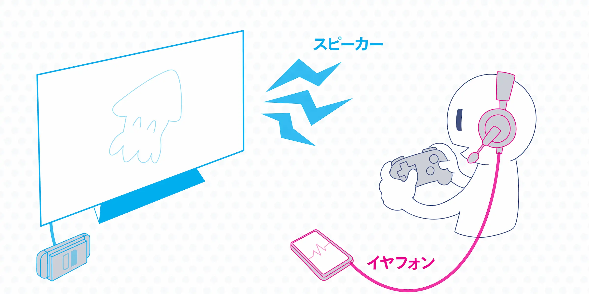

### PlayStation 用官方功能就没问题
顺带一提,PS 上是没有这种烦恼的。PS 主机本身就有线上通话功能,所以不需要手机通话。只要在手柄上插上耳机,就能一边听游戏声音一边直接在 PS 上语音聊天。

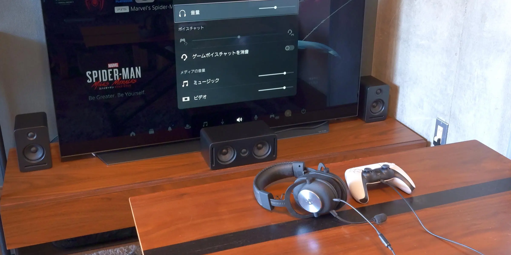

希望 Switch 也能通过系统更新加入语音聊天功能啊……

### Switch 需要一套同时听到游戏声音和语音通话的环境
总之,在 Switch 上一边玩游戏一边通话时,无论如何都希望能用合适的方式同时听到游戏和通话声音,并且让自己的声音被麦克风干净地拾取。下面整理一下目前能想到的方案。说明以电视模式游玩为前提,但最后的总结部分也会涵盖掌机模式下的使用感受。

## 方案0: 使用 iPhone 的降噪功能
后面会介绍各种各样的耳机,但在那之前,试试 iPhone 的降噪也是最简便的方法。

<EmbedCard
    url="https://support.apple.com/ja-jp/guide/iphone/iphb54d5dee2/ios"
    title="在 iPhone 上更改 FaceTime 音频设置 - Apple 支持(日本)"
    site="support.apple.com" />

在通话 App 使用过程中,从控制中心点击「麦克风模式」并切换到「人声突显」,就能相当准确地去除自己声音以外的杂音。

虽然仅限 iPhone 用户,但即便用扬声器通话,游戏声音也几乎不会被对方听到,所以是简便又有效的方法。

不过,这毕竟只是一个临时方案,如果想好好听清游戏声音,还请考虑后面介绍的方案。喷射战士里听声辨位很重要。

## 方案1: 使用混音器
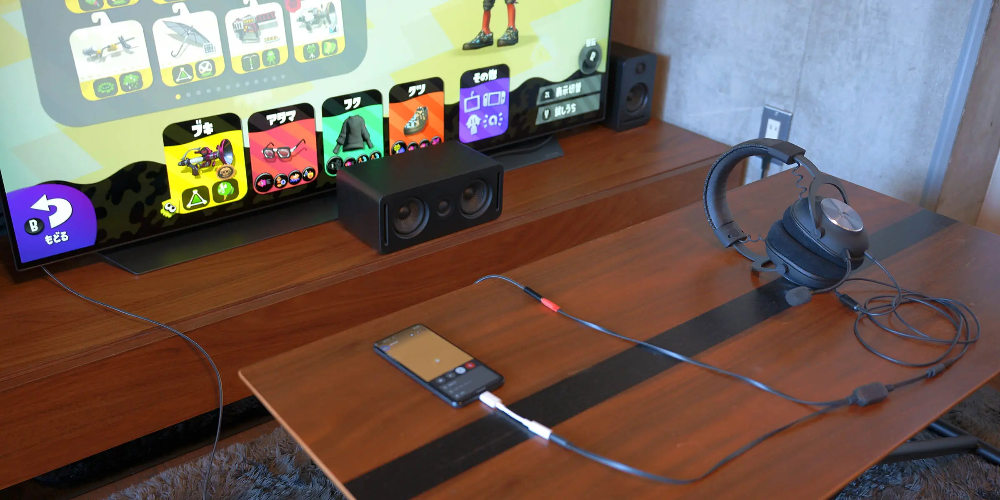

最便宜、可以实现的经典方法。使用一种叫做**混音器**的设备,把游戏和语音聊天的声音合二为一。如下所示,只要把耳机、Switch(连接 Switch 的电视也行)、手机连到混音器即可。

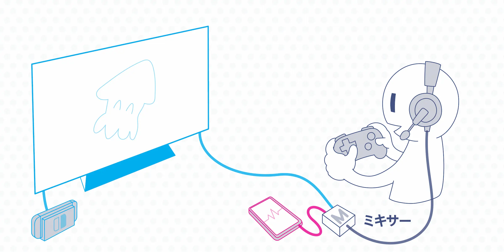

种类有很多,我使用的是 HORI 出品的耳机所附带的混音器。这是任天堂授权产品,设计也好看,如果你正想买新的耳机就再合适不过了。

<EmbedCard
    url="https://amzn.to/3AfMcbV"
    img="https://c.media-amazon.com/images/I/61zyC8da1GL._AC_SX679_.jpg"
    title="Amazon | 【任天堂授权商品】带混音器 HORI 游戏耳机 入耳式 for Nintendo Switch 黑色【支持 Nintendo Switch Online 语音聊天】 | 周边设备・配件"
    site="amazon.co.jp" />

居然还有《喷射战士3》款式发售

<EmbedCard
    url="https://amzn.to/3AdAdLV"
    img="https://c.media-amazon.com/images/I/612jkOVsoPL._AC_SX679_.jpg"
    title="Amazon | 【任天堂授权商品】喷射战士3 HORI 游戏耳机 标准版 for Nintendo Switch【兼容 Lite・OLED】 | 周边设备・配件"
    site="amazon.co.jp" />

如果不需要耳机,ELECOM 也有[只售混音器](https://amzn.to/3pBwFOG)的产品,大约 2000 日元。

不过最近的手机本来就没有耳机口,所以多数情况下需要转换线,请注意。

- [iPhone(Lightning)用](https://www.apple.com/jp/shop/product/MMX62J/A/)
- [Android(Type-C)用](https://amzn.to/3QFB5Q9)

后面在[方案5](#方案5-使用支持-bluetooth-的音频混音器)里还会介绍蓝牙连接的混音器。

### 优点
非常便宜。可以使用已有的有线耳机。

### 缺点
布线相当杂乱。掌机模式下线特别碍事;即便是电视模式,每次通话都得把混音器分别连到电视和手机上。

## 方案2: 使用骨传导等能听到周围声音的耳机
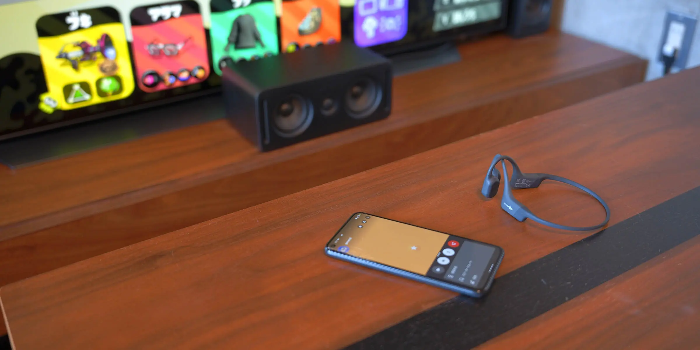

最近,**戴着也能听到周围声音**的开放式(open-ear)耳机越来越多。借助骨传导或定向扬声器技术,耳孔不会被堵住,因此戴着也能听到周围的声音。这类耳机大多自带麦克风,所以可以用它来做手机通话,游戏声音则继续用扬声器听。

适合使用以下这类耳机:

- [ambie sound earcuffs](https://amzn.to/3pmzuDi):
耳夹型的开放式耳机。外观帅气,长时间佩戴耳朵也不会痛。通话品质并不算好。
- [Anker Soundcore Frames](https://amzn.to/3SQTw6c): 眼镜型耳机。Huawei 等几家厂商也推出了类似产品。
- [SHOKZ OPENMOVE](https://amzn.to/3K40zEM): 骨传导领域最经典的耳机厂商。[有几个档次](https://jp.shokz.com/collections/all-products)。也能找到类似的便宜国产替代品。

我有 ambie 和 SHOKZ(旧款),两者都能舒适地游玩+通话。我没试过,但据说 AirPods 等的<b>通透模式</b>也能做到类似的事情([参考](https://twitter.com/tkackey/status/1539201509912502273))。

顺带一提,《喷射战士3》主角的初始装备 `骨导皇帝EP`,模型应该就是骨传导耳机。

### 优点
对于已经拥有开放式耳机的人来说,这是一个不错的过渡方案。布线清爽,也很轻松。

### 缺点
有些耳机的麦克风会拾到游戏声,通话品质偏低。声音的听感在适应之前会有些怪怪的。与有线耳机相比还需要充电。

## 方案3: 使用采集卡,把游戏和通话都放到 PC 上(仅限 PC)
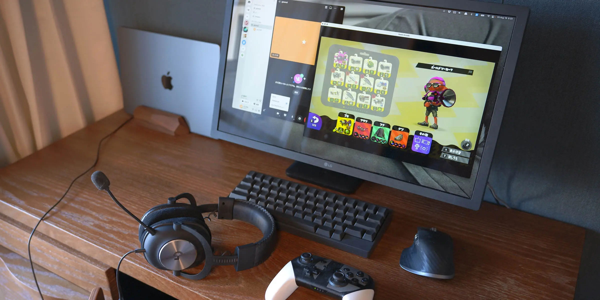

视频博主和职业玩家用这种方式的人多。把 Switch 的画面和声音输出到 PC,在 PC 显示器上玩游戏。可以直接在同一台 PC 上用 LINE 或 Discord 通话,所以耳机直接接到 PC 上即可。

我有一款叫 [ShadowCast](https://amzn.to/3BW1ogI) 的小巧低价的设备,试过之后发现延迟挺明显的,就放弃了。

作为压低成本的折衷方案,也可以让游戏画面继续走电视,而仅把声音输出到 PC。但这样 PC 端就需要 Audio-in(用于游戏音频输入)和 Audio-out(接耳机)两个端子,实质上没有台式机就比较吃力。或者也可以用 USB 转换器、HDMI 分配器等,方法虽然有几种,但话题会变得太复杂,这里就略过。

### 优点
游戏、通话、录像等都用一台 PC 解决,布线一次到位之后就轻松了。配齐这套环境后,直接也能做游戏直播和视频投稿。

### 缺点
单是采集卡就要 2 万日元前后,要想做到无延迟的舒适环境,通常还需要高规格的游戏 PC。除了花钱,凑齐这套设备也需要一定的知识。手机上当然无法实现这种环境。

## 方案4: 使用支持双连接和混音的 Bluetooth 耳机
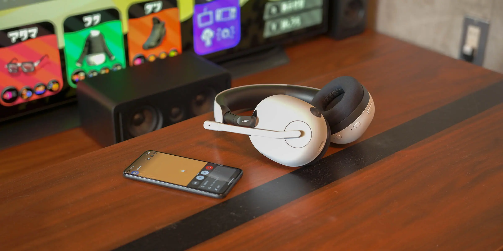

最尖端的方法。使用一种能通过 2.4Ghz 与 Bluetooth/有线分别连接 Switch 和手机,并且能**同时(混音)听到这两路声音**的耳机。如下所示,Switch 端使用 2.4Ghz 专用的 dongle(无线收发器)实现无延迟连接,手机端则用 Bluetooth 或有线方式连接。

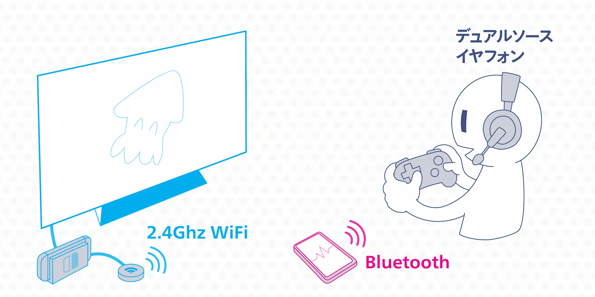

### 前置知识: 关于能用于 FPS 的无线耳机
用无线耳机玩 FPS 或音游时,需要在意延迟。无线耳机的传输方式大致分为 **2.4Ghz WiFi** 和 **Bluetooth**,Bluetooth 又细分为多种编解码器。

| 形式 | 延迟速度 |
| --- | --- |
| 2.4Ghz WiFi | 16ms |
| aptX LL | 40ms |
| aptX Adaptive | 50~80ms |
| aptX | 70ms |
| AAC | 120ms |
| SBC, LDAC | 200ms~ |

参考:
* [Bluetooth vs. USB Wireless | SteelSeries](https://steelseries.com/blog/bluetooth-vs-usb-wireless-120)
* [使用「GO blu」和「BT-W4」打造梦想中的无线游戏环境!](https://news.denfaminicogamer.jp/kikakuthetower/220617c)

据说人能感知到的延迟下限大约是 25ms,所以理论上 2.4Ghz WiFi 是**完全感觉不到延迟**的。如果用于 FPS,起码要选延迟 100ms 以下的产品。

以下是推荐的耳机。※价格为撰文时的价格。

#### 1. SteelSeries ARCTIS 7P+ WIRELESS
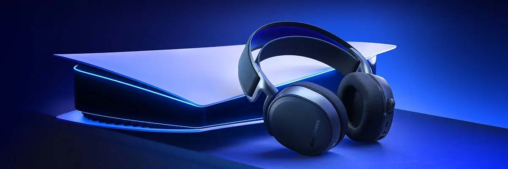
- [Amazon](https://amzn.to/3DvlRdc)
- [官方网站](https://jp.steelseries.com/gaming-headsets/arctis-7p-plus)

电竞厂商 SteelSeries 新发售的耳机。可通过 2.4Ghz WiFi、音频线、Type-C 等多种方式实现双连接。

此外,同一厂商早就有的 [SteelSeries ARCTIS 9 WIRELESS](https://amzn.to/3vUPUWW) 也是这一品类的先驱,虽然偏重,但口碑很好。

重量: 354g, 续航: 最长 30 小时, 价格: 2.3 万

#### 2. INZONE H7

- [Amazon](https://amzn.to/3A0165K)
- [官方网站](https://www.sony.jp/inzone/products/INZONE_H7/)

Sony 推出的电竞耳麦。当然主要是面向 PS5 的,但因为支持混音,所以拿来配 Switch 完全没问题。还有带主动降噪的高端型号 H9。

重量: 325g, 续航: 最长 40 小时, 价格: 2.8 万

#### 3. CORSAIR HS70 Bluetooth
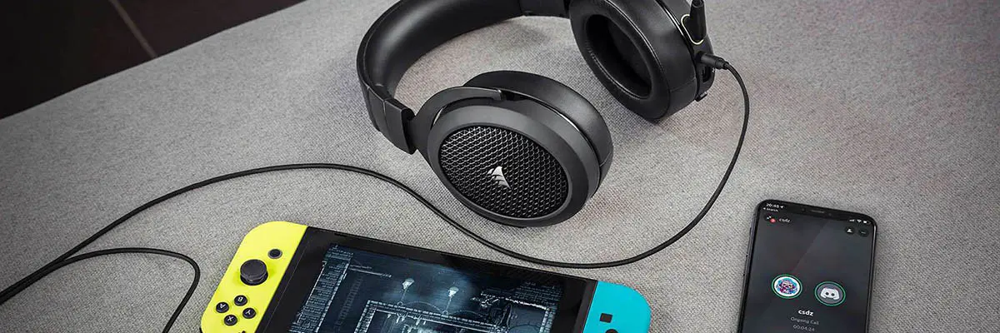
- [Amazon](https://amzn.to/3wgYEHd)
- [官方网站](https://www.corsair.com/kr/ja/カテゴリー/製品/ゲーミングヘッドセット/ステレオ-ヘッドセット/HS70-BLUETOOTH-Multi-Platform-Gaming-Headset/p/CA-9011227-AP)

这款不支持 2.4GhzWi-Fi,但能<b>把有线连接和 Bluetooth 进行混音播放</b>。所以手机用 Bluetooth、Switch 用有线连接,就能像其他产品一样实现混音播放。

由于变成了有线,**价格比较便宜,而且插到电视上和 PS5 一起用也很方便**。线只有一根,接线简单。非常推荐。

重量: 352g, 续航: 最长 20 小时, 价格: 1.3 万

同一厂商最近也推出了 [支持 2.4Ghz 的型号](https://amzn.to/3QT327c),但据说不支持 Switch([参考](https://kakakumag.com/game/?id=17886))。不过应该同样可以用有线连 Switch、用 Bluetooth 走手机通话。(未确认)

{/*
有线 + Bluetooth 的其他产品
* [ARCTIS 3 | 支持 Bluetooth 的游戏耳机 | SteelSeries](https://jp.steelseries.com/gaming-headsets/arctis-3-bluetooth)
* [H3 Hybrid Black 配备 Bluetooth® 功能的封闭式游戏耳机](https://www.eposaudio.com/ja/jp/gaming/products/h3-hybrid-black-bluetooth-gaming-headset-1000890)
https://howmew.com/19357/
 */}

#### 4. GENKI: Waveform Earphones

这款也不是 2.4Ghz WiFi 连接,但看起来不错,所以放个链接介绍一下。与游戏端的连接是 Bluetooth aptX Adaptive 方式。该产品正在众筹中,请留意。

- [官方网站](https://www.kickstarter.com/projects/humanthings/genki-waveform)

### 注意: 即便宣称支持双无线,有些设备也无法同时播放!
有些产品虽然能通过 2.4Ghz 和 Bluetooth 进行连接,但**只是切换、并不能同时听到两路声音**。Quantum TWS、RAZER Barracuda 等在产品介绍中写着「游玩中的来电也能立即接听,然后再无缝切回游戏声音」之类的描述,可见仅能听到二者之一的声音。说实话相当难分辨,所以一定要在测评文章里确认是否真的支持同时播放再下单。

### 优点
布线极其清爽。不必担心杂音,通话品质也好。

### 缺点
比较昂贵。与有线耳机相比也需要充电。如果同一只耳机也用于 PS5,需要切换 WiFi dongle 的连接对象,稍嫌麻烦。

## 方案5: 使用支持 Bluetooth 的音频混音器
正好在写这篇文章的过程中刚发布,所以匆忙补上。I-O Data 即将发售一款 Switch 用有线、手机用 Bluetooth 连接的混音器。看[说明图](https://www.iodata.jp/lib/manual/pdf2/ad-btmix_hn_manu.pdf)能感受到非常明显的喷射战士既视感。

<EmbedCard
    url="https://amzn.to/3z6KxsD"
    img="http://page-edit.iodata.jp/image/ad-btmixhn_l.jpg"
    title="Amazon.co.jp: Bluetooth 游戏混音器(型号:AD-BTMIX/HN) : 游戏"
    site="amazon.co.jp" />

接线图如下。需要电源是个遗憾。

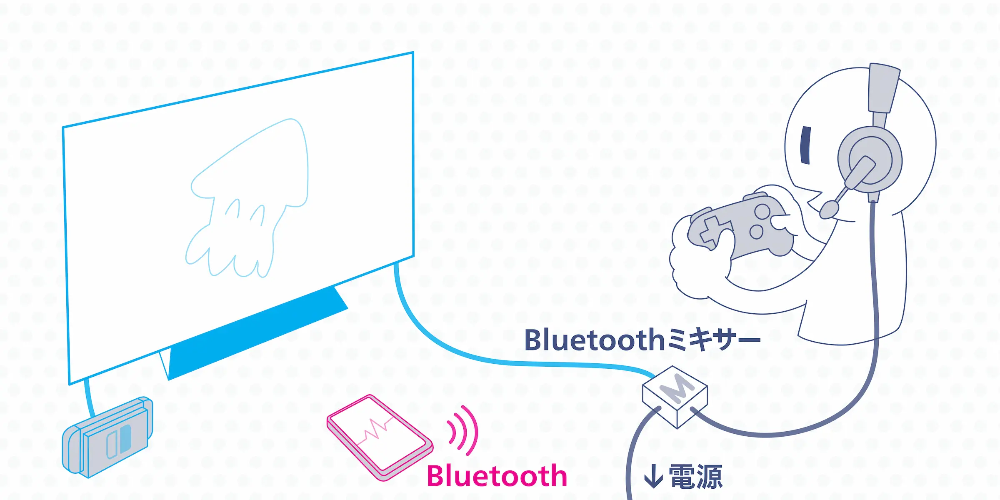

其他厂商的产品里我没见过类似的,所以挺有意思的。但就个人而言,与其买它,不如再加一点钱去买方案 4 介绍的[CORSAIR HS70 Bluetooth](#3-corsair-hs70-bluetooth)更好。

### 优点
比较便宜。可以使用已有的有线耳机。手机端可通过 Bluetooth 连接,这是相比方案 1 的混音器的优势。

### 缺点
设备本身需要电源,所以布线最终还是相对杂乱。

## 总结

把每个方案的优缺点大致整理成表格。

|  | 通话设备 | Switch Lite   ・掌机模式 | 价格参考 | 与PS5共用 | 音质
| --- | --- | --- | --- | --- | --- |
| 方案1: 混音器 | 手机 / PC | △ | 2千日元〜 | ◯ | ◯ |
| 方案2: 开放式耳机 | 手机 / PC | ◯ | 1万日元〜 | ◯ | △ |
| 方案3: 采集卡 | PC | ✗ | 5万日元〜 | ◯ | ◯ |
| 方案4: 双无线 | 手机 / PC | △ | 2万日元〜 | △ | ◯ |
| 方案5: Bluetooth混音器 | 手机 / PC | △ | 5千日元 | ◯ | ◯ |
