import EmbedCard from '@/components/Blog/EmbedCard.astro';

## 背景

モバイルアプリには `Tab bar`, `Toolbar`, `Status bar`, `Menu bar`, `Navigation bar`, `Sidebar`, `App bar`, `Gesture bar` など、**Bar**がつくUIがたくさんあります。

これらのUIがどれのことで、目的や制約を正しく理解していますか？また、iOSとAndroidそれぞれで、**同じ名前でも別のUIを指したり、挙動が違う**ことを理解していますか？

また2025年の[OS26の発表](https://www.apple.com/jp/newsroom/2025/06/apple-introduces-a-delightful-and-elegant-new-software-design/)や[Material 3 Expressiveの発表](https://m3.material.io/blog/building-with-m3-expressive)以降で、さりげなーくそれらの名称が変わったのをご存知ですか？

この記事では俯瞰して一覧で見ることを目的としているので、デザイナーやエンジニアは、公式仕様をしっかり読み込みましょう。公式のFigmaもよく整理されているので、見てみるのもおすすめです。「この見た目のはこう呼ぶんだな」がわかりやすいです。

* Apple
    * [ヒューマンインターフェイスガイドライン | Apple Developer Documentation](https://developer.apple.com/jp/design/human-interface-guidelines/)
    * [iOS and iPadOS 26 | Figma](https://www.figma.com/community/file/1527721578857867021)
* Google
    * [Material Design 3 - Google's latest open source design system](https://m3.material.io/)
    * [Material 3 Design Kit | Figma](https://www.figma.com/community/file/1035203688168086460)

## 各部位ごとの名称まとめ

以降にBar系UIの名称と外観についてまとめます。各名称をできるだけ公式ドキュメントへリンクしていますが、iOSは古いドキュメントは残ってませんのでリンク無しです。

### OS最上部のバーUI

|  | iOS | Android |
| :--: | :--: | :--: |
| 現在 | 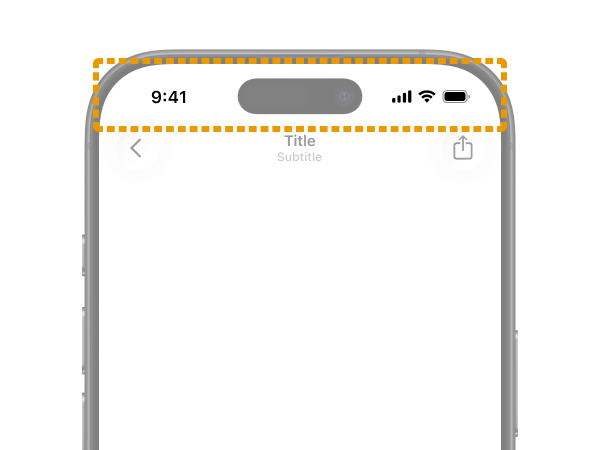   [Status bar](https://developer.apple.com/design/human-interface-guidelines/status-bars) | 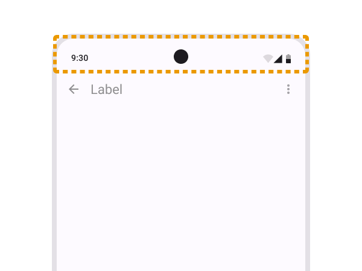    [Status bar](https://developer.android.com/design/ui/mobile/guides/foundations/system-bars#status-bar) |
| 以前 | 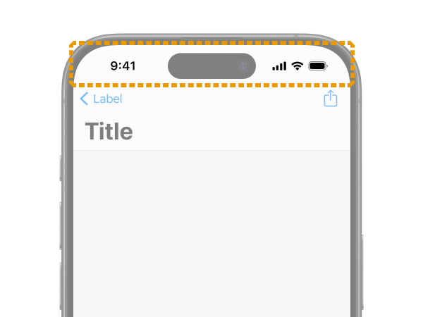   名称変更無し | 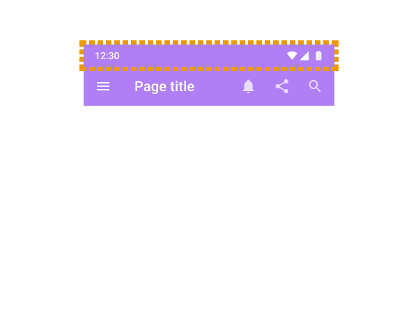    [名称変更無し](https://m2.material.io/design/platform-guidance/android-bars.html#status-bar) |

これはわかりやすいですね。時計・ネットワーク・バッテリーなどシステムの状態を表示するシステムUIです。

基本的に開発側でカスタムできることは少ないです。動画プレーヤーやゲームアプリなどで全画面表示したい場合、隠したりすることは可能です。

### OS最下部のバーUI

|  | iOS | Android |
| :--: | :--: | :--: |
| 現在 | 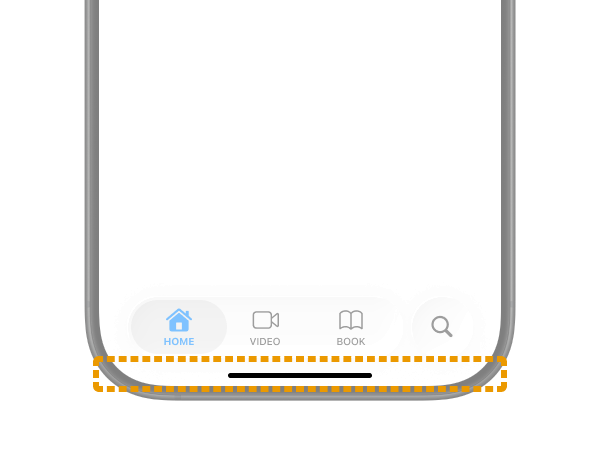   Home indicator | 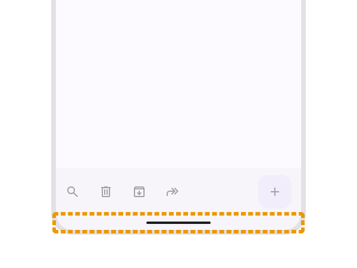    Gesture bar ※[公式Figma](https://www.figma.com/community/file/1035203688168086460)での呼称 |
| 以前 | 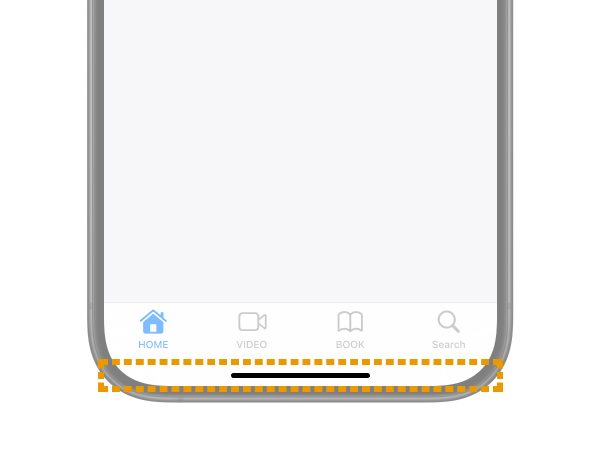   名称変更無し | 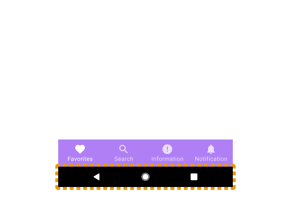    [Android navigation bar](https://m2.material.io/design/platform-guidance/android-bars.html#android-navigation-bar) |

OSのホーム画面に戻ったり、アプリを切り替えたりするためのシステムUIです。`Status bar`同様、あまり開発者が考慮することはないです。

`Home indicator`の公式ガイドライン自体は見つけられなかったのですが、開発者向けのドキュメント([例](https://developer.apple.com/documentation/uikit/uiviewcontroller/prefershomeindicatorautohidden))やユーザーヘルプで良く登場する呼称です。

Androidでは`Status bar`とまとめて`System bar`と呼ばれたりもします。`Gesture bar`という名前も正式なガイドラインにある呼称ではなく、いまだにGoogleの一部記事では`Navigation bar`と書かれています。しかしMaterial Design 3において`Navigation bar`は後述するタブUIをことを指すことになったので、今後これは間違いになっていくと思います。

### アプリ内の上部のBar

|  | iOS | Android |
| :--: | :--: | :--: |
| 現在 | 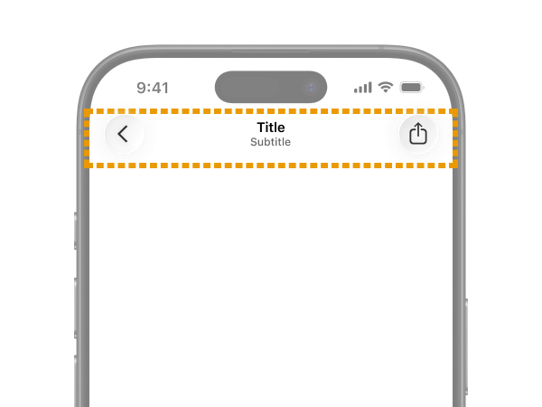   [Toolbars](https://developer.apple.com/design/human-interface-guidelines/toolbars) | 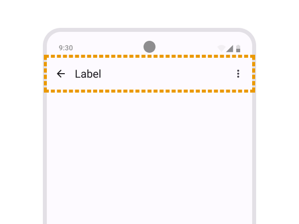    [App bars](https://m3.material.io/components/app-bars/overview) |
| 以前 | 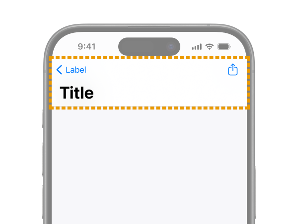   Navigation bar | 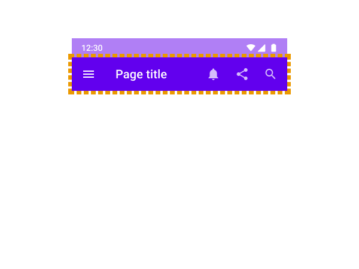    [App bars: top (Top app bar)](https://m2.material.io/components/app-bars-top) |

アプリ内での現在位置を示したり、前の画面に戻るボタンを置いたりするためのBarです。Webの世界では`Header`UIと呼ばれることが多いですね。

これが一番むずかしいというか紛らわしいです。この次に登場する「アプリ内の下部のBar」といっしょにチェックしてみてください。

iOSでは`Navigation bar`が正式なUI名称でしたが、OS26に伴うHIGのアップデートから上部も下部も`Toolbars`に**統合**されました。ただしHIGには以下のように

> In iOS, a navigation-specific toolbar is sometimes called a navigation bar.

という表記があるので、引き続き上部のBarを`Navigation bar`と呼んでも間違いでは無いらしいです。おそらく多くのドキュメントや実装APIに名前が残っているからでしょうが、紛らわしい。

Androidでは**逆に**以前までは上部も下部も`App bar`と呼ばれていたのが、上部のみを`App bar`、下部のものは`Toolbar`と呼ぶように**分解**されました。ああ紛らわしい、、、。

### アプリ内の下部のBar

|  | iOS | Android |
| :--: | :--: | :--: |
| 現在 | 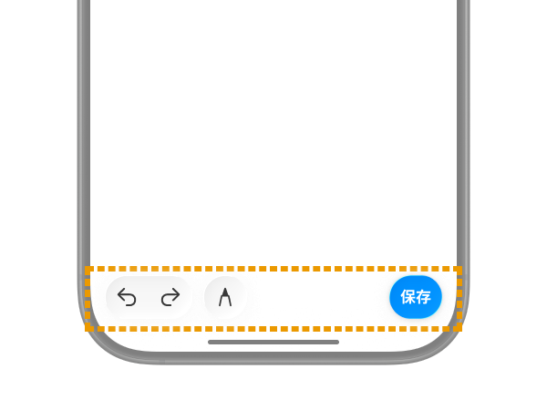   [Toolbars](https://developer.apple.com/design/human-interface-guidelines/toolbars) | 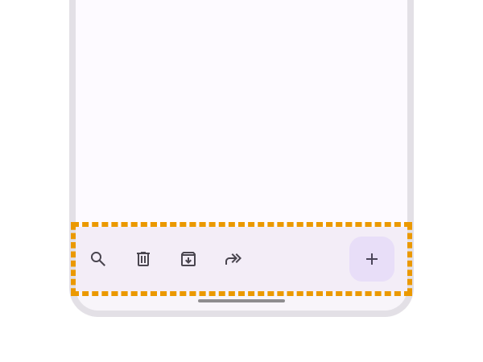    [Toolbars](https://m3.material.io/components/toolbars/overview) |
| 以前 | 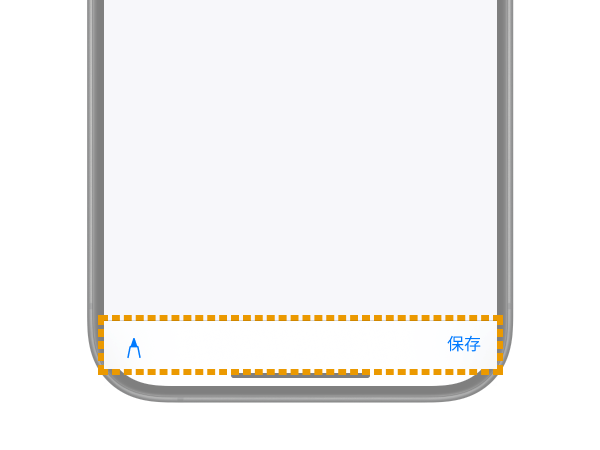   名称変更無し | 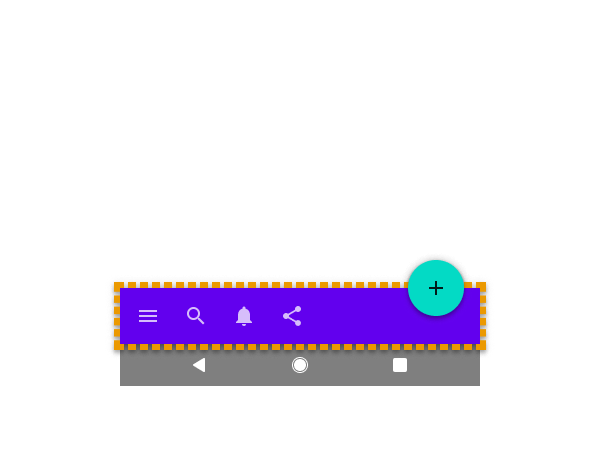    [App bars: bottom (Bottom app bar)](https://m2.material.io/components/app-bars-bottom) |

現在の画面に何かアクションをするためのBarです。登場頻度は少なめ。Webの世界では`Footer`UIと呼ばれることが多いですね。

この次の「グローバルナビゲーションのタブバー」と同じ位置に表示され似ていますが、明確に別のUIです。

### グローバルナビゲーションのタブバー

|  | iOS | Android |
| :--: | :--: | :--: |
| 現在 | 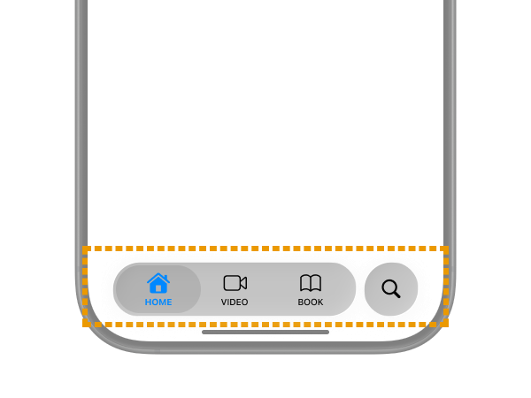   [Tab bars](https://developer.apple.com/design/human-interface-guidelines/tab-bars) | 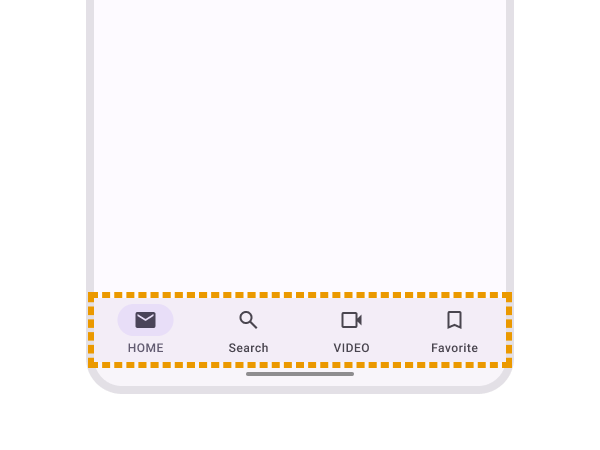    [Navigation bar](https://m3.material.io/components/navigation-bar/overview) |
| 以前 | 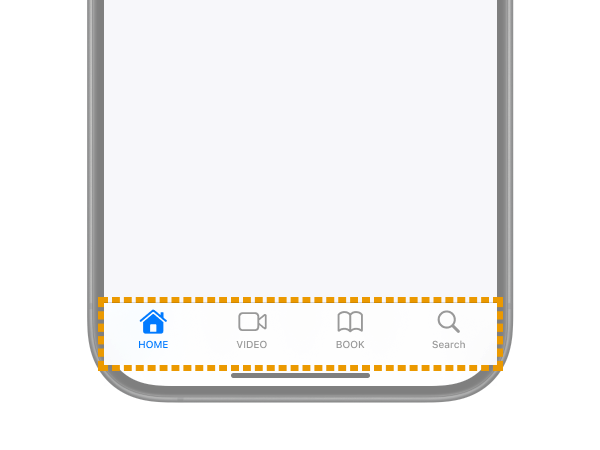   名称変更無し | 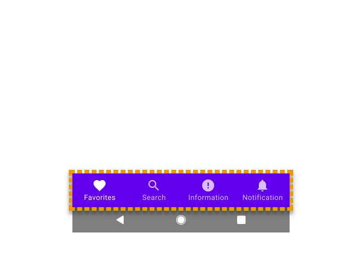    [Bottom navigation](https://m2.material.io/components/bottom-navigation) |

はい、また`Navigation bar`という名称が登場しました。Androidでは今後は下部のタブUIを`Navigation bar`と呼びます。

iOSは昔から`Tab bars`で名称には変化がないです。しかし最近は挙動や見た目が大きくアップデートされる頻度が高く、開発者泣かせです。OS26では見ての通りガラス状の見た目になり、配置もフローティング&変形するようになりました。

<small class="reference">
    参照: <a href="https://www.apple.com/jp/newsroom/2025/06/apple-introduces-a-delightful-and-elegant-new-software-design/" target="_blank">Apple、楽しくて優雅な新しいソフトウェアデザインを発表 - Apple (日本)</a>
</small>

### 通知で表示されるバー

|  | iOS | Android |
| :--: | :--: | :--: |
| 現在 | 無し |     [Snackbar](https://m3.material.io/components/snackbar/overview) |
| 以前 | 無し |     [名称変更無し](https://m2.material.io/components/snackbars) |

Material Designで定義される、自動で消える通知UIですね。一般的に「トースト」UIと呼ばれることも多いですが、Androidでは**OSが表示するエラーUIを`Toast`と呼び区別することもある**ので注意です。

[Toasts overview  |  Android Developers](https://developer.android.com/guide/topics/ui/notifiers/toasts)

Appleではこのような<b>自動で消える</b>トースト系の通知UIはNativeに存在しません。カスタムで似たようなUIを実装しているアプリはよくあり、慣例的に`HUD`(Head Up Display)や`Toast`と呼ばれることが多いようです。iOS Nativeの通知UIには[Alerts](https://developer.apple.com/design/human-interface-guidelines/alerts), [Action sheets](https://developer.apple.com/design/human-interface-guidelines/action-sheets)などがあります。

## 番外編: 他にもBarってつくUIの紹介
ここまでは主にスマホのUIについて紹介してきましたが、**iPad**OSを付け加えるともう少し登場します。

### Sidebar

<EmbedCard
    url="https://developer.apple.com/design/human-interface-guidelines/sidebars"
    img="https://developer.apple.com/tutorials/developer-og.jpg"
    title="Sidebars | Apple Developer Documentation"
    site="developer.apple.com" />

`Tab bar`同様にアプリ内でのセクションを移動するためのナビゲーションUIです。iPadOSでは`Tab bar`は上部に表示するか、代わりにこの`Sidebar`を使うことを推奨されます。`Tab bar`と`Sidebar`を統合する実装も可能で、ユーザーが切り替えて利用できるようになります。

https://developer.apple.com/design/human-interface-guidelines/tab-bars#iPadOS

`Sidebar`はiPadOS, macOS, visionOSでの利用が想定されており、**iOS(iPhone)では非推奨なので注意**です。iOSで同様の目的がある場合は`Tabbar`を使うか、[Sheet](https://developer.apple.com/design/human-interface-guidelines/sheets)を使うのが適切です。

Androidでは[Navigation drawer](https://m3.material.io/components/navigation-drawer/overview), [Navigation rail](https://m3.material.io/components/navigation-rail/overview), [Side Sheets](https://m3.material.io/components/side-sheets/overview)などが似たコンテキストで使用されます。いずれも名称に`Bar`はつきませんね。

### The menu bar

<EmbedCard
    url="https://developer.apple.com/design/human-interface-guidelines/the-menu-bar"
    img="https://developer.apple.com/tutorials/developer-og.jpg"
    title="The menu bar | Apple Developer Documentation"
    site="developer.apple.com" />

画面の最上部、アプリの**外**に表示される横断的なメニューUIです。MacOSやWindowsのデスクトップアプリでは定番ですよね。iPadOS26から、すべてのアプリにiPadでも表示されるようになります。

Android(というかMaterial Design)の[Menu](https://m3.material.io/components/menus/guidelines#9a6467a3-ad1f-4975-a122-73cdd45dc8e6)でも、似たような使い方をされている画面は登場します。

**マウスを前提とするUI**なので、スマホサイズで使われることは考えなくて良いでしょう。

## おわり
もしご質問・ご指摘ありましたら[X](https://x.com/psephopaiktes)とかにご連絡ください。

ついでにここで復習です。`Navigation bar`とは
* Apple系OSにおいてはアプリ上部のヘッダーUI (※ただし以前からの慣例名、現在の正式名は`Toolbars`)
* **現在の**AndroidOSにおいてはアプリ下部のタブUI 
* **以前の**AndroidOSにおいてはホームに戻るシステムUI(※ただし未だにこっちを使う公式資料もある)

のことでした。ムズすぎ。
