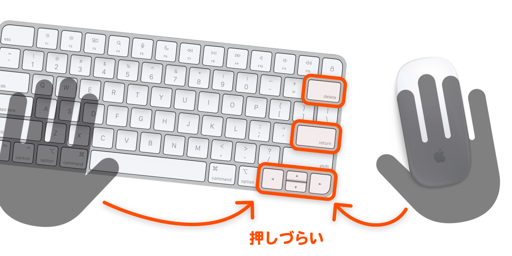
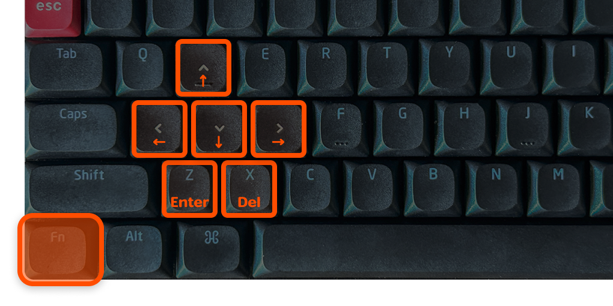
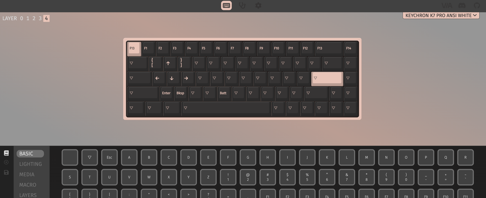
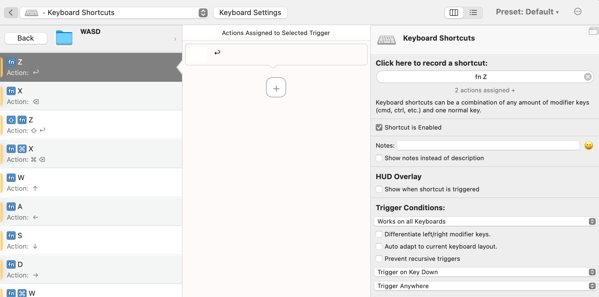
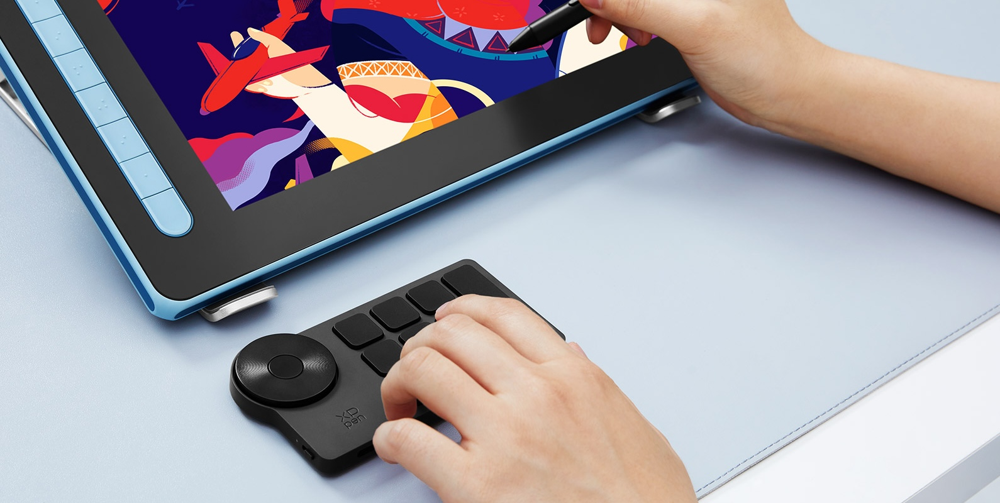
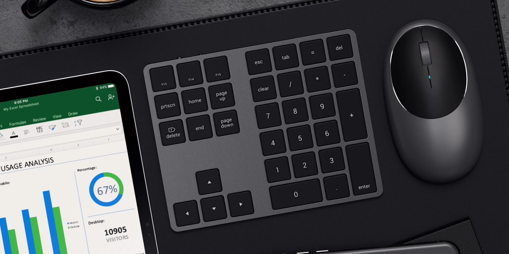
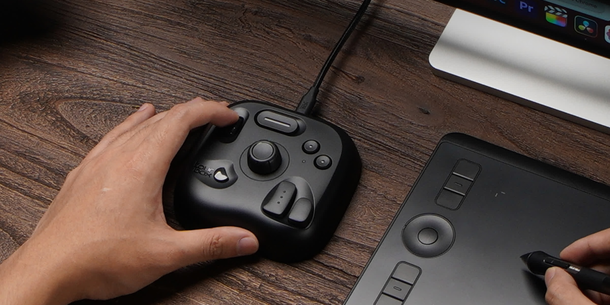

import EmbedCard from '@/components/Blog/EmbedCard.astro';

この記事はこんな方に向けた作業効率化の記事です

* 右手でマウスを使って仕事しているひと
* 特にFigmaやAdobe系などのソフトウェアを使っているひと
* いわゆる左手用デバイスの導入を検討しているひと

## マウスを使っていると主要なキーが遠い

FigmaやAdobe系のデザインソフトでは、キーボードショートカットで以下のキーをめちゃくちゃ利用します。

* Enter
* Delete
* 上下左右(矢印)キー

その他Office系ソフトや動画などの再生中など、あらゆるシーンでかなり使いますよね。なのにこれらは、キーボードの**右側に配置**されています。そのため、マウスを使っている場合はこれらのキーが押しづらく、右手でも左手でも押すには手の移動距離が長く効率がたいへん悪いです。

<small>左右どっちからも遠い！</small>

さらにこれは巻き肩や腱鞘炎にも悪いです。文章入力以外では、右手はずっとマウス、左手はキーボードの左側ポジションから動かさないのが理想です。そこで本記事では表題の通り、**右配置されてるキーを簡単に押せるようにする解決策**をご紹介します。

## 解決策1: キーボードの左側で主要なキーを押せるようにする

私はこの方法です。`Fn`キーを押しながら`W`,`A`,`S`,`D`などのキーを押すことで、矢印やEnterキーを実行できるようにしています。

以下のような設定をしており、めちゃくちゃ快適です。さまざまなショートカットを左手だけで実行できます。キーキャップもわかりやすく変えちゃってます。

私の場合はさらに`Q`,`E`,`C`などにもFigmaで多用するキーを使えるようにしています。実現するには以下の2パターンの方法が取れます。

### ハード側で設定する
キー配列が変更できるキーボードを使う方法です。私が使っている[Keychrone](https://amzn.to/3VWQLEn)は、VIAという方式ですごく簡単に配列を変更できます。

### ソフト側で設定する
キーボードショートカットを自由に変更できる常駐ソフトを使う方法です。Macであれば[BTT](https://folivora.ai/)や[Keyboard Maestro](https://www.keyboardmaestro.com/main/)あたりが定番です。外出先などで外付けキーボードが無いときにも同様の機能が使えます。

私が使っているBTT用の設定プリセットを用意したので、良かったらダウンロードしてBTTで使ってみてください。

<a class="download" href="/download/WASD.bttpreset" download="WASD.bttpreset">WASD.bttpreset</a>

 
## 解決策2: マウス側で主要なキーを実行できるようにする

デザイナーの宮澤さんや長藤さんが昔から紹介されている方法です。おふたり共Enter, Delete, 矢印キーをマウスだけで実行できるように設定されています。図解がめちゃくちゃわかりやすいですね。

<blockquote class="twitter-tweet">
使いやすさを模索しながら随時アップデートしてるマウスのボタンのデフォルト設定。現在はこんな感じ。 さらに、アプリごとにボタンの割り振りを変えてます。 （Logicool G604 と SteerMouse を使用） <a href="https://t.co/S0datz4B5i">pic.twitter.com/S0datz4B5i</a>
&mdash; 宮澤聖二｜三階ラボ (@onthehead) <a href="https://twitter.com/onthehead/status/1623967176163201026?ref_src=twsrc%5Etfw">February 10, 2023</a></blockquote> 

<blockquote class="twitter-tweet">
マウスにReturn, Delete, カーソルキーを割り振るとめっちゃ作業がはかどりますよ〜！ <a href="https://twitter.com/hashtag/steermouse?src=hash&amp;ref_src=twsrc%5Etfw">#steermouse</a> <a href="https://t.co/Jo3TE2Xb5f">pic.twitter.com/Jo3TE2Xb5f</a>
&mdash; 長藤寛和 (@kanwa) <a href="https://twitter.com/kanwa/status/1024857936323960833?ref_src=twsrc%5Etfw">August 2, 2018</a></blockquote> 

私も多ボタンマウスを使っていますが、主にブラウザ操作系のジェスチャーをたくさん割り当てているので非採用でした。（あと、個人的にはマウスでキー入力を実行するのが直感的に感じないので。）

## 解決策3: 左手デバイスを使う

世の中には**左手デバイス**というものがたくさんあり愛用してるクリエイターの方も多いです。キーボードの左側に配置して使う拡張デバイスで、それぞれのキーに任意のショートカットや機能を割り当てられるものが多いです。

iPadや液タブでイラストを描く絵師の方には定番ですね。個人的にはデスクの上がごちゃつくのと、`⌘⌫`や`⇧←`など他のキーと組み合わせたショートカットが押しづらいのでNGです。左手の移動も多くなりますし。

いくつか検討したものを紹介しておきます。

### いわゆる左手デバイス
このへんの見た目が良いやつをいくつか検討してました。

* [XPPen](https://amzn.to/3JbBNCU)
* [HUION](https://amzn.to/3vOvzFX)
* [Razer Tartarus V2](https://amzn.to/4aSe6vj)
* [YesWord X-20](https://amzn.to/4apPqu8)

<small class="reference">
    参照: <a href="https://www.xp-pen.jp/product/1369.html" target="_blank">XPPen</a>
</small>

### 矢印キー付きのテンキー
導入ハードルが低いので、とりあえず試すのにオススメです。数字も左手で打てるようになるので、エクセルを多用する方には良いかも。

* [Cateck](https://amzn.to/4apPwSw)
* [Satechi](https://amzn.to/49uv5Tm)

<small class="reference">
    参照: <a href="https://satechi.net/products/bluetooth-extended-keypad" target="_blank">SATECHI</a>
</small>

### Stream Deck系
配信者御用達のキーボードですが、設定すれば当然テンキーや矢印キーとしても使えます。使いやすいかは怪しいですが、ほかにも色々使えるのでひとによってはいいかも。

* [Stream Deck MK.2](https://amzn.to/4aQRVFx)
* [Loupedeck Live S](https://amzn.to/49uZNf8)

参考: [【Loupedeck Live S】初心者が使ってみて便利だと思った設定を紹介](https://jagadget.com/loupedecklives/#toc7)

<small class="reference">
    参照: <a href="https://www.elgato.com/jp/ja/p/stream-deck-plus-black" target="_blank">Elgato</a>
</small>

### Bluetoothコントローラー
主にイラストレーターの方向けですね。今回のユースケースとは微妙に違うかもしれません。

* [TourBox Lite](https://amzn.to/4cNDEvh)
* [Clip Studio Tabmate 2](https://amzn.to/3xw9fBA)
* [8BitDo Micro](https://amzn.to/43V7r14)

8BitDo Microはゲーム用なのですが、昔のモデルからiPad絵師にめちゃくちゃ人気があります。

<small class="reference">
    参照: <a href="https://www.tourboxtech.com/jp/" target="_blank">tourbox</a>
</small>

### 自作
自作すればすべて解決、見た目も機能も自由自在です。敷居は高いです。

<EmbedCard
    url="https://hoshinotabibito.com/hidarite-device-for-ipad/"
    img="https://hoshinotabibito.com/wp-content/uploads/2020/10/ipad-hidaritedeviceforipad-eyecatch.png"
    title="【iPad左手デバイス】procreateにも使える！自作キーボードのススメ！ | 星ノ旅ビト"
    site="hoshinotabibito.com" />
