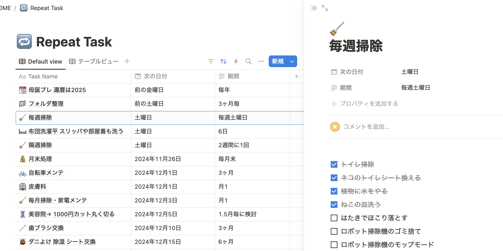
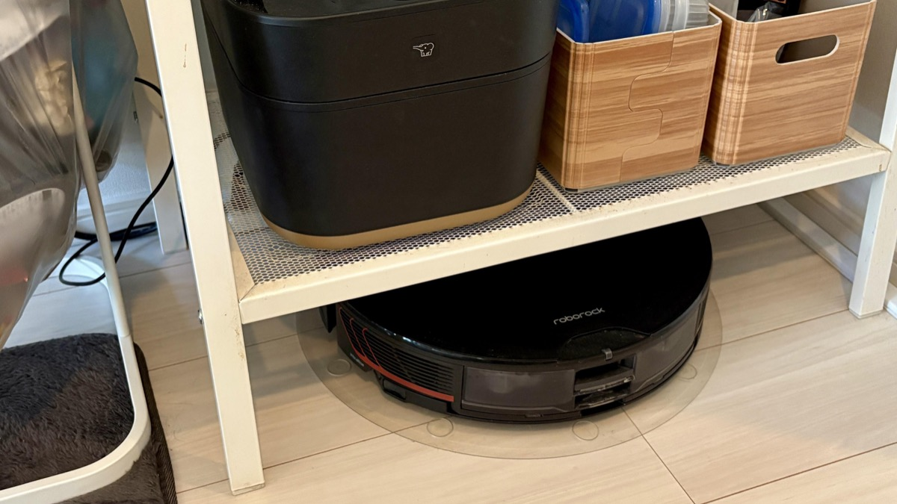
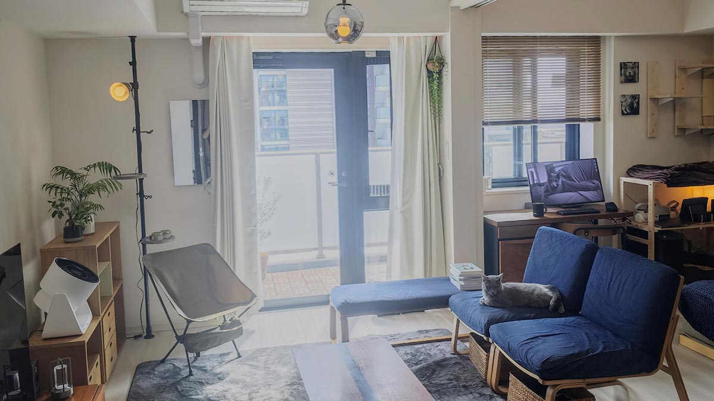
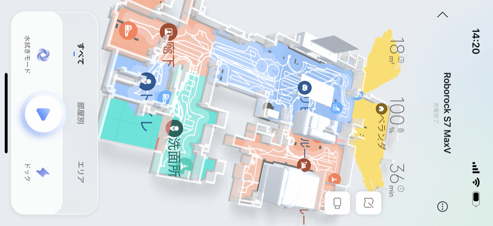
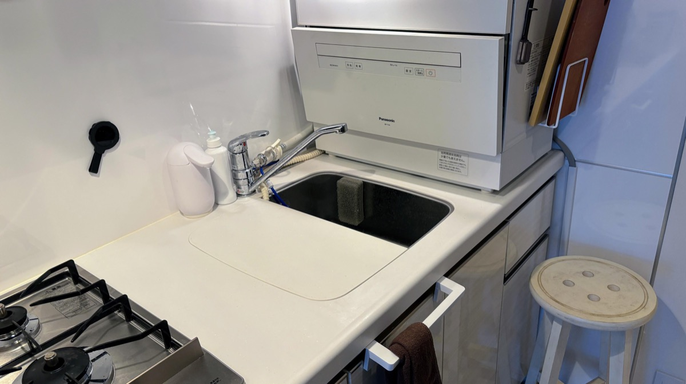
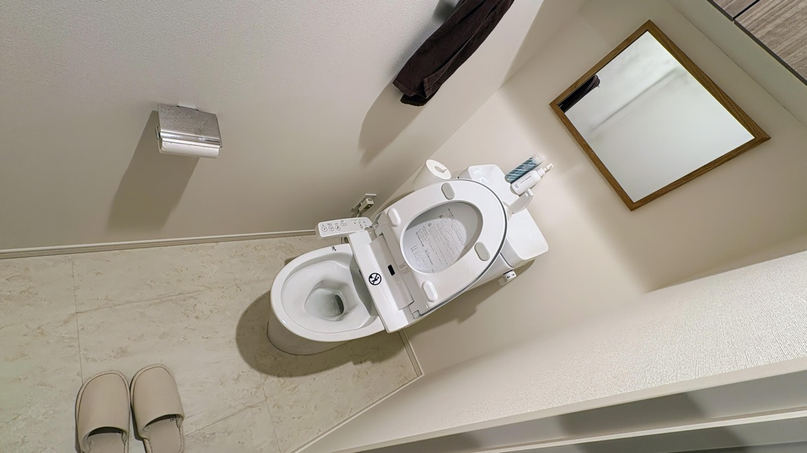
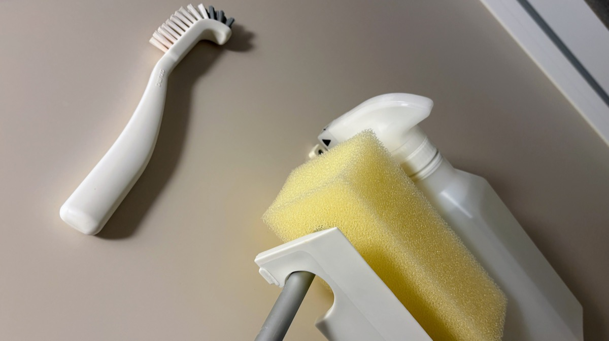
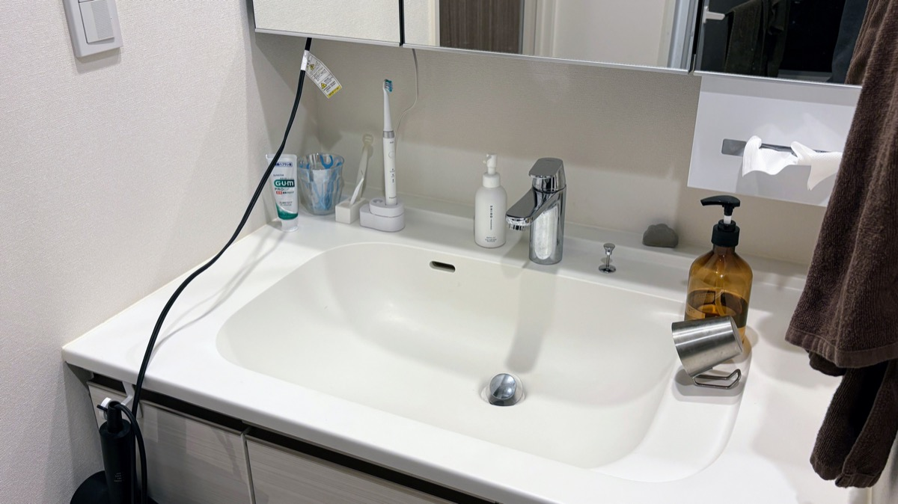
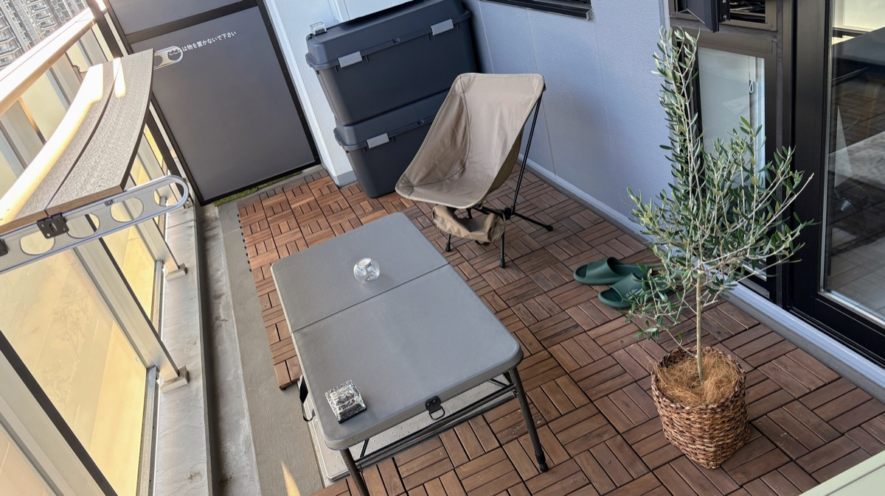

import EmbedCard from '@/components/Blog/EmbedCard.astro';

## 原則

### 🔁 定期タスク化してリマインドする

個人的に最重要です。ズボラは「汚れてきたら掃除する」は絶対しないですし、そもそも毎日暮らしてると汚れてることに気づきません。毎週やること・毎月やることをルーティン化してその時だけやるのが効率良いです。

リマインドするアプリは普段使っているカレンダーでもタスクアプリでも紙媒体でもなんでもいいと思います。私は[Notion](https://notion.so)のデータベースで管理しています。

また、家電を購入したときに説明書に書いてある「お手入れ」も、これらのタスクに追記してしまうのが良いです。参考までに、私が設定しているタスク例を[記事の後半](#わたしの定期タスク例)にまとめます。

### 🤖 ロボット掃除機は買え

あったほうが良いです。手動の掃除機やモップ、コロコロで部屋中を網羅するのは現実的じゃないと思います。狭めのワンルームならいらないかもですが。

特に私の場合、<b>鼻炎 & 猫 & アトピー</b>なのでロボット掃除機と空気清浄機が無いと追いつきません。

ルンバは性能の割に高いので、[Roborock](https://www.roborock.jp/), [ECOVACS](https://www.ecovacs.com/jp), [Anker](https://www.ankerjapan.com/collections/cleaner-all), あたりが良いかと。私は[Roborock S7 MaxV](https://amzn.to/40MyJXW)を使っています。

* 賃貸なら5万円前後のモデルで十分です。
* ランダム式とマップ式がありますが、**絶対マップ式がいい**です。ランダム式は時間がかかりますし、掃除漏れが多いです。
* 最近はデフォルトでモップ水掛け機能が付いてるのが多いです。私は週末だけモップ掛けモードしています。
* 1R ~ 2LDKくらいの部屋ならゴミ自動収集ステーションはいらないです。無い方が棚の下に置けて省スペースです。

[IKEAのレールベリ](https://www.ikea.com/jp/ja/p/lerberg-shelf-unit-white-70315935/)ラック、安いしロボット掃除機がちょうど下に置けるのでおすすめです。

個人的には食洗機も強くおすすめしたいですが、賃貸の部屋ではすごく場所を取るので迷いどころ。最近は[Panasonicから小さいのも](https://amzn.to/3Z9osnu)出てきたので、これくらいなら置けるかも。

### 👋 汚れた瞬間が一番掃除が楽
キッチンの油汚れ、鏡の水垢、トイレの飛び跳ね、いずれも**汚れた瞬間に都度掃除するのが、結局一番楽**です。

さらに、**洗剤や掃除道具がすぐ手に取れる場所にあること**もめちゃくちゃ大事です。そのために、目立たない・おしゃれなデザインの道具がGOOD。このあと場所ごとの解説でも触れます。

### 🫧 洗剤は基本1種類 +α でOK
ドラッグストアに行くとさまざまな住宅用洗剤がありますが、揃える必要はまったくないです。よく言われる最低限の洗剤は基本以下の3種類です。

* 酸性の汚れ(油汚れなど) → アルカリ性洗剤・重曹などで落とす
* アルカリ性の汚れ(水垢など) → 酸性洗剤・クエン酸などで落とす
* その他 → 中性洗剤で落とす

**基本はすべて中性洗剤**で、それで汚れが落ちない場所だけ専用の洗剤を用意する考え方でOKです。中性洗剤は以下がおすすめです。

<EmbedCard
    url="https://amzn.to/3VkvRhB"
    img="https://m.media-amazon.com/images/I/71SfLarPZaL._AC_SY879_.jpg"
    title="Amazon | クイックル ホームリセット 泡クリーナー 本体300ml | クイックル | キッチンクリーナー剤"
    site="www.amazon.co.jp" />

<EmbedCard
    url="https://amzn.to/3UW7Ih2"
    img="https://m.media-amazon.com/images/I/41YufpGXw3L._AC_PIbundle-2,TopRight,0,0_SH20_.jpg"
    title="Amazon | 東邦 ウタマロクリーナー 本体+詰替えセット 2個アソート | ウタマロ | マルチクリーナー"
    site="www.amazon.co.jp" />

スプレーボトルを**数本買って各所に置いても、詰め替えが1種類で済む**のも地味に嬉しい。TikTokとかだとウタマロ信者が多いですが、個人的に<b>部屋の取り出しやすい位置においても自然な見た目</b>のホームリセットが好きです。[無印からも似たコンセプトの](https://www.muji.com/jp/ja/store/cmdty/detail/4550344144794)がでてますね。

### 👯 たまにひとを部屋に呼ぶと部屋がきれいになる
可能なら定期的に人を部屋に呼ぶと、ちょっとした大掃除をするきっかけになるのでオススメです。

## 場所ごとの掃除と予防掃除

### 🛋️ リビング・寝室

基本的に平日は毎朝ロボット掃除機かけるだけです。私は起床する時間に動かして目覚まし代わりにしてます。

またできるだけロボット掃除機が通る動線があることも重要。わたしの部屋はベランダと浴室以外はほぼすべてまわる配置です。

週末だけ以下の掃除をやります。
* モップとブロワーで棚や家具の上のホコリを落とす
* 普段動かすのが面倒な机や椅子をずらす
* その後にロボット掃除機を水拭きモードでかける

<EmbedCard
    url="https://amzn.to/40XIh2t"
    img="https://m.media-amazon.com/images/I/51Ec8GJX8GL._AC_SX679_.jpg"
    title="Amazon | サンワダイレクト 電動エアダスター 充電式 4段階風量調整 ガス不使用 自動噴射/手動噴射 シリコンノズル付き アルミ製 グレー 200-CD076GY | エアダスター | 文房具・オフィス用品"
    site="www.amazon.co.jp" />

<EmbedCard
    url="https://amzn.to/40ZDXQ8"
    img="https://m.media-amazon.com/images/I/61XbZfQV2PL._AC_SX679_.jpg"
    title="Amazon｜花王 クイックルワイパー フロア用掃除道具 ハンディ ブラック 本体 + ブラック 取り替え用 8枚入 各種1個セット + Kunutonnオリジナルロゴ入りおまけ付｜はたき・ほこり取り オンライン通販"
    site="www.amazon.co.jp" />

<EmbedCard
    url="https://amzn.to/4fEXAkR"
    img="https://m.media-amazon.com/images/I/71GCMCLYN8L._AC_SX679_.jpg"
    title="Amazon.co.jp: 山崎実業(Yamazaki) ハンディーワイパー スタンド ブラック 約W7.5×D7.5×H15cm タワー tower ケース 収納 2770 : ホーム＆キッチン"
    site="www.amazon.co.jp" />

ちなみにサブ掃除機として[Shark](https://amzn.to/3Zm9ivh)も使ってます。ロボット掃除機が入らない隙間や、すぐ使いたいときはこちらで。

あと地味にウェットティッシュを取りやすい場所に置いとくのが大事かもしれません。私は[無印のウェットティッシュケース](https://amzn.to/3V74Ca9)に[ノンアルコールの除菌シート](https://amzn.to/3CLC1Rq)を入れてます。

### 🍴 キッチン

コンロ周りは**面倒でも料理のたびに掃除するのが結果的にラク**です。油汚れは冷えて固まると本当に落ちなくなります・・・。虫も湧きますし。

シンクは基本的に皿洗いのときついでに食器用洗剤でさっと洗うだけです。汚れ防止の[コーティング剤](https://amzn.to/3CIxiQp)も前の家では試したのですが、正直あまり効果わからなかったです。

換気扇にフィルター貼っとくのはやった方が良いです。半年くらいで真っ黒になります。100均にもありますが、ご自宅の換気扇にあったタイプを探してください。

<EmbedCard
    url="https://amzn.to/4eKJ4qs"
    img="https://m.media-amazon.com/images/I/71WbuL8132L._AC_SX679_.jpg"
    title="Amazon.co.jp: 東洋アルミ(Toyo Aluminium) 換気扇 フィルター 整流板 貼るだけ 切り取りミシン目付き 約64cm×91cm 1枚入 フィルたん S3074 : DIY・工具・ガーデン"
    site="www.amazon.co.jp" />

電子レンジはこちら↓の製品を使って掃除してます。レモンや重曹を使った方法もあるようですが、布巾を使い捨てできてラクなので頼ってます。

<EmbedCard
    url="https://amzn.to/3Z4QfEh"
    img="https://m.media-amazon.com/images/I/71UPPHh0qKL._AC_SX679_.jpg"
    title="Amazon.co.jp: 【まとめ買い】 チン! してふくだけ 電子レンジ専用お掃除シート 3袋×3個 : ホーム＆キッチン"
    site="www.amazon.co.jp" />

ちなみに五徳と排水溝は月1くらいで食洗機にかけてます。圧倒的にラクなのでオススメ。

### 🚽 トイレ

スクラビングバブル2種類セットが最強です。

便座や本体まわりの汚れはトイレットペーパーを↓でさっと湿らせて拭くだけです。

<EmbedCard
    url="https://amzn.to/4i4qTPx"
    img="https://m.media-amazon.com/images/I/71DhUvGXp6L._AC_SX679_.jpg"
    title="Amazon | スクラビングバブル 除菌剤 プッシュタイプ アルコール除菌 トイレ用 本体 300ml | スクラビングバブル (Scrubbing Bubbles) | トイレ洗剤"
    site="www.amazon.co.jp" />

便器は基本的にブラシ使わなくても、この液体たらして5分でほとんどの汚れは落ちます。

<EmbedCard
    url="https://amzn.to/3OuyHfL"
    img="https://m.media-amazon.com/images/I/71lfGt06QBL._AC_SX679_.jpg"
    title="Amazon | 【Amazon.co.jp 限定】 スクラビングバブル 超強力トイレクリーナー 400g×3本 お掃除手袋つき トイレ洗剤 トイレ洗浄剤 黒ずみ トイレ掃除 洗浄 まとめ買い 洗剤 | スクラビングバブル (Scrubbing Bubbles) | トイレ洗剤"
    site="www.amazon.co.jp" />

便器ブラシはブラシ自体が汚れるので嫌いです。どうしても落ちないときは、1本50円の使い捨てブラシを使います。

<EmbedCard
    url="https://amzn.to/3CRfBxQ"
    img="https://m.media-amazon.com/images/I/71b-e1IVO-L._AC_SX679_.jpg"
    title="Amazon.co.jp: 創和 トイレの黄ばみすっきり棒20本入 掃除用品 日本製 SOUWA : ドラッグストア"
    site="www.amazon.co.jp" />

なおマットや便座カバーは掃除の手間が増えるので使っていません。床はロボット掃除機のモップ+ハンディ掃除機です。

あと男性は掃除の手間が100倍になるので立って小用しないように。

### 🛁 浴室

まずカビについてですが、**換気扇は絶対24時間回し続けましょう**。カビの発生が圧倒的に減りますし、電気代は数百円です([参考](https://enepi.jp/articles/510))。トイレも24時間稼働していいです。

近年は予防掃除として[防カビくん煙剤](https://amzn.to/4fXTfcr)や[吊るすタイプの防カビ剤](https://amzn.to/4fXTfZZ)が人気ですが、わたしはこれらはあまり効果を実感できなかったので使うのをやめました。パッキン部分に[100均のマステ](https://jp.daisonet.com/products/4550480298399)を貼っておくのはオススメです。

また棚や床に直接シャンプーなどを置かないのも定番ですね。[専用ハンガー](https://amzn.to/494eRl3)で吊るしたり、マグネットで壁にひっつけるのが良いです。100均でも売ってます。

<EmbedCard
    url="https://amzn.to/4fB2O18"
    img="https://m.media-amazon.com/images/I/61EN44jcDYL._AC_SY879_.jpg"
    title="Amazon｜山崎実業(Yamazaki) たっぷり洗剤が出る マグネット ディスペンサー シャンプー ブラック W7×D8×H25cm タワー tower 浮かせる収納 詰め替えボトル シャンプーボトル 1533｜ソープ・シャンプー用ディスペンサー - ホーム＆キッチン オンライン通販"
    site="www.amazon.co.jp" />

次に水垢ですが、私は風呂に入り汚れがあったら、**シャワーの冷水が温まるまでの水流**で掃除しています。待ち時間でタイパ良く掃除できるのでオススメ。こちらもスポンジ・洗剤が手に届くところにあるのが大事ですね。洗剤はこだわり無いですが、無印のをひっかけています。

鏡も基本は同じように掃除するだけです。鏡の白い汚れはほとんどが水道水による水垢なので、風呂上がりにスキージーで水を落とすとだいぶ予防できます。

最後に、風呂から出る前に冷水シャワーで壁と床を流すといいです。湯気の発生を抑えてカビ予防と、飛び散ったシャンプー等の石鹸カスを減らせます。余談ですが手足に冷水をかけると自律神経を整える効果があるらしいので([参考](https://weathernews.jp/s/topics/202001/160125/))、わたしはそのついでにやってます。

ちなみに風呂上がりに浴室の壁・床の水分を体を拭いた後のタオルで拭き取るとマジでカビも汚れも発生しないらしいでが、そこまでは面倒でやってません。

排水溝は百均のネットをつけて、月イチ程度で交換しています(髪の長さや何人で暮らしているかで変わると思います)。

またタオルは濡れたまま洗濯機にいれると菌が湧いて臭うので、ちゃんと干してからいれましょう。私は扉の取手に引っ掛けて翌日入るときまで干してます(フェイスタオルを毎日交換する派)。

### 🪞 洗面台

排水溝は元からついてるやつは取り外して、退去時までしまっちゃいましょう。んで、100均のゴミガードを置いて月1とかで使い捨てにしましょう。いろんなタイプがありますが、わたしは[目隠しつきの](https://jp.daisonet.com/products/4582281739917)が好きです。2個入りで安いし、意外と金属に見えて自然です。

鏡は浴室同様、飛び散った水滴を都度拭き取るのが大事です。小さいマイクロファイバー布を取りやすい場所に仕込んどきましょう。

流しの汚れや髪の毛は100均のちっちゃい[吸水スポンジ](https://netshop.cando-web.co.jp/view/item/000000001005)を置いて、気になったら掃除している程度です。ただこのスポンジ固くなって使いづらいので、たぶん[marna](https://amzn.to/418tu4O)か[山崎実業](https://amzn.to/3ZaRr9o)に変えます。

あ、洗濯機のホースが蛇腹タイプの方はラップをまいとくといいですね([参考](https://compactlife-50.com/drain-hose/))。退去時にホコリの掃除がラクになります。

### ☀️ ベランダ・窓

ベランダは立地環境によって汚れ方が変わるので難しいですが、ケルヒャーの携行用タイプがあればわりと完結すると思います。

<EmbedCard
    url="https://amzn.to/4i6MO8X"
    img="https://m.media-amazon.com/images/I/61WQIrIqAtL._AC_SX679_.jpg"
    title="Amazon.co.jp: ケルヒャー(Karcher) マルチクリーナー OC 3 Foldable コードレス USB充電式 水道接続不要 防災/水道より高圧で洗浄(非高圧洗浄機) 簡易シャワー/折り畳めてコンパクト 軽量 タンク一体型 オプションアクセサリー豊富/洗車 墓石掃除 海での砂落とし 泥 自転車 エアコンフィルター 1.599-302.0 : DIY・工具・ガーデン"
    site="www.amazon.co.jp" />

Type-C充電、水道不要、コンパクト収納とかなり優秀です。多少水が飛び散りますが、窓サッシもいけます。

窓は前述した[ホームリセット](https://amzn.to/3VkvRhB)とマイクロファイバーで拭くだけです。

## その他

### 👯 ひとが来る時だけやる掃除
ぶっちゃけひとりで生活する分には気にしないけど、人が来るときだけやっとくか、という掃除タスクです。自宅だと気にならないけど、他人の部屋だと目に付く箇所ですね。

- [ ] 窓を拭く
- [ ] キッチンや洗面台の蛇口を拭く: 中性洗剤で手垢を拭きます。ラクに印象が変わるのでオススメ
- [ ] キッチン・トイレ・浴室・洗面台の水回りを改めてチェック。他人に見せられる状態か
- [ ] 玄関のホコリをチェック
- [ ] ソファや絨毯に消臭スプレー

### 🌷 フレグランス
ネコを飼っている場合はほとんどの芳香剤がNGなので、うちはひたすら消臭剤を置いています。詰替え用の消臭ビーズを買って、トイレ・ネコトイレ・靴箱・キッチン・リビングなど部屋中のいろんな場所に置いてます。

<EmbedCard
    url="https://amzn.to/4i5uyMU"
    img="https://m.media-amazon.com/images/I/71uH0KV5k-L._AC_SX679_.jpg"
    title="Amazon | 消臭力 イオン消臭プラス 部屋用 トイレ用 置き型 無香料 特大 つめかえ 1.5kg クリアビーズ 部屋用 玄関 リビング キッチン トイレ たばこ 消臭剤 消臭 芳香剤 | 消臭力 | 置き型"
    site="www.amazon.co.jp" />

容器は公式のでもいいですが、<b>適当に100均で買った容器でもいいと思います</b>。

### 🐛 虫対策
ここ5年ほどGは1度も出ていません。コバエもだいぶ減らせました。

* 風呂場・キッチン・洗面台等を換気、濡れた汚れを放置しない。
* 排水口を定期的に掃除する。
* ゴミや汚れた皿を放置しない

のが基本。対策製品は以下がおすすめ。

* [くん煙剤](https://amzn.to/3AIZqCo) (毎年春)
* [ブラックキャップ](https://amzn.to/411C19L) (毎年春)
* [無印の殺虫スプレー](https://www.muji.com/jp/ja/store/cmdty/detail/4550583525279) (目立たないので部屋に置きやすい)
* [コバエがいなくなるスプレー](https://amzn.to/40VS9cZ)
* [エアコンホース防虫キャップ](https://amzn.to/492FLty) (100均でも売ってます)
* [すきまパテ](https://amzn.to/3V7FtMq) (シンク下の進入路を塞ぐ)

コバエ取りは[市販の](https://amzn.to/3Z4VyDz)でもいいですが、頻繁に買うと高いので自作も良いですね。

[超かんたん「ペットボトルでコバエ取り器」 | AUT FUN |愛知工科大学](https://www.aut.ac.jp/autfun/5090/)

私は↓の容器にいれています。

<EmbedCard
    url="https://amzn.to/3Z1GqHk"
    img="https://m.media-amazon.com/images/I/71dI7ZM5YlL._AC_SX679_.jpg"
    title="Amazon.co.jp: 山崎実業(Yamazaki) コバエ & 消臭 ポット ホワイト 約W9.5XD9.5XH6cm タワー tower コバエ取りケース 虫よけ 5740 : ホーム＆キッチン"
    site="www.amazon.co.jp" />

### 🧹 水回りはときどきプロに依頼するのもアリ

<b>金より時間</b>派のひとは半年~1年に1回程度だけ家事代行やハウスクリーニングに依頼するのもアリだと思います。わたしも1度CaSyという代行サービスを利用しましたが、億劫な作業をプロがやってくれるのはありがたいですね。キッチン・トイレ・風呂・窓の4箇所で2時間、料金は6千円ほどでした。

家事代行の場合、掃除道具は自分で用意しておく必要があるのでご注意。

よければCaSyの1000円OFFリンクどうぞ→ 
https://casy.co.jp/invite/ycOWk 

## わたしの定期タスク例

さいごに私が実際に設定して実施しているタスク一覧をご紹介します。タスク内容や頻度は住居環境・家族構成などにより全然変わると思うのであくまで参考程度に。

食洗機・空気清浄機・掃除機など、あらゆる家電のメンテナンスも説明書を参考にタスク化していますが、ここでは割愛します。説明書のお手入れはたいてい厳し目に書いてるので、実際は説明書より少ない頻度でお手入れすることが多いです。

タスクを行うたびに「このタスクはもっと頻度下げていいな」「この掃除はもっとやらないとやばいな・・・」を考えて、アップデートしていくのも大事です。

ちなみに私は「歯医者に通う」「非常食の賞味期限」「パソコンのデータ掃除」なども同じ場所で管理しています。

### 毎週
- [ ] 自作コバエ取りの交換（夏のみ）
- [ ] ネコのトイレシート交換
- [ ] 最低限のトイレ掃除
- [ ] ロボット掃除機のゴミ捨てる
- [ ] ブロアー、ハンディモップでホコリを落とす
- [ ] ロボット掃除機のハイパワーモード→水掛けモップモード
- [ ] キッチンや洗面台の手拭きタオルを変える
- [ ] 布団・スリッパ・ルームウェアの洗濯

### 毎月
- [ ] 各部屋の[消臭剤](https://amzn.to/4i5uyMU)のチェック、補充
- [ ] [レンジを拭く](https://amzn.to/3Z4QfEh)
- [ ] [洗面台のゴミガード](https://jp.daisonet.com/products/4582281739917)交換
- [ ] 浴室排水溝のネット交換、汚れがひどければ掃除
- [ ] 浴室の足ふきマット洗う

### 3ヶ月に1回
- [ ] 自転車のメンテナンス
- [ ] 電動歯ブラシのブラシ交換
- [ ] 換気扇フィルターの確認
- [ ] キッチンの排水溝と五徳を食洗機で洗う
- [ ] 冷蔵庫内の掃除

### 半年に1回
- [ ] [洗濯槽クリーナー](https://amzn.to/497rPOX)をかける
- [ ] エアコンの内部フィルターを掃除する
- [ ] 絨毯、ソファカバーを丸洗いする
- [ ] PCキーボードを分解して掃除する
