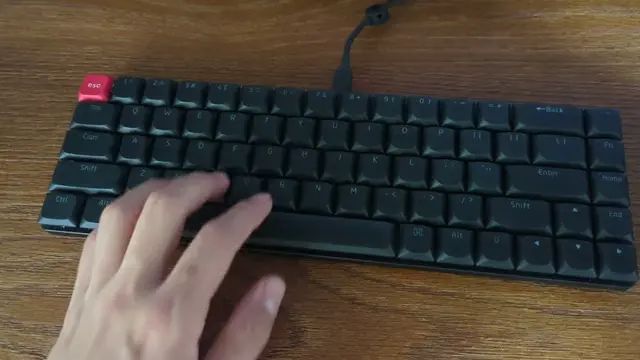

import EmbedCard from '@/components/Blog/EmbedCard.astro';

## 見出し2見出し2見出し2見出し2見出し2見出し2見出し2見出し2
本文。あのイーハトーヴォのすきとおった風、夏でも底に冷たさをもつ青いそら、うつくしい森で飾られたモリーオ市、郊外のぎらぎらひかる草の波。 またそのなかでいっしょになったたくさんのひとたち、ファゼーロとロザーロ、羊飼のミーロや、顔の赤いこどもたち、地主のテーモ、山猫博士のボーガント・デストゥパーゴなど、いまこの暗い巨きな石の建物のなかで考えていると、みんなむかし風のなつかしい青い幻燈のように思われます。では、わたくしはいつかの小さなみだしをつけながら、しずかにあの年のイーハトーヴォの五月から十月までを書きつけましょう

### 見出し3見出し3見出し3見出し3見出し3見出し3見出し3見出し3見出し3
- リスト
- あのイーハトーヴォのすきとおった風、夏でも底に冷たさをもつ青いそら、うつくしい森で飾られたモリーオ市、郊外のぎらぎらひかる草の波。 またそのなかでいっしょになったたくさんのひとたち、ファゼーロとロザーロ、羊飼のミーロや、顔の赤いこどもたち、地主のテーモ、山猫博士のボーガント・デストゥパーゴなど、いまこの暗い巨きな石の建物のなかで考えていると、みんなむかし風のなつかしい青い幻燈のように思われます。では、わたくしはいつかの小さなみだしをつけながら、しずかにあの年のイーハトーヴォの五月から十月までを書きつけましょう
    - ああああ
    - ああああああああああああああああああああああああああああああああああああああああああああああああああああ
    - あああ
- あsdfghjk

#### 見出し4
1. 数値リスト
1. Lorem ipsum elit, sed do eiusmod tempor incididunt ut labore et dolore magna aliqua. Ut enim ad minim veniam, quis nostrud exercitation ullamco laboris nisi ut aliquip ex ea commodo consequat. Duis aute irure dolor in reprehenderit in voluptate velit esse cillum dolore eu fugiat nulla pariatur. Excepteur sint occaecat cupidatat non proident, sunt in culpa qui officia deserunt mollit anim id est laborum.
    1. あああ
    1. あああ
1. asf
    * あああ
    * あああ

## 基本要素
- *斜体*
- <b>軽い強調(bタグ)</b>
- **強い強調**。
- ~~否定~~
- あああ `inline code` あああ
- この文章に脚注をつける.[^1]
- この文章に脚注をつける.[^2]
- [LINK](https://gohugo.io/)
- [ ] 未完了チェック
- [x] 完了チェック

[^1]: 脚注の説明。最後にまとめられる
[^2]: 脚注の説明。最後にまとめられる

> 引用 Lorem Lorem Lorem Lorem Lorem Lorem Lorem Lorem Lorem Lorem Lorem 

<small>※ Smallテキスト</small>

## Link
- URLは自動的にリンク配置: https://gohugo.io/
- <a href="https://gohugo.io/" target="brank_">html link</a>
- [HoverでTitleが出るリンク](https://gohugo.io/ "ウェーイ")


## Definition lists
<dl>
    <dt>Cat</dt>
    <dd>Fluffy animal everyone likes</dd>
</dl>


## Media

```md

```


<small class="reference">
    参照: <a href="https://unsplash.com/" target="_blank">Unsplash</a>
</small>

```md
[](https://test.com)
```

[](https://test.com)


videoファイルは残念ながら同じファイルに置けない...基本GifやWebpがいいかな。

```md

```


どうしても置く場合は `@/public` に置いて以下のようにリンクさすしかないかなあ

```md
<video src="/video/keychrone.mp4" width="640" height="360"controls autoplay />
```

### YouTube
.youtubeクラスをつける

```md
<iframe class="youtube" width="560" height="315" src="https://www.youtube.com/embed/QJm4TWEQST0?si=yk-5TfV8Y1Ewqssj" title="YouTube video player" frameborder="0" allow="accelerometer; autoplay; clipboard-write; encrypted-media; gyroscope; picture-in-picture; web-share" allowfullscreen></iframe>
```

<iframe class="youtube" width="560" height="315" src="https://www.youtube.com/embed/QJm4TWEQST0?si=yk-5TfV8Y1Ewqssj" title="YouTube video player" frameborder="0" allow="accelerometer; autoplay; clipboard-write; encrypted-media; gyroscope; picture-in-picture; web-share" allowfullscreen></iframe>

---

## Table
右寄せ | 左寄せ
--:|:--
aa | aa 
aadg | aadfgb 

header | 真ん中寄せ | header 
:--|:--:|:--
aa | aa | aa 


## CODE Highlight

#### test.js

```js
var elm = document.getElementById('gotop');

    window.addEventListener('scroll', function()
    if( window.pageYOffset > 200 ) elm.classList.add('show');
    else elm.classList.remove('show');

}, false);
```

#### test.html
```html
<!DOCTYPE html>
<html lang="en">
<head>
    <meta charset="UTF-8">
    <meta name="viewport" content="width=device-width, initial-scale=1.0">
    <meta http-equiv="X-UA-Compatible" content="ie=edge">
    <title>Document</title>
</head>
<body>
    <p>Lorem ipsum dolor sit amet, consectetur adipiscing elit, sed do eiusmod tempor incididunt ut labore et dolore magna aliqua. Ut enim ad minim veniam, quis nostrud exercitation ullamco laboris nisi ut aliquip ex ea commodo consequat. Duis aute irure dolor in reprehenderit in voluptate velit esse cillum dolore eu fugiat nulla pariatur. Excepteur sint occaecat cupidatat non proident, sunt in culpa qui officia deserunt mollit anim id est laborum.</p>
</body>
</html>
```

## Embed

<EmbedCard
    url="https://ics.media/entry/201113/"
    img="https://ics.media/entry/201113/images/eyecatch.png"
    title="Adobe Flash作品から学ぶクリエイティブコーディングのテクニック - ICS MEDIAAdobe Flash作品から学ぶクリエイティブコーディングのテクニック - ICS MEDIA"
    site="ics.mediaics.mediaics.mediaics.mediaics.mediaics.mediaics.mediaics.mediaics.mediaics.mediaics.mediaics.mediaics.mediaics.media" />

Amazonの場合、Assosiate Linkと画像URLは自分でコピペ

<EmbedCard
    url="https://amzn.to/3lmzD58"
    img="https://ws-fe.amazon-adsystem.com/widgets/q?_encoding=UTF8&ASIN=B004PGZE7Y&Format=_SL250_&ID=AsinImage&ServiceVersion=20070822&WS=1"
    title="Amazon | キャティーマン 猫用おもちゃ じゃれ猫 LEDにゃんだろー光線 | キャティーマン (CattyMan) | 光るおもちゃ 通販"
    site="amazon.co.jp" />

Bookmarklet

```js
javascript:!function(){
    const og = document.querySelector('meta[property="og:image"]');
    const img = og ? og.getAttribute('content') : '';
    !function(a){
        const b = document.createElement('textarea'), c = document.getSelection();
        b.textContent = a, document.body.appendChild(b), c.removeAllRanges(), b.select(), document.execCommand('copy'), c.removeAllRanges(), document.body.removeChild(b);
    }('<EmbedCard\n'+'    url="'+document.location+'"\n'+'    img="'+img+'"\n'+'    title="'+document.title+'"\n'+'    site="'+location.host+'" />\n');
}();
```

### Twitter

普通にEmbedすればOK

<blockquote class="twitter-tweet"><p lang="ja" dir="ltr">1話3分「超短尺ドラマ」<a href="https://t.co/TWybEeFIyq">https://t.co/TWybEeFIyq</a><br/><br/>Webtoonの動画版か〜音声が必要な分は移動スキマ時間との相性は難しいかもだけど、期待</p>&mdash; 平田 / U-NEXT (@psephopaiktes) <a href="https://twitter.com/psephopaiktes/status/1739951474527080954?ref_src=twsrc%5Etfw">December 27, 2023</a></blockquote> <script async src="https://platform.twitter.com/widgets.js" charset="utf-8"></script>
