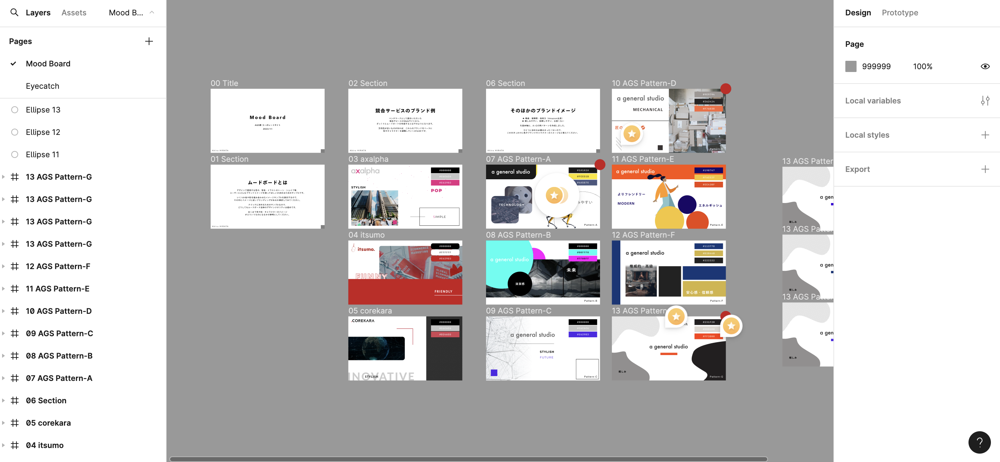
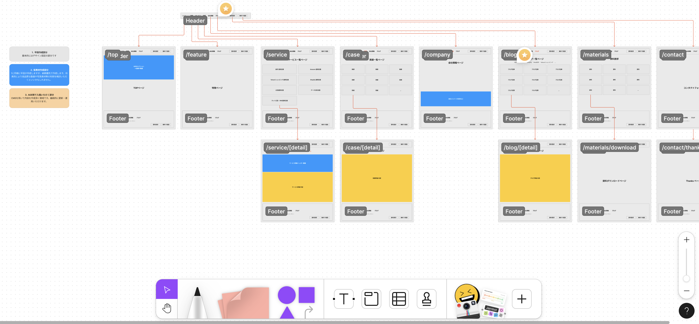
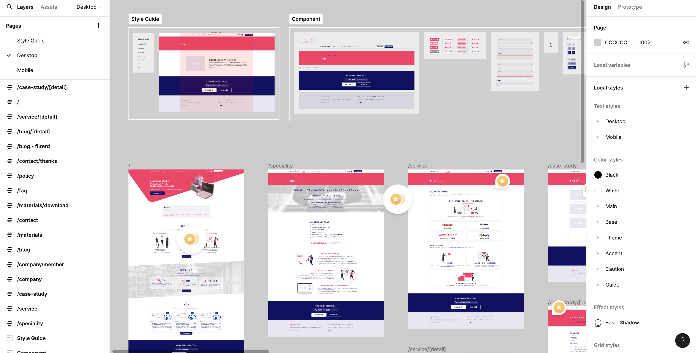

import EmbedCard from '@/components/Blog/EmbedCard.astro';

事業拡大に伴うコーポレートサイトのリニューアルをお手伝いしました。

## ブランディング

ロゴしか無い状況でしたので、ムードボードを作成して企業のキャラクター性や目指すトーンの定義を行いました。

## ワイヤーフレーム

ページ数が多く情報が錯綜していたので、導線設計やユーザーにとって重要な情報のヒアリングを行い、構成を見直しました

## デザイン

Figmaを用いて作成

今回コーディングは別の方が担当されるので、素材やレスポンシブ設計がわかりやすいよう「ドキュメントとしてのFigmaファイル」を意識して作成しています。
