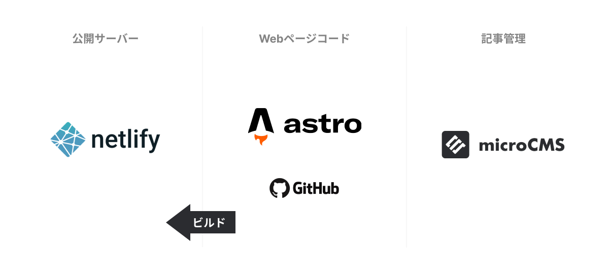

## 概要
ノーコードツールで作成されていたブログメディアサイトのリニューアルを請け負いました。ノーコードツールでは記事のカスタマイズやマーケティングの自由度が低かったため、自由に仕様変更できる環境にするため、フルスクラッチでWebページを作成しました。

## システム構成

私が担当する案件では基本的にWordpressを避け、保守・運用・セキュリティいずれの面からもすぐれているHeadless CMSの構成で構築をご提案しています。

記事の作成・管理は非エンジニアでも利用しやすい[microCMS](https://microcms.io/)を利用し、フロントエンドは非常に高速なWebページを作成できる静的サイトビルダー[astro](https://astro.build/)で構築しています。

ホスティングサーバーは[netlify](https://www.netlify.com/)を利用し、記事の更新に応じてサイトがビルドされるようになっています。
