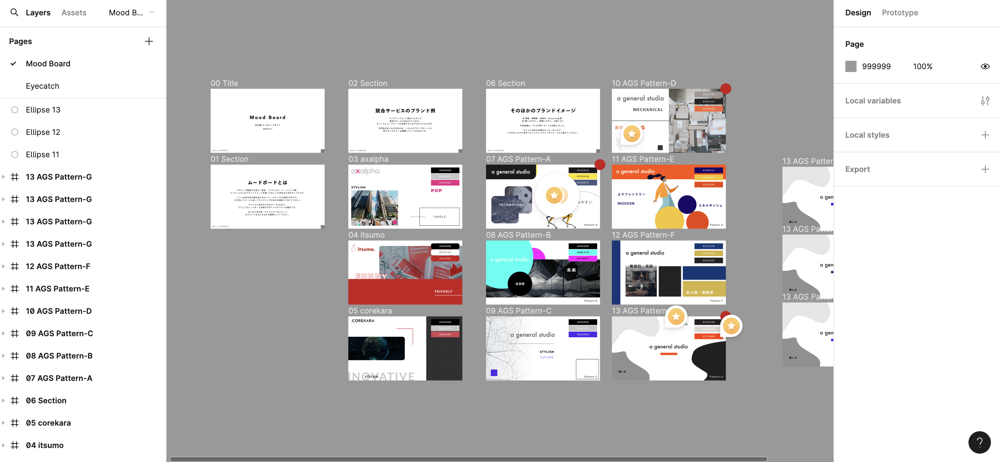

I was responsible for the design of a corporate website renewal accompanying business expansion. *The images shown are from the development phase.

## Branding

Since only a logo was available initially, I created a mood board to define the company's character and target tone.

## Wireframe

With many pages and overlapping information, I conducted interviews about navigation design and user priorities, then restructured the layout.

## Design

Created using Figma

Since coding is being handled by another team, I created this as a "Figma file as documentation" to make materials and responsive design clear and easy to understand.