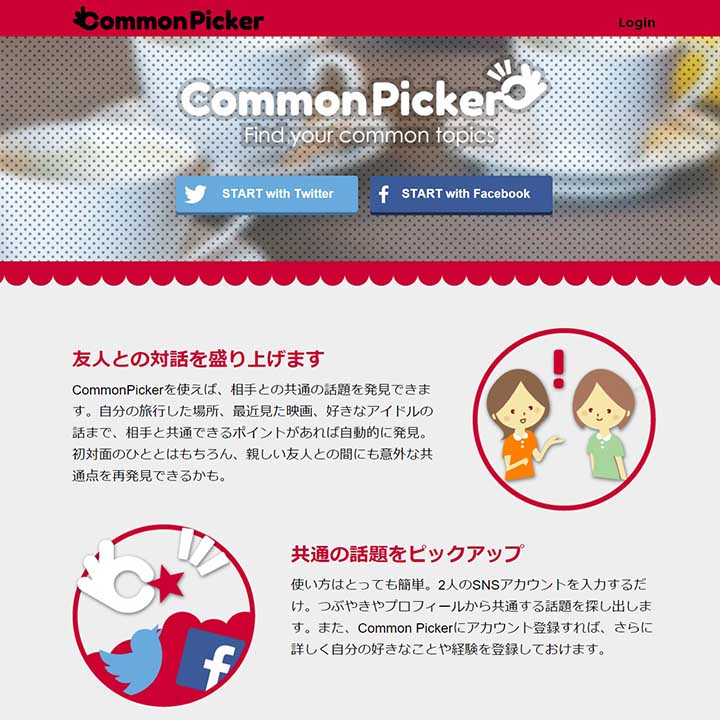
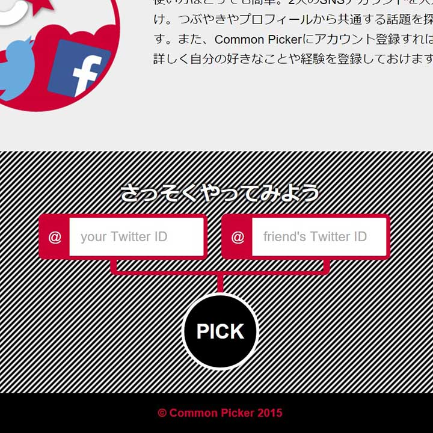
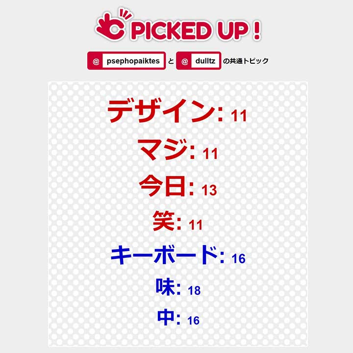

A hackathon entry "Hackerwars" held in Tokyo. By entering two Twitter IDs, the service analyzes the content and provides common topics as suggestions. I participated in a 3-person team, handling planning, design, and frontend development. The project won the Grand Prize and the Jigen Award.

