It's content creation where people enjoy the dishes I prepare, we cook together, and I connect with others through food. My cooking photos were featured on the [Tsukuba apartment information site Tsukuie](https://tsukuba-daigaku.com/?m=201308&paged=19). Since it also helps me study food photography and photo retouching, I'd highly recommend this hobby to designers. I update regularly on [Instagram](https://www.instagram.com/psephopaiktes/), so please check it out!

## Favorite Photos

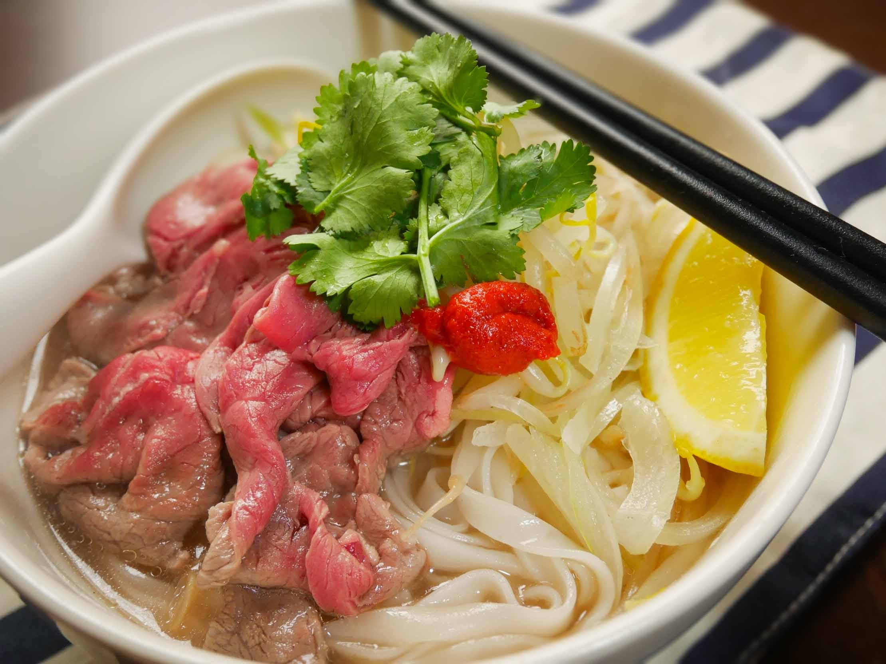

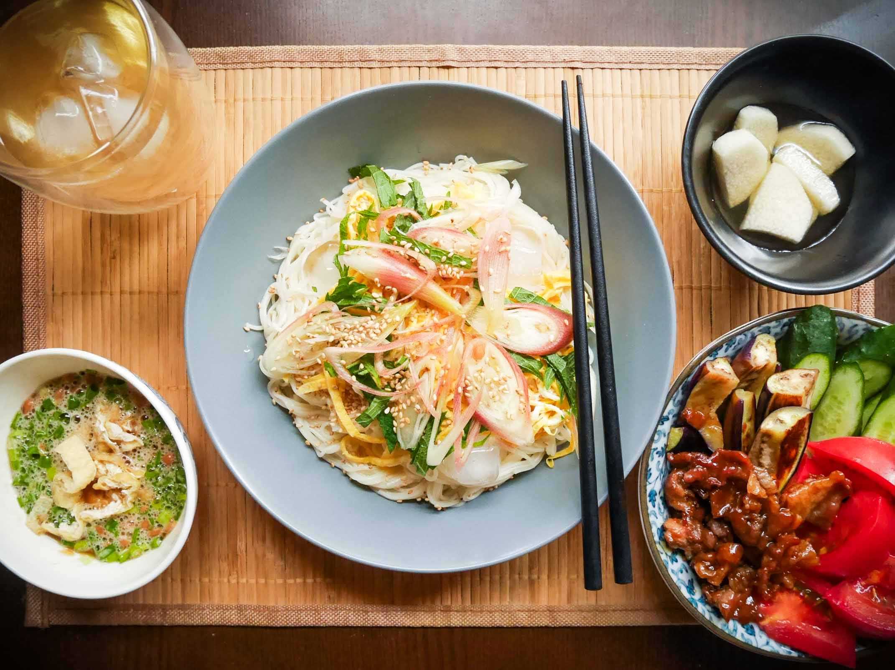

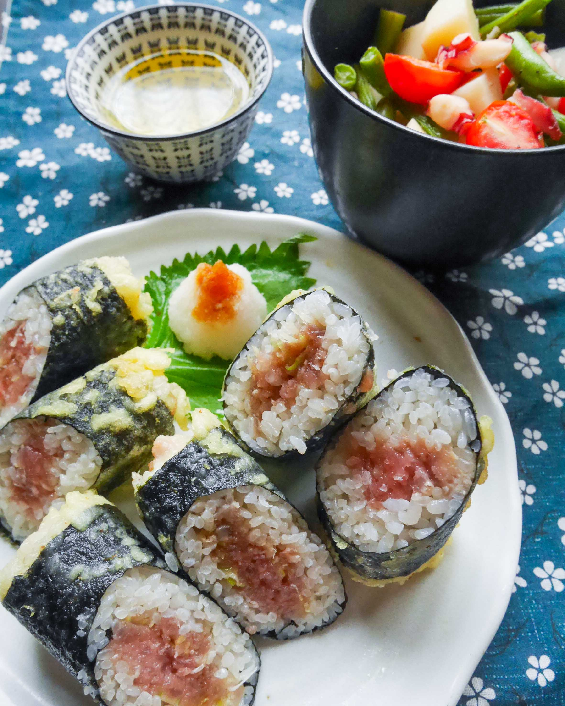

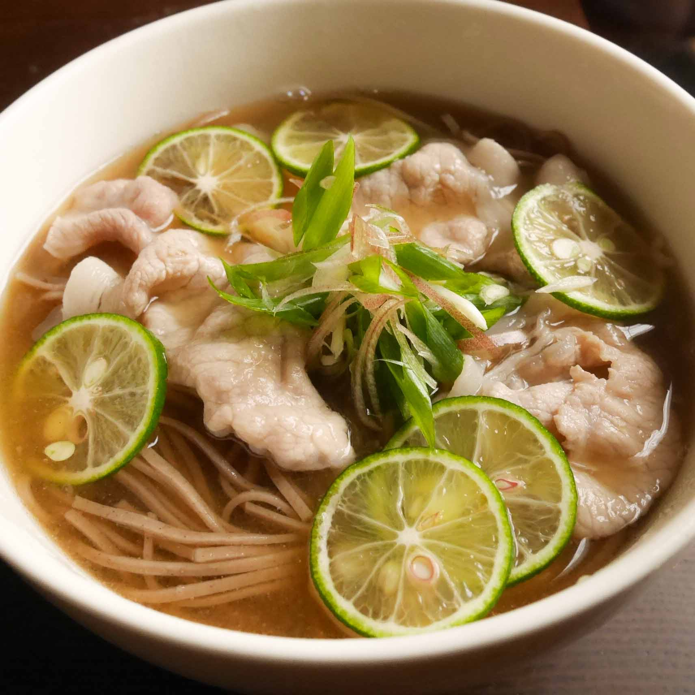

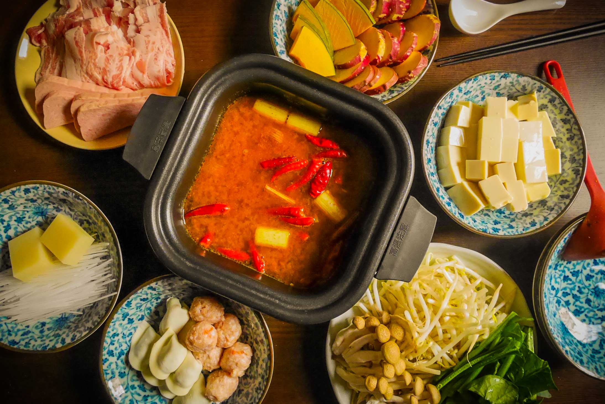

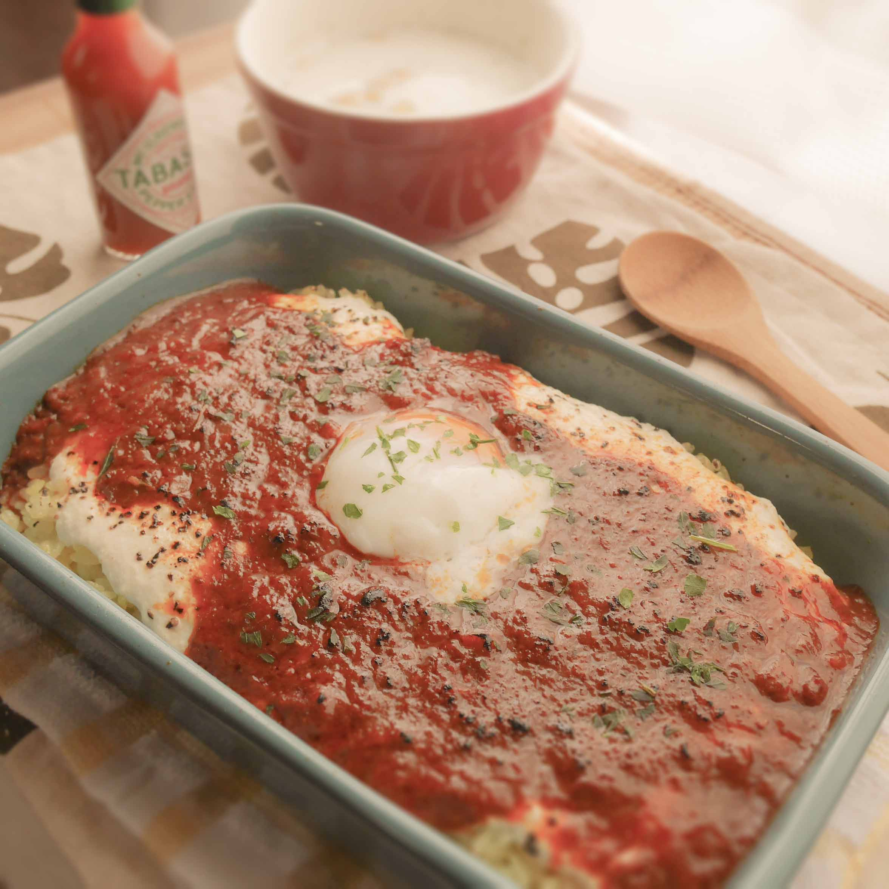

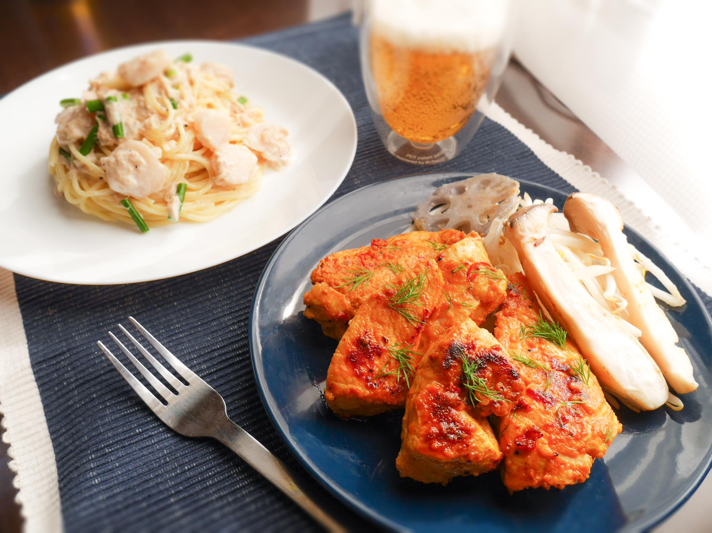

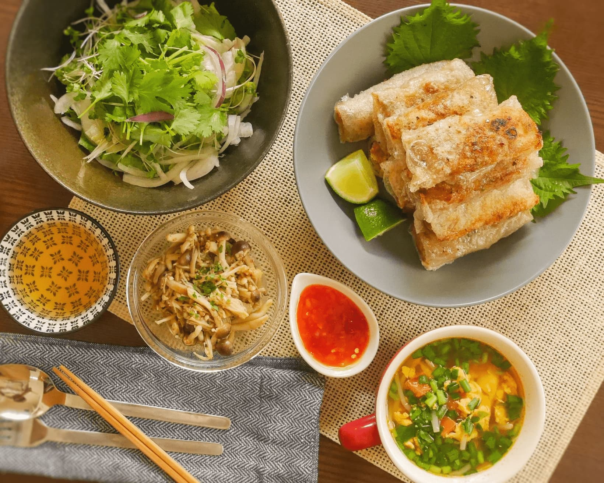

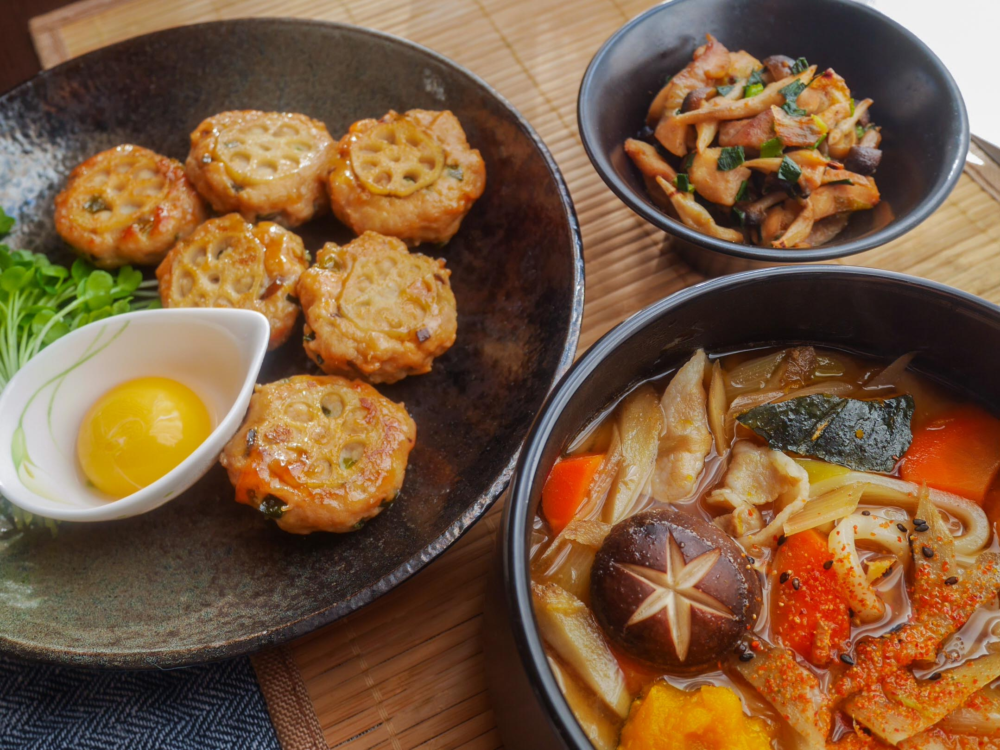

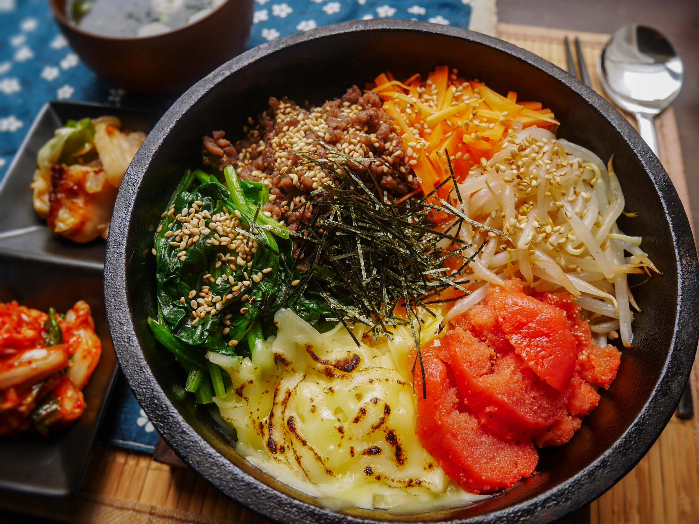

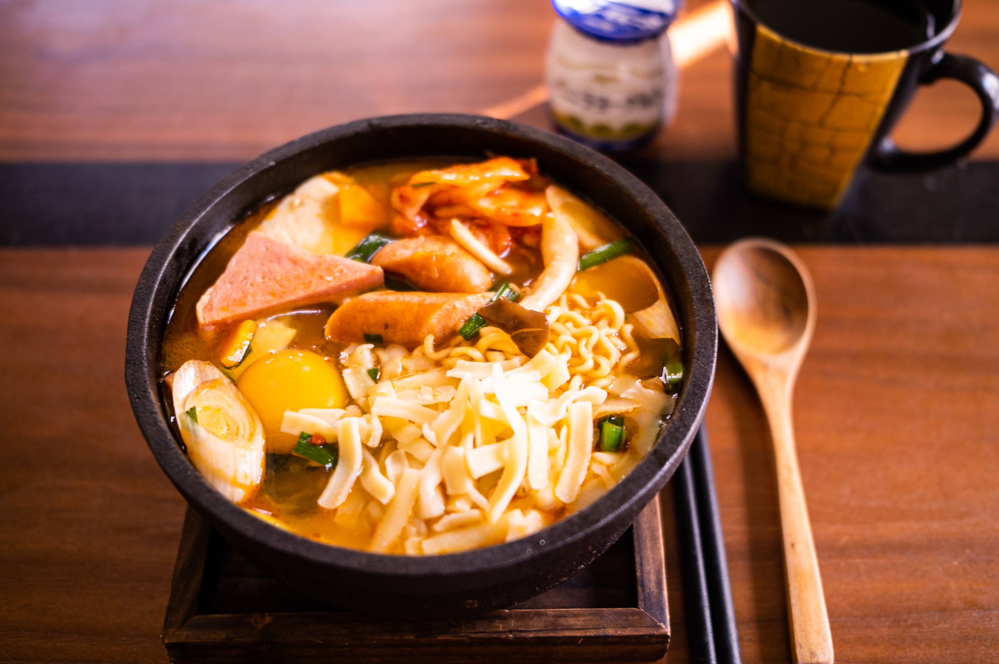

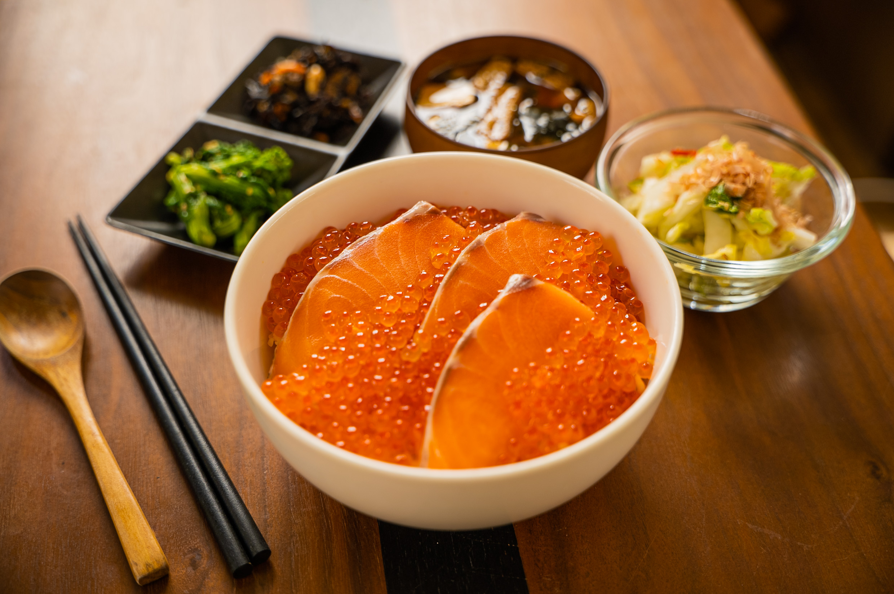

