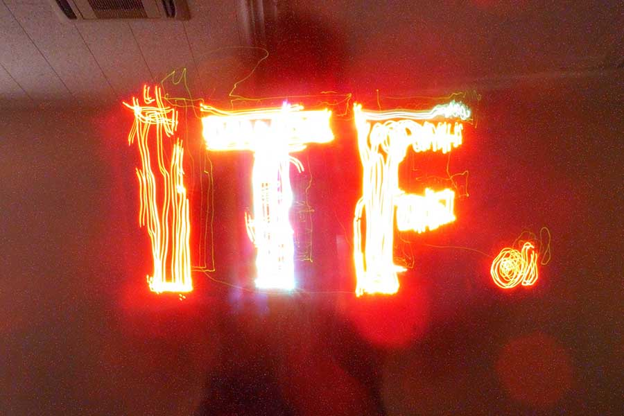
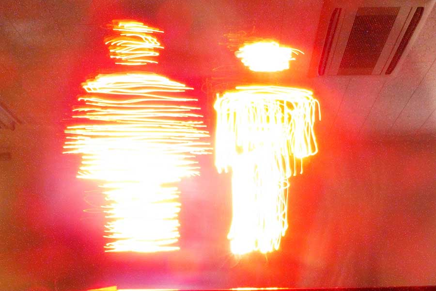
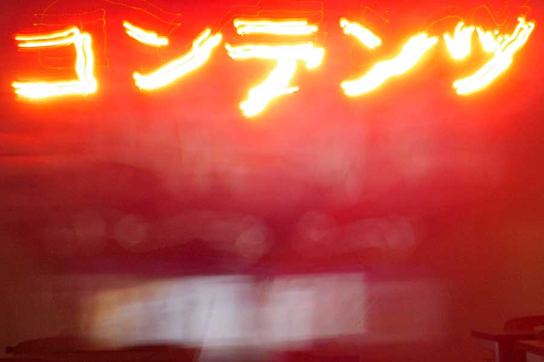

Created as a 3-person team project in a class by Yoichi Ochiai at Tsukuba University Graduate School.

## Mechanism
The concept is **using human power to digitally create art**. The system consists of Arduino, IR LED, DSLR camera, PC, and IR filter. Software was developed using Processing. When the device is waved, light illuminates when it enters a preset image area, creating an art piece through slow shutter photography.

## Examples
By loading transparent PNGs, any image can be converted to light art.

## My Responsibilities
* Planning and ideation
* System creation using Processing
* Partial thesis writing