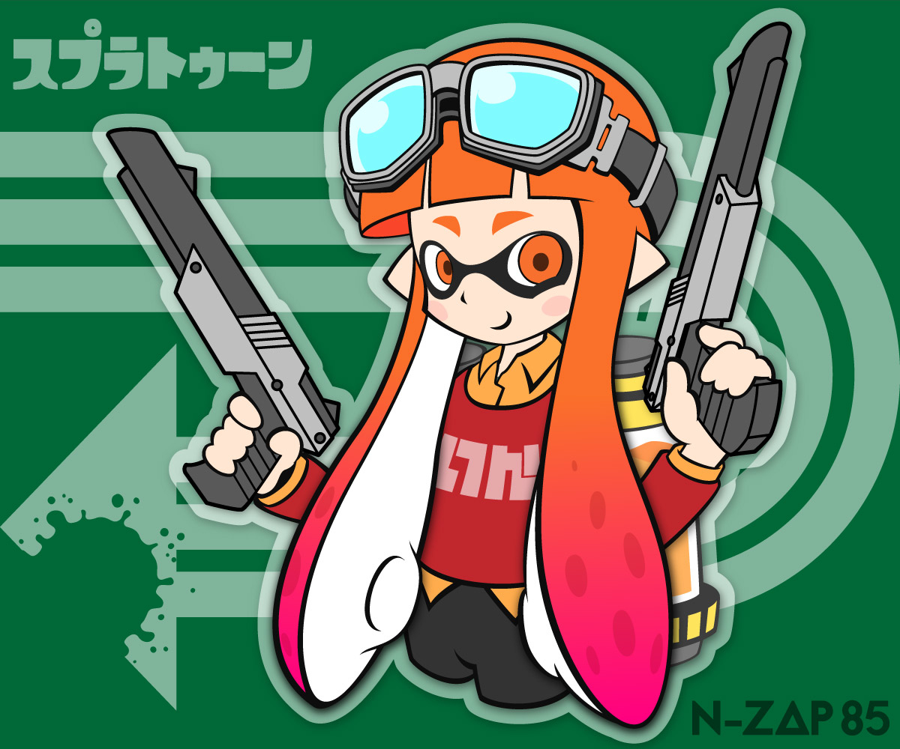
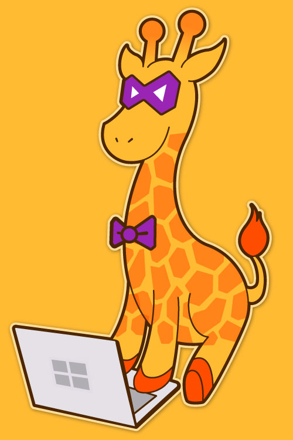

## Microsoft Developer Support Character
An entry for a [mascot character contest](https://docs.microsoft.com/en-us/previous-versions/msdn10/mt603996(v=msdn.10)) held by Microsoft for developer support. I designed it with a giraffe as the motif to convey a smart impression, incorporating the logo. It won an award of merit.

