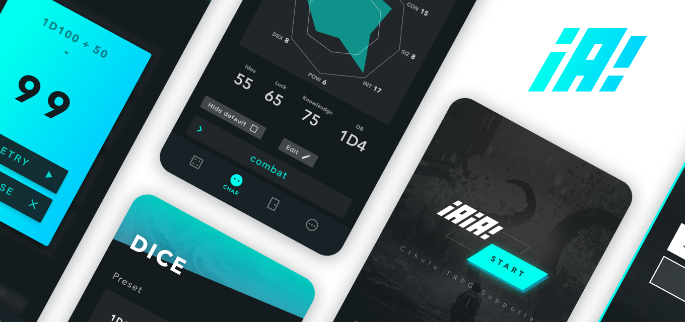

## Overview
A web app currently being developed with an acquaintance. Created to make Cthulhu Mythos TRPG, a type of board game, playable on smartphones alone.

## UI
The design was created with a concept of "future + cosmic horror mythology." With the primary goal of allowing "anyone to play easily," I incorporated UI innovations throughout to help players understand complex game systems in a simplified way.
)

The full UI design is published on Figma, so please take a look.

<iframe class="figma-iframe" style="border: 1px solid rgb(0 0 0 / 0.1);" width="800" height="450" src="https://www.figma.com/embed?embed_host=share&url=https%3A%2F%2Fwww.figma.com%2Ffile%2FcjVUh6J1EYjoztzKKoPHbF7D%2Fiaia%3Fnode-id%3D192%253A0" allowfullscreen></iframe>

## Implementation
Released as a PWA, which allows web pages to be offered as applications. The frontend uses Vue.js + TypeScript, and the backend uses Firebase. The source code is published on [GitHub](https://github.com/psephopaiktes/iAiA).