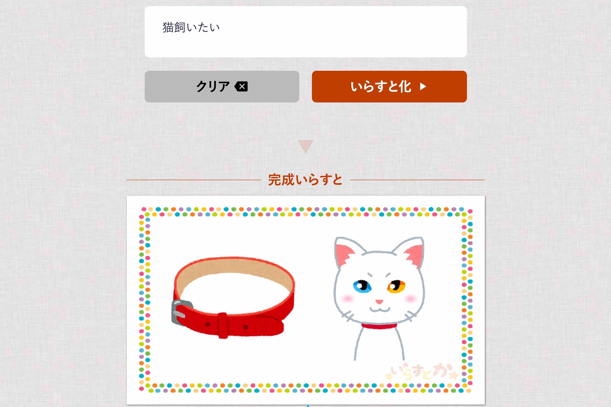

A web app that converts input text into illustrations. The application performs morphological analysis on text strings, links with Wikipedia keywords, and presents a suitable single image.

Featured in many media outlets including [GIGAZINE](https://gigazine.net/news/20170206-irasutoya-irasutoka/), [livedoor NEWS](https://news.livedoor.com/article/detail/12638328/), [APPBANK](https://www.appbank.net/2017/02/06/iphone-news/1308841.php), [BuzzFeed](https://www.buzzfeed.com/akikochino/irasutoka?utm_term=.qsVLx58j8#.hqond64G4), [ねとらぼ](https://nlab.itmedia.co.jp/nl/articles/1702/07/news092.html), and [Yajiumawatch](https://internet.watch.impress.co.jp/docs/yajiuma/1042606.html).

I participated in a 5-person team, handling planning, design, and frontend. I aimed to create a "fun" service and designed with a layout that users could use immediately without confusion.

